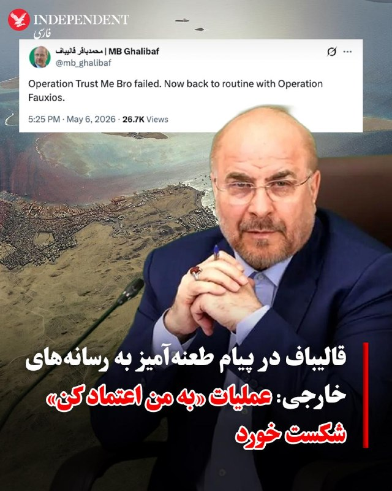
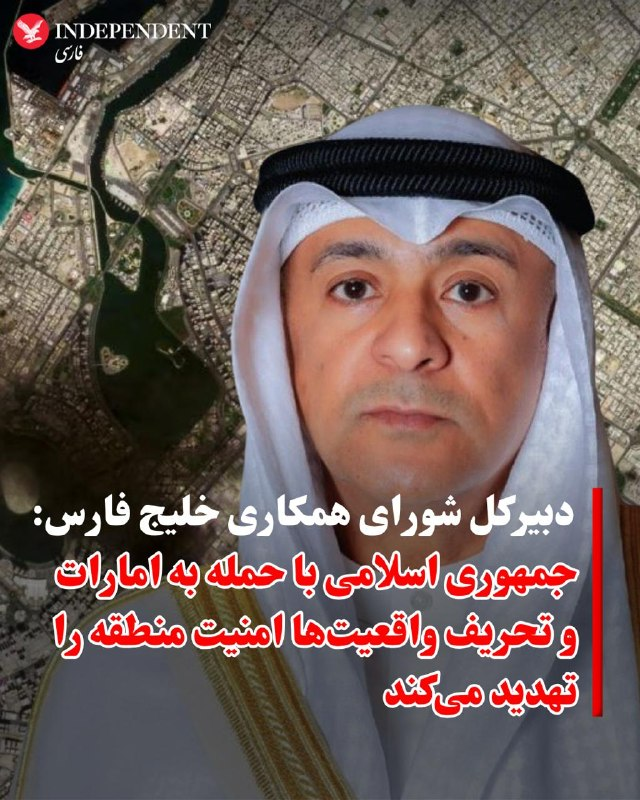

## 1405/02/17 02:01 — Persian_Trend_Official

> 💢توییت قالیباف به ترامپ:
> 
> ▪️عملیات «به من اعتماد کن رفیق» شکست خورد. حالا برگشتیم به روال عادی با عملیات «فوکسیوس».
> 
> 🫆:Tony
> 
> 📌 @persian_trend_official
> پرشین ترند | متفاوت‌ترین کانال نظامی

## 1405/02/17 01:52 — Shin_Persian
> 📦 mhrv-rs v1.9.15 released
> 
> • HTTP/2 multiplexing on relay leg (#799)
> • Block QUIC by default (#805): QUIC over the TCP-based tunnel was causing TCP-over-TCP meltdown (<1 Mbps)
> • UI accessibility: enabled the accesskit feature on eframe
> • GitHub Actions Full tunnel docs (#783)
> • Tests: 197 lib + 35 tunnel-node tests passing.
> 
> Files (Android APKs, Windows, macOS, Linux, OpenWRT) on the files channel:
> 
> 👉 v1.9.15 — all files with SHA-256
> 
> Channel:
> https://t.me/mhrv_rs
> or: https://t.me/+R1OyoHX2boA1ZDgx
> 
> #v1915

## 1405/02/17 01:51 — Persian_Trend_Official
> https://youtube.com/live/jOAbCViny2E?feature=share

## 1405/02/17 01:49 — BBCPersian
> 🔻افزایش دو میلیارد دلاری هزینه سوخت جت شرکت‌های آمریکایی در پروازهای مسافربری
> بنابر اعلام وزارت حمل و نقل ایالات متحده، خطوط هوایی مسافربری اصلی این کشور در ماه مارس بیش از ۵ میلیارد دلار برای سوخت جت هزینه کردند که ۱‌/۸ میلیارد دلار یا ۵۶ درصد بیشتر از رقمی است که یک ماه پیشتر(فوریه) هزینه شده بود.
> 
> بر این اساس، هزینه هر گالن سوخت در ماه مارس ۳/۱۳ دلار بود که در مقایسه با ماه فوریه ۷۴ سنت(۳۱ درصد) افزایش داشت. هر گالن آمریکایی کمی بیشتر از سه لیتر و نیم است.
> 
> وزارت حمل و نقل آمریکا همچنین گفته است که مصرف سوخت در ماه مارس ۲۰ درصد افزایش یافته است.
> 
> از زمان آغاز جنگ آمریکا و اسرائیل با ایران، اختلال در کشتیرانی از طریق تنگه هرمز، قیمت نفت و به تبع آن هزینه سوخت را برای مصرف‌کنندگان بالا برده است.
> 
> افزایش اخیر قیمت سوخت جت، بزرگترین بحران صنعت سفر هوایی را از زمان همه‌گیری کووید-۱۹ دامن زده است.
> 
> در پی این تحولات، شرکت‌های هواپیمایی بزرگ آمریکایی، نرخ بلیط هواپیما و هزینه‌های حمل بار را افزایش داده‌اند، بعضی از مسیرها را حذف کرده و در بعضی دیگر در هزینه‌ها نیز صرفه‌جویی کرده‌اند.
> 
> سوخت هواپیما تا یک چهارم هزینه‌های عملیاتی خطوط هوایی را شامل می‌شود.
> 
> شرکت هواپیمایی ارزان‌قیمت «اسپیریت ایرلاینز» که روز شنبه فعالیت خود را متوقف کرد، اعلام کرد که در ماه‌های مارس و آوریل ۱۰۰ میلیون دلار هزینه اضافی سوخت پرداخت کرده است.
> 
> این شرکت افزایش ناگهانی قیمت سوخت را دلیل شکست طرح تجدید ساختار خود و پایان دادن اجباری به فعالیت‌های خود عنوان کرد.
> 
> https://bbc.in/49zT9a2
> @BBCPersian

## 1405/02/17 01:47 — VahidOOnLine

> ♦️محمدباقر قالیباف، رییس مجلس شورای اسلامی و رییس هیات جمهوری اسلامی در مذاکرات با آمریکا، روز چهارشنبه ۱۵ اردیبهشت با انتشار پیامی طعنه‌آمیز در اکس به عملیات آمریکا علیه جمهوری اسلامی و عملکرد رسانه‌های خارجی، از جمله آکسیوس، واکنش نشان داد.
> قالیباف نوشت: عملیات «به من اعتماد کن» شکست خورد. حالا برگشتیم به روال معمول با عملیات «فاکسیوس».
> ‌🇸🇦 Indypersian
> 
> 🤖 @VahidOOnLine

## 1405/02/17 01:44 — mwarmonitor
> 🔴یک مقام از کشورهای خلیج فارس می‌گوید ترامپ «به‌شدت می‌خواهد جنگ با ایران پایان پیدا کند»، اما ایران حاضر نیست «آن چیزی را که او برای حفظ آبرو و خروج از این وضعیت نیاز دارد» به او بدهد. به گفته این مقام، توهین‌ها و اظهارات ترامپ مبنی بر اینکه آمریکا در جنگ پیروز شده، در حال به خطر انداختن مذاکرات است — پولیتیکو.
> 
> @mwarmonitor

## 1405/02/17 01:43 — Persian_Trend_Official
[🎬 Video](telegram/content/Persian_Trend_Official_13560_1778106907.jpg)

> فایل صوتی لایو اول
> نسخه کم حجم - 8.49 مگابایت
> 
> اتاق جنگ چهارشنبه 16 اردیبهشت | شرط توافق انتقال اورانیم غنی شده
> 
> 📝 Nick
> 
> 📌 @persian_trend_official
> پرشین ترند | متفاوت‌ترین کانال نظامی

## 1405/02/17 01:36 — IranianMinds

> 🔴 ترامپ :
> 
> کم کم داریم به جایی نزدیک میشیم که ایران میخواد اورانیوم غنی شدشو تحویل بده به ما و فعالیت تأسیسات هسته‌ای زیر زمینیش رو هم کاملا متوقف کنه
> 
> ما حتی غنی‌سازی ۳.۶۷ درصدی رو هم قبول نداریم و توی توافق جایی نداره , اگه اونا اینکارو بکنن جنگ تموم میشه و همه چیز آروم میشه
> 
> 
> اگه هم قبول نکنن دوباره میریم سراغ بمباران ولی ایندفه خیلی بدتر ولی من فکر میکنم داریم به یه نتیجه ای میرسیم و به توافق نزدیک شدیم.
> 
> @IranianMinds

## 1405/02/17 01:36 — IranianMinds
> فقط کافیه مرغ از خیابون رد کنی و‌پولت چند برابر کنی
> 💵👌

## 1405/02/17 01:24 — BBCPersian
> 🔻ترامپ - بدون تایید تهران - مدعی شد ایران با نداشتن سلاح هسته‌ای موافقت کرده است
> 
> 🖋برند دبوسمان جونیور - خبرنگار کاخ سفید
> 
> دونالد ترامپ مدعی شد ايران با نداشتن سلاح هسته‌ای «و موارد ديگر» موافقت کرده است؛ ادعايی که تاکنون از سوی تهران تأييد نشده است.
> 
> آقای ترامپ روز چهارشنبه در يک ديدار غيرمنتظره با خبرنگاران در اتاق بيضی کاخ سفید که دفتر اصلی کار روسای جمهوری آمریکاست گفت: «آنها می‌خواهند توافق کنند. در ۲۴ ساعت گذشته گفت‌وگوهای بسيار خوبی داشته‌ايم و بسيار محتمل است که به توافق برسيم.»
> 
> او بار ديگر تأکيد کرد که ايران پذيرفته هرگز به سلاح هسته‌ای دست پيدا نکند، اما هيچ تأييدی از سوی طرف ايرانی درباره اين ادعا وجود ندارد.
> 
> رييس‌جمهور آمريکا همچنين به‌طور ضمنی گفت ضرب‌الاجل ۳۰ روزه برای رسيدن به توافق انعطاف‌پذير است و افزود: «اصلا ضرب‌الاجلی وجود ندارد.»
> 
> با وجود کمبود اطلاعات رسمی درباره وضعيت مذاکرات، ترامپ و ديگر مقام‌های آمريکايی بارها گفته‌اند که روند گفت‌وگوها مثبت بوده است.
> 
> در عين حال، کاخ سفيد همچنان گزينه نظامی را — دست‌کم در سطح علنی — روی ميز نگه داشته، اما تأکيد می‌کند که اميدوار است نيازی به آن نباشد.
> 
> https://bbc.in/49zT9a2
> @BBCPersian

## 1405/02/17 01:22 — BBCPersian
> 🔻حمله پهپادی به اربیل عراق
> 
> خبرگزاری‌های ایران از حمله پهپادی به اربیل در کردستان عراق خبر دادند.
> 
> در ویدئویی که رسانه‌های ایران منتشر کرده‌اند نور انفجاری دیده می‌شود که گفته می‌شود پس از «حمله به مقر احزاب کرد» رخ داده است.
> 
> شب گذشته - سه شنبه - هم رسانه‌های داخل ایران حمله به نیروهای کرد در کردستان عراق را گزارش کرده بودند.
> https://bbc.in/49zT9a2
> @BBCPersian

## 1405/02/17 01:19 — mwarmonitor
> 🔘مارک لوین
> 
> ▫️من مجبورم باور کنم که گزارش آکسیوس تا حد زیادی جعلی است.
> 
> 🔸اگر گزارش آکسیوس حتی تا حدی هم دقیق باشد، رژیم ایران باقی خواهد ماند، مردم ایران با سرکوب و خشونت گسترده‌تری روبه‌رو خواهند شد و دولت اسرائیل ممکن است در انتخابات اکتبر سقوط کند؛ نتیجه‌ای فاجعه‌بار. و در داخل کشور خودمان هم، با وجود همه حرف‌ها درباره «راه‌های خروج» و «توافق» به‌عنوان بهترین نتیجه سیاسی برای رئیس‌جمهور و جمهوری‌خواهان، واقعیت برعکس است. دموکرات‌ها، رسانه‌ها و جریان‌های انزواطلب این عملیات را شکست‌خورده اعلام خواهند کرد. البته جزئیات بسیار تعیین‌کننده خواهد بود؛ به‌ویژه موضوع نظارت و اجرای تعهدات، و نه فقط توسعه هسته‌ای و اورانیوم غنی‌شده، بلکه موشک‌های بالستیک قاره‌پیما، نیروهای نیابتی و بله، وضعیت مردم ایران.
> 
> 🔹من از این فرض آغاز می‌کنم که تروریست‌ها دروغ می‌گویند و تقلب می‌کنند؛ اینکه این تروریست‌ها طی ۴۷ سال گذشته دروغ گفته و تقلب کرده‌اند و هیچ قصدی برای تغییر ندارند، آن هم بر اساس ایدئولوژی اسلام‌گرایانه اعلام‌شده‌شان. همچنین می‌دانم که رؤسای‌جمهور آینده برای اجرای یک توافق دست به اقدام نظامی نخواهند زد، بر پایه تجربه گذشته ما و مخالفت‌های داخلی؛ مخالفت‌هایی که با توجه به تحول حزب دموکرات و نفوذ مارکسیست‌ها و اسلام‌گرایان، فقط شدیدتر هم خواهد شد.
> 
> 🔸به همین دلایل و دلایل بیشتر، ناچارم باور کنم که این گزارش تا حد زیادی جعلی است.
> 
> @mwarmonitor

## 1405/02/17 01:19 — VahidOOnLine

> ♦️ جاسم محمد البدیوی، دبیرکل شورای همکاری خلیج فارس، پنجشنبه‌شب ۱۷ اردیبهشت‌ماه، اظهارات مطرح‌شده در بیانیه وزارت خارجه جمهوری اسلامی علیه امارات متحده عربی را به‌شدت محکوم کرد و گفت شورای همکاری در برابر این «ادعاهای باطل و تجاوزها» کاملا در کنار ابوظبی ایستاده است.
> 
> او اعلام کرد ادعاهای جمهوری اسلامی ادامه رویکرد «تنش‌زا و تحریک‌آمیز» تهران علیه کشورهای منطقه است و افزود جمهوری اسلامی نه‌تنها به حملات علیه خاک امارات بسنده نکرده، بلکه با تحریف واقعیت‌ها تلاش کرده افکار عمومی را منحرف کند.
> 
> دبیرکل شورای همکاری خلیج فارس تاکید کرد بیانیه جمهوری اسلامی نشان‌دهنده اصرار تهران بر افزایش تنش‌ها و برهم زدن امنیت و ثبات منطقه است و رویکرد خصمانه جمهوری اسلامی، امنیت منطقه و ملت‌های آن را تهدید می‌کند.
> 
> البدیوی همچنین گفت کشورهای عضو شورای همکاری خلیج فارس در کنار امارات متحده عربی ایستاده‌اند و از تمامی اقدام‌های این کشور برای حفظ امنیت، ثبات و حاکمیتش حمایت می‌کنند.
> 
> وزارت خارجه جمهوری اسلامی سه‌شنبه ۱۵ اردیبهشت، گزارش‌های امارات درباره حملات موشکی و پهپادی از مبدا ایران را رد کرد و هشدار داد میزبانی از پایگاه‌ها و تجهیزات نظامی آمریکا می‌تواند پیامدهای خطرناکی برای ابوظبی داشته باشد.
> ‌🇸🇦 Indypersian
> 
> 🤖 @VahidOOnLine

## 1378/10/11 03:30 — VahidOOnLine
[🎬 Video](telegram/content/VahidOOnLine_238535_1778106908.mp4)

> دونالد ترامپ، رییس‌جمهوری ایالات متحده، چهارشنبه ۱۶ اردیبهشت در کاخ سفید، در پاسخ به سؤال خبرنگاری درباره احتمال توافق با جمهوری اسلامی گفت: «آن‌ها خیلی می‌خواهند توافق کنند و خواهیم دید که آیا به آن می‌رسیم یا نه. اگر به آن برسیم، آن‌ها نباید سلاح هسته‌ای داشته باشند. موضوع خیلی ساده است.»
> او در ادامه گفت: «رهبران آن‌ها همگی کشته شده‌اند. بنابراین فکر می‌کنم ما پیروز شدیم. حالا فقط مسئله این است که ... ببینید، اگر همین حالا ایران را ترک کنیم، ۲۰ سال طول می‌کشد تا خود را بازسازی کند.»
> ترامپ همچنین افزود: «ما در ۲۴ ساعت گذشته گفت‌وگوهای بسیار خوبی داشته‌ایم و کاملاً ممکن است که در آنجا به توافق برسیم.»
> ‌🏁 🇬🇧 IranintlTV
> 
> 🤖 @VahidOOnLine

## 1378/10/11 03:30 — mwarmonitor
[🎬 Video](telegram/content/mwarmonitor_8603_1778106909.mp4)

> 📝این قابِ متعفن، غایتِ وقاحتِ رسانه‌ای است که در آن «دین» و «دنیا» در کثیف‌ترین شکل ممکن با هم هم‌بستر شده‌اند. آخوندی که با آن ردای مقدس‌نما، ملاقه به دست گرفته و میان جلز و ولز روغن، هرزه‌دری‌های شبِ زفاف و اراجیفِ جنسی را با نیشخندی وقیحانه به خورد ملت می‌دهد، تجسم عینی سقوط اخلاقی است؛ موجودی که منبر را به مطبخ آورده تا از کمر به پایینِ جوانان، قصه‌های خاک‌برسری برای «پر کردن آنتن» بسازد.
> 
> 🔸در آن سو، مجری زنی نشسته که با لبخندهای مشمئزکننده و تاییدهای تهوع‌آور، نقشِ کاتالیزورِ این خیمه‌شب‌بازیِ جنسی را بازی می‌کند؛ زنی که شرفِ رسانه‌ای‌اش را به پای اراجیفِ یک «ملا-آشپزِ» هرزه‌گو ریخته تا با هم، معجونی از ابتذال و حماقت بپزند. این نه یک برنامه‌ی آشپزی، که یک فاحشه‌خانه‌ی ذهنی است که در آن حرمت سفره و حیا، زیر پایِ نعلین‌هایی که از حجله می‌گویند، لگدمال شده است. تف بر این قاب که در آن، املت را با طعمِ هرزه‌دری و دین را با چاشنیِ وقاحت، به خوردِ سفره‌های خالی مردم می‌دهند.
> 
> @mwarmonitor

## 1378/10/11 03:30 — IranIntlTV
[🎬 Video](telegram/content/IranIntlTV_335866_1778106911.mp4)

> دونالد ترامپ، رییس‌جمهوری ایالات متحده، چهارشنبه ۱۶ اردیبهشت در کاخ سفید، در پاسخ به سؤال خبرنگاری درباره احتمال توافق با جمهوری اسلامی گفت: «آن‌ها خیلی می‌خواهند توافق کنند و خواهیم دید که آیا به آن می‌رسیم یا نه. اگر به آن برسیم، آن‌ها نباید سلاح هسته‌ای داشته باشند. موضوع خیلی ساده است.»
> او در ادامه گفت: «رهبران آن‌ها همگی کشته شده‌اند. بنابراین فکر می‌کنم ما پیروز شدیم. حالا فقط مسئله این است که ... ببینید، اگر همین حالا ایران را ترک کنیم، ۲۰ سال طول می‌کشد تا خود را بازسازی کند.»
> ترامپ همچنین افزود: «ما در ۲۴ ساعت گذشته گفت‌وگوهای بسیار خوبی داشته‌ایم و کاملاً ممکن است که در آنجا به توافق برسیم.»

## 1378/10/11 03:30 — IranianMinds
[🎬 Video](telegram/content/IranianMinds_19656_1778106913.mp4)

> بچه ها اسم این بازی عبور مرغ از خیابون  هست ویدئو نگاه کنید خیلی راحت 8 میلیون ازش سود گرفتیم😍
> 
> 
> 😤اگ توم دوس داری خیلی راحت از بازی های انلاین پول در بیاری حتما عضو کازینو شبانه شو
> ✅
> 
> توی کازینو شبانه بهت اموزش میدیم از بازی های انلاین پول دربیاری👌
> 
> کازینو شبانه راهی برای چند برابر کردن سرمایت 🤷‍♂
> 
> کسب درامد انلاین با یه ادم حرفه ای یاد بگیر و‌ پول دربیار 
> 💵
> ae16
> 🎯همین حالا عضو شو و شروع کن👇
> https://t.me/+OS-QBvyDO4M2ZGY0
> https://t.me/+OS-QBvyDO4M2ZGY0

## 1405/02/17 00:59 — kianmeli1

> 🔴قالیباف در حال مسخره کردن ترامپ
> 
> ‏عملیات «به من اعتماد کن برادر» شکست خورد. حالا با عملیات فاکسیوس به روال عادی برمی‌گردیم.
> https://t.me/kianmeli1

## 1405/02/17 00:53 — VahidOOnLine

> ♦️آکسیوس پنجشنبه‌شب ۱۷ اردیبهشت‌ به نقل از مقام‌های آمریکایی گزارش داد که انتظار می‌رود تهران طی ۲۴ تا ۴۸ ساعت آینده به پیشنهاد آمریکا برای پایان جنگ و آغاز چارچوب جدید مذاکرات هسته‌ای پاسخ دهد.
> 
> یکی از مقام‌های آمریکایی به آکسیوس گفت: «ما خیلی دور نیستیم، اما هنوز توافقی حاصل نشده است.» با این حال، برخی دیگر از مقام‌های آمریکایی نسبت به دستیابی به توافق بدبین‌تر هستند.
> 
> براساس این گزارش، روند تبادل پیام‌ها میان واشنگتن و تهران کند پیش می‌رود، زیرا هر پیام باید از طریق عالی‌ترین سطوح تصمیم‌گیری در جمهوری اسلامی منتقل شود.
> 
> آکسیوس همچنین نوشت کاخ سفید امیدوار است پیش از پایان سفر دونالد ترامپ به چین در روز جمعه آینده، یک پیشرفت دیپلماتیک حاصل شود. در غیر این صورت، احتمال بررسی دوباره گزینه اقدام نظامی از سوی رئیس‌جمهوری آمریکا مطرح است.
> ‌🇸🇦 Indypersian
> 
> 🤖 @VahidOOnLine

## 1405/02/17 00:53 — BBCPersian

> 🔸تیم فوتبال پاری سن ژرمن با وجود تساوی یک بر یک برابر بایرن مونیخ، با توجه به بازی نتیجه بازی شگفت‌آور دور رفت توانست راهی فینال اروپا شود.
> 
> پاریسی‌ها که با گل دقیقه ۳ عثمان دمبله، در زمین بایرن جلو افتادند، موفق شدند تا آخرین لحظات وقت‌های تلف‌شده این برتری را حفظ کنند. اما در نهایت هری کین، «شاهزاده انگلیسی» بایرن، توانست گل تساوی را بزند تا تیم آلمانی دست کم برابر هزاران تماشاگر خود بازنده با جام خداحافظی نکند.
> 
> مسابقه رفت دو تیم که هفته پیش در پاریس برگزار شد یکی از جذاب‌ترین و پرگل‌ترین بازی‌های این فصل بود که با نتیجه ۵ بر ۴ به نفع پاری‌سن‌ژرمن تمام شده بود.
> 
> شاگردان لوئیز انریکه حالا در بازی فینال مقابل آرسنال قرار می‌گیرند.
> 
> آرسنال دیشب با برد ۱ بر صفر مقابل اتلتیکو مادرید، موفق شد پس از بیست سال دوباره به فینال جام قهرمانان اروپا برسد.
> 
> فینال این فصل ۹ خرداد در ورزشگاه پوشکاش در بوداپست برگزار می‌شود.
> 
> 📷 UEFA/UEFA via Getty Images
> @BBCPersian

## 1405/02/17 00:49 — IranIntlTV

> 🔻تیم فوتبال پاری‌سن‌ژرمن با تساوی یک بر یک برابر بایرن مونیخ، حریف آرسنال در فینال لیگ قهرمانان اروپا شد. دو تیم در دیدار برگشت نیمه‌نهایی لیگ قهرمانان اروپا در ورزشگاه آلیانز آرنا به مصاف یکدیگر رفتند. شاگردان انریکه با توجه به برتری ۶ بر ۵ در مجموع دو بازی، به فینال صعود کردند.
> 
> 🔹عثمان دمبله در دقیقه ۳ تک‌گل پاری‌سن‌ژرمن را به ثمر رساند و هری کین هم در دقیقه ۴+۹۰ گل تساوی بایرن را زد.
> 
> 🔹شب گذشته آرسنال با پیروزی برابر اتلتیکو مادرید به دیدار پایانی این رقابت‌ها راه یافت.
> 
> @iranintltvsport

## 1405/02/17 00:45 — BBCPersian

> 🔻امارات متحده عربی روز چهارشنبه با رد بیانیه جمهوری اسلامی ایران مبنی بر اینکه همکاری ابوظبی با ایالات متحده امنیت و منافع ملی ایران را تهدید می‌کند، اعلام کرد که روابط و همکاری‌های بین‌المللی و دفاعی این کشور «مسئله‌ای کاملا حاکمیتی» است.
> 
> وزارت خارجه امارات متحده عربی اعلام کرد که این کشور حقوق کامل حاکمیتی، قانونی، دیپلماتیک و نظامی خود را برای رسیدگی به هرگونه «تهدید، اتهام یا اقدام خصمانه» محفوظ می‌دارد.
> 
> همزمان نمایندگی این کشور در سازمان ملل گفته است برنامه هسته‌ای ایران نمی‌تواند از رفتار «خصمانه و تروریستی» جمهوری اسلامی در منطقه جدا در نظر گرفته شود.
> 
> تنش شدید میان امارات و جمهوری اسلامی پس از آن شدت گرفت که امارات متحده عربی پس از چهار هفته آرامش نسبی از زمان اعلام آتش‌بس توسط آمریکا، در روزهای گذشته از حمله جمهوری اسلامی خبر داد.
> 
> ایران انجام عملیات علیه امارات متحده عربی در روزهای اخیر را تکذیب کرد، اما هشدار داد که در صورت هرگونه اقدامی از سوی امارات علیه ایران، به آن«پاسخ کوبنده‌ای» به آن خواهد داد.
> 
> 📷 Getty Images
> https://bbc.in/4toGgH8
> @BBCPersian

## 1405/02/17 00:42 — FarsiVOA
> 🔺به دنبال نشانه‌های کاهش تنش میان آمریکا و جمهوری اسلامی قیمت نفت کاهش و شاخص‌های سهام افزایش یافت
> 
> ▪️قیمت نفت روز چهارشنبه در بحبوحه گزارش‌های احتمال شکل‌گیری توافق بین ایالات متحده و جمهوری اسلامی کاهش یافت؛ و همین امر باعث خوش‌بینی در بازار سهام شد.
> 
> ⬇️ بیشتر بخوانید:
> https://ir.voanews.com/a/8147330.html
> @FarsiVOA

## 1405/02/17 00:33 — kianmeli1
> ‏🔴رضایی، سخنگوی کمیسیون امنیت ملی مجلس: تمرکز ما بر مذاکرات نیست، بلکه بر قوی‌تر شدن است که اگر مجددا جنگی صورت گیرد، بتوانیم در کمترین زمان بیشترین آسیب را به «دشمن» بزنیم
> https://t.me/kianmeli1

## 1405/02/17 00:33 — kianmeli1
> ‏🔴وال‌استریت ژورنال گزارش داد دیپلمات‌های آمریکایی درباره استفاده از بازارهای پیش‌بینی آنلاین در بحبوحه مذاکرات غیرقابل‌پیش‌بینی با ایران هشدار دریافت کرده‌اند
> https://t.me/kianmeli1

## 1405/02/17 00:32 — mwarmonitor
> با فرض اینکه ایران موافقت کند آنچه را که بر سر آن توافق شده است واگذار کند - که شاید فرض بزرگی باشد - عملیات در حال حاضر افسانه‌ای «خشم حماسی» (Epic Fury) به پایان خواهد رسید و محاصره بسیار مؤثر اجازه خواهد داد که تنگه هرمز برای همه، از جمله ایران، باز باشد.…

## 1405/02/17 00:28 — kianmeli1
> 🔴آکسیوس به نقل از مقامات آمریکایی: ما انتظار داریم ظرف 24 تا 48 ساعت آینده از تهران پاسخی دریافت کنیم
> 
> ترامپ ممکن است در صورت عدم دستیابی به توافق تا پایان سفرش به چین، دستور اقدام نظامی را دوباره صادر کند.
> https://t.me/kianmeli1

## 1405/02/17 00:25 — pm_afshaa
> 🔴منابع خبری از کشته شدن «عزام الحیه» فرزند خلیل الحیه، از رهبران ارشد جنبش حماس، در حمله هوایی اسرائیل خبر دادن
> 
> 
> 💧 Rainbet.com the #1 Non-KYC Crypto Casino & Sportsbook @rainbetcom
> 
> 😁 @Pm_Afshaa

## 1405/02/17 00:25 — VahidOOnLine

> ♦️وزارت خارجه امارات متحده عربی چهارشنبه ۱۶ اردیبهشت‌ماه، در بیانیه‌ای، اظهارات جمهوری اسلامی را که حمله یا تهدید علیه این کشور را رد کرده بود، محکوم کرد.
> 
> در این بیانیه آمده است روابط دفاعی و بین‌المللی امارات، موضوعی کاملا حاکمیتی است و هیچ طرفی حق ندارد از آن به‌عنوان بهانه‌ای برای تهدید، دخالت یا تحریک استفاده کند.
> 
> وزارت خارجه امارات همچنین تاکید کرد هرگونه تهدید مستقیم یا غیرمستقیم علیه امنیت کشور، زیرساخت‌های حیاتی و امنیت شهروندان و ساکنان، نقض اصول حسن همجواری و منشور سازمان ملل است.
> 
> این وزارتخانه افزود امارات تمامی حقوق حاکمیتی، حقوقی، دیپلماتیک و نظامی خود را برای مقابله با هرگونه تهدید یا اقدام خصمانه محفوظ می‌داند.
> 
> روز سه‌شنبه ۱۵ اردیبهشت، قرارگاه خاتم‌الانبیا ادعاهای امارات درباره حملات موشکی و پهپادی از مبدا ایران را تکذیب کرد و گفت جمهوری اسلامی در روزهای اخیر حمله‌ای علیه خاک امارات انجام نداده است.
> ‌🇸🇦 Indypersian
> 
> 🤖 @VahidOOnLine

## 1405/02/17 00:23 — pm_afshaa
> 🔴ترامپ درباره ایران:توافق انجام خواهد شد، اما هرگز ضرب‌الاجل وجود نخواهد داشت
> 
> 
> 💧 Rainbet.com the #1 Non-KYC Crypto Casino & Sportsbook @rainbetcom
> 
> 😁 @Pm_Afshaa

## 1405/02/17 00:18 — pm_afshaa
> 🔴وزیر دفاع اسرائیل از ترور فرمانده کل نیرو های ویژه رضوان حزب الله در جنوب بیروت خبر داد
> 
> 
> 💧 Rainbet.com the #1 Non-KYC Crypto Casino & Sportsbook @rainbetcom
> 
> 😁 @Pm_Afshaa

## 1405/02/17 00:16 — mwarmonitor
> ‼️جنگ فراموش کن ⚠️مقامات بهداشتی آفریقای جنوبی سویه «آندِس» از ویروس هانتا را در دو مسافری که در کشتی کروز MV Hondius حضور داشتند و دچار شیوع این عفونت شده بودند، شناسایی کرده‌اند. ⚠️مقامات سوئیسی نیز یک مورد ابتلا را در بیمارستانی در زوریخ تأیید کرده‌اند؛…

## 1405/02/17 00:14 — pm_afshaa
> 🔴سنتکام خبر داد که ساعاتی پیش یه نفتکش ایرانی رو تو دریای مکران با جنگنده F-18 موردهدف قرار داده و نذاشته به بنادر ایران برسه
> 
> 
> 💧 Rainbet.com the #1 Non-KYC Crypto Casino & Sportsbook @rainbetcom
> 
> 😁 @Pm_Afshaa

## 1405/02/17 00:12 — pm_afshaa
> 🔴ترامپ به فاکس نیوز: فقط یک هفته مهلت میدم که سرِ این معامله به نتیجه برسیم
> 
> 
> 💧 Rainbet.com the #1 Non-KYC Crypto Casino & Sportsbook @rainbetcom
> 
> 😁 @Pm_Afshaa

## 1405/02/17 00:08 — VahidOOnLine

> ♦️دونالد ترامپ، رییس‌جمهوری آمریکا، روز چهارشنبه ۱۶ اردیبهشت در گفتگو با خبرنگاران در دفتر بیضی کاخ سفید گفت احتمال دستیابی به توافق با رژیم ایران «بسیار محتمل» است. ترامپ با اشاره به مذاکرات ۲۴ ساعت گذشته گفت: «گفتگوهای بسیار خوبی داشتیم و بسیار ممکن است که به توافق برسیم.»
> ترامپ تاکید کرد جمهوری اسلامی نباید به سلاح هسته‌ای دست پیدا کند و گفت: «آن‌ها به‌شدت می‌خواهند توافق کنند.»
> ‌🇸🇦 Indypersian
> 
> 🤖 @VahidOOnLine

## 1405/02/16 23:59 — mwarmonitor
> 🔴خوش‌بینی ترامپ همزمان با انتظار آمریکا برای پاسخ ایران به چارچوب صلح
> 
> 📝نوشته: باراک راوید
> 
> 🔰پرزیدنت ترامپ روز چهارشنبه اعلام کرد که ایالات متحده و ایران در ۲۴ ساعت گذشته «گفتگوهای خوبی» داشته‌اند و ابراز اطمینان کرد که دستیابی به یک توافق در روزهای آینده امکان‌پذیر است.
> 
> 
> چرا این موضوع مهم است؟
> همان‌طور که اکسیوس برای اولین بار گزارش داد، کاخ سفید در انتظار پاسخ ایران به یک یادداشت تفاهم (MOU) یک صفحه‌ای است که هدف آن پایان دادن به جنگ و تعیین چارچوبی برای مذاکرات هسته‌ای دقیق‌تر است.
> مقامات آمریکایی می‌گویند انتظار دارند تهران ظرف ۲۴ تا ۴۸ ساعت آینده پاسخ دهد.
> یک مقام آمریکایی گفت: «ما فاصله زیادی [با توافق] نداریم، اما هنوز توافقی حاصل نشده است.»
> اما: برخی دیگر از مقامات آمریکایی نسبت به نهایی شدن این توافق تردید بیشتری دارند.
> وضعیت موجود
> مقامات می‌گویند کاخ سفید خواهان یک گشایش دیپلماتیک تا پیش از پایان سفر ترامپ به چین در جمعه آینده است. اگر تا آن زمان توافقی حاصل نشود، رئیس‌جمهور ممکن است بار دیگر گزینه نظامی را مد نظر قرار دهد.
> ترامپ روز چهارشنبه در شبکه اجتماعی «تروث سوشال» نوشت: «اگر آن‌ها موافقت نکنند، بمباران آغاز خواهد شد و متأسفانه، سطح و شدت آن بسیار بالاتر از قبل خواهد بود.»
> جزئیات خبر
> این یادداشت تفاهم یک صفحه‌ای و ۱۴ ماده‌ای، توسط فرستادگان ترامپ یعنی استیو ویتکاف و جارد کوشنر با چندین مقام ایرانی (به صورت مستقیم و از طریق واسطه‌ها) در حال مذاکره است.
> محورهای احتمالی توافق:
> تعهد ایران به توقف (موراتوریوم) غنی‌سازی هسته‌ای.
> موافقت آمریکا با لغو تحریم‌ها و آزادسازی میلیاردها دلار دارایی مسدود شده ایران.
> لغو محدودیت‌های دوطرفه پیرامون تردد در تنگه هرمز.
> سخنگوی وزارت امور خارجه ایران روز چهارشنبه اعلام کرد که ایران همچنان در حال بررسی این پیشنهاد است و هنوز پاسخ خود را به واسطه‌های پاکستانی ارائه نکرده است. مقامات آمریکایی می‌گویند روند پیام‌رسانی به دلیل مسائل امنیتی و لزوم ارسال پیام‌ها به مجتبی خامنه‌ای (که در مخفیگاه به سر می‌برد) کند پیش می‌رود.
> اظهارات ترامپ
> ترامپ روز چهارشنبه لحنی خوش‌بینانه داشت، هرچند ضرب‌الاجل‌های اعلامی او کمی متغیر به نظر می‌رسید:
> او در یک مراسم در کاخ سفید گفت: «ما با افرادی طرف هستیم که بسیار مایل به توافق هستند. باید ببینیم موافقت می‌کنند یا نه؛ اگر الان موافقت نکنند، به زودی موافقت خواهند کرد.»
> او به «برت بایر» از شبکه فاکس نیوز گفت که فکر می‌کند توافق می‌تواند ظرف یک هفته حاصل شود.
> اما بعداً در دفتر بیضی به خبرنگاران گفت که ضرب‌الاجل خاصی ندارد.
> پشت صحنه
> بنیامین نتانیاهو، نخست‌وزیر اسرائیل و تیم او روز چهارشنبه چندین تماس تلفنی با ترامپ و مشاورانش برای بحث درباره مذاکرات آمریکا و ایران داشتند.
> نتانیاهو در بیانیه‌ای گفت: «هماهنگی کامل بین ما برقرار است و هیچ غافلگیری در کار نیست. ما اهداف مشترکی داریم و مهم‌ترین هدف، خروج تمامی مواد غنی‌شده از ایران و برچیدن توانمندی‌های غنی‌سازی این کشور است.»
> نکته قابل توجه
> در همین حال، ارتش اسرائیل (IDF) روز چهارشنبه حمله‌ای هوایی را در بیروت علیه دو فرمانده ارشد حزب‌الله انجام داد؛ این نخستین حمله اسرائیل به پایتخت لبنان در چند هفته اخیر بود.
> ترامپ هفته گذشته به اکسیوس گفته بود که از نتانیاهو خواسته است تنها حملات «جراحی‌شده» (دقیق و محدود) در لبنان انجام دهد.
> یک مقام ارشد اسرائیلی مدعی شد که حمله روز چهارشنبه «به صورت جراحی‌شده» انجام شده و هدف آن مقر حزب‌الله برای هدایت حملات نقض آتش‌بس بوده است.
> 
> 
> 📌چالش اصلی: ایران در مذاکرات با آمریکا خواستار توقف حملات اسرائیل به لبنان شده است. هنوز مشخص نیست که آیا حمله روز چهارشنبه بر روند مذاکرات تأثیر خواهد گذاشت یا خیر.
> 
> @mwarmonitor

## 1405/02/16 23:55 — IranIntlTV
> 🎧نسخه صوتی چشم‌انداز: تغییر جهت ناگهانی ترامپ در تنگه هرمز
> @iranintlTV

## 1405/02/16 23:53 — mwarmonitor
> 🚨به‌روزرسانی برنامه هسته‌ای ایران: مشاهده اقدامات دفاعیِ غیرفعالِ احتمالیِ جدید در کوه «پیک‌اکس»
> 
> 🔴بر اساس تصاویر ماهواره‌ای تازه‌در‌دسترس از مجموعه زیرزمینی کوه Pickaxe Mountain که درست در جنوب Natanz Nuclear Complex قرار دارد، به نظر می‌رسد که از حدود ۲۲ آوریل، دو دهانه شرقی تونل‌ها به‌طور جزئی با مواد خاکیِ خاکستری‌رنگ مسدود شده‌اند؛ موادی که برای جلوگیری از دسترسی وسایل نقلیه به هر دو دهانه به کار رفته است.
> 
> 🔴در ۱ آوریل ۲۰۲۶، ورودی‌های این تونل‌ها باز و بدون مانع بودند. برخلاف وضعیت ورودی‌های تونلی در Fordow و Esfahan، این مواد در کوه پیک‌اکس باعث انسداد کامل دهانه‌ها نشده‌اند. با این حال، به نظر می‌رسد همین میزان مسدودسازی نیز برای ایجاد اختلال جدی در ورود و خروج سریع وسایل نقلیه کافی باشد و برای بازگشایی کامل مسیر و دسترسی آزاد به داخل، نیاز به استفاده از ماشین‌آلات سنگین خاک‌برداری وجود داشته باشد.
> 
> 🔴در حال حاضر، نشانه‌ای از اجرای چنین مسدودسازی‌ای در دو دهانه غربی تونل‌ها مشاهده نمی‌شود. این فعالیت پرسش‌های مهمی را برمی‌انگیزد؛ زیرا این مجموعه تونلی در عمق زیادی قرار دارد و می‌تواند برای حفاظت از تجهیزات یا مواد ارزشمند مورد استفاده قرار گیرد.
> 
> 🔴شایان ذکر است که اوایل سال جاری مشاهده شد دهانه‌های قدیمی تونل‌های یک مجموعه مربوط به سال ۲۰۰۷ در کوه پیک‌اکس با خاک پر شده و با بتن تقویت شده‌اند؛ موضوعی که می‌تواند نشان دهد اقلام یا تجهیزات مهمی به داخل این تونل‌ها منتقل شده است.
> 
> @mwarmonitor

## 1405/02/16 23:52 — mwarmonitor
> 

## 1405/02/16 23:44 — FarsiVOA
> 🔺ترامپ: جمهوری اسلامی نمی‌تواند سلاح هسته‌ای داشته باشد و نخواهد داشت؛ رژیم خواهان توافق است
> 
> ▪️دونالد ترامپ، رئیس‌جمهوری آمریکا، روز چهارشنبه در مورد ایران با خبرنگاران در کاخ سفید گفت‌وگو کرد.
> 
> ⬇️ بیشتر بخوانید:
> https://ir.voanews.com/a/8147327.html?withmediaplayer=1
> @FarsiVOA

## 1405/02/16 23:37 — Shin_Persian
> Shin ✓ @hey_itsmyturn
> Wed, 06 May 2026 20:06:55 UTC
> 
> Jet activity over Baghdad #Iraq 🇮🇶
> 
> فارسی
> 
> فعالیت جت‌ها بر فراز بغداد #Iraq 🇮🇶
> 
> 𝕏 · @shin_persian

## 1378/10/11 03:30 — VahidOOnLine
[🎬 Video](telegram/content/VahidOOnLine_238534_1778103305.mp4)

> تماسی از تهران:
> «می‌گفت صحنه‌هایی که دیدیم شبیه جنگ بود…
> جنازه‌ها روی زمین، ترس، و زخمی که هنوز بعد از ماه‌ها خوب نشده؛ خشمش هم هنوز باهامونه.
> ‌🏁 🇬🇧 ManotoTV
> 
> 🤖 @VahidOOnLine

## 1378/10/11 03:30 — VahidOOnLine
[🎬 Video](telegram/content/VahidOOnLine_238533_1778103307.mp4)

> رسانه‌ها و مقام‌های اسرائیلی اعلام کردند ارتش این کشور در حمله‌ای به حومه جنوبی بیروت، مالک بلوط، فرمانده نیروی رضوان حزب‌الله را هدف قرار داده است.
> 
> بنیامین نتانیاهو، نخست‌وزیر اسرائیل، گفت این حمله به دستور او و وزیر دفاع انجام شده تا «طرح‌های این فرمانده خنثی شود». او افزود: «نیروهای رضوان مسئول حمله به شهرک‌های اسرائیلی و آسیب رساندن به نیروهای ما هستند.»
> 
> نتانیاهو همچنین گفت: «هیچ‌کس مصونیت ندارد و دست بلند اسرائیل به هر دشمنی خواهد رسید.»
> 
> در همین حال، رسانه‌های اسرائیلی گزارش دادند ارزیابی اولیه حاکی از «موفقیت‌آمیز بودن» این عملیات است و برخی منابع گفتند مالک بلوط به همراه چند عضو دیگر کشته شده‌اند.
> 
> برخی گزارش‌ها نیز حاکی است این حمله با هماهنگی آمریکا انجام شده، هرچند جزئیات مستقلی در این باره منتشر نشده است.
> 
> رادیو ارتش اسرائیل نیز اعلام کرد ارزیابی‌ها نشان می‌دهد فرمانده نیروی رضوان کشته شده، اما معاون او در محل حضور نداشته و در این حمله آسیبی ندیده است.
> 
> به گزارش رسانه‌ها، این حمله با جنگنده‌ها و همچنین شلیک موشک به یک ساختمان مسکونی در منطقه حاره حریک در جنوب بیروت انجام شده است.
> ‌🏁 🇬🇧 ManotoTV
> 
> 🤖 @VahidOOnLine

## 1378/10/11 03:30 — VahidOOnLine
[🎬 Video](telegram/content/VahidOOnLine_238532_1778103308.mp4)

> تماسی از ایران:
> «می‌گفت عمهٔ یکی از جاویدنام‌ها هستم…
> نه گریه می‌کنم، نه عجز نشون می‌دم؛ با تمام صلابت ایستادم.
> می‌گفت تنها چیزی که حال ما رو خوب می‌کنه،
> دادخواهی خون عزیزانمونه، این حکومت باید بره»
> ‌🏁 🇬🇧 ManotoTV
> 
> 🤖 @VahidOOnLine

## 1378/10/11 03:30 — VahidOOnLine
[🎬 Video](telegram/content/VahidOOnLine_238531_1778103309.mp4)

> ‌
> امانوئل مکرون، رئیس‌جمهور فرانسه، اعلام کرد گفت‌وگوهای تازه‌ای با مسعود پزشکیان، رئیس‌جمهور جمهوری اسلامی، انجام داده است.
> 
> او گفت در این گفت‌وگو بر اهمیت بازگشایی مسیر کشتیرانی در تنگه هرمز تأکید کرده و پزشکیان را به بررسی طرح مشترک فرانسه و بریتانیا برای ایجاد یک مأموریت بین‌المللی جهت تأمین عبور امن کشتی‌ها در این آبراه تشویق کرده است.
> 
> مکرون در شبکه ایکس نوشت: «از رئیس‌جمهور ایران دعوت کردم از این فرصت استفاده کند و قصد دارم این موضوع را با رئیس‌جمهور ترامپ نیز مطرح کنم.»
> ‌🏁 🇬🇧 ManotoTV
> 
> 🤖 @VahidOOnLine

## 1378/10/11 03:30 — VahidOOnLine
[🎬 Video](telegram/content/VahidOOnLine_238527_1778103309.mp4)

> ⭕️ ترامپ: جمهوری اسلامی موافقت کرده است به سمت سلاح هسته‌ای نرود
> 
> ♦️در حالی که گمانه‌زنی‌ها درباره محتوای پیشنهادهای متقابل تهران و واشنگتن برای ازسرگیری مذاکرات ادامه دارد، دونالد ترامپ در پاسخ به خبرنگاران تاکید کرد که جمهوری اسلامی با دست نیافتن به سلاح هسته‌ای «موافقت کرده است». او تاکید کرد که ایران «نمی‌تواند و نخواهد توانست» به سلاح هسته‌ای دست یابد و این موضوع را بخشی از تفاهمات مطرح‌شده دانست، هرچند جزئیات بیشتری ارائه نکرد.
> آکسیوس پیش‌تر گزارش داده بود که در یکی از بندهای پیشنهاد آمریکا، توقف غنی‌سازی در مقابل رفع تدریجی تحریم‌ها مطرح شده است.
> این در حالی است که پیش‌تر مقامات جمهوری اسلامی هرگونه مذاکره درباره توقف غنی‌سازی را رد کرده بودند و بر ادامه این برنامه در چارچوب سیاست‌های اعلامی تاکید داشتند.
> ‌🇸🇦 Indypersian
> 
> 🤖 @VahidOOnLine

## 1378/10/11 03:30 — VahidOOnLine
> ♦️دونالد ترامپ، رئیس‌جمهوری آمریکا، روز چهارشنبه ۱۶ اردیبهشت، در دفتر بیضی کاخ سفید با ابراز خوش‌بینی نسبت به پایان جنگ، از پیشرفت جدی در روند مذاکرات خبر داد. او تاکید کرد که در ۴۴ ساعت گذشته گفتگوهای بسیار مثبتی با مقام‌های جمهوری اسلامی انجام شده و دستیابی به یک توافق نهایی «بسیار محتمل» است.
> 
> ترامپ با اشاره به وضعیت نظامی کنونی گفت که توان دفاعی ایران به‌شدت کاهش یافته و نیروهای هوایی و دریایی این کشور عملا از کار افتاده‌اند. او با بیان اینکه «ما پیروز شده‌ایم»، اعلام کرد که جمهوری اسلامی اکنون تمایل زیادی برای دستیابی به توافق دارد.
> 
> رئیس‌جمهوری آمریکا شرط اصلی هرگونه توافق را دست نیافتن ایران به سلاح هسته‌ای و خروج ذخایر اورانیوم غنی‌شده از این کشور عنوان کرد. او هشدار داد که اگرچه به دیپلماسی امیدوار است، اما در صورت شکست مذاکرات، ایالات متحده آماده است تا گام‌های نظامی بسیار بزرگ‌تری بردارد.
> ‌🇸🇦 Indypersian
> 
> 🤖 @VahidOOnLine

## 1378/10/11 03:30 — mamlekate
[🎬 Video](telegram/content/mamlekate_103461_1778103311.mp4)

> 📝 در حالی که گمانه‌زنی‌ها درباره محتوای پیشنهادهای متقابل تهران و واشنگتن برای ازسرگیری مذاکرات ادامه دارد، دونالد ترامپ در پاسخ به خبرنگاران تاکید کرد که جمهوری اسلامی با دست نیافتن به سلاح هسته‌ای «موافقت کرده است». او تاکید کرد که ایران «نمی‌تواند و نخواهد توانست» به سلاح هسته‌ای دست یابد و این موضوع را بخشی از تفاهمات مطرح‌شده دانست، هرچند جزئیات بیشتری ارائه نکرد.
> 
> آکسیوس پیش‌تر گزارش داده بود که در یکی از بندهای پیشنهاد آمریکا، توقف غنی‌سازی در مقابل رفع تدریجی تحریم‌ها مطرح شده است. این در حالی است که پیش‌تر مقامات جمهوری اسلامی هرگونه مذاکره درباره توقف غنی‌سازی را رد کرده بودند و بر ادامه این برنامه در چارچوب سیاست‌های اعلامی تاکید داشتند.
> 
> 📝 دونالد ترامپ، رئیس‌جمهوری آمریکا، روز چهارشنبه ۱۶ اردیبهشت، در دفتر بیضی کاخ سفید با ابراز خوش‌بینی نسبت به پایان جنگ، از پیشرفت جدی در روند مذاکرات خبر داد. او تاکید کرد که در ۴۴ ساعت گذشته گفتگوهای بسیار مثبتی با مقام‌های جمهوری اسلامی انجام شده و دستیابی به یک توافق نهایی «بسیار محتمل» است.
> 
> ترامپ با اشاره به وضعیت نظامی کنونی گفت که توان دفاعی ایران به‌شدت کاهش یافته و نیروهای هوایی و دریایی این کشور عملا از کار افتاده‌اند. او با بیان اینکه «ما پیروز شده‌ایم»، اعلام کرد که جمهوری اسلامی اکنون تمایل زیادی برای دستیابی به توافق دارد.
> 
> رئیس‌جمهوری آمریکا شرط اصلی هرگونه توافق را دست نیافتن ایران به سلاح هسته‌ای و خروج ذخایر اورانیوم غنی‌شده از این کشور عنوان کرد. او هشدار داد که اگرچه به دیپلماسی امیدوار است، اما در صورت شکست مذاکرات، ایالات متحده آماده است تا گام‌های نظامی بسیار بزرگ‌تری بردارد.
> 
> indypersian
> @mamlekate

## 1378/10/11 03:30 — VahidOnline
[🎬 Video](telegram/content/VahidOnline_75290_1778103311.mp4)

> دونالد ترامپ، رئیس‌جمهور ایالات متحده، شامگاه چهارشنبه گفت که پس از «گفت‌وگوهای بسیار خوب» در ۲۴ ساعت گذشته، دستیابی به توافقی با ایران برای پایان دادن به جنگ «بسیار محتمل» است.
> @VahidHeadline
> ترامپ با اشاره به وضعیت نظامی کنونی گفت که توان دفاعی ایران به‌شدت کاهش یافته و نیروهای هوایی و دریایی این کشور عملا از کار افتاده‌اند. او با بیان اینکه «ما پیروز شده‌ایم»، اعلام کرد که جمهوری اسلامی اکنون تمایل زیادی برای دستیابی به توافق دارد.
> رئیس‌جمهوری آمریکا شرط اصلی هرگونه توافق را دست نیافتن ایران به سلاح هسته‌ای و خروج ذخایر اورانیوم غنی‌شده از این کشور عنوان کرد.
> @VahidOOnLine
> او تاکید کرد که ایران «نمی‌تواند و نخواهد توانست» به سلاح هسته‌ای دست یابد و این موضوع را بخشی از تفاهمات مطرح‌شده دانست، هرچند جزئیات بیشتری ارائه نکرد.
> آکسیوس پیش‌تر گزارش داده بود که در یکی از بندهای پیشنهاد آمریکا، توقف غنی‌سازی در مقابل رفع تدریجی تحریم‌ها مطرح شده است.
> این در حالی است که پیش‌تر مقامات جمهوری اسلامی هرگونه مذاکره درباره توقف غنی‌سازی را رد کرده بودند و بر ادامه این برنامه در چارچوب سیاست‌های اعلامی تاکید داشتند.
> @VahidOOnLine
> ترامپ گفت: «ما در وضعیت خوبی هستیم و حالا باید آنچه را می‌خواهیم به دست بیاوریم؛ اگر این اتفاق نیفتد، باید یک گام بزرگ‌تر برداریم.»
> @VahidOOnLine
> 
> 📡 @VahidOnline

## 1378/10/11 03:30 — kianmeli1
[🎬 Video](telegram/content/kianmeli1_87196_1778103312.mp4)

> 🔴توهمات ترامپ همچنان ادامه دارد
> 
> ادعای ترامپ در مصاحبه با خبرنگاران: موشک‌های ایران عمدتا نابود شده‌اند. احتمالا حدود ۱۸ تا ۱۹ درصد از آنها باقی مانده است؛ در مقایسه با آنچه قبلا داشتند، مقدار زیادی نیست
> https://t.me/kianmeli1

## 1378/10/11 03:30 — IranIntlTV
[🎬 Video](telegram/content/IranIntlTV_335863_1778103313.mp4)

> بحرین و امارات متحده عربی خواهان واکنش قاطع جامعه جهانی در قبال حملات جمهوری اسلامی شدند و تهران را به باج‌گیری از اقتصاد جهانی متهم کردند. همزمان اختلاف رویکرد میان کشورهای عربی درباره نحوه مواجهه با جمهوری اسلامی افزایش یافته است.
> 
> گفت‌وگو با علی صدرزاده، تحلیل‌گر مسائل خاورمیانه
> @iranintltv

## 1378/10/11 03:30 — IranIntlTV
[🎬 Video](telegram/content/IranIntlTV_335862_1778103314.mp4)

> بر اساس تصاویر ماهواره‌ای که واشینگتن‌پست منتشر کرده، در حملات جمهوری اسلامی به مواضع آمریکا در منطقه خاورمیانه، دست‌کم ۲۲۸ هدف در کشورهایی مانند کویت، قطر و عراق آسیب دیده‌اند.
> گفت‌وگو با فرزین ندیمی، پژوهشگر ارشد امور دفاعی و امنیتی در موسسه واشینگتن
> @iranintltv

## 1378/10/11 03:30 — ManotoTV
[🎬 Video](telegram/content/ManotoTV_105063_1778103316.mp4)

> تماسی از تهران:
> «می‌گفت صحنه‌هایی که دیدیم شبیه جنگ بود…
> جنازه‌ها روی زمین، ترس، و زخمی که هنوز بعد از ماه‌ها خوب نشده؛ خشمش هم هنوز باهامونه.

## 1378/10/11 03:30 — ManotoTV
[🎬 Video](telegram/content/ManotoTV_105062_1778103318.mp4)

> رسانه‌ها و مقام‌های اسرائیلی اعلام کردند ارتش این کشور در حمله‌ای به حومه جنوبی بیروت، مالک بلوط، فرمانده نیروی رضوان حزب‌الله را هدف قرار داده است.
> 
> بنیامین نتانیاهو، نخست‌وزیر اسرائیل، گفت این حمله به دستور او و وزیر دفاع انجام شده تا «طرح‌های این فرمانده خنثی شود». او افزود: «نیروهای رضوان مسئول حمله به شهرک‌های اسرائیلی و آسیب رساندن به نیروهای ما هستند.»
> 
> نتانیاهو همچنین گفت: «هیچ‌کس مصونیت ندارد و دست بلند اسرائیل به هر دشمنی خواهد رسید.»
> 
> در همین حال، رسانه‌های اسرائیلی گزارش دادند ارزیابی اولیه حاکی از «موفقیت‌آمیز بودن» این عملیات است و برخی منابع گفتند مالک بلوط به همراه چند عضو دیگر کشته شده‌اند.
> 
> برخی گزارش‌ها نیز حاکی است این حمله با هماهنگی آمریکا انجام شده، هرچند جزئیات مستقلی در این باره منتشر نشده است.
> 
> رادیو ارتش اسرائیل نیز اعلام کرد ارزیابی‌ها نشان می‌دهد فرمانده نیروی رضوان کشته شده، اما معاون او در محل حضور نداشته و در این حمله آسیبی ندیده است.
> 
> به گزارش رسانه‌ها، این حمله با جنگنده‌ها و همچنین شلیک موشک به یک ساختمان مسکونی در منطقه حاره حریک در جنوب بیروت انجام شده است.

## 1378/10/11 03:30 — ManotoTV
[🎬 Video](telegram/content/ManotoTV_105061_1778103319.mp4)

> تماسی از ایران:
> «می‌گفت عمهٔ یکی از جاویدنام‌ها هستم…
> نه گریه می‌کنم، نه عجز نشون می‌دم؛ با تمام صلابت ایستادم.
> می‌گفت تنها چیزی که حال ما رو خوب می‌کنه،
> دادخواهی خون عزیزانمونه، این حکومت باید بره»

## 1378/10/11 03:30 — ManotoTV
[🎬 Video](telegram/content/ManotoTV_105060_1778103320.mp4)

> ‌
> امانوئل مکرون، رئیس‌جمهور فرانسه، اعلام کرد گفت‌وگوهای تازه‌ای با مسعود پزشکیان، رئیس‌جمهور جمهوری اسلامی، انجام داده است.
> 
> او گفت در این گفت‌وگو بر اهمیت بازگشایی مسیر کشتیرانی در تنگه هرمز تأکید کرده و پزشکیان را به بررسی طرح مشترک فرانسه و بریتانیا برای ایجاد یک مأموریت بین‌المللی جهت تأمین عبور امن کشتی‌ها در این آبراه تشویق کرده است.
> 
> مکرون در شبکه ایکس نوشت: «از رئیس‌جمهور ایران دعوت کردم از این فرصت استفاده کند و قصد دارم این موضوع را با رئیس‌جمهور ترامپ نیز مطرح کنم.»

## 1378/10/11 03:30 — IranianMinds
[🎬 Video](telegram/content/IranianMinds_19655_1778103320.mp4)

> 🔴 خبرنگار: شما در ایران با حریفی روبرو هستید که حاضر به تسلیم نشده است.
> 
> ترامپ: چرا می گویید آنها از تسلیم شدن خودداری می کنند؟ شما این را نمی دانید.
> 
> خبرنگار: آنها چند روز پیش به سمت کشتی های آمریکایی شلیک کردند.
> 
> ترامپ: چند روز پیش، زمان زیادی است. اونا الان خیلی به دنبال اینن معامله کنند.
> 
> @IranianMinds

## 1378/10/11 03:30 — IranianMinds
[🎬 Video](telegram/content/IranianMinds_19654_1778103322.mp4)

> 🔴 ترامپ:
> 
> چه من پاپ را خوشحال کنم یا نه، ایران نمی تواند سلاح هسته ای داشته باشد.
> 
> به نظر می رسید او می گفت که آنها می توانند. من می گویم آنها نمی توانند.
> 
> @IranianMinds

## 1378/10/11 03:30 — IranianMinds
[🎬 Video](telegram/content/IranianMinds_19653_1778103324.mp4)

> 🔴 ترامپ درباره ایران:
> 
> ما در 24 ساعت گذشته صحبت های بسیار خوبی داشته ایم.
> 
> @IranianMinds

## 1405/02/16 23:34 — Persian_Trend_Official
> https://youtube.com/live/jOAbCViny2E?feature=share

## 1405/02/16 23:31 — VahidOOnLine

> لیلا جعفرلو، متولد سال ۱۳۶۹، پنجم اردیبهشت بازداشت شده است. تاکنون جزئیات بیشتری درباره علت بازداشت و وضعیت او منتشر نشده است. او، نخستین‌بار در بهمن‌ماه ۱۴۰۱ بازداشت شد و پس از ۴۰ روز انفرادی، در اسفندماه همان سال با وثیقه ۵۰۰ میلیون تومانی به‌طور موقت آزاد شد. پرونده لیلا جعفرلو در اواخر بهار ۱۴۰۲ به دادگاه ارجاع شد. او‌ به «تبلیغ علیه نظام» و «افشای اسناد محرمانه» متهم شد و در نهایت، دادگاه او را به سه سال حبس محکوم کرد که اجرای این حکم به مدت پنج سال به حالت تعلیق درآمد.
> ‌🏁 🇬🇧 IranintlTV
> 
> 🤖 @VahidOOnLine

## 1405/02/16 23:31 — IranIntlTV

> لیلا جعفرلو، متولد سال ۱۳۶۹، پنجم اردیبهشت بازداشت شده است. تاکنون جزئیات بیشتری درباره علت بازداشت و وضعیت او منتشر نشده است. او، نخستین‌بار در بهمن‌ماه ۱۴۰۱ بازداشت شد و پس از ۴۰ روز انفرادی، در اسفندماه همان سال با وثیقه ۵۰۰ میلیون تومانی به‌طور موقت آزاد شد. پرونده لیلا جعفرلو در اواخر بهار ۱۴۰۲ به دادگاه ارجاع شد. او‌ به «تبلیغ علیه نظام» و «افشای اسناد محرمانه» متهم شد و در نهایت، دادگاه او را به سه سال حبس محکوم کرد که اجرای این حکم به مدت پنج سال به حالت تعلیق درآمد.
> https://iranintl.com/202605069054

## 1405/02/16 23:29 — BBCPersian

> 🔻دونالد ترامپ، رئیس جمهور آمریکا، روز چهارشنبه گفت که ایالات متحده اورانیوم غنی‌شده را از ایران خواهد گرفت. این در حالیست که دو کشور برای دستیابی به توافقی برای پایان دادن به جنگ در خلیج فارس تلاش می‌کنند.
> 
> آقای ترامپ هنگام ترک یک مراسم در کاخ سفید به خبرنگاری گفت: «ما آن را خواهیم گرفت.»
> 
> یکی از اهداف اصلی دونالد ترامپ در حملات نظامی به ایران، اطمینان از عدم توسعه سلاح هسته‌ای بود.
> 
> پیشتر بنیامین نتانیاهو، نخست‌وزیر اسرائیل، در آغاز جلسه کابینه خود امروز (چهارشنبه) به موضوع ایران و همکاری با آمریکا در این زمینه اشاره کرده بود.
> 
> آقای نتانیاهو با اشاره به آمریکا گفت: «ما اهداف مشترکی داریم و مهمترین هدف، خارج کردن تمام مواد غنی‌شده از ایران و برچیدن قابلیت‌های غنی‌سازی ایران است.»
> 
> ایران هنوز بیش از چهارصد کیلوگرم اورانیوم غنی‌شده با خلوص بالا را در اختیار دارد.
> 
> 📷 Bloomberg via Getty Images
> https://bbc.in/4cTCoJb
> @BBCPersian

## 1405/02/16 23:20 — VahidOOnLine

> همزمان با پایان نشست غیرعلنی شورای امنیت درباره بحران خاورمیانه، حساب رسمی نمایندگی دائم جمهوری اسلامی در سازمان ملل در شبکه اجتماعی ایکس، آمریکا را به مانع‌تراشی در مسیر حل بحران متهم کرد و پیش‌نویس قطعنامه پیشنهادی در این جلسه را «معیوب» و متاثر از «انگیزه‌های سیاسی» خواند.
> 
> در این پست آمده است: «آمریکا با پیش کشیدن پیش‌نویس قطعنامه‌ای معیوب و با انگیزه‌های سیاسی در شورای امنیت سازمان ملل، آن هم به بهانه «آزادی کشتیرانی»، در پی پیشبرد دستور کار سیاسی خود و مشروعیت‌بخشی به اقدامات غیرقانونی است؛ نه حل بحران.»
> 
> نمایندگی دائم جمهوری اسلامی در سازمان ملل «تنها راه‌حل عملی» برای پایان دادن به بحران کشتیرانی در تنگه هرمز را «پایان دائمی جنگ و، رفع محاصره دریایی» خواند.
> 
> این نمایندگی همچنین از کشورهای عضو شورای امنیت خواست بر پایه «منطق، انصاف و اصول» عمل کنند، این پیش‌نویس را رد کنند و از حمایت از آن بپرهیزند.
> ‌🏁 🇬🇧 IranintlTV
> 
> 🤖 @VahidOOnLine

## 1405/02/16 23:19 — IranIntlTV

> همزمان با پایان نشست غیرعلنی شورای امنیت درباره بحران خاورمیانه، حساب رسمی نمایندگی دائم جمهوری اسلامی در سازمان ملل در شبکه اجتماعی ایکس، آمریکا را به مانع‌تراشی در مسیر حل بحران متهم کرد و پیش‌نویس قطعنامه پیشنهادی در این جلسه را «معیوب» و متاثر از «انگیزه‌های سیاسی» خواند.
> 
> در این پست آمده است: «آمریکا با پیش کشیدن پیش‌نویس قطعنامه‌ای معیوب و با انگیزه‌های سیاسی در شورای امنیت سازمان ملل، آن هم به بهانه «آزادی کشتیرانی»، در پی پیشبرد دستور کار سیاسی خود و مشروعیت‌بخشی به اقدامات غیرقانونی است؛ نه حل بحران.»
> 
> نمایندگی دائم جمهوری اسلامی در سازمان ملل «تنها راه‌حل عملی» برای پایان دادن به بحران کشتیرانی در تنگه هرمز را «پایان دائمی جنگ و، رفع محاصره دریایی» خواند.
> 
> این نمایندگی همچنین از کشورهای عضو شورای امنیت خواست بر پایه «منطق، انصاف و اصول» عمل کنند، این پیش‌نویس را رد کنند و از حمایت از آن بپرهیزند.
> https://iranintl.com/202605063241

## 1405/02/16 23:19 — IranianMinds
> 🔴منابع عربی:
> 
> ایران پیامی فوری به واسطه پاکستانی درباره ترور در بیروت ارسال کرد.
> 
> @IranianMinds

## 1405/02/16 23:15 — IranIntlTV
> 🎧نسخه صوتی ‌‌‏۲۴ با فرداد فرحزاد: پیام‌های متناقض ترامپ در میانه جنگ و صلح با جمهوری اسلامی
> @iranintlTV

## 1405/02/16 23:14 — VahidOOnLine

> به گزارش کانال ۱۲ اسرائیل، دیوید آلبرایت، بازرس پیشین هسته‌ای سازمان ملل و رییس موسسه «علوم و امنیت بین‌الملل»، گفت هرگونه توافق هسته‌ای با جمهوری اسلامی باید شامل خروج کامل همه ذخایر اورانیوم غنی‌شده باشد، نه فقط ذخایر با غنای بالا.
> 
> او هم‌زمان با افزایش تلاش‌های آمریکا برای دستیابی به توافق با تهران افزود هدف باید خارج کردن تمام ۱۰ تن اورانیوم غنی‌شده از ایران باشد و تاکید کرد باقی ماندن بخش قابل توجهی از این ذخایر به معنای توافقی بد خواهد بود.
> ‌🏁 🇬🇧 IranintlTV
> 
> 🤖 @VahidOOnLine

## 1405/02/16 23:13 — IranIntlTV

> به گزارش کانال ۱۲ اسرائیل، دیوید آلبرایت، بازرس پیشین هسته‌ای سازمان ملل و رییس موسسه «علوم و امنیت بین‌الملل»، گفت هرگونه توافق هسته‌ای با جمهوری اسلامی باید شامل خروج کامل همه ذخایر اورانیوم غنی‌شده باشد، نه فقط ذخایر با غنای بالا.
> 
> او هم‌زمان با افزایش تلاش‌های آمریکا برای دستیابی به توافق با تهران افزود هدف باید خارج کردن تمام ۱۰ تن اورانیوم غنی‌شده از ایران باشد و تاکید کرد باقی ماندن بخش قابل توجهی از این ذخایر به معنای توافقی بد خواهد بود.
> https://iranintl.com/202605065384

## 1405/02/16 23:10 — VahidOOnLine

> ♦️وبسایت آکسیوس، روز چهارشنبه ۱۶ اردیبهشت در گزارشی اختصاصی جزئیاتی از یادداشت تفاهمی که از سوی واشنگتن به تهران پیشنهاد شده را ارائه داد.
> 
> به گفته آکسیوس، این یادداشت تفاهم (MOU) تک‌صفحه‌ای و ۱۴ ماده‌ای، بین فرستادگان ترامپ، استیو ویتکوف و جرد کوشنر، و چندین مقام جمهوری اسلامی به‌صورت مستقیم و از طریق میانجی‌ها در حال مذاکره است.
> 
> در شکل فعلی، این یادداشت تفاهم پایان جنگ در منطقه و آغاز یک دوره ۳۰ روزه مذاکره برای دستیابی به توافقی دقیق جهت بازگشایی تنگه، محدود کردن برنامه هسته‌ای ایران و لغو تحریم‌های ایالات متحده را اعلام می‌کند. به گفته دو منبع آگاه، این مذاکرات ممکن است در اسلام‌آباد یا ژنو برگزار شود.
> 
> یک مقام آمریکایی به آکسیوس گفت که محدودیت‌های ایران بر کشتیرانی در تنگه و محاصره دریایی ایالات متحده، در طول این دوره ۳۰ روزه به تدریج لغو خواهند شد. این مقام افزود در صورت شکست مذاکرات، نیروهای آمریکایی قادر خواهند بود محاصره را بازگردانده یا اقدامات نظامی را از سر بگیرند.
> ‌🇸🇦 Indypersian
> 
> 🤖 @VahidOOnLine

## 1405/02/16 23:09 — DEJradio

> 🤡
> 🔺 محسن رضایی: باید در میدان جنگ با آمریکایی‌ها به تنیجه برسیم
> 
> محسن رضایی در گفتگویی با اشاره به تحولات اخیر منطقه، مدعی شد که جمهوری اسلامی اجازه نخواهد داد واشنگتن بدون پرداخت هزینه از بحران خارج شود.
> 
> رضایی افزود: «اینجا میدان جنگ است و باید در مواجهه با آمریکایی‌ها به نتیجه نهایی برسیم و دستاوردهای خود را از این جنگ برداشت کنیم.»
> 
> پیش از این ترامپ گفته بود لحن و گفتار مقامات جمهوری اسلامی در صحبت‌های تلفنی با او بسیار متفاوت از حرف های آنها در رسانه هاست. او تاکید کرده بود که مقامات جمهوری اسلامی از هر راهی تلاش می‌کنند تا با دولت ترامپ به توافق برسند.
> 
> #حملات_هدفمند #جمهوری_اسلامی
> @DEJradio

## 1405/02/16 23:07 — VahidOOnLine

> نمایندگی امارات متحده عربی در سازمان ملل، چهارشنبه ۱۶ اردیبهشت، با انتشار پستی در شبکه اجتماعی ایکس، با اشاره به مباحث کمیته‌های اول و دوم کنفرانس بازنگری پیمان منع گسترش سلاح‌های هسته‌ای، ان‌پی‌تی، اعلام کرد برنامه هسته‌ای ایران را نمی‌توان از «رفتارهای خصمانه و تروریستی» تهران در منطقه جدا دانست.
> 
> امارات متحده عربی تاکید کرد هرگونه گفت‌وگو درباره پرونده هسته‌ای جمهوری اسلامی باید تهدیدهای موجود را به‌طور کامل در نظر بگیرد.
> 
> این کشور همچنین حملات اخیر منتسب به حکومت ایران علیه تاسیسات حیاتی غیرنظامی را محکوم کرد و آن را «تشدیدی خطرناک» خواند.
> 
> نمایندگی امارات متحده عربی از جامعه جهانی خواست رویکردی جامع در قبال تهران در پیش بگیرد؛ رویکردی که هم‌زمان برنامه هسته‌ای، برنامه موشکی و رفتارهای بی‌ثبات‌کننده جمهوری اسلامی را شامل شود.
> 
> امارات متحده عربی همچنین درباره غنی‌سازی ۶۰ درصدی اورانیوم هشدار داد و گفت این سطح از غنی‌سازی تهدیدی برای امنیت منطقه‌ای و بین‌المللی است.
> ‌🏁 🇬🇧 IranintlTV
> 
> 🤖 @VahidOOnLine

## 1405/02/16 23:06 — IranIntlTV

> نمایندگی امارات متحده عربی در سازمان ملل، چهارشنبه ۱۶ اردیبهشت، با انتشار پستی در شبکه اجتماعی ایکس، با اشاره به مباحث کمیته‌های اول و دوم کنفرانس بازنگری پیمان منع گسترش سلاح‌های هسته‌ای، ان‌پی‌تی، اعلام کرد برنامه هسته‌ای ایران را نمی‌توان از «رفتارهای خصمانه و تروریستی» تهران در منطقه جدا دانست.
> 
> امارات متحده عربی تاکید کرد هرگونه گفت‌وگو درباره پرونده هسته‌ای جمهوری اسلامی باید تهدیدهای موجود را به‌طور کامل در نظر بگیرد.
> 
> این کشور همچنین حملات اخیر منتسب به حکومت ایران علیه تاسیسات حیاتی غیرنظامی را محکوم کرد و آن را «تشدیدی خطرناک» خواند.
> 
> نمایندگی امارات متحده عربی از جامعه جهانی خواست رویکردی جامع در قبال تهران در پیش بگیرد؛ رویکردی که هم‌زمان برنامه هسته‌ای، برنامه موشکی و رفتارهای بی‌ثبات‌کننده جمهوری اسلامی را شامل شود.
> 
> امارات متحده عربی همچنین درباره غنی‌سازی ۶۰ درصدی اورانیوم هشدار داد و گفت این سطح از غنی‌سازی تهدیدی برای امنیت منطقه‌ای و بین‌المللی است.

## 1405/02/16 23:04 — Persian_Trend_Official
> حدود نیم ساعت دیگه لایو داریم

## 1405/02/16 23:03 — IranianMinds
> 🔴یسرائیل کاتز وزیر دفاع اسرائیل ، از ترور هدفمند فرمانده گردان رضوان، مالک بلوت در بیروت خبر داد.
> 
> @IranianMinds

## 1405/02/16 22:57 — Hranews

> فدراسیون مدیریت و مشاوران کسب‌وکار ایران با انتشار بیانیه‌ای نسبت به تداوم محدودیت‌ها و سیاست‌های تبعیض‌آمیز اینترنتی هشدار داد و اعلام کرد که اینترنت دیگر صرفاً یک ابزار ارتباطی نیست، بلکه زیرساخت حیاتی اقتصاد دیجیتال محسوب می‌شود. در این بیانیه تأکید شده که اختلال و بی‌ثباتی در دسترسی به #اینترنت، مستقیماً بر تولید، اشتغال، سرمایه‌گذاری و رقابت‌پذیری اقتصاد کشور تأثیر می‌گذارد و بسیاری از کسب‌وکارهای دیجیتال را با کوچک شدن یا نابودی مواجه کرده است. به گفته این فدراسیون، وضعیت موجود می‌تواند به شکل‌گیری موجی از بیکاری تدریجی منجر شود که از لایه‌های پنهان آغاز شده و به‌مرور به سطح جامعه منتقل می‌شود.
> 
> در بخش دیگری از این بیانیه، نسبت به پیامدهای بلندمدت این وضعیت بر سرمایه انسانی هشدار داده شده و آمده است که بی‌ثباتی مداوم اینترنت، فعالیت نیروهای متخصص را مختل کرده و تصمیم آنها برای ماندن در کشور را تغییر می‌دهد. این فدراسیون همچنین تأکید کرده که سیاست‌هایی مانند «اینترنت طبقاتی» نه‌تنها مشکلات موجود را حل نمی‌کند، بلکه به تشدید نابرابری، افزایش رانت و تضعیف رقابت در اقتصاد دیجیتال منجر خواهد شد.
> 
> ↘️
> @hranews_bot تماس ✉️ -  @Hranews  کانال هرانا 🆑

## 1405/02/16 22:56 — VahidOOnLine

> ایال زمیر، رئیس ستاد ارتش اسرائیل گفت مجموعه‌ای از اهداف بیشتری برای حمله در ایران آماده شده است و این کشور در «بالاترین سطح آماده‌باش» قرار دارد تا در صورت لزوم عملیات گسترده‌تری را از سر بگیرد.
> 
> رئیس ستاد ارتش اسرائیل پس از بازدید از جنوب لبنان به کشته شدن «بیش از ۲ هزار» عضو حزب‌الله اشاره کرد و گفت:
> «ما یک فرصت تاریخی برای تغییر واقعیت منطقه‌ای در چارچوب یک عملیات چندجبهه‌ای داریم. همکاری و هماهنگی با ارتش آمریکا ادامه دارد و ما وضعیت را زیر نظر داریم.»
> ‌🏁 🇬🇧 ManotoTV
> 
> 🤖 @VahidOOnLine

## 1405/02/16 22:56 — VahidOOnLine

> وزارت امور خارجه امارات متحده عربی در بیانیه‌ای اظهارات اخیر وزارت امور خارجه جمهوری اسلامی را «خصمانه» خواند و آن را به‌شدت محکوم کرد.
> 
> در این بیانیه تأکید شده امارات هرگونه ادعا یا تهدید علیه حاکمیت، امنیت ملی و استقلال تصمیم‌گیری خود را «به‌طور قاطع» رد می‌کند.
> 
> این وزارتخانه اعلام کرد روابط بین‌المللی و دفاعی امارات موضوعی «کاملاً حاکمیتی» است و هیچ کشوری حق ندارد از آن برای تهدید یا دخالت استفاده کند.
> 
> در ادامه آمده هرگونه تهدید علیه امنیت کشور، تأسیسات حیاتی یا شهروندان «غیرقابل قبول» است و با اصول حقوق بین‌الملل و منشور سازمان ملل مغایرت دارد.
> 
> وزارت امور خارجه امارات همچنین اعلام کرد این کشور همه حقوق خود را برای پاسخ به هرگونه اقدام خصمانه محفوظ می‌داند و تأکید کرد فشارها و اتهامات، مواضع امارات را تغییر نخواهد داد.
> ‌🏁 🇬🇧 ManotoTV
> 
> 🤖 @VahidOOnLine

## 1405/02/16 22:56 — VahidOOnLine

> در شرایطی که برنامه‌های تدارکاتی تیم فوتبال ایران پیش از جام جهانی با اختلال روبه‌رو شده، این تیم دومین دیدار درون‌تیمی خود را در ورزشگاه پاس قوامین برگزار کرد.
> 
> این مسابقه بدون حضور تماشاگر انجام شد، اما به‌صورت زنده از صداوسیمای جمهوری اسلامی پخش شد و با استفاده از سیستم کمک‌داور ویدیویی نیز همراه بود.
> 
> در این دیدار، تیم سفید با نتیجه سه بر یک پیروز شد. اسماعیل بقایی، سخنگوی وزارت امور خارجه، از جمله افرادی بود که این بازی را از نزدیک تماشا کرد.
> 
> پیش از این قرار بود تیم فوتبال ایران در اردوی ترکیه به مصاف تیم‌های مقدونیه و آنگولا برود، اما این دو تیم از انجام این دیدارها انصراف دادند.
> ‌🏁 🇬🇧 ManotoTV
> 
> 🤖 @VahidOOnLine

## 1405/02/16 22:55 — ManotoTV

> ایال زمیر، رئیس ستاد ارتش اسرائیل گفت مجموعه‌ای از اهداف بیشتری برای حمله در ایران آماده شده است و این کشور در «بالاترین سطح آماده‌باش» قرار دارد تا در صورت لزوم عملیات گسترده‌تری را از سر بگیرد.
> 
> رئیس ستاد ارتش اسرائیل پس از بازدید از جنوب لبنان به کشته شدن «بیش از ۲ هزار» عضو حزب‌الله اشاره کرد و گفت:
> «ما یک فرصت تاریخی برای تغییر واقعیت منطقه‌ای در چارچوب یک عملیات چندجبهه‌ای داریم. همکاری و هماهنگی با ارتش آمریکا ادامه دارد و ما وضعیت را زیر نظر داریم.»

## 1405/02/16 22:55 — ManotoTV

> وزارت امور خارجه امارات متحده عربی در بیانیه‌ای اظهارات اخیر وزارت امور خارجه جمهوری اسلامی را «خصمانه» خواند و آن را به‌شدت محکوم کرد.
> 
> در این بیانیه تأکید شده امارات هرگونه ادعا یا تهدید علیه حاکمیت، امنیت ملی و استقلال تصمیم‌گیری خود را «به‌طور قاطع» رد می‌کند.
> 
> این وزارتخانه اعلام کرد روابط بین‌المللی و دفاعی امارات موضوعی «کاملاً حاکمیتی» است و هیچ کشوری حق ندارد از آن برای تهدید یا دخالت استفاده کند.
> 
> در ادامه آمده هرگونه تهدید علیه امنیت کشور، تأسیسات حیاتی یا شهروندان «غیرقابل قبول» است و با اصول حقوق بین‌الملل و منشور سازمان ملل مغایرت دارد.
> 
> وزارت امور خارجه امارات همچنین اعلام کرد این کشور همه حقوق خود را برای پاسخ به هرگونه اقدام خصمانه محفوظ می‌داند و تأکید کرد فشارها و اتهامات، مواضع امارات را تغییر نخواهد داد.

## 1405/02/16 22:55 — ManotoTV

> در شرایطی که برنامه‌های تدارکاتی تیم فوتبال ایران پیش از جام جهانی با اختلال روبه‌رو شده، این تیم دومین دیدار درون‌تیمی خود را در ورزشگاه پاس قوامین برگزار کرد.
> 
> این مسابقه بدون حضور تماشاگر انجام شد، اما به‌صورت زنده از صداوسیمای جمهوری اسلامی پخش شد و با استفاده از سیستم کمک‌داور ویدیویی نیز همراه بود.
> 
> در این دیدار، تیم سفید با نتیجه سه بر یک پیروز شد. اسماعیل بقایی، سخنگوی وزارت امور خارجه، از جمله افرادی بود که این بازی را از نزدیک تماشا کرد.
> 
> پیش از این قرار بود تیم فوتبال ایران در اردوی ترکیه به مصاف تیم‌های مقدونیه و آنگولا برود، اما این دو تیم از انجام این دیدارها انصراف دادند.

## 1405/02/16 22:48 — Hranews
> اجرای حکم اعدام یک زندانی در زندان کرمانشاه
> 
> 
> ❗️
> ❗️
> ❗️
> ❗️
> ❗️– سحرگاه امروز چهارشنبه ۱۶ اردیبهشت ماه، حکم یک زندانی که پیشتر از بابت اتهام قتل به #اعدام محکوم شده بود، در زندان کرمانشاه به اجرا درآمد.
> 
> ادامه مطلب
> 
> #محمدتقی_شاه‌ویسی
> 
> ↘️
> @hranews_bot تماس ✉️ -  @Hranews  کانال هرانا 🆑

## 1405/02/16 22:46 — DW_Farsi

> 🔶 ارزش پول اسرائيل به بالاترین سطح خود از سال ۱۹۹۳ رسید
> 
> بر اساس گزارش‌ها، ارزش شِکِل، واحد پول ملی اسرائيل، روز چهارشنبه ۶ مه (۱۶ اردیبهشت) با ۱.۱ درصد افزایش در برابر دلار آمریکا، به بالاترین سطح خود در ۳۳ سال گذشته رسید.
> 
> این رشد در پی امید سرمایه‌گذاران به دستیابی به توافق صلح میان آمریکا و ایران رخ داد.
> 
> شِکِل که از ابتدای سال ۲۰۲۶ تا کنون ۹درصد افزایش ارزش داشته به نرخ به ۲.۹۰ در برابر هر دلار رسید که قوی‌ترین سطح ارزش این واحد پولی از اکتبر ۱۹۹۳ تاکنون محسوب می‌شود.
> @dw_farsi

## 1405/02/16 22:44 — VahidOOnLine

> نمایندگی امارات متحده عربی در سازمان ملل، چهارشنبه ۱۶ اردیبهشت، با انتشار پستی در شبکه اجتماعی ایکس، با اشاره به مباحث کمیته‌های اول و دوم کنفرانس بازنگری پیمان منع گسترش سلاح‌های هسته‌ای، ان‌پی‌تی، اعلام کرد برنامه هسته‌ای ایران را نمی‌توان از «رفتارهای خصمانه و تروریستی» تهران در منطقه جدا دانست.
> 
> امارات تاکید کرد هرگونه گفت‌وگو درباره پرونده هسته‌ای جمهوری اسلامی باید تهدیدهای موجود را به‌طور کامل در نظر بگیرد.
> 
> این کشور همچنین حملات اخیر منتسب به حکومت ایران علیه تاسیسات حیاتی غیرنظامی را محکوم کرد و آن را «تشدیدی خطرناک» خواند.
> 
> نمایندگی امارات از جامعه جهانی خواست رویکردی جامع در قبال تهران در پیش بگیرد؛ رویکردی که هم‌زمان برنامه هسته‌ای، برنامه موشکی و رفتارهای بی‌ثبات‌کننده جمهوری اسلامی را شامل شود.
> 
> امارات همچنین درباره غنی‌سازی ۶۰ درصدی اورانیوم هشدار داد و گفت این سطح از غنی‌سازی تهدیدی برای امنیت منطقه‌ای و بین‌المللی است.
> ‌🏁 🇬🇧 IranintlTV
> 
> 🤖 @VahidOOnLine

## 1405/02/16 22:43 — Hranews
> گزارشی از قطع بیمه بازنشستگان فولاد و ۴۰ هزار کارگر ساختمانی
> 
> 
> ❗️
> ❗️
> ❗️
> ❗️
> ❗️– کارگران بازنشسته صنعت فولاد در اصفهان و تهران نسبت به قطع بیمه درمان تکمیلی خود اعتراض دارند. همچنین، رئیس انجمن صنفی #کارگران ساختمانی آمل از قطع بیمه ۴۰ هزار کارگر ساختمانی در استان مازندران خبر داد.
> 
> ادامه مطلب
> ↘️
> @hranews_bot تماس ✉️ -  @Hranews  کانال هرانا 🆑

## 1405/02/16 22:41 — FarsiVOA
> 🔺نخست‌وزیر اسرائیل از حذف یکی از فرماندهان حزب‌الله در بیروت خبر داد
> 
> ◾️بنیامین نتانیاهو، نخست‌وزیر اسرائیل، شامگاه چهارشنبه ۱۶ اردبیهشت با صدور بیانیه‌ای اعلام کرد که در پی حمله اسرائیل به محله ضاحیه بیروت، «فرمانده بلندپایه‌ای» از حزب‌الله را به قتل رسانده است.
> 
> ⬇️ بیشتر بخوانید:
> https://ir.voanews.com/a/hezbollah-lebanon-war-iran-proxy/8147318.html
> @FarsiVOA

## 1405/02/16 22:41 — VahidOOnLine

> دونالد ترامپ، رییس‌جمهوری آمریکا، روز چهارشنبه به خبرنگاران گفت ایالات متحده در ۲۴ ساعت گذشته گفت‌وگوهای بسیار خوبی با ایران داشته است و افزود بسیار محتمل است که واشینگتن و تهران به توافق برسند.
> 
> او پیش‌تر گفت اگر جمهوری اسلامی با شرایط مورد نظر واشینگتن موافقت نکند، «خیلی زود مجبور به موافقت خواهد شد» و تاکید کرد که اوضاع تحت کنترل ایالات متحده است.
> ‌🏁 🇬🇧 IranintlTV
> 
> 🤖 @VahidOOnLine

## 1405/02/16 22:40 — IranIntlTV

> دونالد ترامپ، رییس‌جمهوری آمریکا، روز چهارشنبه به خبرنگاران گفت ایالات متحده در ۲۴ ساعت گذشته گفت‌وگوهای بسیار خوبی با ایران داشته است و افزود بسیار محتمل است که واشینگتن و تهران به توافق برسند.
> 
> او پیش‌تر گفت اگر جمهوری اسلامی با شرایط مورد نظر واشینگتن موافقت نکند، «خیلی زود مجبور به موافقت خواهد شد» و تاکید کرد که اوضاع تحت کنترل ایالات متحده است.
> https://iranintl.com/202605063899

## 1405/02/16 22:38 — VahidOnline

> ارتش اسرائیل عصر روز چهارشنبه در حمله هوایی به منطقه ضاحیه، حومه جنوبی بیروت، که تحت نفوذ حزب‌الله است، فرمانده یگان نخبه «رضوان» این گروه را هدف قرار داد.
> 
> این نخستین حمله به حومه بیروت از زمان آتش‌بسی بود که روز ۲۷ فروردین بین اسرائیل و حزب‌الله برقرار شد، هرچند درگیری‌ها در جنوب لبنان متوقف نشده است.
> 
> در بیانیه مشترک بنیامین نتانیاهو، نخست‌وزیر اسرائیل، و یسرائیل کاتس، وزیر دفاع، آمده است: «عوامل رضوان به رهبری این فرمانده مسئول شلیک به مناطق مسکونی اسرائیل و آسیب رساندن به نیروهای ارتش اسرائیل بودند.»
> خبرگزاری فرانسه به نقل از یک منبع نزدیک به حزب‌الله اعلام کرد که «مالک بلّوط، فرمانده عملیات در یگان رضوان» در این حمله کشته شده است.
> @VahidHeadline
> 
> 📡 @VahidOnline

## 1405/02/16 22:38 — mwarmonitor

> «روز شلوغ خارگ 🇮🇷 جزیره خارگ امروز. دو نفتکش VLCC، یک نفتکش Suezmax و یک نفتکش ساحلی در حال بارگیری مشاهده شدند. یک خطا - حادثه در یکی از VLCCها در مختصات 29.2309, 50.2837 منجر به نشت نفت خام شد. ❗️معلوم نیست میزان نشت چقدر است، چون بیشتر چیزی که دیده می‌شود…

## 1405/02/16 22:38 — IranianMinds

> 🔴 سنتکام خبر داد که ساعاتی پیش یه نفتکش ایرانی رو تو دریای مکران با جنگنده F-18 موردهدف قرار داده و نذاشته به بنادر ایران برسه. @IranianMinds

## 1405/02/16 22:36 — IranianMinds
> 🔴 سنتکام خبر داد که ساعاتی پیش یه نفتکش ایرانی رو تو دریای مکران با جنگنده F-18 موردهدف قرار داده و نذاشته به بنادر ایران برسه.
> 
> @IranianMinds

## 1405/02/16 22:33 — mwarmonitor
> 🔴اختصاصی: سه زندانی ایرانی جزئیات شکنجه‌ای را که به دست حکومت متحمل شده‌اند با « جوروزالم پست » در میان گذاشتند.
> 
> 📝این گزارش که توسط «اورشلیم پست» منتشر شده، به جزئیات شکنجه و بدرفتاری با سه زندانی در ایران پیش از اعدام آن‌ها در زندان مرکزی ارومیه می‌پردازد.
> 
> 🔸طبق اطلاعاتی که «شبکه حقوق بشر کردستان» در اختیار این رسانه قرار داده، این افراد پیش از مرگ در تماس‌های تلفنی و نامه‌های خود، شرایط دشوارشان را تشریح کرده بودند.
> 
> 
> 🔰خلاصه متن خبر به شرح زیر است:
> ۱. مشخصات زندانیان اعدام شده:
> یعقوب کریم‌پور (۴۳ ساله): شهروند ترک آذربایجانی و پیرو آیین یارسان، دارای معلولیت جسمی.
> ناصر باقرزاده (۲۶ ساله): شهروند کُرد اهل سنت.
> محراب عبدالله‌زاده (۲۸ ساله): بازداشت شده در جریان اعتراضات «زن، زندگی، آزادی».
> (کریم‌پور و باقرزاده روز شنبه و عبدالله‌زاده روز یکشنبه اعدام شدند.)
> ۲. اتهامات و شکنجه‌ها:
> یعقوب کریم‌پور و ناصر باقرزاده: به اتهام جاسوسی برای موساد اعدام شدند. کریم‌پور در نامه‌ای نوشته بود که تحت فشارهای شدید روانی و جسمی و تهدید به آزار همسرش مجبور به اعترافات اجباری شده است. او همچنین تأکید کرده بود که به دلیل معلولیت شدید جسمی و مشکلات ریوی، از دسترسی به دارو محروم بوده تا برای اعتراف تحت فشار قرار گیرد.
> ناصر باقرزاده: او در فایل صوتی گفته بود که فعالیت‌هایش صرفاً در حوزه گردشگری بوده و پیش‌تر حکم اعدامش دو بار نقض شده بود، اما در نهایت با تغییر اتهامات اعدام شد.
> محراب عبدالله‌زاده: او متهم به قتل یک نیروی امنیتی (عباس فاطمیه) در اعتراضات سال ۱۴۰۱ بود. او در تماس‌های خود تأکید کرده بود که بی‌گناه است و تنها به دلیل رد درخواست همکاری با سپاه پاسداران و تحت شکنجه‌های وحشتناک (از جمله ضرب و شتم و استفاده از مواد توهم‌زا) مجبور به اعتراف شده است.
> ۳. نقض حقوق قانونی:
> در این گزارش آمده است که خانواده‌های این افراد از زمان اعدام مطلع نشده و حق آخرین ملاقات از آن‌ها سلب شده بود.
> همچنین به مواردی نظیر عدم دسترسی به وکیل، دادگاه‌های نمایشی و کوتاه (کمتر از ۱۵ دقیقه)، و نادیده گرفتن ادعای شکنجه توسط قضات اشاره شده است.
> ۴. تحلیل شبکه حقوق بشر کردستان:
> رابین رحمانی از این سازمان معتقد است که رژیم ایران اعدام زندانیان با پرونده‌های امنیتی را به عنوان نوعی «انتقام‌جویی» و برای ایجاد ترس و ارعاب در جامعه، به ویژه در شرایط تنش با اسرائیل و آمریکا، افزایش داده است.
> 
> 📌در پایان ذکر شده که خانواده‌ها همچنان برای دریافت پیکر عزیزانشان و برگزاری مراسم مذهبی با محدودیت و ممنوعیت مواجه هستند.
> 
> @mwarmonitor

## 1405/02/16 22:31 — DW_Farsi

> 🔶 نگرانی شدید برادر نرگس محمدی از وضعیت سلامت خواهرش
> 
> حمیدرضا محمدی، برادر نرگس محمدی، برنده زندانی جایزه نوبل صلح، ابراز امیدواری کرد که این فعال سیاسی زندانی که به گفته خانواده‌اش، به شدت بیمار است پس از معاینات تکمیلی به تهران منتقل شود.
> 
> او به خبرگزاری آسوشیتدپرس گفت، خواهرش امروز ۱۶ اردیبهشت همراه با اعضای خانواده از بیمارستانی در زنجان به پزشکان وابسته به قوه قضائیه ارجاع داده شده است.
> 
> او با ابراز امیدواری در این باره که این معاینات مجدد به انتقال خواهرش منجر شود افزود: «اگر این اتفاق نیفتد، یعنی واقعا قصد دارند نرگس را بکشند.»
> 
> پیش‌تر مایک والتز، سفیر آمریکا در سازمان ملل، در پیامی در شبکه ایکس نسبت به وضعیت نرگس محمدی ابراز نگرانی کرده بود.
> 
> والتز نوشته بود که حکومت ایران "سال‌هاست که او را به‌خاطر گفتن حقیقت درباره بدرفتاری حکومت با زنان و مخالفان سیاسی" در زندان بدنام اوین نگه داشته است.
> 
> والتز با تأکید بر لزوم آزادی فوری این زندانی افزوده بود، وضعیت جسمی نرگس محمدی "به شدت رو به وخامت رفته" و حکومت جمهوری اسلامی مانع از دسترسی او به مراقبت‌های پزشکی ضروری شده است.
> @dw_farsi

## 1405/02/16 22:28 — VahidOOnLine

> سخنگوی وزارت خارجه آمریکا در گفت‌وگو با الجزیره اعلام کرد که دونالد ترامپ «برای دستیابی به یک توافق بد تحت فشار قرار نخواهد گرفت.
> 
> او افزود که ترامپ تاکید کرده مسیر دیپلماتیک را ترجیح می‌دهد، اما حاضر نیست شتاب‌زده وارد توافقی نامطلوب شود. سخنگوی وزارت خارجه آمریکا همچنین گفت که ترامپ توافقی خوب برای مردم آمریکا به دست خواهد آورد.
> 
> تردیدی نیست که ترامپ در گفته خود جدی است که رژیم ایران هرگز نباید به سلاح هسته‌ای دست پیدا کند
> ‌🏁 🇬🇧 IranintlTV
> 
> 🤖 @VahidOOnLine

## 1405/02/16 22:27 — IranIntlTV

> سخنگوی وزارت خارجه آمریکا در گفت‌وگو با الجزیره اعلام کرد که دونالد ترامپ «برای دستیابی به یک توافق بد تحت فشار قرار نخواهد گرفت.
> 
> او افزود که ترامپ تاکید کرده مسیر دیپلماتیک را ترجیح می‌دهد، اما حاضر نیست شتاب‌زده وارد توافقی نامطلوب شود. سخنگوی وزارت خارجه آمریکا همچنین گفت که ترامپ توافقی خوب برای مردم آمریکا به دست خواهد آورد.
> 
> تردیدی نیست که ترامپ در گفته خود جدی است که رژیم ایران هرگز نباید به سلاح هسته‌ای دست پیدا کند
> https://iranintl.com/202605067394

## 1405/02/16 22:24 — BBCPersian
> 🔻اسرائیل با حمله به بیروت، فرمانده ارشد حزب‌الله را هدف قرار داد
> 
> بنیامین نتانیاهو، نخست وزیر اسرائیل، اعلام کرد که ارتش این کشور پس از حمله به بیروت، یکی از فرماندهان ارشد حزب‌الله لبنان را هدف قرار داده است.
> 
> آقای نتانیاهو می‌گوید او و وزیر دفاع اسرائیل، به ارتش این کشور دستور دادند «همین حالا در بیروت فرمانده نیروی رضوان در سازمان تروریستی حزب‌الله را هدف قرار دهند تا او را خنثی کنند.»
> 
> او در پیامی که در رسانه‌های اجتماعی منتشر کرده، گفته است که نیروی رضوان «مسئول تیراندازی به شهرک‌های اسرائیلی و آسیب رساندن به سربازان ارتش اسرائیل است.»
> 
> آقای نتانیاهو گفت که «بازوی بلند اسرائیل به هر دشمن و قاتلی خواهد رسید» و افزود: «اینگونه شده و اینگونه خواهد شد.»
> 
> https://bbc.in/4d4Qh61
> @BBCPersian

## 1405/02/16 22:22 — Hranews
> مرگ دو کارگر در سایه فقدان ایمنی کار
> 
> 
> ❗️
> ❗️
> ❗️
> ❗️
> ❗️– در سایه فقدان ایمنی محیط و شرایط نامناسب کار، دو #کارگر در مشهد و اراک حین انجام کار طی حوادثی جان خود را از دست دادند.
> 
> ادامه مطلب
> 
> ↘️
> @hranews_bot تماس ✉️ -  @Hranews  کانال هرانا 🆑

## 1405/02/16 22:20 — DW_Farsi

> 🔶 ترامپ: در صورت توافق با ایران اورانیوم با غنای بالا به آمریکا منتقل می‌شود
> 
> دونالد ترامپ، رئیس جمهور آمریکا، گفت، در صورت دستیابی به یک توافق احتمالی، ایران اورانیوم با غنای بالای خود را تحویل خواهد داد تا به ایالات متحده منتقل شود.
> 
> او در گفت‌وگو با شبکه پی‌بی‌اس گفت: «این [اورانیوم] به ایالات متحده می‌رود.» ترامپ افزود که جمهوری اسلامی همچنین موافقت خواهد کرد از تاسیسات هسته‌ای زیرزمینی خود استفاده نکند.
> 
> او با گفتن این که "شانس بسیار خوبی برای رسیدن به یک توافق وجود دارد" افزود: «اگر این اتفاق نیفتد، به روش‌های قبلی خود بازمی‌گردیم.»
> 
> ترامپ همچنین گفت، بعید است که فرستادگان ارشد خود، استیو ویتکاف و جرد کوشنر، را برای گفت‌وگو با ایران به پاکستان بفرستد.
> 
> او تصریح کرد: «فکر می‌کنم می‌توانیم این کار را همین‌جا انجام دهیم و شاید برای نشست نهایی، در جایی مراسم امضا داشته باشیم.»
> 
> ترامپ ادامه داد: «اگر آنها موافقت کنند، همه چیز تمام است و اگر موافقت نکنند، بمباران می‌کنیم.»
> 
> او با این اظهارات، تهدیدی را که در هفته‌های اخیر بارها مطرح کرده بود، تکرار کرد.
> @dw_farsi

## 1405/02/16 22:19 — FarsiVOA
> 🔺آمریکا از متحدانش می‌خواهد اقدامات ضدتروریستی علیه رژیم ایران را افزایش دهند
> 
> ◾️یک مقام‌ کاخ سفید روز چهارشنبه ۱۶ اردیبهشت اعلام کرد که مقامات آمریکایی مسئول مبارزه با تروریسم روز جمعه با شرکای بین‌المللی خود دیدار خواهند کرد تا بررسی کنند که متحدان آمریکا چگونه می‌توانند تلاش‌های خود را برای مقابله با تهدیدهای تروریستی، به‌ویژه ناشی از اقدامات حکومت ایران و در تنگه هرمز، افزایش دهند.
> 
> ⬇️ بیشتر بخوانید:
> 
> https://ir.voanews.com/a/sebastian-gorka-national-security-jihadism-iran-muslim-brotherhood/8147306.html

## 1405/02/16 22:17 — BBCPersian
> 🔻واکنش نمایندگی ایران در سازمان ملل به پیش‌نویس قطعنامه آمریکا درباره کشتیرانی در تنگه هرمز
> 
> نمایندگی ایران در سازمان ملل متحد می‌گوید که «تنها راه‌حل عملی در تنگه هرمز روشن است: پایان دائمی جنگ، رفع محاصره دریایی و بازگشت عبور و مرور عادی.»
> 
> این نمایندگی در پستی در شبکه اجتماعی ایکس افزوده است اما آمریکا «در حال انجام پیش‌نویس قطعنامه‌ای معیوب و با انگیزه‌های سیاسی در شورای امنیت سازمان ملل تحت عنوان "آزادی کشتیرانی" است، تا دستورکار سیاسی و اقدامات غیرقانونی راپیش ببرد، نه اینکه بحران را حل کند.»
> 
> ایران از کشورهای عضو خواسته است تا براساس «منطق» و نه «تحت فشار» عمل کرده و آن را رد کنند.
> 
> این پیش‌نویس قطعنامه می‌گوید اگر ایران حملات به کشتی‌ها در تنگه هرمز را متوقف نکند، دریافت «عوارض غیرقانونی» را پایان ندهد و محل تمامی مین‌ها را برای تضمین آزادی کشتیرانی اعلام نکند، با تحریم‌ها یا اقدامات دیگر روبه‌رو خواهد شد.
> 
> 
> @BBCPersian

## 1405/02/16 22:09 — kianmeli1

> 🔴ترامپ به فاکس نیوز:
> 
> ایران یک هفته فرصت دارد تا به توافق برسد
> 
> شانس دستیابی به توافق صلح بین ایالات متحده و ایران قبل از سال ۲۰۲۶ در حال حاضر در پلی مارکت 77 درصد است.
> https://t.me/kianmeli1

## 1405/02/16 22:07 — RadioFarda

> 🔸ارتش اسرائیل عصر روز چهارشنبه در حمله هوایی به منطقه ضاحیه، حومه جنوبی بیروت، که تحت نفوذ حزب‌الله است، فرمانده یگان نخبه «رضوان» این گروه را هدف قرار داد.
> 
> 🔸این نخستین حمله به حومه بیروت از زمان آتش‌بسی بود که روز ۲۷ فروردین بین اسرائیل و حزب‌الله برقرار شد، هرچند درگیری‌ها در جنوب لبنان متوقف نشده است.
> 
> 🔸در بیانیه مشترک بنیامین نتانیاهو، نخست‌وزیر اسرائیل، و یسرائیل کاتس، وزیر دفاع، آمده است: «عوامل رضوان به رهبری این فرمانده مسئول شلیک به مناطق مسکونی اسرائیل و آسیب رساندن به نیروهای ارتش اسرائیل بودند.»
> 
> 🔸خبرگزاری فرانسه به نقل از یک منبع نزدیک به حزب‌الله اعلام کرد که فرمانده ارشد گروه یگان رضوان در حمله اسرائیل به ضاحیه کشته شده است.
> 
> 🔸این منبع که نخواست نامش فاش شود، به این خبرگزاری گفت: «مالک بلّوط، فرمانده عملیات در یگان رضوان» در این حمله کشته شده است.
> 
> 🔸حزب‌الله که از سوی آمریکا سازمان تروریستی شناخته می‌شود، هنوز به شکل رسمی کشته شدن این عضو ارشد خود را تأیید نکرده است.
> 
> @RadioFarda

## 1405/02/16 22:07 — Persian_Trend_Official
[🎬 Video](telegram/content/Persian_Trend_Official_13555_1778098018.jpg)

> یک منبع لبنانی مدعی است در هنگام ترور صدای پرواز جنگنده های اسرائیلی شنیده نشده و حمله از دریا توسط ناوچه‌های اسرائیلی (موشک کروز) انجام شده است. ۳موشک کروز از یک ناو شکن اسرائیلی شلیک شده است. ☆Phantom☆ 📌 @persian_trend_official پرشین ترند | متفاوت‌ترین…

## 1405/02/16 22:05 — IranIntlTV
> 🎧نسخه صوتی تیتراول با نیوشا صارمی: ارتش اسرائیل: در آماده باش کاملیم و فهرست جدید اهداف در ایران مشخص شده
> @iranintlTV

## 1405/02/16 22:04 — mwarmonitor

> ۲ فروند دیگر از ناوشکن‌های آمریکا 🇺🇸 امروزدر مختصات زیر مشاهده شدند:
> 🔸تنها ۴۸ کیلومتر از پاکستان فاصله دارد
> 
> 📍 24.6809, 62.1570
> 📍 22.9680, 61.3696
> 
> این ناوشکن‌ها در حال اجرای «خط قرمز محاصره آمریکا علیه ایران » در دریای عرب هستند.
> 
> @mwarmonitor

## 1405/02/16 22:03 — Persian_Trend_Official

> ایران پیامی فوری به میانجی پاکستانی درباره حمله اسرائیل به بیروت ارسال کرد.
> 
> ☆Phantom☆
> 
> 📌 @persian_trend_official
> پرشین ترند | متفاوت‌ترین کانال نظامی

## 1405/02/16 22:02 — VahidOOnLine

> بنیامین نتانیاهو، نخست‌وزیر اسرائیل، در آغاز نشست کابینه امنیتی گفت که ارتباط میان اسرائیل و آمریکا «مداوم» است و او تقریباً هر روز با ترامپ صحبت می‌کند و علام کرد که امشب با دونالد ترامپ، رئیس‌جمهور آمریکا، گفت‌وگو خواهد کرد.
> او با رد گزارش‌ها درباره غافلگیری اسرائیل از توافق احتمالی، تأکید کرد: «هماهنگی کامل میان ما وجود دارد و هیچ غافلگیری‌ای در کار نیست.»
> به گفته نتانیاهو، هدف مشترک دو کشور، حذف کامل مواد غنی‌شده از ایران و برچیدن توانایی‌های غنی‌سازی جمهوری‌اسلامی است.
> نخست‌وزیر اسرائیل همچنین گفت ترامپ معتقد است این هدف «به هر شکلی» قابل تحقق است، اما اسرائیل خود را برای هر سناریویی آماده کرده است.
> ‌🏁 🇬🇧 ManotoTV
> 
> 🤖 @VahidOOnLine

## 1405/02/16 22:02 — Persian_Trend_Official

> ترامپ به فاکس نیوز گفت که یک مهلت یک هفته‌ای برای رسیدن به توافق با ایران تعیین کرده است.
> 
> ☆Phantom☆
> 
> 📌 @persian_trend_official
> پرشین ترند | متفاوت‌ترین کانال نظامی

## 1405/02/16 22:02 — ManotoTV

> بنیامین نتانیاهو، نخست‌وزیر اسرائیل، در آغاز نشست کابینه امنیتی گفت که ارتباط میان اسرائیل و آمریکا «مداوم» است و او تقریباً هر روز با ترامپ صحبت می‌کند و علام کرد که امشب با دونالد ترامپ، رئیس‌جمهور آمریکا، گفت‌وگو خواهد کرد.
> او با رد گزارش‌ها درباره غافلگیری اسرائیل از توافق احتمالی، تأکید کرد: «هماهنگی کامل میان ما وجود دارد و هیچ غافلگیری‌ای در کار نیست.»
> به گفته نتانیاهو، هدف مشترک دو کشور، حذف کامل مواد غنی‌شده از ایران و برچیدن توانایی‌های غنی‌سازی جمهوری‌اسلامی است.
> نخست‌وزیر اسرائیل همچنین گفت ترامپ معتقد است این هدف «به هر شکلی» قابل تحقق است، اما اسرائیل خود را برای هر سناریویی آماده کرده است.

## 1405/02/16 22:01 — Persian_Trend_Official

> ‏تمام فرستنده‌های نیروی هوایی ایالات متحده در خلیج فارس خاموش هستند.
> 
> ☆Phantom☆
> 
> 📌 @persian_trend_official
> پرشین ترند | متفاوت‌ترین کانال نظامی

## 1405/02/16 22:01 — mwarmonitor
> 🇦🇪بیانیه: امارات اظهارات خصمانه ایران را محکوم می‌کند
> 
> 🇦🇪دولت امارات متحده عربی، بیانیه وزارت امور خارجه ایران را با شدیدترین لحن محکوم کرده و بر مخالفت قاطع خود با هرگونه ادعا یا تهدیدی که حاکمیت، امنیت ملی یا استقلال تصمیم‌گیری این کشور را هدف قرار دهد، تأکید کرد.
> 🇦🇪وزارت امور خارجه در بیانیه‌ای اعلام کرد که روابط بین‌المللی و شراکت‌های دفاعی دولت امارات، یک مسئله کاملاً حاکمیتی است و هیچ طرفی حق ندارد از آن به عنوان بهانه‌ای برای تهدید، مداخله یا تحریک استفاده کند.
> 🇦🇪این وزارتخانه تأکید کرد که هرگونه گفتمانی که شامل تهدید مستقیم یا غیرمستقیم علیه امنیت دولت، تأسیسات غیرنظامی و حیاتی، یا شهروندان، ساکنان و زائران در خاک این کشور باشد، رفتاری غیرقابل قبول تلقی می‌شود که با اصول حسن همجواری، قواعد حقوق بین‌الملل و منشور سازمان ملل متحد در تضاد است.
> 🇦🇪وزارت امور خارجه در پایان خاطرنشان کرد که دولت امارات تمامی حقوق حاکمیتی، قانونی، دیپلماتیک و نظامی خود را برای مقابله با هرگونه تهدید، ادعا یا اقدام خصمانه محفوظ می‌دارد. همچنین تأکید کرد که تلاش‌ها برای فشار، اتهام‌زنی یا ترویج ادعاهای مغرضانه، هرگز از مواضع ثابت این کشور نخواهد کاست و آن را از حفاظت از منافع عالی ملی و صیانت از حاکمیت و استقلال در تصمیم‌گیری باز نخواهد داشت.
> 
> @mwarmonitor

## 1405/02/16 21:58 — FarsiVOA
> 🔺دیدار دونالد ترامپ و شی جین‌ پینگ در پکن در گرماگرم تنش‌ها بر سر جمهوری اسلامی، کره شمالی، و تایوان
> 
> ▪️در حالی که تنها چند روز به سفر دونالد ترامپ، رئیس جمهوری آمریکا، به پکن در روزهای ۲۴ و ۲۵ اردیبهشت باقی مانده، نشست سران این دو ابرقدرت جهان همچنان با تنش‌هایی در رویکرد آنها نسبت به جمهوری اسلامی، کره شمالی، و تایوان روبرو است.
> 
> ⬇️ بیشتر بخوانید:
> 
> https://ir.voanews.com/a/iran-china-trump-visit-oil-taiwan-xi/8147278.html/?nocach=1

## 1405/02/16 21:57 — IranIntlTV

> امانوئل مکرون، رییس‌جمهوری فرانسه، با انتشار پستی در شبکه اجتماعی ایکس از گفت‌وگو با مسعود پزشکیان، رییس دولت در جمهوری اسلامی خبر داد و گفت نگرانی عمیق خود را از «تشدید تنش‌های جاری» ابراز کرده است.
> مکرون در این پیام حملات به زیرساخت‌های غیرنظامی امارات و چند کشتی را «توجیه‌ناپذیر» خواند و محکوم کرد.
> او تاکید کرد همه طرف‌ها باید «بدون تاخیر و بدون قیدوشرط» محاصره تنگه را بردارند و وضعیت آزادی کامل کشتیرانی را که پیش از درگیری برقرار بود، دوباره برقرار کنند.
> رییس‌جمهوری فرانسه همچنین نوشت ماموریت چندملیتی فرانسه و بریتانیا می‌تواند به بازسازی اعتماد میان مالکان کشتی‌ها و شرکت‌های بیمه کمک کند و استقرار ناو هواپیمابر شارل دو گل نیز در همین چارچوب انجام شده است.
> https://iranintl.com/202605064400

## 1405/02/16 21:56 — ManotoTV

> ترامپ در پاسخ به پرسشی پیرامون دریافت اورانیوم غنی‌شده از ایران پاسخ داد و به خبرنگار گفت: «ما آن را به دست خواهیم آورد.» او همچنین پیش از این رویداد در کاخ سفید با پی‌بی‌نیوز گفتگویی داشته و نسبت به دستیابی به توافقی با جمهوری‌اسلامی ابراز خوش‌بینی کرد، اما گفت: «قبلاً هم چنین احساسی درباره آن‌ها داشتم، بنابراین باید ببینیم چه اتفاقی می‌افتد.» او همچنین گفت «بعید است» وتیکاف و کوشنر را به مذاکرات بفرستد. ترامپ هشدار داد: «فکر می‌کنم شانس بسیار خوبی برای پایان یافتن آن وجود دارد، و اگر پایان نیابد، مجبوریم دوباره به شدت آن‌ها را بمباران کنیم.»

## 1405/02/16 21:54 — BBCPersian
> 🔻دفتر مکرون: فرانسه می‌خواهد موضوع مذاکرات ایران و آمریکا از تنگه هرمز جدا باشد
> 
> دفتر ریاست جمهوری فرانسه، اعلام کرد که فرانسه و شرکایش قادرند از امنیت تنگه هرمز اطمینان حاصل کنند.
> 
> در این اطلاعیه آمده است که فرانسه مایل است مسئله تنگه هرمز از مذاکرات فعلی بین ایالات متحده و جمهوری اسلامی جدا باشد.
> 
> ارتش فرانسه پیش‌تر اعلام کرده بود که گروه ناو هواپیمابر «شارل دوگل» در حال حرکت به سمت دریای سرخ و خلیج عدن است، که بخشی از تلاش‌های فرانسه و بریتانیا برای آمادگی در صورت انجام ماموریتی در آینده برای کمک به آزادی دریانوردی در تنگه هرمز است.
> 
> گروه کشتیرانی فرانسوی «سی‌ام‌ای سی‌جی‌ام» اعلام کرده است که یکی از کشتی‌هایش با نام سن آنتونیو، روز سه‌شنبه ۱۵ اردیبهشت، هنگام عبور از تنگه هرمز هدف قرار گرفت و علاوه بر جراحت برخی خدمه، خساراتی نیز به کشتی وارد شد.
> 
> بر اساس داده‌های شرکت کپلر، که تردد کشتی‌ها را ردیابی می‌کند، عبور کشتی‌های حامل کالا از تنگه هرمز در این هفته به پایین‌ترین سطح خود از زمان آغاز جنگ در نهم اسفند رسید.
> 
> این شرکت که فقط تردد کشتی‌های حامل کالا را ارزیابی می‌کند، دو روز پیش فقط یک عبور را ثبت کرد در حالی که می گوید سه‌شنبه (دیروز) هیچ عبوری از این تنگه ثبت نشد.
> 
> پیش از جنگ، حدود ۱۲۰ فرودند کشتی روزانه از این تنگه عبور می‌کرد.
> 
> https://bbc.in/42kAI5h
> @BBCPersian

## 1405/02/16 21:53 — FarsiVOA
> 🔺سنتکام: به یک نفتکش جمهوری اسلامی در دریای عمان شلیک و آن را متوقف کردیم
> 
> ▪️ستاد فرماندهی مرکزی ایالات متحده اعلام کرد نیروهای آمریکایی پس از بی‌‌اعتنایی یک نفتکش جمهوری اسلامی به هشدارها و تلاش برای شکستن محاصره دریایی جمهوری اسلامی، در دریای عمان به آن شناور شلیک و آن را متوقف کرده‌اند.
> 
> ⬇️ بیشتر بخوانید:
> 
> https://ir.voanews.com/a/iran-us-centcom-tanker-hormuz/8147286.html/?nocach=1

## 1405/02/16 21:44 — DW_Farsi

> 🔶 آمریکا از حمله به نفتکش ایرانی "ام‌تی حسنا" خبر داد
> 
> فرماندهی مرکزی ارتش آمریکا، سنتکام، اعلام کرد نیروهای آمریکایی چندین گلوله به سوی نفتکش بدون بار "ام‌تی حسنا" (M/T Hasna) شلیک کرده و این کشتی را از حرکت انداخته‌اند.
> 
> سنتکام در شبکه ایکس شرح داد، این نفتکش که با پرچم ایران در حال حرکت بود، تلاش کرده بود محاصره دریایی آمریکا را بشکند و خود را به یکی از بنادر ایران برساند.
> 
> به گفته سنتکام، نیروهای آمریکایی چندین بار به این شناور هشدار دادند که در حال نقض محاصره آمریکا است.
> 
> در بیانیه سنتکام آمده است، پس از آنکه خدمه "حسنا" به هشدارهای مکرر توجه نکردند، نیروهای آمریکا با شلیک چند گلوله از توپ ۲۰ میلی‌متری یک جنگنده اف/ای-۱۸ سوپر هورنت (برخاسته از ناو هواپیمابر "یواس‌اس آبراهام لینکلن") سکان این نفتکش را از کار انداختند.
> 
> بر اساس این بیانیه، "حسنا" دیگر به سمت ایران در حرکت نیست.
> 
> سنتکام همچنین تاکید کرد که محاصره آمریکا علیه کشتی‌هایی که تلاش می‌کنند وارد بنادر ایران شوند یا از آنها خارج شوند، همچنان به طور کامل برقرار است.
> @dw_farsi

## 1405/02/16 21:44 — IranIntlTV

> نبیه بری، رییس مجلس لبنان، به الجزیره گفت که جمهوری اسلامی به مقام‌های لبنانی اطلاع داده است که هر توافق احتمالی با آمریکا، لبنان را نیز در بر خواهد گرفت.
> 
> او افزود عباس عراقچی، وزیر امور خارجه جمهوری اسلامی، به او اطمینان داده که لبنان بخشی از هر توافق با واشینگتن برای برقراری آتش‌بس خواهد بود.
> 
> بری گفت که هرگونه توافق لبنان با اسرائیل نیازمند تضمین است، زیرا به گفته او، اسرائیل «به تعهدات خود پایبند نمی‌ماند».
> 
> رییس مجلس لبنان که به جمهوری اسلامی نزدیک است و گفته می‌شود برای تحقق اهداف حکومت ایران مقرری سالانه دریافت می‌کند، اسرائیل را متهم کرد که با وجود پایبندی حزب‌الله به توافق، آتش‌بس و توقف درگیری‌ها را نقض کرده است.
> https://iranintl.com/202605061638

## 1405/02/16 21:42 — FarsiVOA
> 🔺پرزیدنت ترامپ:‌ رژیم ایران شکست‌ خورده است، هرچند شاید خودشان خبر نداشته باشند
> 
> ▪️پرزیدنت ترامپ می‌گوید که رژیم ایران از لحاظ نظامی شکست‌ خورده است، هرچند «شاید خودشان خبر نداشته باشند.»
> 
> ⬇️ بیشتر بخوانید:
> 
> https://ir.voanews.com/a/trump-nuclear-energy-new-targets-attack/8147264.html/?nocach=1

## 1405/02/16 21:40 — Hranews
> گزارشی از اعدام یک زندانی در زندان دستگرد اصفهان/ تایید یک حکم اعدام در تهران
> 
> 
> ❗️
> ❗️
> ❗️
> ❗️
> ❗️– سحرگاه روز دوشنبه، حکم یک زندانی که پیشتر از بابت اتهامات مرتبط با جرائم مواد مخدر به #اعدام محکوم شده بود، در زندان دستگرد اصفهان به اجرا درآمد. از سوی دیگر، حکم اعدام مردی که متهم به قتل یک مرد دیگر بود، توسط دیوان عالی کشور تایید شد.
> 
> ادامه مطلب
> 
> #مسعود_شیرزاد
> 
> ↘️
> @hranews_bot تماس ✉️ -  @Hranews  کانال هرانا 🆑

## 1405/02/16 21:39 — IranIntlTV
> 🎧نسخه صوتی اخبار شبانگاهی | چهارشنبه ۱۶ اردیبهشت
> @iranintlTV

## 1405/02/16 21:39 — VahidOnline
> بنیامین نتانیاهو، نخست‌وزیر اسرائیل در آغاز جلسه کابینه خود امروز(چهارشنبه) به موضوع ایران و همکاری با آمریکا در این زمینه اشاره کرده است.
> آقای نتانیاهو درباره ارتباط با ایالات متحده گفته است: «هماهنگی کاملی بین ما وجود دارد؛ هیچ غافلگیری وجود ندارد. ما اهداف مشترکی داریم و مهمترین هدف، خارج کردن تمام مواد غنی‌شده از ایران و برچیدن قابلیت‌های غنی‌سازی ایران است.»
> نخست وزیر اسرائیل گفته است:«رئیس جمهور ترامپ معتقد است که می‌تواند به هر طریقی به این هدف دست یابد. با این حال، ما برای هر سناریویی آماده هستیم و این دستورالعملی است که من به ارتش اسرائیل و سازمان‌های امنیتی‌مان داده‌ام. اسرائیل از همیشه قوی‌تر است؛ ایران و نیروهای نیابتی آن از همیشه ضعیف‌تر هستند.»
> او گفته است: «ما در حال حفظ ارتباط مداوم با دوستانمان در ایالات متحده هستیم. من تقریبا هر روز با رئیس جمهور ترامپ صحبت می‌کنم. مردم من و مردم او روزانه، از جمله امروز، با هم صحبت می‌کنند. و من امشب دوباره با رئیس جمهور ترامپ صحبت خواهم کرد.»
> @VahidHeadline
> دونالد ترامپ، رئیس‌جمهور ایالات متحده، روز چهارشنبه و همزمان با تلاش‌ها برای دستیابی به توافق پایان جنگ در خاورمیانه، بار دیگر تأکید کرد که آمریکا اورانیوم غنی‌شده ایران را خواهد گرفت.
> او هنگام ترک یک رویداد در کاخ سفید به خبرنگاران گفت: «ما آن را خواهیم گرفت.»
> آقای ترامپ در جریان سخنرانی خود در کاخ سفید همچنین گفت «ما در ایران خیلی خوب عمل می‌کنیم. همه‌چیز خیلی روان پیش می‌رود و خواهیم دید چه اتفاقی می‌افتد. آن‌ها می‌خواهند به توافق برسند، می‌خواهند مذاکره کنند.»
> رئیس‌جمهور آمریکا درباره وضعیت مذاکرات توضیح داد: «ما با افرادی سر و کار داریم که بسیار خواهان رسیدن به توافق هستند و خواهیم دید آیا می‌توانند توافقی ارائه دهند که برای ما رضایت‌بخش باشد یا نه.»
> @VahidHeadline
> 
> 📡 @VahidOnline

## 1405/02/16 21:39 — IranianMinds
> 🔴 حملات شدید اسرائیل به جنوب لبنان
> 
> @IranianMinds

## 1405/02/16 21:37 — IranIntlTV

> رسانه‌های اسرائیلی گزارش دادند بنیامین نتانیاهو، نخست‌وزیر اسرائیل، در آغاز نشست کابینه امنیتی این کشور گفت که قرار است شامگاه چهارشنبه ۱۶ اردیبهشت با دونالد ترامپ، رییس‌جمهوری آمریکا، تلفنی گفت‌وگو کند.
> 
> نتانیاهو گفت او و ترامپ «تقریبا هر روز» با یکدیگر صحبت می‌کنند و تیم‌های دو طرف نیز به‌طور روزانه در تماس هستند.
> 
> او با تاکید بر «هماهنگی کامل» میان اسرائیل و آمریکا افزود: «هیچ غافلگیری‌ای در کار نیست. ما اهداف مشترکی داریم و مهم‌ترین هدف، خارج کردن همه مواد غنی‌شده از ایران و برچیدن توانایی‌های غنی‌سازی ایران است.»
> 
> نخست‌وزیر اسرائیل گفت ترامپ معتقد است می‌تواند این هدف را «به‌شکلی» محقق کند، اما اسرائیل برای «هر سناریویی» آماده است و همین دستور را به ارتش و نهادهای امنیتی این کشور داده است.
> https://iranintl.com/202605068411

## 1405/02/16 21:32 — BBCPersian

> 🔻فرماندهی مرکزی ایالات متحده در اطلاعیه‌ دیگری اعلام کرده است که نیروهای نظامی ایالات متحده روز چهارشنبه در خلیج عمان چندین بار به سمت یک نفتکش بدون بار ایرانی شلیک کردند و این کشتی(ام‌تی‌حسنا) که تلاش می‌کرد با نقض محاصره دریایی به سمت بندری در ایران حرکت کند، را از کار انداختند.
> 
> سنتکام گفته است که خدمه این کشتی هشدارهای مکرر را نادیده گرفتند و نیروهای آمریکایی به این کشتی شلیک کردند.
> 
> فرماندهی مرکزی ایالات متحده همچنین گفته است کشتی «حسنا» دیگر بسوی ایران در حرکت نیست.
> 
> این نهاد می‌گوید محاصره کشتی‌هایی که قصد ورود یا خروج از بنادر ایران را دارند، همچنان به طور کامل توسط ایالات متحده پابرجاست.
> 
> 📷CENTCOM
> @BBCPersian

## 1405/02/16 21:29 — ManotoTV

> اسرائیل اعلام کرده که نیروهای نظامی‌اش حمله‌ای را در حومه جنوبی پایتخت لبنان انجام داده‌اند که هدف آن فرمانده نیروی رضوان حزب‌الله بوده است.
> منابع امنیتی در ابتدا این حمله را به خبرگزاری رویترز گزارش دادند و گفتند که این نخستین حمله در حومه جنوبی بیروت طی چند هفته اخیر بوده است.
> پیش‌تر گزارش شده بود اسرائیل از توافق احتمالی میان آمریکا و جمهوری اسلامی بی‌اطلاع بوده و برای تشدید تنش‌ها آماده است.
> اسرائیل در حالی به حملات خود در جنوب لبنان ادامه می‌دهد که حزب‌الله گروه مورد حمایت جمهوری اسلامی را هدف قرار داده است.

## 1405/02/16 21:27 — Persian_Trend_Official
> 🔴فرمانده یگان رضوان حزب الله ترور شد ‼️ ▪️بر اساس چند گزارش، نیروهای اسرائیلی “مالک بلوت” فرمانده نیروی رضوان حزب‌الله، را به همراه چند نیروی دیگر هدف قرار داده و کشته‌اند 🫆:Tony 📌 @persian_trend_official پرشین ترند | متفاوت‌ترین کانال نظامی

## 1405/02/16 21:27 — RadioFarda
> 📻بشنوید: ایستگاه ۱۹ با رادیوفردا، ۱۶ اردیبهشت ۱۴۰۵
> 
> @RadioFarda

## 1405/02/16 21:25 — DW_Farsi

> 🔶 نخست‌وزیر قطر: احتمال توافق ایران و آمریکا بالاست
> 
> محمد بن عبدالرحمن آل ثانی، نخست‌وزیر و وزیر امور خارجه قطر در گفت‌وگو با رسانه "العربی الجدید" گفت، احتمال آن که آمریکا و جمهوری اسلامی به توافق دست یابند، "بالا" است.
> 
> عبدالرحمن آل ثانی با انتقاد از استفاده از تنگه هرمز به عنوان اهرم فشار افزود، هر توافقی باید منافع منطقه را نیز در نظر بگیرد.
> 
> نخست‌وزیر قطر همچنین خواستار "همگرایی" میان کشورهای خلیج فارس برای مقابله با تهدیدهای مشترک شد؛ اشاره‌ای که به نظر می‌رسد به ایران مربوط باشد.
> 
> او در عین حال از اتحاد کشورش با آمریکا دفاع کرد و گفت، این رابطه بر پایه منافع مشترک و تفاهم‌های همه‌جانبه بنا شده است.
> @dw_farsi

## 1405/02/16 21:25 — Persian_Trend_Official

> فرزند خلیل الحیه فرمانده نظامی ارشد حماس در غزه نیز کشته شده است.
> 
> ☆Phantom☆
> 
> 📌 @persian_trend_official
> پرشین ترند | متفاوت‌ترین کانال نظامی

## 1405/02/16 21:25 — RadioFarda
> 🔸دونالد ترامپ، رئیس‌جمهور ایالات متحده، روز چهارشنبه و همزمان با تلاش‌ها برای دستیابی به توافق پایان جنگ در خاورمیانه، بار دیگر تأکید کرد که آمریکا اورانیوم غنی‌شده ایران را خواهد گرفت. 🔸او هنگام ترک یک رویداد در کاخ سفید به خبرنگاران گفت: «ما آن را خواهیم…

## 1405/02/16 21:25 — RadioFarda

> 🔸دونالد ترامپ، رئیس‌جمهور ایالات متحده، روز چهارشنبه و همزمان با تلاش‌ها برای دستیابی به توافق پایان جنگ در خاورمیانه، بار دیگر تأکید کرد که آمریکا اورانیوم غنی‌شده ایران را خواهد گرفت.
> 
> 🔸او هنگام ترک یک رویداد در کاخ سفید به خبرنگاران گفت: «ما آن را خواهیم گرفت.»
> 
> 🔸یکی از اهداف اصلی دونالد ترامپ از آغاز حملات نظامی علیه ایران این بوده است که اطمینان حاصل کند تهران به سلاح هسته‌ای دست پیدا نمی‌کند.
> 
> 🔸ایران هنوز بیش از چهارصد کیلوگرم اورانیوم با غنای ۶۰ درصدی دارد که به گفته مدیرکل آژانس بین‌المللی انرژی اتمی به احتمال زیاد در تأسیسات بمباران‌شده طی جنگ ۱۲ روزه در سال گذشته مدفون شده است.
> 
> 🔸آقای ترامپ در جریان سخنرانی خود در کاخ سفید همچنین گفت که ایران می‌خواهد مذاکره کند و به یک توافق برسد و افزود که آمریکا در ایران «خیلی خوب» عمل می‌کند و اوضاع «به‌خوبی پیش می‌رود.»
> 
> @RadioFarda

## 1405/02/16 21:20 — Persian_Trend_Official

> آنلاین/گزارش ها از درگیری زمینی میان حزب الله و نیروهای اسرائیل در جنوب لبنان
> 
> ☆Phantom☆
> 
> 📌 @persian_trend_official
> پرشین ترند | متفاوت‌ترین کانال نظامی

## 1405/02/16 21:20 — IranIntlTV

> رسانه‌های اسرائیلی گزارش دادند بنیامین نتانیاهو، نخست‌وزیر اسرائیل، در آغاز نشست کابینه امنیتی این کشور گفت که قرار است شامگاه چهارشنبه ۱۶ اردیبهشت با دونالد ترامپ، رییس‌جمهوری آمریکا، تلفنی گفت‌وگو کند.
> 
> نتانیاهو گفت او و ترامپ «تقریبا هر روز» با یکدیگر صحبت می‌کنند و تیم‌های دو طرف نیز به‌طور روزانه در تماس هستند.
> 
> او با تاکید بر «هماهنگی کامل» میان اسرائیل و آمریکا افزود: «هیچ غافلگیری‌ای در کار نیست. ما اهداف مشترکی داریم و مهم‌ترین هدف، خارج کردن همه مواد غنی‌شده از ایران و برچیدن توانایی‌های غنی‌سازی ایران است.»
> 
> نخست‌وزیر اسرائیل گفت ترامپ معتقد است می‌تواند این هدف را «به‌شکلی» محقق کند، اما اسرائیل برای «هر سناریویی» آماده است و همین دستور را به ارتش و نهادهای امنیتی این کشور داده است.
> https://iranintl.com/202605064178

## 1405/02/16 21:18 — Persian_Trend_Official
[🎬 Video](telegram/content/Persian_Trend_Official_13546_1778098029.jpg)

> 🔴فرمانده یگان رضوان حزب الله ترور شد ‼️ ▪️بر اساس چند گزارش، نیروهای اسرائیلی “مالک بلوت” فرمانده نیروی رضوان حزب‌الله، را به همراه چند نیروی دیگر هدف قرار داده و کشته‌اند 🫆:Tony 📌 @persian_trend_official پرشین ترند | متفاوت‌ترین کانال نظامی

## 1405/02/16 21:16 — BBCPersian

> 🔻بنیامین نتانیاهو، نخست‌وزیر اسرائیل در آغاز جلسه کابینه خود امروز(چهارشنبه) به موضوع ایران و همکاری با آمریکا در این زمینه اشاره کرده است.
> 
> آقای نتانیاهو درباره ارتباط با ایالات متحده گفته است: «هماهنگی کاملی بین ما وجود دارد؛ هیچ غافلگیری وجود ندارد. ما اهداف مشترکی داریم و مهمترین هدف، خارج کردن تمام مواد غنی‌شده از ایران و برچیدن قابلیت‌های غنی‌سازی ایران است.»
> 
> نخست وزیر اسرائیل گفته است:«رئیس جمهور ترامپ معتقد است که می‌تواند به هر طریقی به این هدف دست یابد. با این حال، ما برای هر سناریویی آماده هستیم و این دستورالعملی است که من به ارتش اسرائیل و سازمان‌های امنیتی‌مان داده‌ام. اسرائیل از همیشه قوی‌تر است؛ ایران و نیروهای نیابتی آن از همیشه ضعیف‌تر هستند.»
> 
> او گفته است: «ما در حال حفظ ارتباط مداوم با دوستانمان در ایالات متحده هستیم. من تقریبا هر روز با رئیس جمهور ترامپ صحبت می‌کنم. مردم من و مردم او روزانه، از جمله امروز، با هم صحبت می‌کنند. و من امشب دوباره با رئیس جمهور ترامپ صحبت خواهم کرد.»
> 
> 📷Getty Images
> @BBCPersian

## 1405/02/16 21:15 — IranianMinds

> نخست‌وزیر نتانیاهو در آغاز کابینه سیاسی-امنیتی :
> 
> «ما با دوستانمان در ایالات متحده در تماس مداوم هستیم. من تقریباً هر روز با پرزیدنت ترامپ صحبت می‌کنم.
> مقامات ما هر روز، از جمله امروز با هم صحبت می‌کنند. و من امشب نیز با پرزیدنت ترامپ صحبت خواهم کرد.
> 
> ما هماهنگی کامل داریم، هیچ غافلگیری وجود ندارد. ما اهداف مشترکی داریم و مهمترین هدف، خارج کردن مواد غنی‌شده از ایران، تمام مواد غنی‌شده، و برچیدن قابلیت‌های غنی‌سازی جمهوری اسلامی است.
> 
> پرزیدنت ترامپ معتقد است که می‌تواند به هر طریقی به این هدف دست یابد. اما ما برای هر سناریویی آماده‌ایم و این دستورالعمل من به ارتش اسرائیل و نیروهای امنیتی ما است. اسرائیل از همیشه قوی‌تر است، جمهوری اسلامی و نیروهای نیابتی آن از همیشه ضعیف‌تر هستند.»
> 
> @IranianMinds

## 1405/02/16 21:08 — BBCPersian
> 🔻سنتکام: آمریکا تا کنون ۵۲ کشتی را بازگردانده است
> 
> فرماندهی مرکزی ارتش ایالات متحده سنتکام، در پیامی که در شبکه اجتماعی ایکس منتشر کرده، اعلام کرده است که در چارچوب محاصره دریایی ایران، «۵۲ کشتی تجاری» مجبور به بازگشت شده یا به بندر برگشته‌اند.»
> 
> دونالد ترامپ، رئیس جمهور آمریکا، دیروز ضمن اعلام توقف عملیات محاصره دریایی ایران موسوم به «پروژه آزادی» در تنگه هرمز، در خصوص توافق با ایران برای پایان دادن به جنگ ابراز امیدواری کرد.
> 
> سنتکام عکس‌هایی را هم از ناو هواپیمابر یو‌اس‌اس‌ جورج اچ‌دبلیو‌بوش (سی‌وی‌ان- ۷۷) هم منتشر کرده است و در توضیح آنها آورده است که این ناو «یکی از بزرگترین ناوگان‌های کشتی‌های جنگی، هواپیماها و پرسنل آمریکایی است که محاصره دریایی ایالات متحده علیه ایران را به طور کامل اجرا می‌کند.»
> 
> @BBCPersian

## 1405/02/16 21:08 — pm_afshaa
> 🔴آکسیوس: اسرائیل آماده بازگشت به درگیری با ایران است
> 
> 
> 💧 Rainbet.com the #1 Non-KYC Crypto Casino & Sportsbook @rainbetcom
> 
> 😁 @Pm_Afshaa

## 1405/02/16 21:03 — Persian_Trend_Official

> 🔴فرمانده یگان رضوان حزب الله ترور شد ‼️
> 
> ▪️بر اساس چند گزارش، نیروهای اسرائیلی “مالک بلوت” فرمانده نیروی رضوان حزب‌الله، را به همراه چند نیروی دیگر هدف قرار داده و کشته‌اند
> 
> 🫆:Tony
> 
> 📌 @persian_trend_official
> پرشین ترند | متفاوت‌ترین کانال نظامی

## 1405/02/16 21:02 — ManotoTV

> سنتکام در بیانیه‌ای اعلام کرده نیروهای آمریکایی در دریای عمان «در چارچوب اجرای محاصره»، یک نفتکش خالی با پرچم ایران را که در حال حرکت به سمت یکی از بنادر ایران بود، از کار انداختند.
> سنتکام اعلام کرد پیش از این اقدام، چندین هشدار به این نفتکش داده شده، اما خدمه از دستورات تبعیت نکرده‌اند.
> در ادامه آمده است که نیروهای آمریکایی با شلیک چند گلوله از توپ ۲۰ میلی‌متری یک جنگنده اف/ای-۱۸ سوپر هورنت سکان نفتکش را از کار انداختند.

## 1405/02/16 21:02 — ManotoTV

> دونالد ترامپ بار دیگر از احتمال دستیابی به توافق با جمهوری‌اسلامی برای پایان دادن به جنگ ابراز اطمینان کرد و گفت: «اگر توافق نکنند، در نهایت مجبور می‌شوند توافق کنند.»
> او در مراسمی در کاخ سفید با حضور مادران نظامیان آمریکایی، جنگ با ایران را «درگیری محدود» توصیف کرد و افزود: «اوضاع خیلی خوب پیش می‌رود.» ترامپ گفت: «همه‌چیز خیلی روان جلو می‌رود و باید دید چه اتفاقی می‌افتد. آن‌ها می‌خواهند توافق کنند و وارد مذاکره شوند.»
> او بار دیگر تأکید کرد که آمریکا «به‌مراتب قدرتمندترین ارتش جهان» را دارد و افزود: «الان داریم آن‌ها را کاملاً تحت فشار قرار می‌دهیم… اجازه نخواهیم داد ایران به سلاح هسته‌ای دست پیدا کند.»
> رئیس‌جمهور آمریکا همچنین با اشاره به محاصره دریایی ایران گفت: «همه‌چیز را کاملاً تحت کنترل داریم؛ این محاصره بی‌سابقه است و نیروی دریایی عملکرد فوق‌العاده‌ای داشته.»
> او افزود: «هیچ چیزی وارد یا خارج نمی‌شود… آن‌ها عملاً از کار افتاده‌اند و باید دید آیا با توافق موافقت می‌کنند یا نه.»
> او در پایان تاکید کرد: «اگر توافق نکنند، خیلی زود مجبور خواهند شد توافق کنند.»

## 1405/02/16 20:57 — ManotoTV

> برای نخستین‌بار از زمان جنگ جهانی دوم، ژاپن نیروهای رزمی خود را در خاک فیلیپین مستقر کرد؛ حدود ۱۴۰۰ نیروی نظامی در چارچوب رزمایش «بالیکاتان ۲۰۲۶» که بزرگ‌ترین دوره این مانور مشترک میان آمریکا و فیلیپین تا امروز به‌شمار می‌رود.
> در جریان این رزمایش، نیروهای زمینی دفاع از خود ژاپن با شلیک موشک‌های ضدکشتی Type 88 از منطقه ایلوکوس نورته، یک ناو از رده خارج فیلیپینی به نام BRP Quezon را در فاصله حدود ۵۰ تا ۷۵ کیلومتری از ساحل غرق کردند. این نخستین‌بار است که ژاپن از این سامانه خارج از قلمرو خود استفاده می‌کند.
> این مانور با مشارکت نیروهای آمریکا، فیلیپین و استرالیا برگزار می‌شود و سناریوی آن شبیه‌سازی مقابله با یک تهاجم آبی‌-خاکی در دریای جنوبی چین است. چین این رزمایش را «نظامی‌سازی مجدد» و «بازی با آتش» توصیف کرده است.
> رزمایش از ۲۰ آوریل آغاز شده و تا ۸ مه ادامه دارد و حدود ۱۷ هزار نیروی نظامی از هفت کشور در آن حضور دارند.

## 1405/02/16 20:57 — FarsiVOA

> دونالد ترامپ، رئیس جمهوری آمریکا میزبان گروهی از مادران نظامی بود و ضمن تجلیل از آن‌ها به عنوان نمادهای استقامت و «بهترین‌های کشور» گفت: «شما از تعطیلات، جشن‌های تولد، مراسم فارغ‌التحصیلی و حتی شنیدن اولین کلمات فرزندانتان چشم‌پوشی کرده‌اید. بسیاری از شما بیش از آنچه کسی بتواند تصورش را بکند، جابه‌جا شده و تغییر مکان داده‌اید؛ اما همه این کارها را به خاطر عشق به آمریکا انجام می‌دهید.»
> پرزیدنت ترامپ ترامپ که به همراه بانوی اول ملانیا در این مراسم حضور داشت، از عملکرد ملانیا ترامپ قدردانی کرد و افزود: «او در جایگاه بانوی اول عملکردی باورنکردنی داشته و مادری فوق‌العاده است.»

## 1405/02/16 20:55 — BBCPersian
> 📻پادکست رادیویی جام جهان‌نما چهارشنبه ۱۶ اردیبهشت ۱۴۰۵
> 
> در پی تحولات اخیر ایران و قطع و اختلال در اینترنت که امکان دسترسی مخاطبان در ایران به رسانه‌ها را با مشکل مواجه کرده است، بی‌بی‌سی فارسی از ۱۵ بهمن پخش رادیویی برنامه‌های خود را دوباره آغاز کرده است.
> 
> برنامه‌ جام جهان‌نما از این پس همه روزه از ساعت ۱۶:۳۰ گرینویچ (۲۰:۰۰ ایران) روی موج متوسط ۷۰۲ کیلوهرتز و موج کوتاه ۹۴۶۵ کیلوهرتز پخش می‌شود.
> 
> تکرار این برنامه از ساعت ۱۸:۰۰ گرینویچ (۲۱:۳۰ ایران) روی موج متوسط ۷۰۲ کیلوهرتز و موج کوتاه ۵۹۳۵ کیلوهرتز پخش می‌شود.
> 
> @BBCPersian

## 1405/02/16 20:51 — kianmeli1
> 🔴فوری
> وزیر دفاع اسرائیل از ترور فرمانده کل نیرو های ویژه رضوان حزب الله در جنوب بیروت خبر داد
> https://t.me/kianmeli1

## 1405/02/16 20:51 — RadioFarda

> 🔸ستاد فرماندهی مرکزی ایالات متحده اعلام کرد نیروهای آمریکایی یک نفتکش خالی با پرچم ایران را که به گفته واشینگتن در حال نقض محاصره دریایی بنادر ایران بوده، در دریای عمان با شلیک گلوله از کار انداخته‌اند.
> 
> 🔸بر اساس بیانیه سنتکام، نفتکش «ام‌تی حسنا» صبح چهارشنبه ۱۶ اردیبهشت در آب‌های بین‌المللی در مسیر یکی از بنادر ایران شناسایی شد و نیروهای آمریکایی چندین بار به آن هشدار دادند که در حال نقض محاصره دریایی است.
> 
> 🔸به گفته این فرماندهی، پس از آن‌که خدمه کشتی به هشدارها توجه نکردند، یک جنگنده اف-۱۸ نیروی دریایی آمریکا که از ناو هواپیمابر آبراهام لینکلن به پرواز درآمده بود، با شلیک گلوله‌های ۲۰ میلی‌متری سکان نفتکش را هدف قرار داد.
> 
> 🔸سنتکام اعلام کرد این کشتی دیگر به سمت ایران حرکت نمی‌کند و محاصره دریایی بنادر ایران همچنان برقرار است.
> 
> @RadioFarda

## 1405/02/16 20:47 — FarsiVOA

> دونالد ترامپ، رئیس جمهوری آمریکا با اشاره به محاصره دریایی جمهوری اسلامی گفت: «ما اوضاع را کاملاً تحت کنترل داریم. این محاصره باورنکردنی است... درست مثل یک دیوار فولادی عمل می‌کند.»
> پرزیدنت ترامپ در مراسم «روز مادر» نظامیان در کاخ سفید، بار دیگر به تلاش مقامات جمهوری اسلامی برای توافق با آمریکا اشاره کرد و گفت: «ما با افرادی طرف هستیم که بسیار مشتاق به دستیابی به یک توافق هستند. باید منتظر بمانیم و ببینیم آیا آن‌ها می‌توانند به توافقی برسند که برای ما رضایت‌بخش باشد یا خیر.»

## 1405/02/16 20:46 — DW_Farsi

> 🔸 ناو هواپیمابر آمریکایی "یواس‌اس جرالد آر. فورد" مدیترانه را ترک کرد
> 
> بر اساس داده‌های ناوبری وبسایت "مارین ترافیک" و نیز گزارش‌های شاهدان عینی، ناو هواپیمابر آمریکایی "یواس‌اس جرالد آر. فورد" که از مأموریت برای جنگ ایران فراخوانده شده بود، از طریق تنگه جبل‌الطارق دریای مدیترانه را ترک کرده است.
> 
> تصاویر منتشرشده در شبکه‌های اجتماعی نشان می‌دهند، این ناو که بزرگ‌ترین ناو هواپیمابر جهان با ده‌ها جنگنده بر عرشه به شمار می‌رود این تنگه را به سمت غرب پشت سر گذاشته است.
> 
> این کشتی هفته گذشته پس از آنکه پیش‌تر در عملیات نظامی علیه جمهوری اسلامی مشارکت داشت، منطقه خلیج فارس را ترک کرد.
> 
> ناو "یواس‌اس جرالد آر. فورد" اکنون ۱۰ ماه است که در دریا به سر می‌برد. بنا بر گزارش رسانه‌های آمریکایی، قرار است این ناو به بندر خانگی خود در نورفولک در ایالت ویرجینیای آمریکا بازگردد.
> @dw_farsi

## 1405/02/16 20:44 — BBCPersian
> 🔻كميسيون امنيت ملی و سياست خارجی مجلس شورای اسلامی: متن اکسیوس لیست آرزوهای آمریکایی‌هاست
> 
> ابراهیم رضایی، سخنگوی كميسيون امنيت ملی و سياست خارجی مجلس شورای اسلامی گزارش آکسیوس را «لیست آرزوهای آمریکایی‌‌ها» خوانده است.
> 
> او در شبکه اجتماعی ایکس نوشته است: «متن اکسیوس لیست آرزوهای آمریکایی‌هاست تا یک واقعیت.»
> 
> «آمریکایی‌ها چیزی که در مذاکرات رودررو بدست نیاورده‌اند در یک جنگ شکست خورده به دست نخواهند آورد، ایران دست به ماشه و آماده است، اگر تسلیم نشوند و امتیازات لازم را ندهند یا بخواهند خودشان یا سگهای پادوشان شیطنتی کنند پاسخ سخت و پشیمان‌کننده خواهیم داد.»
> 
> پیشتر وب‌سایت خبری اکسیوس به نقل از برخی منابع آگاه از نزدیک بودن توافق اولیه با ایران خبر داد و خبرگزاری رویترزهم به نقل از یک منبع پاکستانی دخیل در مذاکرات گزارش داد که آمریکا و ایران به دستیابی به یک تفاهم‌نامه یک‌صفحه‌ای برای پایان دادن به جنگ «نزدیک شده‌اند.»
> 
> اسماعیل بقایی، سخنگوی وزارت امور خارجه ایران می‌گوید که «پیشنهاد آمریکا هنوز توسط ایران در دست بررسی است و پس از جمع‌بندی، نظر خود را به طرف پاکستانی اطلاع خواهد داد.»
> 
> @BBCPersian

## 1405/02/16 20:34 — DW_Farsi

> 🔶 فرانسه می‌گوید با متحدانش قادر به تضمین امنیت تنگه هرمز است
> 
> کاخ الیزه، دفتر ریاست جمهوری فرانسه، روز چهارشنبه ۶ مه (۱۶ اردیبهشت) اعلام کرد که فرانسه و شرکایش قادرند امنیت تنگه هرمز را تضمین کنند.
> 
> کاخ الیزه همچنین افزود که فرانسه مایل است موضوع تنگه هرمز از گفت‌وگوهای جاری میان ایالات متحده و جمهوری اسلامی جدا نگه داشته شود.
> 
> ارتش فرانسه پیش‌تر اعلام کرده بود که ناوگروه هواپیمابر شارل دوگل در حال حرکت به سمت دریای سرخ و خلیج عدن است.
> 
> به گفته ارتش فرانسه، این اقدام بخشی از تلاش‌های فرانسه و بریتانیا برای آمادگی در صورت ماموریتی احتمالی در آینده با هدف کمک به آزادی کشتیرانی در تنگه هرمز است.
> @dw_farsi

## 1405/02/16 20:33 — Hranews
> زرندیه؛ ۵ شهروند توسط نیروی انتظامی بازداشت شدند
> 
> 
> ❗️
> ❗️
> ❗️
> ❗️
> ❗️– فرمانده انتظامی شهرستان زرندیه از بازداشت پنج شهروند به دلیل آنچه «ارسال اطلاعات و همکاری با شبکه معاند» عنوان کرده است، خبر داد.
> 
> ادامه مطلب
> 
> ↘️
> @hranews_bot تماس ✉️ - @Hranews کانال هرانا 🆑

## 1405/02/16 20:32 — Persian_Trend_Official
> فوری🔴 سنتکام: متوقف‌سازی نفتکش ایرانی در دریای عمان
> 
> نیروهای آمریکایی اعلام کردند در چارچوب اجرای محاصره دریایی، یک نفتکش با پرچم ایران را در دریای عمان از ادامه مسیر بازداشته‌اند.
> 
> بر اساس بیانیه منتشرشده:
> 
> ▪️ نفتکش «M/T Hasna» در حال حرکت به‌سوی یکی از بنادر ایران بوده است
> 
> ▪️ نیروهای آمریکا چندین بار هشدار داده‌اند و اعلام کرده‌اند این کشتی ناقض محاصره است
> 
> ▪️ پس از عدم تمکین، یک جنگنده F/A-18 از ناو هواپیمابر «USS Abraham Lincoln» با شلیک توپ ۲۰ میلی‌متری، سکان کشتی را هدف قرار داده و آن را از حرکت بازداشته است
> 
> در نتیجه، این نفتکش دیگر قادر به ادامه مسیر به سمت ایران نیست.
> 
> سنتکام تأکید کرده محاصره دریایی همچنان به‌طور کامل برقرار است و نیروهای آمریکایی برای اجرای آن به عملیات ادامه خواهند داد.
> 
> 🫆:Tony
> 
> 📌 @persian_trend_official
> پرشین ترند | متفاوت‌ترین کانال نظامی

## 1405/02/16 20:22 — iaghapour

> 💢 سخنگو وزارت خارجه حذف تیک آبی خود در شبکه X را (سرکوب حقیقت) خواند.
> 
> 68 روزه اینترنت مردم ایران رو قطع کردن، بعد یه تیک آبی‌شو گرفتن میگه حقیقت سرکوب شد.
> 
> 🆔 @iaghapour

## 1405/02/16 20:18 — BBCPersian
> 🔻بقایی: مذاکره نیازمند حسن نیت است نه اجبار
> 
> اسماعیل بقایی، سخنگوی وزارت خارجه ایران در پیامی در شبکه اجتماعی ایکس، بدون اشاره به آمریکا، نوشت که مذاکره نیازمند «حسن نیت» است.
> 
> او نوشت: «مفهوم مذاکره، دست‌کم، مستلزم تلاش واقعی برای گفتگو با هدف حل اختلاف است (دیوان بین‌المللی دادگستری، رأی مورخ اول آوریل ۲۰۱۱).
> 
> به گفته او مذاکره نیازمند حسن نیت است؛ «به این معنی که مذاکره نه 'جدل' است، نه 'دیکته'، نه 'فریب'، نه 'اخاذی' و نه 'اجبار'.»
> 
> دونالد ترامپ، رئیس جمهور آمریکا ساعاتی پیش در شبکه اجتماعی خود، تروث سوشیال، نوشت: «اگر ایران با آنچه مورد توافق قرار گرفته، موافقت کند -که البته شاید فرض بزرگی باشد- عملیات افسانه‌ای 'خشم حماسی' ، پایان خواهد یافت و محاصره بسیار موثر نیز این امکان را می‌دهد که تنگه هرمز به روی همه، از جمله ایران، باز شود.»
> 
> آقای ترامپ در ادامه نوشت: «اما اگر موافقت نکنند، بمباران‌ها آغاز خواهد شد و متأسفانه در سطح و شدتی بسیار بیشتر از قبل خواهد بود.»
> 
> https://bbc.in/42iCKTG
> @BBCPersian

## 1405/02/16 20:13 — BBCPersian
> 🔻تد ترنر، بنیان‌گذار شبکه خبری سی‌ان‌ان، در ۸۷ سالگی درگذشت. او در سال ۱۹۸۰ اولین شبکه خبری ۲۴ ساعته اختصاصی را راه‌اندازی کرد که به سرعت الگوی تازه‌ای در پوشش مداوم رویدادها ایجاد کرد، مدلی که بعدها به استاندارد صنعت خبر بدل شد.
> 
> دونالد ترامپ در واکنش به خبر درگذشت او در شبکه تروث سوشال خود نوشت که تد ترنر یکی از بزرگان تاریخ رسانه و دوست من بود. هر زمان به او نیاز داشتم حضور داشت و همیشه آماده بود که برای یک هدف خوب بجنگد.
> 
> سی‌ان‌ان با وجود تردیدهای اولیه و تمسخر منتقدان، با پوشش زنده رویدادهایی چون سوءقصد به رونالد ریگان در سال ۱۹۸۱ و انفجار شاتل چلنجر در سال ۱۹۸۶ جایگاه خود را تثبیت کرد.
> 
> همچنین پوشش پیوسته جنگ خلیج فارس در سال‌های ۱۹۹۰ و ۱۹۹۱ نقطه عطفی در نفوذ جهانی این شبکه بود.
> 
> تد ترنر فعالیت حرفه‌ای خود را با اداره کسب‌وکار تبلیغاتی خانوادگی آغاز کرد و سپس با خرید یک ایستگاه رادیویی در آتلانتا، پایه‌های امپراتوری رسانه‌ای خود را بنا گذاشت.
> 
> آقای ترنر در سال ۲۰۱۸ از ابتلا به نوعی از زوال عقل خبر داده بود.
> 
> جین فوندا بازیگر سرشناس از سال ۱۹۹۱ تا ۲۰۰۱ همسر آقای ترنر بود.
> 
> 
> 📷Getty Images
> @BBCPersian

## 1405/02/16 20:06 — RadioFarda
> توقف «پروژه آزادی» در تنگه هرمز و کورسوی دیپلماسی؛ گفت‌وگو با کامران متین
> 
> 🔸وضعیت خاورمیانه همچنان دستخوش تغییرات پی‌درپی است. اکنون با توقف عملیات «پروژه آزادی» به دستور دونالد ترامپ، رئیس‌جمهور ایالات متحده، و انتشار گزارش‌هایی درباره پیشرفت در مسیر دیپلماسی، بار دیگر امیدها به دستیابی تهران و واشینگتن به یک راه‌حل سیاسی افزایش یافته است. آیا رسیدن به یک تفاهم اولیه ممکن است، یا اینکه آتش‌بس همچنان ناپایدار است و خطر بازگشت به درگیری نظامی وجود دارد؟ ارزیابی کامران متین، تحلیلگر روابط بین‌الملل در بریتانیا را در این‌باره بشنوید.
> 
> @RadioFarda

## 1405/02/16 20:01 — RadioFarda
> 🔸 در این کافه فردا به صبحت‌های یک نماینده مجلس در مورد جایگزینی بمب اتم با موشک سجیل، صحبت‌های یک آخوند صدا و سیما در مورد لزوم اعدام ظریف و روحانی، گزارش رویترز در مورد تراکنش‌های مشکوک در صرافی نوبیتکس و حواشی انتشار یک ویدیو مربوط به سواحل کیش می‌پردازیم.
> 
> 🔸 برای تماس با ما می‌توانید به شناسه کافه فردا در تلگرام صوت و متن بفرستید.
> 
> 📻 کافه فردا

## 1405/02/16 20:00 — DW_Farsi

> 🔶 بقائی: پیشنهاد آمریکا همچنان در دست بررسی ایران است
> 
> اسماعیل بقائی، سخنگوی وزارت امور خارجه جمهوری اسلامی، گفت که تهران در حال بررسی پیشنهاد آمریکا برای پایان دادن به جنگی است که بیش از دو ماه از آغاز آن می‌گذرد.
> 
> بقائی در گفت‌وگو با ایسنا مطرح کرد: «طرح و پیشنهاد آمریکا از سوی ایران همچنان در حال بررسی است و ایران پس از جمع‌بندی، نقطه‌نظرهای خود را به طرف پاکستانی منتقل می‌کند.»
> 
> ایسنا همچنین نوشت، رسانه‌های آمریکایی در ساعت‌های گذشته، در چارچوب پوشش آنچه این خبرگزاری "شکست پروژه آزادی" رئیس جمهور آمریکا خواند، در تلاش بوده‌اند با "انتشار گمانه‌زنی‌ها و اخبار نادرست"، فضا را به سود دونالد ترامپ، رئیس‌جمهور آمریکا و این کشور تغییر دهند.
> 
> در همین ارتباط، این خبرگزاری به گزارشی از رسانه آمریکایی اکسیوس اشاره کرد که بخش‌هایی از توافق مدنظر آمریکا با جمهوری اسلامی را منتشر کرده است.
> 
> ایسنا مدعی شده که در این پیشنهادها خواسته‌هایی "زیاده‌خواهانه و غیرواقعی" مطرح شده که در روزهای اخیر از سوی مقام‌های جمهوری اسلامی به شدت رد شده‌اند.
> @dw_farsi

## 1405/02/16 19:53 — BBCPersian
> 🔻در واشنگتن، پرسش‌هایی در باره توافق احتمالی مطرح است
> 
> 🖊برند دبوسمن، خبرنگار بی‌بی‌سی در واشنگتن
> گزارش‌ها حاکی از آن است که ایالات متحده و ایران به تدریج به یک تفاهم‌نامه یک صفحه‌ای با هدف پایان دادن به جنگ نزدیک می‌شوند.
> 
> با این حال، کارشناسان هشدار می‌دهند که هرگونه مذاکره‌ای با هدف پایان دادن به جنگ، فوق‌العاده پیچیده است و در مورد برنامه هسته‌ای ایران بسیار فنی است.
> 
> هالی دگرس، متخصص ایران در موسسه واشنگتن در سیاست خاور نزدیک، به بی‌بی‌سی گفت که اگر ایرانی‌ها به عنوان بخشی از تفاهم‌نامه پیشنهادی به برنامه هسته‌ای خود نپردازند، «بسیار بعید» است دولت دونالد ترامپ راضی شود.
> 
> تفاهم‌نامه یک صفحه‌ای گزارش شده ، یک دوره ۳۰ روزه برای مذاکره در مورد این موضوع و همچنین تنگه هرمز و لغو تحریم‌ها تعیین می‌کند، اما هالی دگرس گفت که این جدول زمانی ممکن است غیرواقع‌بینانه باشد.
> 
> او گفت: « باید توجه داشت که برنامه جامع اقدام مشترک (برجام)، که دونالد ترامپ در دوره اول ریاست جمهوری خود از آن خارج شد، ۱۵۰ صفحه بود و شامل جزئیات فنی می‌شد.»
> 
> همچنین سردرگمی قابل توجهی در مورد توقف «پروژه آزادی» وجود دارد و اینکه آیا آزادی دریانوردی در تنگه هرمز واقعا دو طرف را به یک توافق نزدیک‌تر خواهد کرد.
> 
> یک مقام ارشد سابق پنتاگون به من گفت: «اگر این تفاهم‌نامه نهایی شود، کشتی‌ها باید آزاد شوند و این گامی بزرگ در پایان دادن به این جنگ است.
> 
> اگر این اتفاق نیفتد، ایران ممکن است جسورتر شود.»
> 
> به نظر می‌رسد که خود دونالد ترامپ هم تا حدودی در مورد رسیدن به یک توافق محتاط است. او امروز در یک مصاحبه تلفنی کوتاه با آربی‌اس گفت که در گذشته هم تصور می‌شد که حصول توافق نزدیک است اما اینطور نشد.
> 
> او گفت: «بنابر این باید ببینیم چه می‌شود.»
> 
> @BBCPersian

## 1405/02/16 19:53 — kianmeli1
> 🔴ناوهای هواپیمابر ائتلاف که در حال حاضر در منطقه، نزدیکی آن یا در عملیات خاورمیانه از تاریخ ۶ مه حضور دارند:
> 
> ناوهای بزرگ:
> - 🇺🇸یو اس اس آبراهام لینکلن (دریای عرب)
> - 🇺🇸یو اس اس جورج اچ. دبلیو. بوش (دریای عرب)
> - 🇫🇷ناو هواپیمابر شارل دوگل (کانال سوئز، در حال حرکت به سمت خلیج عدن)
> 
> ناوهای سبک:
> - 🇺🇸یو اس اس تریپولی (دریای عرب)
> - 🇺🇸یو اس اس باکسر (در حال حرکت، اقیانوس هند)
> - 🇫🇷ناو میسترال (مدیترانه)
> - 🇫🇷ناو هواپیمابر تونر (تولون، مدیترانه)
> - 🇫🇷ناو هواپیمابر دیکسمود (اقیانوس اطلس)
> 
> در حال ترک صحنه نبرد:
> - 🇺🇸 ناو هواپیمابر جرالد آر. فورد (اقیانوس اطلس، جبل الطارق)
> 
> هر سه ناو هواپیمابر بزرگ فرانسه، میسترال، تونر و دیکسمود، به دلیل جنگ در خاورمیانه، محل استقرارشان تغییر کرده است، به طوری که ناو هواپیمابر دیکسمود به طور خاص نقش خود را در رزمایش‌های چندملیتی بالیکتان در فیلیپین به دلیل نیازهای عملیاتی بالقوه در خاورمیانه لغو کرده است.
> 
> این ناو در حال حاضر در اقیانوس اطلس، نزدیک یا در آب‌های برزیل قرار دارد.
> 
> ناو هواپیمابر میسترال و تونر هر دو پیش از این پس از حملات ایران به قبرس، در کنار ناو هواپیمابر شارل دوگل به مدیترانه شرقی اعزام شده بودند، اما از آن زمان به بندر تولون بازگشته‌اند و ناو هواپیمابر میسترال دیروز در تاریخ ۵ مه بندر را ترک کرد.
> https://t.me/kianmeli1

## 1405/02/16 19:52 — RadioFarda
> 🔸محمدباقر قالیباف، رئیس‌ مجلس شورای اسلامی و مذاکره‌کننده ارشد ایران در مذاکرات با آمریکا، می‌گوید واشینگتن با اجرای محاصره دریایی و فشار اقتصادی قصد دارد «ما را تسلیم کند» و درباره تأثیر این فشارها بر وضعیت جامعه ابراز نگرانی کرد. 🔸او در یک فایل صوتی که…

## 1405/02/16 19:52 — RadioFarda

> 🔸محمدباقر قالیباف، رئیس‌ مجلس شورای اسلامی و مذاکره‌کننده ارشد ایران در مذاکرات با آمریکا، می‌گوید واشینگتن با اجرای محاصره دریایی و فشار اقتصادی قصد دارد «ما را تسلیم کند» و درباره تأثیر این فشارها بر وضعیت جامعه ابراز نگرانی کرد.
> 
> 🔸او در یک فایل صوتی که رسانه‌های ایران روز چهارشنبه منتشر کردند، گفت: «ما احتمال حمله نظامی و مخصوصاً حملات تروریستی را کم نمی‌دانیم اما آن بخشی از طراحی دشمن که به جامعه باز می‌گردد، ضعیف‌کردن ایران از درون است.»
> 
> 🔸وزیر خزانه‌داری آمریکا روز یکشنبه اعلام کرد که دولت دونالد ترامپ همزمان با جنگ، «محاصره اقتصادی» علیه ایران را ترتیب داده و در حال «خفه کردن» حکومت ایران است. او مدعی شد که جمهوری اسلامی حتی قادر نیست حقوق سربازان خود را بپردازد.
> 
> 🔸قالیباف در فایل صوتی خود جنگ اخیر را «یکی از بزرگ‌ترین جنگ‌های معاصر ایران» خواند و با طرح این ادعا که پیروزی در این جنگ، «ایران را به یک بازیگر مؤثر در نظام بین‌المللی تبدیل می‌کند» افزود که رسیدن به چنین هدفی «با سختی‌هایی همراه است.»
> 
> @RadioFarda

## 1405/02/16 19:52 — BBCPersian
> 🔻رئیس ستاد ارتش اسرائیل: در صورت لزوم برای یک عملیات جدید علیه ایران آماده‌ایم
> 
> رئیس ستاد ارتش اسرائیل می‌گوید که در صورت لزوم ارتش آن کشور برای آغاز یک عملیات جدید علیه ایران آماده است.
> 
> سپهبد ایال زمیر در بازدید از نیروهای ارتش اسرائیل در جنوب لبنان گفت: «ارتش اسرائیل در حالت آماده‌باش کامل قرار دارد تا در صورت نیاز به یک عملیات قدرتمند و گسترده بازگردد.»
> 
> او گفت چنین عملیاتی «به ما امکان می‌دهد دستاوردهای خود را ثبت و رژیم ایران را بیش از پیش تضعیف کنیم.»
> 
> سپهید زمیر همچنین تاکید کرد: «از هر فرصتی برای تعمیق روند برچیدن حزب‌الله استفاده خواهیم کرد و به تضعیف آن ادامه می‌دهیم.»
> 
> @BBCPersian

## 1405/02/16 19:49 — kianmeli1

> 🔴جایزه 10 میلیون دلاری امریکا برای شناسایی محل دبیرکل جنبش النجباء
> 
> وزارت خارجه امریکا برای اطلاعاتی که موجب شناسایی شیخ اکرم الکعبی دبیرکل جنبش النجباء عراق شود یا محل اقامت او را مشخص کند، 10 میلیون دلار پاداش در نظر گرفت.
> https://t.me/kianmeli1

## 1405/02/16 19:48 — kianmeli1

> 🔴بر اساس بیانیه‌ای که از سوی ستاد فرماندهی مرکزی ایالات متحده منتشر شده است، از زمان آغاز محاصره تنگه هرمز توسط ایالات متحده، ۵۲ کشتی از عبور از این تنگه منع شده یا به بنادر ایران بازگردانده شده‌اند.
> https://t.me/kianmeli1

## 1405/02/16 19:45 — Hranews

> حبس بدون تصمیم؛ ادامه بلاتکلیفی آزاده یعقوبی در زندان وکیل‌آباد مشهد
> 
> 
> ❗️
> ❗️
> ❗️
> ❗️
> ❗️– آزاده (معصومه) یعقوبی، شهروند ساکن مشهد، بیش از سه ماه است که در جریان اعتراضات سراسری توسط نیروهای امنیتی بازداشت شده و همچنان به‌ صورت بلاتکلیف در زندان وکیل‌آباد مشهد نگهداری می‌شود.
> 
> به گزارش خبرگزاری هرانا، ارگان خبری مجموعه فعالان حقوق بشر در ایران، آزاده (معصومه) یعقوبی کماکان در بازداشت به‌سر می‌برد.
> 
> بر اساس اطلاعات دریافتی هرانا، بازداشت آزاده یعقوبی در تاریخ ۱۴ بهمن ماه ۱۴۰۴، توسط نیروهای امنیتی در مشهد صورت گرفته است. او هم اکنون در قرنطینه زندان وکیل‌آباد مشهد نگهداری می‌شود.
> 
> #آزاده_یعقوبی #معصومه_یعقوبی
> #اعتراضات۱۴۰۴ #اعتراضات_بازار
> 
> ادامه مطلب
> 
> ↘️
> @hranews_bot تماس ✉️ - @Hranews کانال هرانا 🆑

## 1405/02/16 19:45 — FarsiVOA
> 🔺اتحادیه جهانی پزشکی: دسترسی فوری نرگس محمدی به مراقبت‌های پزشکی تخصصی فراهم شود
> 
> ▪️اتحادیه جهانی پزشکی ضمن ابراز نگرانی عمیق نسبت به گزارش‌های مربوط به وضعیت وخیم سلامتی نرگس محمدی، فعال حقوق بشر زندانی در ایران و برنده جایزه نوبل، از مقامات حکومت ایران خواست دسترسی فوری و اقدامات درمانی مناسب، از جمله انتقال او به بیمارستانی مجهز برای درمان تخصصی، را فراهم کنند.
> 
> ⬇️ بیشتر بخوانید:
> 
> https://ir.voanews.com/a/narges-mohammadi-health-hospital-wold-health-organiztaion-/8147251.html/?nocach=1

## 1405/02/16 19:38 — Hranews
> حامد دلاوری به زندان قروه منتقل شد
> 
> 
> ❗️
> ❗️
> ❗️
> ❗️
> ❗️– حامد دلاوری، شهروند بازداشتی اهل سقز، از یکی از بازداشتگاه‌های امنیتی در این شهر به زندان قروه منتقل شد.
> 
> #حامد_دلاوری
> 
> ادامه مطلب
> 
> ↘️
> @hranews_bot تماس ✉️ - @Hranews کانال هرانا 🆑

## 1405/02/16 19:32 — DW_Farsi

> 🔶 سپاه: با پایان تهدید متجاوزان امکان عبور ایمن از تنگه هرمز فراهم می‌شود
> 
> رسانه‌های ایران گزارش دادند که نیروی دریایی سپاه پاسداران انقلاب اسلامی از امکان عبور ایمن از تنگه هرمز سخن گفته است.
> 
> به نقل از خبرگزاری فارس، فرماندهی نیروی دریایی سپاه اعلام کرده که "با پایان تهدیدهای متجاوزان و در سایه رویه‌های جدید امکان عبور و مرور ایمن و پایدار از تنگه هرمز فراهم خواهد شد."
> 
> این اظهارات نخستین واکنش جمهوری اسلامی به تصمیم آمریکا برای توقف موقت ماموریت‌هایش در حمایت از کشتی‌های متوقف‌شده در این آبراه حیاتی به شمار می‌رود.
> 
> فرماندهی نیروی دریایی سپاه پاسداران انقلاب اسلامی همچنین "از همکاری کاپیتان‌ها و مالکان کشتی‌های مستقر در خلیج فارس و دریای عمان برای عبور و مرور از تنگه هرمز مطابق ضوابط ایران و مشارکت شناورها در امنیت دریانوردی منطقه" تشکر کرده است.
> @dw_farsi

## 1405/02/16 19:30 — DEJradio
[🎬 Video](telegram/content/DEJradio_4461_1778098039.jpg)

> 🚨
> ⭕️ دونالد ترامپ، رئیس جمهوری آمریکا به شبکه PBS:
> «اورانیوم غنی‌شده در چارچوب توافق احتمالی به آمریکا منتقل خواهد شد و جمهوری اسلامی از تأسیسات زیرزمینی استفاده نخواهد کرد. اما اگر توافقی حاصل نشود، جهنم را به روی آنها باز خواهیم کرد.»
> 
> #مذاکرات #ترامپ
> @DEJradio

## 1405/02/16 19:30 — IranianMinds
> 🔴 ترامپ : ممکنه قبل از سفرم به چین در هفته آینده با ایران به توافق برسیم.
> 
> @IranianMinds

## 1405/02/16 19:30 — ManotoTV

> وزیر کشور بحرین اعلام کرد افرادی که در ارتباط با پرونده‌های امنیتی اخیر بازداشت شده‌اند، «ارتباط نزدیکی با سپاه پاسداران انقلاب اسلامی و ایدئولوژی ولایت فقیه» داشته‌اند.
> به گفته وزارت کشور بحرین، این بازداشت‌ها در چارچوب یک بررسی «جامع امنیتی و حقوقی» و در پی آنچه «تجاوز آشکار ایران» خوانده شده، انجام شده است.
> این وزارتخانه افزود در این روند، جرائم و فعالیت‌های غیرقانونی مرتبط با این افراد نیز مورد بررسی قرار گرفته است.

## 1405/02/16 19:29 — IranianMinds

> روبرت ادوارد تد ترنر، بنیانگذار شبکه CNN امروز در سن ۸۷ سالگی درگذشت.
> 
> @IranianMinds

## 1405/02/16 19:17 — RadioFarda
> بغداد میان ایران و آمریکا؛ آیا توازن ممکن است؟ گفت‌وگو با فرزین کرباسی
> 
> 🔸عراق در آستانه شکل‌گیری دولتی تازه با نخست وزیری علی الزیدی است؛ در چنین فضایی یک مقام ارشد وزارت خارجه آمریکا که نامش فاش نشده به خبرگزاری فرانسه گفته است واشینگتن از نخست‌وزیر آینده عراق انتظار دارد برای دور کردن نهادهای دولتی از گروه‌های مسلح نزدیک به ایران «اقدام‌های ملموس» انجام دهد و در غیر این صورت کمک‌های مالی و امنیتی آمریکا از سر گرفته نخواهد شد. واشینگتن پیش‌تر انتقال نقدی درآمدهای نفتی عراق و بخشی از کمک‌های امنیتی به این کشور را متوقف کرده بود. «اقدام‌های ملموس» مورد نظر واشینگتن چیست و بغداد چگونه می‌تواند در روابطش با دو کشور آمریکا و ایران توازن برقرار کند؟ ارزیابی فرزین کرباسی، تحلیلگر مسائل خاورمیانه در سلیمانیه در اقلیم کردستان عراق، را در این‌باره بشنوید.
> 
> @RadioFarda

## 1405/02/16 19:13 — DW_Farsi
> DW Persian دویچه‌‌وله فارسی pinned Deleted message

## 1405/02/16 19:06 — RadioFarda
> 🔸دونالد ترامپ، رئیس‌جمهور آمریکا، روز چهارشنبه اعلام کرد که ممکن است توافق با ایران برای پایان دادن به جنگ پیش از سفر پیش‌روی او به چین حاصل شود. 🔸او که قرار است هفته آینده به چین برود، در گفت‌‌وگوی تلفنی با شبکه پی‌بی‌اس گفت احساس می‌کند آمریکا به یک توافق…

## 1405/02/16 19:06 — RadioFarda

> 🔸دونالد ترامپ، رئیس‌جمهور آمریکا، روز چهارشنبه اعلام کرد که ممکن است توافق با ایران برای پایان دادن به جنگ پیش از سفر پیش‌روی او به چین حاصل شود.
> 
> 🔸او که قرار است هفته آینده به چین برود، در گفت‌‌وگوی تلفنی با شبکه پی‌بی‌اس گفت احساس می‌کند آمریکا به یک توافق نزدیک شده است، «اما قبلاً هم چنین احساسی درباره آن‌ها داشته‌ام، پس ببینیم چه می‌شود.»
> 
> 🔸رئیس‌جمهور ایلات متحده اعزام استیو ویتکاف و جرد کوشنر، نمایندگان ویژه‌اش، به مذاکرات مستقیم و رو در رو با ایران را «بعید» دانست.
> 
> 🔸ترامپ به لیز لندرز، خبرنگار پی‌بی‌اس، گفت: «فکر می‌کنم شانس بسیار خوبی برای پایان یافتن آن وجود دارد، و اگر پایان نیابد، مجبوریم دوباره آن‌ها را به‌شدت بمباران کنیم.»
> 
> 🔸او ساعتی پیش نیز با انتشار پیامی در شبکه اجتماعی خود این تهدید را اعلام کرده و نوشته بود اگر ایران تن به توافق ندهد، «بمباران آغاز می‌شود و متأسفانه این بار با سطح و شدتی بسیار فراتر از گذشته خواهد بود».
> 
> @RadioFarda

## 1405/02/16 19:01 — pm_afshaa
> 🔴ترامپ به شبکه پی‌بی‌اس: این توافق تصریح می‌کند که ایران اورانیوم غنی‌شده با غلظت بالا را به ایالات متحده صادر خواهد کرد
> 
> 
> 💧 Rainbet.com the #1 Non-KYC Crypto Casino & Sportsbook @rainbetcom
> 
> 😁 @Pm_Afshaa

## 1405/02/16 18:57 — ManotoTV

> یک منبع اسرائیلی به خبرگزاری رویترز گفته است که اسرائیل از نزدیک شدن احتمالی توافق میان آمریکا و جمهوری اسلامی اطلاعی نداشته است.
> این منبع همچنین افزوده که اسرائیل خود را برای احتمال تشدید درگیری‌ها آماده کرده است.
> اسرائیل همچنان به حملات خود در جنوب لبنان ادامه می‌دهد و مواضع گروه حزب‌الله مورد حمایت تهران را هدف قرار می‌دهد.
> این گزارش در حالی منتشر شده که پیش‌تر یک منبع پاکستانی به رویترز گفته بود آمریکا و جمهوری اسلامی به توافق بر سر یک یادداشت تفاهم یک‌صفحه‌ای برای پایان جنگ نزدیک شده‌اند.
> به نقل از سخنگوی وزارت خارجه جمهوری اسلامی نیز گزارش شده که تهران در حال بررسی این پیشنهاد است و نظرات خود را از طریق پاکستان به طرف مقابل منتقل خواهد کرد.

## 1405/02/16 18:56 — kianmeli1
> 🔴منبع اسرائیلی به سی‌ان‌ان گفت: نتانیاهو نگران و مضطرب از مذاکرات ایران و آمریکا است و قرار است امروز با دولت ترامپ مذاکره کند تا «آخرین تحولات مذاکرات را بهتر درک کند».
> https://t.me/kianmeli1

## 1405/02/16 18:56 — pm_afshaa
> 🔴بر اساس گزارش رسانه‌ Ynet، رئیس کل ستاد ارتش اسرائیل اعلام کرد که ارتش اسرائیل اهداف اضافی را آماده کرده و در حالت آماده‌باش کامل برای از سرگیری عملیات علیه ایران است
> 
> 
> 💧 Rainbet.com the #1 Non-KYC Crypto Casino & Sportsbook @rainbetcom
> 
> 😁 @Pm_Afshaa

## 1405/02/16 18:56 — kianmeli1
> ‏🔴محمدباقر قالیباف، رییس مجلس: احتمال حمله نظامی کم نیست
> https://t.me/kianmeli1

## 1405/02/16 18:54 — IranianMinds
> 🔴وزارت امور خارجه ایالات متحده اعلام کرد که کنسولگری کل ایالات متحده در پیشاور پاکستان به صورت مرحله‌ای تعطیل خواهد شد.
> 
> این اقدام برای حفظ امنیت کارکنان دیپلماتیک است.
> 
> @IranianMinds

## 1405/02/16 18:53 — kianmeli1

> 🔴روایت جانسوز کشته شدن پرهام آقامحمدی
> https://t.me/kianmeli1

## 1405/02/16 18:52 — kianmeli1

> عارف جعفرزاده در ۱۸ دی ۱۴۰۴ توسط حکومت اهریمنی خامنه ای کشته شد
> https://t.me/kianmeli1

## 1405/02/16 18:49 — DW_Farsi
> 🔶 "سیاست بی‌طرفی"؛ چگونه سوریه در جنگ ایران در حال پیروزی است؟
> 
> توصیف‌ها از سوریه در طول سال گذشته به‌شدت تغییر کرده است: از دولتی منفور و حامی تروریسم، به کشوری ویران‌شده بر اثر جنگ داخلی و اکنون به‌عنوان یک قطب بالقوه انرژی که خاورمیانه را به اروپا متصل می‌کند و می‌تواند به جهان در کاهش اثرات تورمی ناشی از محاصره تنگه هرمز کمک کند.
> 
> این توصیف مثبت به دلیل جنگ کنونی ایران پدید آمده است. پس از آنکه اسرائیل و ایالات متحده در ۲۸ فوریه (۹ اسفند۱۴۰۴) حمله کردند و ایران در واکنش، تنگه هرمز را که یکی از مهم‌ترین آبراه‌های جهان برای انتقال نفت خام از عراق، عربستان سعودی، کویت و امارات متحده عربی است را بست.
> 
> سوریه حالا خود را به‌عنوان جایگزینی احتمالی برای تولیدکنندگان نفت و گاز معرفی می‌کند که هیچ راهی برای رساندن کالاهای خود به بازار ندارند. موقعیت جغرافیایی این کشور در قلب منطقه و سیاست خارجی‌ای که عمدا آن را از جنگ ایران دور نگه داشته است، باعث شده این ایده با استقبال روبه‌رو شود.
> 
> در برخی جنبه‌ها، این ایده هم‌اکنون در حال اجر است. در اوایل ماه آوریل سال جاری میلادی، سوریه و عراق مرز خود را بازگشایی کردند تا تانکرهای نفت عراق بتوانند به سمت بنادر مدیترانه حرکت کنند.
> 
> در این زمان، "المجله" (Al Majalla) رسانه عربی مستقر در لندن به سندی افشا شده استناد کرد که به تام باراک، فرستاده ویژه ایالات متحده در امور سوریه نسبت داده شده بود و در آن او نیز از ایجاد "یک پل زمینی از طریق سوریه" حمایت کرده بود.
> 
> این رسانه عربی در این سند به هزاران کیلومتر خط لوله اشاره داشت که می‌تواند، کشورهای حاشیه خلیج فارس و عراق را به بازارهای اروپایی متصل کند.
> 
> این تنها یکی از راه‌هایی است که سوریه از طریق آن، از موضعی که ناظران آن را "بی‌طرفی استراتژیک" در جنگ ایران توصیف کرده‌اند، سود می‌برد.
> 
> دولت موقت سوریه متشکل از گروه‌های شورشی است که در اواخر سال ۲۰۲۴ بشار اسد، دیکتاتور دیرینه این کشور را سرنگون کردند. ایران و گروه‌های نیابتی مختلف در منطقه، از جمله حزب‌الله لبنان از حکومت اسد حمایت کرده و علیه این گروه‌های شورشی جنگیده بودند.
> 
> خضر خادور، پژوهشگر غیرمقیم در مرکز خاورمیانه کارنگی (Carnegie Middle East Center) در بیروت در نشستی در ماه مارس سال جاری گفت: «مقامات جدید در دمشق با یک دغدغه اصلی و حیاتی به قدرت رسیدند؛ جلوگیری از تبدیل شدن دوباره‌ سوریه به جبهه‌ای برای درگیری‌های منطقه‌ای.»
> 
> او افزود: «مقامات سوریه به همین دلیل، از زمان آغاز درگیری با ایران، بیش از آنکه بر مداخله مستقیم در این نبرد تمرکز کنند، بر مدیریت تبعات این درگیری متمرکز شده‌اند.»
> 
> @dw_farsi

## 1405/02/16 18:42 — IranianMinds
> 🔴فوری:
> 
> بر اساس گزارش رسانه‌ای Ynet، رئیس کل ستاد ارتش اسرائیل اعلام کرد که ارتش اسرائیل اهداف اضافی را آماده کرده و در حالت آماده‌باش کامل برای از سرگیری عملیات علیه ایران است.
> 
> @IranianMinds

## 1405/02/16 18:42 — kianmeli1

> 🔴وزارت دفاع فرانسه اعلام کرد ناو هواپیمابر شارل دوگل با عبور از کانال سوئز به سمت جنوب حرکت کرده تا در دریای سرخ و خلیج عدن مستقر شود و برای ماموریت اعلام شده قبلی بریتانیا و فرانسه در تنگه هرمز آماده شود.
> https://t.me/kianmeli1

## 1405/02/16 18:32 — IranianMinds
> 📲#اپلیکیشن اندروید سایت جهانی دربی بت
> 
> 👍اسپانسر لیگ انگلیس
> 👍
> 🔥امکان شارژ امن از طریق کارت بانکی
> ➖➖➖➖➖➖➖➖➖
> 
> 🪙همین حالا عضو شوید 👇
> https://t.me/+aCbq7yy8QY80NzQ0

## 1405/02/16 18:32 — IranianMinds

> 😤دنبال یه سایت شرط بندی بین المللی بودی که به ایرانیا خدمات بده؟!
> ⛔
> 
> 
> 👍دربی بت همون انتخاب  100%
> 
> 
> 💎ویژگی های سایت جهانی Derby Bet:
> 
> ⬅️امکان شارژ امن با کارت بانکی
> 
> ⬅️واریز اول دوبل شارژ می شوید(بونوس۱۰۰٪)
> 
> ⬅️پر اپشن ترین سایت فعال در ایران
> 
> ⬅️تسویه حساب کمتر از 5 دقیقه
> 
> ⬅️برگشت بخشی از باخت به صورت هفتگی
> 
> 
> 🚨کد هدیه ثبت نام:GG007
> 
> ⚠️برای دانلود اپلکیشن کلیک کنید
> 👉
> ge16
> 
> 🔔کانال دربی بت :
> 
> 🪙https://t.me/+aCbq7yy8QY80NzQ0

## 1405/02/16 18:29 — ManotoTV

> دادبان جزئیات تازه‌ای از یکی از سه بازداشتی دی ۱۴۰۴ اعدام شده در مشهد منتشر کرده است. بر اساس این گزارش، محمدرضا میری، کارگر ۲۱ ساله‌ای که اخیراً خدمت سربازی خود را به پایان رسانده بود، بامداد یکشنبه ۱۳ اردیبهشت ۱۴۰۵ در تماس تلفنی با خانواده‌اش از انتقال خود برای اجرای حکم اعدام خبر داده است.
> به گفته منابع نزدیک به خانواده، او در این تماس با صدایی لرزان گفته است: «دارن منو می‌برن برای اعدام، من کاری نکردم، بیاین منو نجات بدین.»
> ساعاتی بعد، حکم اعدام او اجرا شد.
> محمدرضا میری یکی از سه معترض بازداشت‌شده در جریان اعتراضات دی‌ماه ۱۴۰۴ بوده که به همراه ابراهیم دولت‌آبادی و مهدی رسولی به اتهام «محاربه» و «مشارکت در قتل یک مأمور نیروی انتظامی» به اعدام محکوم شده بودند.
> دادبان می‌نویسد این احکام در حالی اجرا شده که به گفته منابع حقوقی، روند رسیدگی به پرونده‌ها با ابهامات جدی همراه بوده است.
> همچنین گزارش شده اجرای این احکام بدون اطلاع قبلی به خانواده‌ها انجام شده و به آن‌ها گفته شده بود پرونده در کمیسیون عفو در حال بررسی است.

## 1405/02/16 18:29 — kianmeli1
> 🔴فوری
> بر اساس گزارش رسانه اسرائیلی Ynet،
> رئیس ستاد کل ارتش اسرائیل، اعلام کرد که ارتش اسرائیل اهداف اضافی را آماده کرده و در حالت آماده‌باش کامل برای از سرگیری عملیات شدید علیه ایران است.
> https://t.me/kianmeli1

## 1405/02/16 18:28 — DEJradio

> 🛩️
> 🔥 فرمانده ارتش اسرائیل: در صورت حمله به جمهوری اسلامی، لیست جدیدی از اهداف داریم
> 
> ژنرال ایال زمیر، فرمانده ارتش اسرائیل، در جریان بازدید از نیروهای مستقر در جنوب لبنان اعلام کرد اسرائیل در بحبوحه نبرد چندجبهه‌ای، فرصتی تاریخی برای تغییر معادلات منطقه‌ای در اختیار دارد.
> او با اشاره به ادامه هماهنگی و همکاری نظامی با ایالات متحده گفت ارتش اسرائیل همچنان اهدافی آماده برای حمله در داخل ایران در اختیار دارد و در آمادگی کامل برای ازسرگیری عملیات گسترده و پرقدرت علیه جمهوری اسلامی قرار دارد.
> 
> به گفته زمیر، چنین عملیاتی می‌تواند دستاوردهای اسرائیل را گسترش داده و حکومت ایران را بیش از پیش تضعیف کند.
> 
> #حملات_هدفمند #جمهوری_اسلامی
> @DEJradio

## 1405/02/16 18:26 — Hranews

> زندان تبریز؛ ابوالفضل رنجبری، وکیل دادگستری با تودیع وثیقه آزاد شد
> 
> 
> ❗️
> ❗️
> ❗️
> ❗️
> ❗️– امروز چهارشنبه ۱۶ اردیبهشت ماه، ابوالفضل رنجبری، وکیل دادگستری با تودیع وثیقه از زندان تبریز آزاد شد.
> 
> به گزارش خبرگزاری هرانا، ارگان خبری مجموعه فعالان حقوق بشر در ایران، ابوالفضل رنجبری، وکیل دادگستری آزاد شد.
> 
> آزادی ابوالفضل رنجبری امروز چهارشنبه ۱۶ اردیبهشت ۱۴۰۵ با تودیع وثیقه ۵۰ میلیارد تومانی و از زندان تبریز صورت گرفته است.
> 
> #ابوالفضل_رنجبری
> 
> ادامه مطلب
> 
> ↘️
> @hranews_bot تماس ✉️ - @Hranews کانال هرانا 🆑

## 1405/02/16 18:18 — Persian_Trend_Official
[🎬 Video](telegram/content/Persian_Trend_Official_13542_1778098046.jpg)

> 💢تسنیم:
> 
> 🔹جمهوری‌اسلامی هنوز به متن پیشنهادی آمریکا که «بندهای غیرقابل‌قبول» داره، جواب رسمی نداده. تبلیغات رسانه‌های آمریکایی فقط برای توجیهِ عقب‌نشینیِ ترامپه و تهران بعد از جمع‌بندی، نتیجه رو به میانجیِ پاکستانی اعلام می‌کنه.
> 
> 
> 🫆:Tony
> 
> 📌 @persian_trend_official
> پرشین ترند | متفاوت‌ترین کانال نظامی

## 1405/02/16 18:13 — IranianMinds

> 🔴 سپاه :
> 
> دلیل اعتراضات اخیر و ناآمنی کشور بازی کلش اف کلنز بوده و این بازی باعث شده جوونا ناآروم و خشمگین بشن !
> 
> @IranianMinds

## 1405/02/16 18:12 — Shin_Persian
> U.S. Central Command ✓ @CENTCOM Wed, 06 May 2026 14:35:13 UTC Aircraft carrier USS George H.W. Bush (CVN 77) is among the large contingent of U.S. warships, aircraft, and personnel fully enforcing the U.S. naval blockade against Iran. So far, 52 commercial…

## 1405/02/16 18:12 — Shin_Persian
> U.S. Central Command ✓ @CENTCOM
> Wed, 06 May 2026 14:35:13 UTC
> 
> Aircraft carrier USS George H.W. Bush (CVN 77) is among the large contingent of U.S. warships, aircraft, and personnel fully enforcing the U.S. naval blockade against Iran. So far, 52 commercial vessels have been directed to turn around or return to port in order to comply.
> 
> فارسی
> 
> ناو هواپیمابر یواس‌اس جورج اچ. دبلیو. بوش (CVN 77) در میان گروه بزرگی از کشتی‌های جنگی، هواپیماها و پرسنل ایالات متحده است که به‌طور کامل در حال اجرای محاصره دریایی آمریکا علیه ایران هستند. تا این لحظه، به ۵۲ شناور تجاری دستور داده شده است تا جهت پایبندی [به این محاصره]، تغییر مسیر داده یا به بندر بازگردند.
> 
> 𝕏 · @shin_persian

## 1405/02/16 18:07 — pm_afshaa
> 🔴سی ان ان به نقل از مقامات دولت ترامپ: کاخ سفید دیروز بازخورد مثبتی از پاکستان در مورد پیشرفت ایران در جهت سازش دریافت کرد‌‌
> 
> 
> 💧 Rainbet.com the #1 Non-KYC Crypto Casino & Sportsbook @rainbetcom
> 
> 😁 @Pm_Afshaa

## 1405/02/16 18:05 — DW_Farsi
> 🔶 قطع اینترنت در ایران؛ از اختلال فنی تا موج بیکاری
> 
> 🔻گزارشی از دانیال عمری
> 
> در اقتصاد امروز، اینترنت دیگر یک ابزار جانبی نیست؛ زیرساخت زندگی روزمره و کار است. خرید و فروش، پرداخت قبوض، آموزش، سرگرمی، ارتباطات و طیفی وسیع از مشاغل به آن وابسته‌اند. برای بسیاری از افرادی که از مراکز اقتصادی دورند یا توان اجاره مغازه و دفتر ندارند، اینترنت به تنها بستر ممکن برای کسب درآمد تبدیل شده است. به همین دلیل، قطع اینترنت بین‌الملل در ایران فقط یک محدودیت ارتباطی نیست؛ ضربه‌ای مستقیم به نان، کار و آینده میلیون‌ها نفر است. حتی مقام‌های رسمی نیز پذیرفته‌اند که حدود ۱۰ میلیون نفر به‌طور مستقیم درگیر فعالیت‌هایی هستند که به ارتباطات پایدار دیجیتال وابسته است و تداوم ناپایداری اینترنت، اشتغال این جمعیت را تهدید می‌کند.
> 
> از ۹ اسفند سال گذشته و هم‌زمان با آغاز جنگ، دسترسی به اینترنت بین‌الملل با تصمیم مراجع مسئول محدود شده است. حتی مقام‌های دولتی از جمله وزیر ارتباطات نیز، اینترنت پایدار و باکیفیت را "حق عمومی" دانسته‌اند.
> 
> اما فاصله میان این توصیف رسمی و تجربه واقعی مردم، همان‌جایی است که بحران آغاز می‌شود. اگر اینترنت "حق عمومی" و "زیرساخت حیاتی" است، قطع آن فقط به معنای محدود شدن واتس‌اپ و اینستاگرام نیست؛ به معنای مختل شدن بازار کار، توقف فروش، از بین رفتن مشتری، قطع آموزش و فروپاشی بخشی از اقتصاد روزمره است. همین تناقض باعث شده برخی منتقدان بپرسند اگر توجیه اصلی این تصمیم، امنیت ناشی از جنگ است، چرا در بسیاری از کشورهای درگیر جنگ اینترنت به شکل فراگیر قطع نمی‌شود، و اگر تهدیدهای امنیتی حتما در بستر اینترنت شکل می‌گیرند، چرا برخی افراد و نهادها همچنان به اینترنت کم‌محدودیت یا بدون فیلتر دسترسی دارند.
> 
> بر اساس گفته های وزیر کار، تنها در دو ماه گذشته حدود ۲۵۰ هزار نفر از کارگرانبرای دریافت بیمه بیکاری ثبت‌نام کرده‌اند. روزنامه "دنیای اقتصاد" در گزارشی درباره پیامدهای جنگ و قطع اینترنت نوشت که موجی از بیکاری، بازار کار ایران را فراگرفته است. برآوردهای اولیه، از بین رفتن بیش از یک میلیون شغل از ابتدای جنگ را نشان می‌دهد. این روزنامه همچنین از افزایش شدید شمار متقاضیان کار، به‌ویژه در پلتفرم‌های آنلاین، خبر داده است.
> @dw_farsi

## 1405/02/16 18:01 — RadioFarda

> 🔸دفتر امانوئل مکرون، رئیس‌جمهور فرانسه، روز چهارشنبه اعلام کرد که این کشور و شرکایش قادرند امنیت تنگه هرمز را تضمین کنند.
> 
> 🔸کاخ الیزه افزود که فرانسه مایل است موضوع تنگه هرمز از مذاکرات جاری میان ایالات متحده و ایران جدا نگه داشته شود.
> 
> 🔸فرانسه ساعتی پیش‌تر اعلام کرده بود که ناو هواپیمابر «شارل دوگل» به‌همراه گروه رزمی آن در حال حرکت به سوی دریای سرخ و خلیج عدن است؛ این اقدام در چارچوب تلاش‌های فرانسه و بریتانیا برای آمادگی انجام مأموریت در آینده به‌منظور کمک به آزادی کشتیرانی در تنگه هرمز صورت می‌گیرد.
> 
> 🔸وزارت نیروهای مسلح فرانسه در بیانیه‌ای اعلام کرد که این گروه ناو هواپیمابر روز چهارشنبه از کانال سوئز عبور کرده و در مسیر جنوب دریای سرخ قرار گرفته است.
> 
> 🔸این گروه رزمی ناو هواپیمابر فرانسه اندکی پس از آن‌که آمریکا و اسرائیل حملات هوایی به ایران را آغاز کردند، در شرق مدیترانه مستقر شده بود و می‌تواند بین چهار تا پنج ماه در دریا باقی بماند.
> 
> @RadioFarda

## 1405/02/16 17:50 — RadioFarda
> شیرین اردکانی در گفت‌وگو با رادیو فردا: حقوق بنیادین نرگس محمدی هر روز نقض می‌شود
> 
> 🔸در روزهایی که ایران با قطعی سراسری اینترنت مواجه است و گزارش‌ها از داخل کشور به‌سختی به بیرون درز می‌کند، خبرهایی از وضعیت جسمی نرگس محمدی، برندهٔ جایزهٔ صلح نوبل و زندانی سیاسی، منتشر شده که نگرانی فعالان حقوق بشر را برانگیخته و توجه رسانه‌ها را به خود جلب کرده است.
> 
> 🔸خانم محمدی که از ماه‌ها پیش در زندان زنجان نگهداری می‌شود، در روزهای اخیر پس از وخامت شدید وضعیت جسمانی‌اش، به‌طور اضطراری به بیمارستان منتقل شد؛ جایی که بنا بر گزارش‌ها، پس از دو حمله قلبی، از دست دادن هوشیاری و افت شدید فشار خون، در بخش مراقبت‌های ویژه بستری شده است.
> 
> 🔸خانواده، وکلا و نهادهای حقوق بشری می‌گویند که وضعیت نرگس «میان مرگ و زندگی» است. برادرش از استفاده او از دستگاه اکسیژن و حال «وخیم» خواهرش سخن می‌گوید، و پزشکان توصیه کرده‌اند که او باید حداقل برای مدتی طولانی از شرایط زندان دور بماند.
> 
> 🔸در این میان، شیرین اردکانی، وکیل نرگس محمدی در پاریس، که روز سه‌شنبه ۱۵ اردیبهشت نشستی خبری در این شهر درباره وضعیت موکلش برگزار کرد، نسبت به وخامت شرایط جسمانی موکلش هشدار داد.
> 
> 🔸خانم اردکانی پس از این نشست خبری در گفت‌وگو با رادیو فردا، در مورد رفتار حکومت جمهوری اسلامی با این زندانی سیاسی، به موضوعی کلیدی اشاره می‌کند: این‌که انتقال نرگس محمدی از زندان اوین به زندان زنجان، نه‌تنها یک جابه‌جایی ساده نبوده، بلکه بخشی از یک سیاست فشار علیه این فعال حقوق بشر است و محمدی را از شبکه حمایتی و شرایط نسبتاً متفاوت زندان اوین جدا کرده و در محیطی آسیب‌پذیرتر قرار داده است.
> 
> 🔸متن این گفت‌وگو را در وب‌سایت رادیوفردا بخوانید.
> 
> @RadioFarda

## 1405/02/16 17:49 — IranianMinds
> 🔴 سی ان ان به نقل از مقامات دولت ترامپ:
> 
> کاخ سفید دیروز بازخورد مثبتی از پاکستان در رابطه با پیشرفت ایران به سمت سازش دریافت کرد.
> 
> @IranianMinds

## 1405/02/16 17:48 — IranianMinds

> 🔴 حملات هوایی شدید اسرائیل به جنوب لبنان
> 
> @IranianMinds

## 1405/02/16 17:45 — Persian_Trend_Official
[🎬 Video](telegram/content/Persian_Trend_Official_13541_1778098048.jpg)

> ⭕️ علی‌حسین قاضی‌زاده:
> 
> مسیری که ج.ا. از چند ماه پیش آغاز کرده این است که به جای رد پیشنهادهای آمریکا، ابتدا با کلیات طرح موافقت می‌کند و سپس با رد کلیدی‌ترین بخش‌های آن، پیشنهاد جایگزین ارائه می‌کند.
> آمریکا این تغییر رویکرد را نشانه نرمش و تلاش برای رسیدن به توافق تلقی می‌کند اما این حربه تازه مذاکراتی ج.ا. تفاوتی ماهوی با شیوه پیشین حکومت ندارد و در نهایت به رد طرح‌های پیشنهادی آمریکا منجر می‌شود.
> 
> برعکس تلقی ترامپ، نسخه کنونی ج.ا. مذاکره‌ناپذیرتر از عصر خامنه‌ای است و برخی از دلایل این تغییر به تغییرات ژئوپلتیک منطقه پس از جنگ اخیر بازمی‌گردد.
> آمریکایی‌ها دیر یا زود می‌پذیرند که این بازی تنها یک برنده دارد و اگر بخواهند بازنده نباشند، باید به میدان نبرد بازگردند.
> 
> 📝 Nick
> 
> 📌 @persian_trend_official
> پرشین ترند | متفاوت‌ترین کانال نظامی

## 1405/02/16 17:41 — IranianMinds
> 🔴 سی ‌ان ‌ان به نقل از یک منبع اسرائیلی:
> 
> اسرائیل از احتمال امتیاز دادن واشنگتن برای دستیابی به توافق برای پایان دادن به جنگ با ایران نگران است.
> 
> @IranianMinds

## 1405/02/16 17:36 — pm_afshaa
> 🔴کانال 11 اسرائیل:آمریکا و اسرائیل در حال هماهنگی برای از سرگیری جنگ با ایران هستن
> 
> 
> 💧 Rainbet.com the #1 Non-KYC Crypto Casino & Sportsbook @rainbetcom
> 
> 😁 @Pm_Afshaa

## 1405/02/16 17:34 — ManotoTV

> یک پژوهش تازه نشان می‌دهد ممکن است در آینده بتوان خطر ابتلا به آلزایمر را با یک آزمایش ساده در خانه پیش‌بینی کرد.
> این روش ترکیبی از یک آزمون آنلاین برای سنجش عملکرد مغز و یک آزمایش خون با نمونه‌گیری از نوک انگشت است که به‌دنبال نشانگرهای زیستی مرتبط با آلزایمر می‌گردد.
> پژوهشگران می‌گویند این ابزار می‌تواند افراد را بر اساس میزان خطر بیماری دسته‌بندی کند تا کسانی که در معرض خطر بیشتری هستند، زودتر برای بررسی‌های دقیق‌تر و درمان‌های احتمالی ارجاع داده شوند.
> پروفسور آن کربت از دانشگاه اکستر گفته است این تحقیق ادامه مطالعات قبلی درباره دقت آزمایش خون‌های نوک انگشتی است و ترکیب این آزمایش‌ها با تست‌های شناختی می‌تواند راهی مؤثر برای پیش‌بینی خطر زوال عقل باشد.
> به گفته او، مزیت این روش در این است که می‌تواند بدون نیاز به مراجعه به کلینیک یا انجام آزمایش‌های پیچیده، غربالگری گسترده‌تری انجام دهد و افراد پرخطر را سریع‌تر شناسایی کند.
> در این مطالعه بیش از ۱۷۰ نفر شرکت کردند. نمونه خون آن‌ها برای بررسی نشانگرهای p-tau217 و GFAP که با آلزایمر و کاهش عملکرد مغز مرتبط هستند؛ حلیل شد و هم‌زمان آزمون‌های شناختی آنلاین نیز انجام گرفت.
> 
> پژوهشگران این فناوری را بسیار امیدوارکننده توصیف کرده و گفته‌اند آزمایش خون با نمونه‌گیری از انگشت می‌تواند تحول بزرگی در تشخیص زودهنگام زوال عقل ایجاد کند، هرچند برای تأیید نهایی به مطالعات بزرگ‌تر و متنوع‌تری نیاز است.

## 1405/02/16 17:31 — Persian_Trend_Official
[🎬 Video](telegram/content/Persian_Trend_Official_13540_1778098049.jpg)

> فقط اومدم یادآوری کنم که علی خامنه‌ای بعد از 68 روز هنوز دفن نشده. 🗿🚶‍♂️ 📝 Nick 📌 @persian_trend_official پرشین ترند | متفاوت‌ترین کانال نظامی

## 1405/02/16 17:18 — DW_Farsi

> 🔶 ترامپ: اگر ایران پیشنهاد تازه آمریکا را رد کند شدیدتر بمباران می‌شود
> 
> دونالد ترامپ، رئیس جمهور آمریکا، گفت چنانچه جمهوری اسلامی تازه‌ترین پیشنهاد آمریکا را بپذیرد، جنگ آمریکا علیه ایران و محاصره دریایی این کشور پایان خواهد یافت.
> 
> او هم‌زمان تهدید کرد که در صورت رد این پیشنهاد، حملات هوایی از سر گرفته می‌شود.
> 
> ترامپ در شبکه اجتماعی تروث سوشال نوشت: «با فرض این که ایران با آنچه توافق شده موافقت کند، که البته شاید فرض بزرگی باشد، عملیات خشم حماسی که همین حالا هم افسانه‌ای است به پایان خواهد رسید و محاصره بسیار کارآمد ما اجازه خواهد داد که تنگه هرمز به روی همه، از جمله ایران باشد.»
> 
> این در حالیست که مارکو روبیو، وزیر امور خارجه آمریکا، روز گذشته گفته بود که این عملیات "به پایان رسیده" و آمریکا "به اهداف خود در این عملیات دست یافته است".
> 
> ترامپ در ادامه نوشت: «اگر آن‌ها نپذیرند، بمباران آغاز می‌شود و متاسفانه این بار در سطح و شدتی بسیار بالاتر از قبل خواهد بود.»
> @dw_farsi

## 1405/02/16 17:10 — DEJradio

> 🔺📢 “مکانیکی دارم، قیمت لوازم استوک تازه‌تولید داخلی دو-سه برابر شده، یعنی یکی بیاد لنت‌ترمز عوض کنه خودش موتور می‌سوزنه...
> 
> پیام دریافتی
> 
> #تورم #جمهوری_اسلامی
> @DEJradio

## 1405/02/16 17:09 — Persian_Trend_Official
> کانال 12 اسرائیل ادعا کرده علی خامنه ای کشته شده !!! البته هنوز برای من قابل تایید نیست ...

## 1405/02/16 17:06 — RadioFarda

> 🔸در پی انتشار گزارش‌هایی درباره قریب‌الوقوع بودن توافق میان آمریکا و ایران برای پایان دادن به جنگ، سخنگوی وزارت خارجه جمهوری اسلامی گفت که تهران هنوز در حال بررسی پیشنهاد آمریکا است.
> 
> 🔸اسماعیل بقائی روز چهارشنبه به خبرگزاری ایسنا گفت: «طرح و پیشنهاد آمریکا از سوی ایران همچنان در حال بررسی است و ایران پس از جمع‌بندی نقطه نظرات خود را به طرف پاکستانی منتقل می‌کند.»
> 
> 🔸همزمان خبرگزاری تسنیم، نزدیک به سپاه پاسداران، به نقل از یک «منبع مطلع» نوشت که آخرین پیشنهاد آمریکا «حاوی برخی بندهای غیرقابل قبول» است و ایران هنوز به آن پاسخ نداده است.
> 
> 🔸خبرگزاری فارس، دیگر رسانه نزدیک به سپاه، نیز مدعی شد که «هیچ پیام مکتوب جدیدی میان ایران و آمریکا ردوبدل نشده» و گزارش‌های رسانه‌ای درباره نزدیک بودن تفاهم را رد کرد.
> 
> 🔸در ساعات گذشته وب‌سایت اکسیوس و خبرگزاری رویترز اعلام کردند که ایران و آمریکا به توافق با ایران بر سر یک یادداشت تفاهم یک‌صفحه‌ای برای پایان جنگ اخیر نزدیک شده‌اند.
> 
> 🔸فارس می‌گوید این گزارش‌ها برای «تأثیرگذاری بر بازارهای جهانی، به‌ویژه کاهش قیمت نفت» منتشر شده‌اند.
> 
> @RadioFarda

## 1405/02/16 17:02 — kianmeli1

> 🔴حملات ایران ۲۲۸ سازه و قطعه از تجهیزات را در سایت‌های نظامی ایالات متحده در سراسر خاورمیانه آسیب دیده یا نابود کرده است - واشنگتن پست
> 
> این گزارش می‌گوید که حملات به آشیانه‌ها، سربازخانه‌ها، سیستم‌های راداری، انبارهای سوخت، زیرساخت‌های ارتباطی و تجهیزات دفاع هوایی آسیب رسانده است.
> https://t.me/kianmeli1

## 1405/02/16 17:00 — DW_Farsi
> 🔶 اوکراین روسیه را به نقض آتش‌بس متهم کرد
> 
> آتش‌بسی که اخیرا کی‌یف به صورت یک‌جانبه اعلام کرده بود، با ادامه حملات روسیه به این کشور نقض شده است.
> 
> آندری سیبیها، وزیر امور خارجه اوکراین، روز چهارشنبه ۶ مه (۱۶ اردیبهشت) در شبکه ایکس نوشت: «این نشان می‌دهد که روسیه صلح را رد می‌کند و فراخوان‌های دروغین آن برای آتش‌بس در ۹ مه هیچ ارتباطی با دیپلماسی ندارد.»
> 
> آتش‌بسی که ولودیمیر زلنسکی، رئیس جمهور اوکراین، اعلام کرده بود، از ۶ مه اجرایی شد.
> 
> ولادیمیر پوتین، رئیس جمهور روسیه، پیش‌تر خود نیز آتش‌بسی را برای روزهای ۸ و ۹ مه اعلام کرده بود. روسیه روز ۹ مه را به طور سنتی به عنوان روز پیروزی بر آلمان نازی با یک رژه نظامی گرامی می‌دارد.
> 
> در همین حال سیبیها اظهار داشت: «پوتین فقط به رژه‌های نظامی اهمیت می‌دهد، نه به جان انسان‌ها.»
> 
> زلنسکی یک آتش‌بس بدون محدودیت زمانی پیشنهاد کرده و از روسیه خواسته بود به آن بپیوندد. او در عین حال گفته بود که اوکراین از زمان آغاز آتش‌بس، "به‌طور متناسب" عمل خواهد کرد.
> 
> مقام‌های اوکراینی پیش‌تر اعلام کرده بودند که روز سه‌شنبه، تنها چند ساعت پیش از پایان مهلت پیشنهاد اوکراین، دست‌کم ۲۷ نفر در چندین حمله روسیه کشته شدند.
> 
> ولودیمیر زلنسکی گفت، نباید این‌گونه باشد که روسیه فقط به دلیل یک رژه نظامی، پس از آنکه پیش‌تر اوکراین را به شدت بمباران کرده، حملات خود را برای مدتی کوتاه متوقف کند.
> 
> وزیر امور خارجه اوکراین روز چهارشنبه همچنین گفت که روسیه در طول شب نیز به حملات خود ادامه داده است. به گفته او، شهرهای خارکیف و زاپوریژیا صبح همان روز نیز هدف حمله قرار گرفتند.
> 
> در همین رابطه نیروی هوایی اوکراین نیز اعلام کرد که روسیه از شامگاه سه‌شنبه ۱۰۸ پهپاد، دو موشک بالستیک و یک موشک کروز به سوی این کشور شلیک کرده است.
> 
> به گفته فرماندار منطقه سومی در شمال اوکراین، یک خودروی غیرنظامی در این منطقه هدف یک پهپاد قرار گرفت که در نتیجه آن یکی از سرنشینان کشته و راننده نیز زخمی شد.
> 
> در خارکیف، دومین شهر بزرگ اوکراین، حمله پهپادی به هفت ساختمان مسکونی آسیب رساند.
> 
> در زاپوریژیا در جنوب شرق کشور، نیروهای روسیه یک تاسیسات صنعتی را هدف قرار دادند. تنها در زاپوریژیا، روز سه‌شنبه ۱۲ نفر در یک حمله کشته شدند.
> 
> شهر "کریوی‌ ریه" اوکراین نیز روز چهارشنبه از وارد شدن خسارت به زیرساخت‌ها بر اثر حملات پهپادی خبر داد.
> @dw_farsi

## 1405/02/16 16:43 — kianmeli1
> 🔴سپاه: تا امریکا عقب نشینی نکند٫ پاسخی به متن پیشنهادی نمی دهیم
> https://t.me/kianmeli1

## 1405/02/16 16:41 — Hranews

> اعتراضات دی‌ماه ۱۴۰۴؛ گزارشی از آخرین وضعیت علی آزاد در زندان لاکان رشت
> 
> 
> ❗️
> ❗️
> ❗️
> ❗️
> ❗️– علی آزاد، از بازداشت‌شدگان اعتراضات دی‌ماه ۱۴۰۴ در رودسر، به‌تازگی به زندان لاکان رشت منتقل شده است. وی با اتهاماتی از جمله «قتل» یکی از نیروهای بسیج در جریان این اعتراضات مواجه است.
> 
> به گزارش خبرگزاری هرانا، ارگان خبری مجموعه فعالان حقوق بشر در ایران، علی آزاد در زندان لاکان رشت به سر می‌برد.
> 
> براساس اطلاعات دریافتی هرانا، آقای آزاد در جریان اعتراضات دی‌ماه ۱۴۰۴، در رودسر بازداشت و پس از پایان مراحل بازجویی در دادسرای شهرستان املش، در روزهای اخیر به زندان لاکان رشت منتقل شده است. او با اتهاماتی از جمله «قتل» یکی از نیروهای بسیج به نام محمد میرزایی در جریان این اعتراضات در املش مواجه است؛ موضوعی که نگرانی خانواده و نزدیکان وی را نسبت به احتمال صدور احکام سنگین افزایش داده است.
> 
> ادامه مطلب
> 
> #علی_آزاد #اعتراضات۱۴۰۴ #اعتراضات_بازار
> 
> ↘️
> @hranews_bot تماس ✉️ - @Hranews کانال هرانا 🆑

## 1405/02/16 16:32 — DW_Farsi
> 📸 ویروس هانتا چیست؟
> 
> پس از مرگ سه مسافر یک کشتی در اقیانوس اطلس، نام "ویروس هانتا" دوباره مطرح شده است. این ویروس چگونه منتقل می‌شود، چه علائمی دارد و چرا برخی گونه‌های آن خطرناک هستند؟
> @dw_farsi

## 1405/02/16 16:30 — kianmeli1
> 🔴 منابع اسرائیلی تأیید می کنند که عربستان سعودی و امارات متحده عربی اکنون ترامپ و اسرائیل را برای شروع مجدد جنگ تمام عیار علیه ایران تحت فشار قرار می دهند.
> https://t.me/kianmeli1

## 1405/02/16 16:20 — kianmeli1
> ‏🔴ترامپ در پاسخ به این پرسش نیویورک‌پست که آیا باید برای دور تازه‌ای از مذاکرات خبرنگاری را به پاکستان اعزام کند، گفت: فکر نمی‌کنم
> https://t.me/kianmeli1

## 1405/02/16 16:17 — kianmeli1
> 🔴فوری
> کانال 11 اسرائیل گزارش داد آمریکا و اسرائیل در حال هماهنگی برای از سرگیری جنگ با ایران هستند.
> https://t.me/kianmeli1

## 1405/02/16 16:14 — kianmeli1
> 🔴فوری
> ترامپ به خبرنگار نیویورک پست:
> هم اکنون قرار ملاقاتی با ژنرال های ارتش در مورد موضوع ایران دارم.
> https://t.me/kianmeli1

## 1405/02/16 16:05 — DEJradio

> 🚨
> ⭕️ واکنش ترامپ به احتمال تفاهم با جمهوری اسلامی؛ توافق نکنید بمباران را از سر می‌گیریم!
> 
> دونالد ترامپ، رئیس‌جمهوری ایالات متحده، با انتشار پیامی تازه در تروث سوشال، جمهوری اسلامی را میان پذیرش توافق یا روبه‌رو شدن با دور تازه‌ای از حملات سنگین قرار داد. ترامپ اعلام کرد اگر تهران با مفادی که به گفته او پیش‌تر مورد توافق قرار گرفته موافقت کند، عملیات نظامی آمریکا موسوم به «خشم حماسی» پایان خواهد یافت و مسیر بازگشایی تنگه هرمز برای همۀ کشورها، از جمله ایران، فراهم می‌شود.
> ترامپ در عین حال هشدار داد که مخالفت جمهوری اسلامی با این شروط، به ازسرگیری بمباران‌ها منجر خواهد شد؛ حملاتی که به گفتۀ او این بار «بسیار شدیدتر» از مراحل پیشین خواهد بود.
> این اظهارات در حالی مطرح می‌شود که رسانه اکسیوس گزارش داده کاخ سفید و جمهوری اسلامی به یک تفاهم‌نامۀ ۱۴بندی نزدیک شده‌اند.
> 
> #ترامپ #مذاکرات #جمهوری_اسلامی
> @DEJradio

## 1405/02/16 16:01 — DEJradio
[🎬 Video](telegram/content/DEJradio_4453_1778098053.jpg)

> 🔺📷 خسارت سنگین به هواپیماهای خطوط هوایی تحریم‌شده در جنگ چهل روزه
> 
> بر اساس تصاویر تازه منتشر شده از سوی رسانه‌های داخلی، تعدادی از هواپیماهای خطوط هوایی، از جمله ماهان‌ایر و ایران‌ایر که در انتقال تسلیحات نظامی و نیرو به نیابتی‌های جمهوری اسلامی نقش به‌سزایی داشتند، در طول جنگ چهل روزه متحمل خسارات سنگینی شده‌اند.
> 
> #جنگ۴۰روزه #جمهوری_اسلامی
> @DEJradio

## 1405/02/16 15:57 — DEJradio

> 🔺📷 “من خیاطم، زن سرپرست خانوار، ۱۹ دی تو شیراز با بچه‌ام رفتیم تظاهرات دستم ساچمه خورد عصب‍ها آسیب دید، چهار ماهه نتونستم کار کنم...
> 
> پیام دریافتی
> 
> #دی۱۴۰۴ #ساچمه
> @DEJradio

## 1405/02/16 15:54 — RadioFarda
> فرمانده پیشین ناتو: بحران ایران نشان داد غرب چندپاره‌تر از دشمنان خود است
> 
> 🔸همزمان با افزایش تنش‌ها در تنگهٔ هرمز و فشار واشینگتن به متحدانش برای افزایش مشارکت در بازگشایی آن، اکنون بحث تنها درباره این نیست که آیا ناتو قابلیت لازم برای دخالت دارد یا خیر، بلکه مسئله این است که آیا این پیمان می‌تواند بدون تشدید اختلافات در دو سوی اقیانوس اطلس، یک آزمون امنیتی بزرگ دیگر را مدیریت کند؟
> 
> 🔸در قلب این بحث، سازوکاری قرار دارد که تاکنون عمدتاً در این گفت‌وگوها غایب بوده است: مادهٔ چهار ناتو؛ بندی که به متحدان اجازه می‌دهد در صورتی که یکی از اعضا احساس کند امنیت، یکپارچکی سرزمینی یا استقلال سیاسی آن تحت تهدید قرار گرفته، به طور رسمی برای مشورت گرد هم آیند.
> 
> 🔸به عقیدۀ فیلیپ بریدلاو، ژنرال بازنشستهٔ چهارستاره و فرمانده پیشین ناتو در اروپا، انجام نشدن این مشورت‌ها بخشی از مشکل است.
> 
> 🔸او در مصاحبه با رادیو اروپای آزاد در روز ۱۵ اردیبهشت تأکید کرد، آنچه برخی به عنوان «آزمون تعیین‌کنندهٔ ایران» برای ناتو ترسیم می‌کنند، در واقع فرصتی برای بازتعریف رویکرد این پیمان در مدیریت بحران‌هایی است که اگرچه خارج از حوزۀ سنتی عملیات‌های ناتو قرار دارند، اما تبعات راهبردی مستقیمی ایجاد می‌کنند.
> 
> 🔸متن کامل این مصاحبه را در وب‌سایت رادیوفردا بخوانید.
> 
> @RadioFarda

## 1405/02/16 15:48 — pm_afshaa
> قالیباف: امنیت کشتیرانی و ترانزیت انرژی به دست آمریکا و متحدانش با نقض آتش‌بس و اعمال محاصره به خطر افتاده است؛ البته شرّشان کم خواهد شد
> 
> 
> 💧 Rainbet.com the #1 Non-KYC Crypto Casino & Sportsbook @rainbetcom
> 
> 😁 @Pm_Afshaa

## 1405/02/16 15:40 — kianmeli1
> 🔴ترامپ با کشتن خامنه ای به جمهوری اسلامی این جسارت را داد که تنگه هرمز را ببندند و جنگ نامتقارن را عملی کنند
> 
> برنامه بعدی نیز این است برای حملات بزرگتر امریکا به ایران٫ جنگ نامتقارن به دو نقطه ادامه پیدا میکند
> تنگه باب المندب و درون خاک امارات
> 
> ترامپ متوجه این موضوع است دوسال فرصت دارد و جنگ نامتقارن به مثابه باتلاق است برای ابرقدرتها
> 
> مبتکر جنگ نامتقارن ایرانیان بوده اند چه در دوران هخامنشیان و چه اشکانیان ووو
> https://t.me/kianmeli1

## 1405/02/16 15:32 — RadioFarda
> 🔸دونالد ترامپ رئیس جمهوری آمریکا در پیامی تازه در شبکه اجتماعی خود، تروث سوشال نوشت: «با این فرض که ایران با آنچه توافق شده موافقت کند—که البته شاید فرض بزرگی باشد—عملیات «خشم حماسی» که همین حالا هم زبانزد شده، به پایان می‌رسد و محاصرۀ بسیار کارساز کنونی اجازه…

## 1405/02/16 15:32 — RadioFarda

> 🔸دونالد ترامپ رئیس جمهوری آمریکا در پیامی تازه در شبکه اجتماعی خود، تروث سوشال نوشت: «با این فرض که ایران با آنچه توافق شده موافقت کند—که البته شاید فرض بزرگی باشد—عملیات «خشم حماسی» که همین حالا هم زبانزد شده، به پایان می‌رسد و محاصرۀ بسیار کارساز کنونی اجازه خواهد داد که تنگۀ هرمز برای همگان، از جمله خود ایران، باز باشد.»
> 
> 🔸او در این پیام افزود: «اگر موافقت نکنند، بمباران آغاز می‌شود و متأسفانه این بار با سطح و شدتی بسیار فراتر از گذشته خواهد بود.»
> 
> 🔸پیام دونالد ترامپ ساعاتی پس از انتشار گزارش‌هایی از نزدیک شدن احتمالی ایران و آمریکا به یک یادداشت تفاهم یک صفحه‌ای برای پایان جنگ منتشر شد.
> 
> @RadioFarda

## 1405/02/16 15:32 — pm_afshaa
> 🔴سپاه:اورانیوم تحویل داده نمیشود
> 
> 
> 💧 Rainbet.com the #1 Non-KYC Crypto Casino & Sportsbook @rainbetcom
> 
> 😁 @Pm_Afshaa

## 1405/02/16 15:25 — pm_afshaa
> 🔴ارتش اسرائیل در حال بمباران زیرساخت‌های مرتبط با حزب‌الله در مناطق مختلف لبنانه
> 
> 
> 💧 Rainbet.com the #1 Non-KYC Crypto Casino & Sportsbook @rainbetcom
> 
> 😁 @Pm_Afshaa

## 1405/02/16 15:21 — pm_afshaa

> پست جدید ترامپ اگر جمهوری اسلامی با پیش‌نویس توافق مطرح موافقت کند، عملیات پایان خواهد یافت و اگر موافقت نکند، بمباران با شدت بیشتر از سر گرفته خواهد شد
> 
> 
> 💧 Rainbet.com the #1 Non-KYC Crypto Casino & Sportsbook @rainbetcom
> 
> 😁 @Pm_Afshaa

## 1405/02/16 15:19 — pm_afshaa
> سیدمحمد مرندی، تحلیلگر جمهوری‌اسلامی: آکسیوس ابزاری برای دستکاری بازار کاخ‌سفید است. جمهوری‌اسلامی قبل از سفر ترامپ به چین، کاملا برای یک حمله بزرگ احتمالی آماده‌ست
> 
> 
> 💧 Rainbet.com the #1 Non-KYC Crypto Casino & Sportsbook @rainbetcom
> 
> 😁 @Pm_Afshaa

## 1405/02/16 15:13 — pm_afshaa
> 🔴اکسیوس: بسیاری از شرایط ذکر شده تو این یادداشت منوط به دستیابی به توافق نهاییه و احتمال جنگ مجدد یا وضعیت طولانی‌ای که تو اون جنگ متوقف شده اما هیچ چیز واقعاً حل نشده رو باقی می‌ذاره
> 
> 
> 💧 Rainbet.com the #1 Non-KYC Crypto Casino & Sportsbook @rainbetcom
> 
> 😁 @Pm_Afshaa

## 1405/02/16 15:11 — pm_afshaa
> دلار 170

## 1405/02/16 15:11 — pm_afshaa
> قیمت هر بشکه نفت به 97 دلار رسید
> 
> 
> 💧 Rainbet.com the #1 Non-KYC Crypto Casino & Sportsbook @rainbetcom
> 
> 😁 @Pm_Afshaa

## 1405/02/16 15:09 — RadioFarda
> 📻بشنوید: ساعت ۱۴ با رادیوفردا،۱۶ اردیبهشت ۱۴۰۵‌
> 
> @Radiofarda

## 1405/02/16 15:03 — DEJradio

> 🚨📢 تاکید اسرائیل بر اتحاد با امارات متحده در برابر جمهوری اسلامی
> 
> سفارت اسرائیل در امارات متحده عربی اعلام کرد بنیامین نتانیاهو، نخست‌وزیر اسرائیل، در گفت‌وگوی تلفنی با رئیس امارات متحده عربی تأکید کرده است که اسرائیل همانند گذشته در کنار نزدیک‌ترین متحدان خود خواهد ایستاد و به تلاش مشترک برای حفظ صلح و امنیت پایبند می‌ماند. بنا بر این گزارش، نتانیاهو در این تماس، حملات جمهوری اسلامی به امارات متحده عربی را تهدیدی علیه ثبات منطقه توصیف کرده است.
> بر اساس گزارشات منتشر شده در حملات چند روز گذشته جمهوری اسلامی به امارات متحده عربی، سامانه‌های رهگیر و ضد موشکی اسرائیلی، مستقر در امارات کمک شایانی به مهار این حملات ترکیبی پهپادی و موشکی کرده است.
> 
> #امارات #جمهوری_اسلامی
> @DEJradio

## 1405/02/16 14:59 — DEJradio

> 🔺📢 ادعای آکسیوس درباره تفاهم یک صفحه‌ای برای پایان جنگ
> آمریکا برای رسیدن به توافق مطمئن نیست
> 
> آکسیوس به نقل از دو مقام آمریکایی و چند منبع آگاه مدعی شده است که کاخ سفید معتقد است به دستیابی به یک تفاهم اولیه با جمهوری اسلامی برای پایان جنگ و آغاز مذاکرات هسته‌ای نزدیک شده است. بر پایه این گزارش، واشینگتن انتظار دارد تهران ظرف۴۸ساعت آینده به چند موضوع کلیدی پاسخ دهد.
> بنا بر این گزارش، تفاهم‌نامۀ پیشنهادی شامل تعلیق غنی‌سازی اورانیوم، لغو تدریجی بخشی از تحریم‌ها و کاهش محدودیت‌ها در تنگۀ هرمز خواهد بود. منابع آگاه می‌گویند مذاکرات برای توافق نهایی ممکن است در اسلام‌آباد یا ژنو ادامه پیدا کند.
> با این حال، مقام‌های آمریکایی می‌گویند اختلافات و شکاف درون حاکمیت جمهوری اسلامی، رسیدن به توافق را همچنان نامطمئن کرده است. مارکو روبیو، وزیر امور خارجۀ آمریکا، تأکید کرد واشینگتن همچنان به دنبال یک راه‌حل دیپلماتیک است، هرچند هنوز هیچ توافق نهایی حاصل نشده است.
> 
> #مذاکرات #جمهوری_اسلامی #توافق
> @DEJradio

## 1405/02/16 14:33 — iaghapour
> 🔻 تسنیم: درآمد طرح اینترنت «پرو» در سال به ۹۶ هزار میلیارد تومن می‌رسه!
> 
> 🔹خب با این رقم‌های نجومی و پول هنگفتی که درمیاد، معلومه که از این تبعیضی که راه انداختن حسابی راضی‌ان. وقتی محدودیت و فیلترینگ این‌قدر براشون سود داره، چرا نباید اینترنت داخلی و بسته رو بیشتر تحویل بگیرن؟
> 
> 🔸این وسط یه تشکر ویژه و خسته نباشید هم باید بگیم به اون دسته از دوستانی که رفتن تو صف اینترنت پرو و این سیستم طبقاتی رو خیلی راحت پذیرفتن. از رئیس فلان اتحادیه و مدیر فلان اداره بگیر تا نماینده صنف لاستیک‌فروش‌ها و یه سری کسب‌وکارهایی که واقعاً بدون اینترنت آزاد هم کارشون لنگ نمی‌موند. تو شرایطی که ۹۹ درصد مردم هیچ دسترسیِ عادی به اینترنت آزاد ندارن، مرسی از شماها که رفتین این اینترنت رو گرفتین و با این کارتون، قشنگ به این تبعیض و نابرابری رسمیت دادین!
> 
> پ.ن: البته به این نکته هم توجه کنید که خبرگذاری داخلی اینو گفته و ممکنه دقیقا مقصودشون از این حرف هم همین باشه که بگن چقدر این طرح خوب و سودآور هستش و...
> 
> 🆔 @iaghapour

## 1405/02/16 14:20 — Hranews
> بازداشت و پخش اعترافات اجباری چند شهروند در تهران
> 
> 
> ❗️
> ❗️
> ❗️
> ❗️
> ❗️– چند شهروند در تهران از بابت آنچه «ارتباط با رسانه‌های معاند خارج از کشور» عنوان شده است، توسط پلیس امنیت استان تهران بازداشت شدند. ویدیویی از #اعترافات_اجباری دستکم سه تن از این افراد نیز منتشر شده که شرایط ضبط آن مشخص نیست.
> 
> ادامه مطلب
> 
> ↘️
> @hranews_bot تماس ✉️ - @Hranews کانال هرانا 🆑

## 1405/02/16 13:51 — DEJradio

> 🔺📢 صدر اعظم آلمان:
> جمهوری اسلامی باید از گروگان گیری و وقت‌کشی دست بردارد
> 
> صدراعظم آلمان می‌گوید رژیم ایران دیگر نباید منطقه و کل جهان را به گروگان بگیرد و برنامه نظامی - هسته‌ای آنها نیز باید برای همیشه متوقف شود.
> فردریش مرتس با تاکید بر این موضوع که جمهوری اسلامی نمی‌بایست به حملات خود علیه اسرائیل و شرکای آلمان در منطقه ادامه دهد، گفت: «جمهوری اسلامی باید به مذاکره بازگردد و از وقت‌کشی دست بردارد.»
> 
> #مذکرات #جمهوری_اسلامی
> @DEJradio

## 1405/02/16 13:49 — Shin_Persian
> ایران اینترنشنال - خبر فوری ✓ @IranIntlbrk
> Wed, 06 May 2026 10:03:09 UTC
> 
> سخنگوی وزارت خارجه جمهوری اسلامی گفت که تهران در حال بررسی پیشنهاد صلح ۱۴ بندی آمریکا است
> 
> English
> 
> The spokesperson for the Ministry of Foreign Affairs of the Islamic Republic stated that Tehran is reviewing the U.S. 14-point peace proposal.
> 
> 𝕏 · @shin_persian

## 1405/02/16 13:42 — pm_afshaa
> 🔴رویترز: در توافق پیش رو، ایران اورانیوم غنی شده را تحویل خواهد داد
> 
> 
> 💧 Rainbet.com the #1 Non-KYC Crypto Casino & Sportsbook @rainbetcom
> 
> 😁 @Pm_Afshaa

## 1405/02/16 13:40 — Shin_Persian
> Emanuel (Mannie) Fabian ✓ @manniefabian
> Wed, 06 May 2026 10:10:29 UTC
> 
> The IDF says it has launched a wave of airstrikes on Hezbollah infrastructure sites in several areas of southern Lebanon.
> 
> فارسی
> 
> ارتش دفاعی اسرائیل اعلام کرد که موجی از حملات هوایی را علیه سایت‌های زیرساختی حزب‌الله در چندین منطقه در جنوب لبنان آغاز کرده است.
> 
> 𝕏 · @shin_persian

## 1405/02/16 13:37 — pm_afshaa
> 🔴اکسیوس: ایران با تعلیق 12 تا 15 ساله غنی سازی موافقت کرد
> 
> 
> 💧 Rainbet.com the #1 Non-KYC Crypto Casino & Sportsbook @rainbetcom
> 
> 😁 @Pm_Afshaa

## 1405/02/16 13:35 — DEJradio

> 🔺📷 برگزاری جلسات حکومتی با فلاسک چای در پناهگاه‌ها
> 
> در حالیکه سخنگوی وزارت خارجه جمهوری اسلامی ادعا می‌کند که این رژیم یک «ابر قدرت»! است، تصاویر منتشر شده نشان میدهد که همچنان مقامات ارشد حکومتی جلسات خود را در پناهگاه‌ها و در اماکن نا معلوم برگزار می کنند.
> 
> #ابرقدرت #جمهوری_اسلامی
> @DEJradio

## 1405/02/16 13:15 — Hranews

> بر اساس آخرین داده‌های نت بلاکس، قطع اینترنت در ایران با گذشت ۱۶۰۸ ساعت، وارد شصت و هشتمین روز خود شده است. این نهاد ناظر بر وضعیت دسترسی به #اینترنت در جهان همچنین اعلام کرد: عموم مردم ایران اکنون ۷۰٪ از سال ۲۰۲۶ را از اینترنت جهانی محروم بوده‌اند و برخی از مردم از آغاز اولین قطعی دیجیتال در ژانویه هیچ ارتباطی با اینترنت نداشته‌اند.
> 
> ↘️
> @hranews_bot تماس ✉️ - @Hranews کانال هرانا 🆑

## 1405/02/16 13:07 — pm_afshaa
> 🔴اکسیوس: آمریکا انتظار داره ظرف 48 ساعت آینده پاسخی از طرف تهران من‌باب چند نکته کلیدی دریافت کنه
> 
> 
> 💧 Rainbet.com the #1 Non-KYC Crypto Casino & Sportsbook @rainbetcom
> 
> 😁 @Pm_Afshaa

## 1405/02/16 13:06 — Hranews
> شناسایی ۲۱ کودک کار در شهرستان کهگیلویه
> 
> 
> ❗️
> ❗️
> ❗️
> ❗️
> ❗️– معاون سیاسی فرماندار کهگیلویه، از شناسایی ۲۱ #کودک_کار در این شهرستان خبر داد.
> 
> ادامه مطلب
> 
> ↘️
> @hranews_bot تماس ✉️ - @Hranews کانال هرانا 🆑

## 1405/02/16 13:05 — pm_afshaa
> 🔴اکسیوس: آمریکا و ایران به تدوین یک یادداشت یک صفحه‌ای برای پایان دادن به جنگ نزدیک شدن
> 
> 
> 💧 Rainbet.com the #1 Non-KYC Crypto Casino & Sportsbook @rainbetcom
> 
> 😁 @Pm_Afshaa

## 1405/02/16 13:04 — pm_afshaa
> 🔴اکسیوس: به گفته یک مقام آمریکایی، محدودیت‌های اعمال‌شده از سوی ایران در تنگه و محاصره دریایی آمریکا در طول آن دوره 30 روزه به‌تدریج برداشته خواهد شد
> 
> 
> 💧 Rainbet.com the #1 Non-KYC Crypto Casino & Sportsbook @rainbetcom
> 
> 😁 @Pm_Afshaa

## 1405/02/16 13:03 — pm_afshaa
> 🔴اکسیوس: ایران قراره برنامه هسته‌ای و غنی‌سازی اورانیومش رو تعلیق کنه و در عوض آمریکا تحریم‌هارو لغو می‌کنه و میلیاردها دلار پول بلوکه شده‌ی ایران رو بهش برمی‌گردونه
> 
> 
> 💧 Rainbet.com the #1 Non-KYC Crypto Casino & Sportsbook @rainbetcom
> 
> 😁 @Pm_Afshaa

## 1405/02/16 12:36 — DEJradio

> 👑📢 دفتر ارتباطات شاهزاده رضا پهلوی در پستی در شبکه اجتماعی ایکس اعلام کرد:
> " شاهزاده رضا پهلوی همراه با کارآفرینان برجسته ایرانی-آمریکایی به بحث و بررسی راهبردهای بازیابی و شکوفایی تجارت، صنعت و تکنولوژی در ایران خواهند پرداخت."
> شنبه ۲۶ اردیبهشت - سان‌فرانسیسکو، کالیفرنیا
> 
> #شاهزاده_رضا_پهلوی
> @DEJradio

## 1405/02/16 12:25 — DEJradio

> 🔺📢 جیب خالی سرکوبگران
> بشار اسد وقتی سقوط کرد که نارضایتی در نیروهای مسلح اوج گرفت
> 
> بررسی‌های میدانی نشان می‌دهد برخلاف نمایش‌های خیابانی، جنگ از یک سو و بحران اقتصادی از سوی دیگر به ماشین سرکوب جمهوری اسلامی آسیب جدی وارد کرده است.
> وضعیت دشوار اقتصادی در ایران، عناصر سرکوب را در امان نگذاشته است. جیب نیروهای عملیاتی و خانواده‌هایشان خالی است. در ساختار سرکوب اکنون آن‌هایی پول بیشتری گیرشان می‌آید که مستقیم و غیرمستقیم با پروپاگاندا و بنگاه‌های مالی در ارتباط هستند، اما نیروهای یونیفرم‌پوش به‌شدت در مضیقه هستند و برای تهیه مایحتاج روزانه مشکل دارند.
> در جنگ ۴۰ روزه، بخش عمده‌ای از ساختار نظامی و امنیتی جمهوری اسلامی نابود شد. از یک سو فرماندهی کل قوا، لایه‌ای از فرماندهان رده‌بالا و نیروها و از سوی دیگر مراکز نظامی، پادگان‌ها، مقرهای سرکوب و کلانتری‌ها.
> 
> اگرچه حکومت همچنان بقا کرده، اما آواربرداری و بازسازی ویرانه‌های جنگ کاری زمان‌بر و پرخرج است.
> 
> بعد از جنگ مردم در خیابان، با وضعیتی شبیه حکومت نظامی روبه‌رو شدند.
> تجمعات شبانه و ایست‌های بازرسی در عمل اقدامات امنیتی برای مقابله با تهدیدات خیابانی است. مأموران امنیتی تا دندان مسلح‌اند و حکومت نشان داده که روی مسلح شدن بخشی از هوادارانش برای مقابله با عملیات زمینی احتمالی یا خیزش‌های خیابانی حساب می‌کند.
> 
> حکومت برای بقای خود با چند تهدید روبه‌روست: تکرار حذف‌های هدفمند، فروپاشی اقتصادی، جنگ مجدد، آغاز اعتراضات، خیانت و بی‌تفاوتی در رده‌های فرماندهی، ریزش نظامی‌ها ناشی از خستگی، ناامیدی و ترس، بی‌پولی.
> 
> به‌ظاهر تاکنون حکومت انسجام در ساختار نظامی و امنیتی خود را حفظ کرده است، اما هر آن احتمال فروپاشی این ساختار شبیه آنچه برای بشار اسد در سوریه رخ داد وجود دارد.
> 
> رژیم اسد ناشی از تداوم شرایط بحرانی، پوسیده شده بود اما بقا کرد. حکومتی که بارها حملات به‌مراتب سنگین‌تر از عملیات منجر به فروپاشی را از سر گذرانده بود طی دو هفته فروپاشید. مشکل آنجا شروع شد که بخشی از فرماندهان و نیروها تصمیم گرفتند دیگر نجنگند و سرکوب نکنند. آنها می‌دیدند نظامیان و فرماندهان وابسته به اسد پول‌های هنگفت دارند، اما جیب خودشان خالی‌ست. وفاداری آنها به مرور در اثر خستگی، ناامیدی، بی‌اعتمادی و بی‌پولی از بین رفت.
> 
> #نیروهای_مسلح #سرکوبگران #سقوط
> @DEJradio

## 1405/02/16 12:20 — Hranews
> گزارشی از آخرین وضعیت مجید جمشیدزاده در زندان اوین
> 
> 
> ❗️
> ❗️
> ❗️
> ❗️
> ❗️– مجید جمشیدزاده، دانشجوی دانشگاه علم و صنعت و از بازداشت شدگان اعتراضات دی ماه ۱۴۰۴، دوران محکومیت حبس خود در زندان اوین سپری می‌کند. وی پیشتر توسط شعبه ۱۵ دادگاه انقلاب تهران به پنج سال حبس محکوم شده بود.
> 
> ادامه مطلب
> 
> #مجید_جمشیدزاده #اعتراضات۱۴۰۴ #اعتراضات_بازار
> 
> ↘️
> @hranews_bot تماس ✉️ - @Hranews کانال هرانا 🆑

## 1405/02/16 12:03 — pm_afshaa
> 🔴نت بلاکس : قطعی نت تو ایران وارد 68 مین روز خودش شده طوری که مردم ایران 70 درصد از سال 2026 رو بدون اینترنت سپری کردن
> 
> 
> 💧 Rainbet.com the #1 Non-KYC Crypto Casino & Sportsbook @rainbetcom
> 
> 😁 @Pm_Afshaa

## 1405/02/16 11:45 — Hranews

> بررسی چرخش سیاست کیفری به سمت توقیف و مصادره‌ی اموال؛ گفتگو با حسن اسدی‌زیدآبادی/ علی کلائی
> 
> 
> 📡
> 📡
> 📡
> 📡
> 📡– تحولات پرتنش و جنگ آمریکا و اسرائیل با ایران، فضای داخلی کشور را دستخوش تغییرات محسوسی کرده است. این تغییرات صرفاً به حوزه‌های امنیتی و سیاسی محدود نمانده، بلکه آثار آن در عرصه‌ی حقوقی و قضایی نیز به‌وضوح قابل مشاهده است. خبرها از ضبط و توقیف اموال، محدودیت‌های دسترسی مالی و اعمال فشارهای حقوقی و اقتصادی علیه شهروندانی منتشر شده که به‌نوعی در زمره‌ی منتقدان یا معترضان قرار گرفته‌اند؛ به‌ویژه برخی از ایرانیان خارج از کشور، از جمله بازیگران و چهره‌های رسانه‌ای، که با محدودیت‌های تازه‌ای در مدیریت دارایی‌های خود مواجه شده‌اند یا اموالشان به‌کلی توسط قوه‌ی قضاییه‌ی جمهوری اسلامی توقیف شده است.
> 
> همین وضعیت است که ماهنامه‌ی «خط صلح» را بر آن داشته تا به سراغ آقای «حسن اسدی‌زیدآبادی»، وکیل دادگستری و فعال سیاسی، برود و در خصوص مبانی حقوقی توقیف‌ها و تمایز آن با مصادره، استناد به قوانین اخیر از جمله قانون تشدید مجازات جاسوسی، و نسبت این اقدامات با اصول دادرسی عادلانه و حق دسترسی به وکیل، گفتگویی انجام دهد. همچنین، پیامدهای این روندها بر امنیت حقوقی و اعتماد عمومی به نظام قضایی، در گفتگو با این وکیل دادگستری و زندانی سیاسی سابق، مورد بررسی قرار گرفته است.
> 
> مشروح گفتگوی ماهنامه‌ی «خط صلح» با آقای حسن اسدی‌زیدآبادی را در ادامه می‌خوانید:
> 
> 
> ادامه مطلب
> 
> ادامه مطلب در وبسایت خط صلح
> 
> #حسن_اسدی‌زیدآبادی
> #علی_کلائی
> 
> 
> 
> ↘️
> @hranews_bot تماس ✉️ - @Hranews کانال هرانا 🆑

## 1405/02/16 11:29 — Hranews
> قوه قضاییه از توقیف اموال ۴۰ نفر در همدان خبر داد
> 
> 
> ❗️
> ❗️
> ❗️
> ❗️
> ❗️– اموال و دارایی ۴۰ نفر در استان همدان، به دستور مقام قضایی مصادره شد. قوه قضاییه این افراد را به «همکاری با دولت‌های متخاصم» و اقدام علیه امنیت کشور متهم کرده است.
> 
> ادامه مطلب
> 
> ↘️
> @hranews_bot تماس ✉️ - @Hranews کانال هرانا 🆑

## 1405/02/16 10:42 — Hranews

> بیش از ۵۰ روز بازداشت؛ بی‌خبری از سرنوشت پیام افخمی ادامه دارد
> 
> 
> ❗️
> ❗️
> ❗️
> ❗️
> ❗️– پیام افخمی، شهروند ساکن تهران، با گذشت بیش از ۵۰ روز از زمان بازداشت، کماکان در بلاتکلیفی به‌سر می‌برد. بی خبری از سرنوشت آقای افخمی، منجر به افزایش نگرانی‌های خانواده وی شده است.
> 
> به گزارش خبرگزاری هرانا، ارگان خبری مجموعه فعالان حقوق بشر در ایران، بلاتکلیفی پیام افخمی، شهروند بازداشتی ساکن تهران، وارد پنجاه‌ودومین روز شد.
> 
> یک منبع نزدیک به خانواده آقای افخمی، ضمن تایید این موضوع به هرانا گفت: «از زمان بازداشت، پیام تنها یک تماس کوتاه با خانواده داشته و در این تماس نیز نتوانسته توضیحی درباره وضعیت یا محل نگهداری خود ارائه دهد. بی‌اطلاعی از وضعیت این شهروند در حالی ادامه دارد که وی سرپرستی مادر بیمار خود را بر عهده داشته و غیبت او موجب افزایش نگرانی‌ها و فشار مضاعف بر خانواده‌اش شده است.»
> 
> #پیام_افخمی
> 
> ادامه مطلب
> 
> ↘️
> @hranews_bot تماس ✉️ - @Hranews کانال هرانا 🆑

## 1405/02/16 01:30 — Shin_Persian
> Shin ✓ @hey_itsmyturn
> Tue, 05 May 2026 22:00:45 UTC
> 
> NOW -
> 2 blasts heard in Qeshm
> Hormozgan Province, #Iran
> 
> فارسی
> 
> فوری -
> شنیده شدن صدای ۲ انفجار در قشم
> استان هرمزگان، #Iran_
> 
> 𝕏 · @shin_persian

## 1405/02/15 23:16 — Shin_Persian

> UKMTO Operations Centre @UK_MTO
> Tue, 05 May 2026 19:43:57 UTC
> 
> UKMTO WARNING 055-26
> 
> Click here to read the full warning⤵️
> http://www.ukmto.org/-/media/ukmto/products/20260505-ukmto_warning_055-26.pdf?rev=a3c137a5b14848ea8f7992b0720e3117
> 
> #MaritimeSecurity #MarSec
> 
> فارسی
> 
> هشدار UKMTO 055-26
> 
> برای خواندن متن کامل هشدار اینجا کلیک کنید⤵️
> http://www.ukmto.org/-/media/ukmto/products/20260505-ukmto_warning_055-26.pdf?rev=a3c137a5b14848ea8f7992b0720e3117
> 
> #MaritimeSecurity #MarSec_
> 
> 𝕏 · @shin_persian

## 1405/02/15 23:05 — Hranews

> اعتراضات دی‌ماه ۱۴۰۴؛ رسول صالحی به ۹ سال و ۳ ماه حبس محکوم شد
> 
> 
> ❗️
> ❗️
> ❗️
> ❗️
> ❗️ – رسول صالحی، از بازداشت‌شدگان مرتبط با اعتراضات دی‌ماه ۱۴۰۴، با حکم دادگاه انقلاب به ۹ سال و ۳ ماه #حبس محکوم شد.
> 
> به گزارش خبرگزاری هرانا، ارگان خبری مجموعه فعالان حقوق بشر در ایران، رسول صالحی به حبس محکوم شد.
> 
> بر اساس رای صادره توسط دادگاه انقلاب، وی از بابت اتهام «فراهم نمودن وسایل ارتکاب اجتماع و تبانی» به پنج سال حبس، به اتهام «توهین به رهبری» به دو سال زندان، از بابت اتهام «فعالیت تبلیغی علیه نظام» به یک سال و سه ماه حبس و همچنین به اتهام «نشر اکاذیب» به یک سال زندان محکوم شده است.
> 
> ادامه مطلب
> 
> #رسول_صالحی
> 
> ↘️
> @hranews_bot تماس ✉️ -  @Hranews  کانال هرانا 🆑

## 1405/02/15 22:41 — Hranews
> دستکم ۲ تجمع اعتراضی برگزار شد
> 
> 
> ❗️
> ❗️
> ❗️
> ❗️
> ❗️ – تعدادی از #کارگران پیمانکاری پالایشگاه گاز ایلام که پس از اتمام قرارداد بیکار شده‌اند، با برگزاری #تجمع اعتراضی خواستار بازگشت به کار و رسیدگی به وضعیت شغلی خود شدند. همچنین، خانواده مریم آقابابایی، زن جوانی که مدتی پیش پس از سوار شدن به یک خودرو ناپدید و سپس به قتل رسید، روز گذشته با تجمع مقابل دادسرای عمومی شهرکرد خواستار سرعت در رسیدگی به این پرونده شدند.
> 
> ادامه مطلب
> 
> #مریم_آقابابایی
> 
> ↘️
> @hranews_bot تماس ✉️ -  @Hranews  کانال هرانا 🆑

## 1405/02/15 22:13 — Hranews

> یزد؛ فلورا صمدانی، شهروند بهائی بازداشت شد
> 
> 
> ❗️
> ❗️
> ❗️
> ❗️
> ❗️ – فلورا صمدانی، شهروند بهائی، روز یکشنبه ۱۳ اردیبهشت‌ماه، توسط نیروهای امنیتی در یزد #بازداشت شد. با گذشت سه روز از زمان دستگیری خانم صمدانی، اطلاع دقیقی از سرنوشت این زن بهائی در دست نیست.
> 
> به گزارش هرانا، ارگان خبری مجموعه فعالان حقوق بشر در ایران، تداوم بازداشت و بلاتکلیفی فلورا صمدانی وارد سومین روز شد.
> 
> بر اساس اطلاعات دریافتی هرانا، این شهروند بهائی روز یکشنبه ۱۳ اردیبهشت‌ماه توسط نیروهای امنیتی در یزد بازداشت شده و همچنان اطلاعی از سرنوشت او در دست نیست. بی خبری از وضعیت وی، منجر به افزایش نگرانی های خانواده صمدانی شده است.
> 
> ادامه مطلب
> 
> #فلورا_صمدانی
> 
> ↘️
> @hranews_bot تماس ✉️ -  @Hranews  کانال هرانا 🆑

## 1405/02/15 21:12 — iaghapour
[🎬 Video](telegram/content/iaghapour_2586_1778098062.jpg)

> اکانت های هوش مصنوعیو با یک دهم قیمت بخر 
> ✈️
> 
> 
> 🏳️‍🌈 Gemini Pro :
> - پلن مشابه ChatGPT Plus از شرکت گوگل
> - پشتیبانی از antigravity ( دستیار کد نویسی مشابه کدکس )
> - ساخت عکس و ویدیو + تحقیق عمیق + تجزیه و تحلیل
> - فعالسازی روی ایمیل شما
> - کاملا اختصاصی ( فمیلی نیست )
> - فعالسازی روی ایمیل شما
> 
> 🔆 ChatGPT Go :
> - پلن اقتصادی OpenAI
> - مناسب استفاده روزمره
> - 10 برابر محدودیت کمتر نسبت به نسخه ی رایگان
> - مناسب برنامه نویسی نیست
> 
> 📲 SuperGrok :
> - پلن مشابه ChatGPT Plus
> - تجزیه تحلیل قوی
> - پاسخ های کاملا هوشمند و طبیعی
> - بدون جواب های کلیشه ای
> 
> خرید و توضیحات بیشتر از ربات :
> 
> 🤖 @ChatGPT_StoreBOT

## 1405/02/15 21:12 — iaghapour
> ⭕️ وعده بازگشت به وضعیت عادی؛ توجیه محدودیت‌ها یا امید به بهبود اینترنت؟
> 
> معاون ارتباطات دفتر رئیس‌جمهور به تازگی اعلام کرده که وضعیت فعلی اینترنت مورد تایید دولت نیست و رئیس‌جمهور، محمدرضا عارف را مامور ساماندهی این شرایط کرده است. به گفته او، این محدودیت‌های شدید و قطعی‌ها صرفا تصمیماتی از سوی شورای عالی امنیت ملی و به دلیل شرایط خاص امنیتی و جنگی بوده‌اند.
> 
> 🔹 وعده روزهای بهتر: این مقام مسئول قول داده که با عبور از این شرایط ویژه، اینترنت نه تنها به حالت قبل برمی‌گردد، بلکه وضعیتی بهتر از گذشته پیدا خواهد کرد و وعده‌های انتخاباتی رئیس‌جمهور در این زمینه همچنان پیگیری می‌شوند.
> 
> 🔸 دفاع از اینترنت پرو: در واکنش به انتقادات، دولت ادعا می‌کند طرح «اینترنت پرو» صرفا برای نجات کسب‌وکارها در روزهای محدودیت ایجاد شده و نباید به آن برچسب اینترنت طبقاتی زد؛ چرا که به گفته آن‌ها، در شرایط عادی اصلا نیازی به چنین طرحی نخواهد بود.
> 
> 🔹 کاهش محدودیت‌های عمومی: خبر دیگر این است که قرار شده تدابیر جدیدی برای دسترسی بهتر سایر شهروندان به اینترنت اتخاذ شود تا فشار محدودیت‌های فعلی روی مردم کاهش یابد.
> 
> در حالی که دولت تلاش می‌کند قطعی‌ها و طرح‌های بحث‌برانگیزی مثل اینترنت پرو را صرفا به شرایط اضطراری گره بزند، کاربران و کسب‌وکارها همچنان منتظرند تا ببینند آیا این وعده‌ها در عمل به یک اینترنت آزاد و بدون محدودیت ختم می‌شود یا صرفا وعده‌ای برای کنترل نارضایتی‌های فعلی است.
> 
> 🆔 @iaghapour

## 1405/02/15 19:49 — Shin_Persian
> 📦 mhrv-rs v1.9.14 released
> 
> • Fix v1.9.13 perceived-slowness regression on upgrade (#773)
> 
> Files (Android APKs, Windows, macOS, Linux, OpenWRT) on the files channel:
> 
> 👉 v1.9.14 — all files with SHA-256
> 
> Channel:
> https://t.me/mhrv_rs
> or: https://t.me/+R1OyoHX2boA1ZDgx
> 
> #v1914

## 1405/02/15 19:47 — Shin_Persian
> ↩️ Quoted tweet: The Golden Days ✓ @TheGoldenDays Mon, 04 May 2026 20:20:27 UTC Kids today will never understand this feeling ↩️ توییت نقل‌قول شده — برای پاسخ، پست زیر را ببینید. فارسی بچه‌های امروز هیچ‌وقت این حس را درک نخواهند کرد 𝕏 · @shin_persian

## 1405/02/15 19:47 — Shin_Persian

> ↩️ Quoted tweet:
> The Golden Days ✓ @TheGoldenDays
> Mon, 04 May 2026 20:20:27 UTC
> 
> Kids today will never understand this feeling
> 
> ↩️ توییت نقل‌قول شده — برای پاسخ، پست زیر را ببینید.
> 
> فارسی
> 
> بچه‌های امروز هیچ‌وقت این حس را درک نخواهند کرد
> 
> 𝕏 · @shin_persian

## 1405/02/15 19:36 — iaghapour
> ⭕️ ایده عجیب در مجلس: تاسیس «اینستاگرام دولتی» و مدیریت کامل اینترنت!
> 
> نمایندگان مجلس در تازه‌ترین نشست خود با وزیر ارتباطات، از طرح‌ها و نگاه‌های جدیدی برای کنترل بیشتر فضای مجازی پرده برداشتند. در این جلسه، پیشنهاد ایجاد یک پلتفرم کاملا دولتی مشابه اینستاگرام مطرح شد تا به زعم آن‌ها، نیاز کشور برطرف شود.
> 
> 🔹 اینستاگرام دولتی: یکی از نمایندگان با اشاره به بازار سیاه و چند میلیونی فیلترشکن‌ها، رسما پیشنهاد ساخت یک سکوی دولتی شبیه اینستاگرام را برای پر کردن جای خالی این پلتفرم ارائه داده است.
> 
> 🔸 رویای مدیریت اینترنت: نایب رئیس مجلس تاکید کرده که مشکل آن‌ها اصل اینترنت نیست، بلکه می‌خواهند در صحنه بین‌المللی، مدیریت اینترنت کاملا در دست خودشان باشد و این فضا را به یک جبهه تقابل تشبیه کرده است.
> 
> 🔹 فرصت‌سازی از بحران: بخش قابل توجهی از صحبت‌های نمایندگان، حسرت خوردن برای از دست رفتن فرصت در شرایط ملتهب و جنگی است؛ آن‌ها معتقدند باید از این شرایط استفاده می‌کردند تا مردم و کسب‌وکارها به اجبار به سمت سکوهای داخلی کوچ کنند.
> 
> این صحبت‌ها به وضوح نشان می‌دهد که دغدغه اصلی، کاهش نارضایتی مردم از قیمت و کیفیت اینترنت نیست؛ بلکه تلاش برای بومی‌سازی اجباری، قطع ارتباط با شبکه‌های اجتماعی بین‌المللی و کشاندن کاربران به پلتفرم‌های تحت کنترل و نظارت است. / زومیت
> 
> ✍🏻 پ.ن: از سوپر اپلیکیشن های ایتا و سروش و گپ و بله که از تلگرام کپی کردین مشخصه توانایی اینکار رو دارید.
> 
> 🆔 @iaghapour

## 1405/02/15 19:29 — iaghapour
> ⭕️ مرگ خاموش اقتصاد خرد: نابودی ۴۰ درصد از کسب‌وکارهای اینستاگرامی!
> 
> قطعی‌ها و محدودیت‌های اینترنتی فقط حق دسترسی آزاد ما به شبکه‌های اجتماعی را سلب نکرده، بلکه تیشه به ریشه‌ی اقتصاد خرد و معیشت مردم زده است. طبق اعلام پشوتن پورپزشک، عضو هیئت‌مدیره اتحادیه کسب‌وکارهای مجازی، فیلترینگ و اختلالات باعث نابودی بخش عظیمی از مشاغل آنلاین شده است.
> 
> 🔹 فاجعه‌ی آماری: نزدیک به ۴۰ درصد از کسب‌وکارهای اینستاگرامی برای همیشه از بین رفته‌اند؛ این یعنی مرگ مستقیم بیش از ۴۰۰ هزار شغل!
> 
> 🔸 دومینوی ویرانی: وقتی شوکی مثل محدودیت اینترنت وارد می‌شود، ابتدا کسب‌وکارهای کوچک و آسیب‌پذیر می‌میرند، اما این نابودی با کمی تاخیر گریبان شرکت‌های بزرگ اقتصادی را هم خواهد گرفت.
> 
> 🔹 زنجیره‌ی به هم پیوسته: کسب‌وکارهای بزرگ در تولید، تامین و توزیع به شدت به همین کسب‌وکارهای خرد وابسته‌اند. توهم مصونیت برای شرکت‌های بزرگ، در نهایت منجر به فروپاشی خود آن‌ها می‌شود. منبع: زومیت
> 
> 🆔 @iaghapour

## 1405/02/15 19:05 — Shin_Persian

> Emanuel (Mannie) Fabian ✓ @manniefabian Tue, 05 May 2026 15:35:18 UTC IDF Chief of Staff Lt. Gen. Eyal Zamir says the military is "prepared to respond with force" if Iran targets Israel amid the escalation in the Gulf. "Our forces are deployed across all…

## 1405/02/15 19:05 — Shin_Persian
> Emanuel (Mannie) Fabian ✓ @manniefabian
> Tue, 05 May 2026 15:35:18 UTC
> 
> IDF Chief of Staff Lt. Gen. Eyal Zamir says the military is "prepared to respond with force" if Iran targets Israel amid the escalation in the Gulf.
> 
> "Our forces are deployed across all sectors, fighting and prepared in immediate readiness for any scenario — from near and from far," Zamir says at a handover ceremony for the chief of the Israeli Air Force.
> 
> "The IDF, in all its systems, maintains high readiness," he says.
> 
> Zamir says the military is "closely monitoring developments in the Persian Gulf" and is "prepared to respond with force against any attempt to harm Israel.”
> 
> فارسی
> 
> سپهبد ایال زامیر، رئیس ستاد کل ارتش دفاعی اسرائیل (IDF)، می‌گوید در صورت هدف قرار گرفتن اسرائیل توسط ایران در بحبوحه تنش‌ها در خلیج [فارس]، ارتش «آماده پاسخ با قدرت است».
> 
> زامیر در مراسم تودیع و معارفه فرمانده نیروی هوایی اسرائیل گفت: «نیروهای ما در تمامی بخش‌ها مستقر هستند، در حال نبرد می‌باشند و با آمادگی فوری برای هر سناریویی - از نزدیک و دور - آماده‌اند.»
> 
> او می‌گوید: «ارتش دفاعی اسرائیل (IDF) در تمامی سیستم‌های خود، آمادگی بالایی را حفظ کرده است.»
> 
> زامیر گفت ارتش «از نزدیک تحولات خلیج فارس را زیر نظر دارد» و «آماده است تا با قدرت در برابر هرگونه تلاش برای آسیب رساندن به اسرائیل پاسخ دهد.»
> 
> 𝕏 · @shin_persian

## 1405/02/15 17:49 — Shin_Persian
> Shin ✓ @hey_itsmyturn
> Tue, 05 May 2026 14:19:24 UTC
> 
> 1st: 1412Z
> 2nd: 1416Z
> Qeshm, Hormozgan Province, #Iran
> 
> فارسی
> 
> اول: ۱۴۱۲ زولو (۱۷:۴۲ به وقت تهران)
> دوم: ۱۴۱۶ زولو (۱۷:۴۶ به وقت تهران)
> قشم، استان هرمزگان، #Iran
> 
> 𝕏 · @shin_persian

## 1405/02/15 17:48 — Shin_Persian

> NCEMA UAE ✓ @NCEMAUAE
> Tue, 05 May 2026 14:13:51 UTC
> 
> Air defense systems are currently responding to a missile threat. Please remain in a safe location and follow official channels for warnings and updates.
> 
> فارسی
> 
> سامانه‌های پدافند هوایی در حال حاضر در حال پاسخگویی به یک تهدید موشکی هستند. لطفاً در مکان امن بمانید و کانال‌های رسمی را برای هشدارها و به‌روزرسانی‌ها دنبال کنید.
> 
> 𝕏 · @shin_persian

## 1405/02/15 17:47 — Shin_Persian
> Shin ✓ @hey_itsmyturn
> Tue, 05 May 2026 14:17:51 UTC
> 
> NOW -
> Seek shelter alert in Dubai, #UAE 🇦🇪
> 
> فارسی
> 
> فوری - هشدار پناه گرفتن در دبی، امارات متحده عربی #UAE 🇦🇪
> 
> 𝕏 · @shin_persian

## 1405/02/15 17:47 — Shin_Persian
> Shin ✓ @hey_itsmyturn
> Tue, 05 May 2026 14:17:01 UTC
> 
> 2 blasts were heard in Qeshm, Hormozgan Province, #Iran
> 
> فارسی
> 
> ۲ انفجار در قشم، استان هرمزگان، #Iran شنیده شد.
> 
> 𝕏 · @shin_persian

## 1405/02/15 15:43 — Shin_Persian
> 📦 mhrv-rs v1.9.13 released
> 
> • Hotfix v1.9.11 / v1.9.12 build failure
> 
> Files (Android APKs, Windows, macOS, Linux, OpenWRT) on the files channel:
> 
> 👉 v1.9.13 — all files with SHA-256
> 
> Channel:
> https://t.me/mhrv_rs
> or: https://t.me/+R1OyoHX2boA1ZDgx
> 
> #v1913

## 1405/02/15 15:00 — Shin_Persian
> U.S. Embassy Baghdad ✓ @USEmbBaghdad
> Tue, 05 May 2026 11:16:50 UTC
> 
> Security Alert – U.S. Embassy Baghdad, Iraq – May 5, 2026
> 
> Location: Iraq
> 
> Iraqi airspace has reopened and limited commercial flights are operating. Those considering air travel in Iraq should be aware of the ongoing potential risk of missiles, drones, and rockets in Iraqi airspace. The U.S. Embassy in Iraq reminds U.S. citizens of the Level 4: Do Not Travel warning for Iraq. U.S. citizens are advised: “Do not travel to Iraq for any reason. Leave now if you are there.”
> 
> Iraqi terrorist militias aligned with Iran continue to plot additional attacks against U.S. citizens and targets associated with the United States throughout Iraq, including in the Iraqi Kurdistan Region (IKR). Some elements associated with the Iraqi government continue to actively provide political, financial, and operational cover for these terrorist militias.
> 
> U.S. Mission Iraq remains open while on ordered departure to assist U.S. citizens in Iraq. Do not attempt to come to the Embassy in Baghdad or the Consulate General in Erbil in light of significant security risks. If you are a U.S. citizen and need assistance, contact U.S. Embassy Baghdad at BaghdadACS@state.gov, or Consulate General Erbil at ErbilACS@state.gov.
> 
> Iraqi airport information:
> • Baghdad International Airport: https://www.flightradar24.com/data/airports/bgw
> • Erbil International Airport: https://www.eia.krd/english/flight-information
> • Basrah International Airport: https://www.flightradar24.com/data/airports/bsr
> • Jalal Talabani International Airport (Sulaymaniyah): https://www.sulairport.krd/
> 
> Commercial flights are operating out of neighboring countries, including Jordan, Kuwait, Saudi Arabia, and Türkiye. Overland routes to those countries remain open, and local ground transportation options are functioning. Local entry and exit requirements apply. U.S. citizens wishing to travel via land crossings should check security alerts and travel advisories for those countries at official U.S. Embassy websites.
> 
> Consular Operations
> Routine consular services in Iraq remain suspended, including all visa services. Americans should contact BaghdadACS@state.gov or ErbilACS@state.gov in case of emergency.
> 
> ترجمه فارسی در بخش نظرات
> 
> 𝕏 · @shin_persian

## 1405/02/14 20:20 — Iliaen
> سنتکام: نیروی دریایی ایالات متحده ۶ قایق کوچک (تندرو) جمهوری اسلامی را غرق کرد.
> 
> @iliaen

## 1405/02/14 19:43 — Iliaen
> ساعت ۱۹:۴۳ دوشنبه؛ چند موشک دیگر از جنوب هرمزگان به سمت خلیج فارس شلیک شد.
> 
> @iliaen

## 1405/02/14 19:36 — Iliaen
> آماده دور جدید حملات باشید.

## 1405/02/14 19:19 — Iliaen
> ساعت ۱۹:۱۹ دوشنبه؛ ساکنان دوبی از دریافت پیام هشدار چهارم خبر می‌دهند.
> 
> @iliaen

## 1405/02/14 19:15 — Iliaen

> دو موشک در آسمان سیریک (هرمزگان)
> 
> @iliaen

## 1405/02/14 19:09 — Iliaen
> ساعت حدود ۱۹:۰۰ دوشنبه؛ یک موشک شلیک شده از سمت سیریک (هرمزگان) چند لحظه بعد در آسمان ایران منفجر شد.
> 
> همچنین گزارش‌ها از شنیده شدن یک انفجار مهیب از سمت دریای عمان حکایت دارد.
> 
> @iliaen

## 1405/02/14 19:09 — iaghapour
> اسم این زندگــــــی نبود
> یک مبارزه تمام عیار بود...
> 
> #جوانی #زندگی #جنگ #اینترنت

## 1405/02/14 19:03 — Iliaen
> جمهوری اسلامی درحال حمله پهپادی و موشکی به مکانی در نزدیک دوبی است.
> 
> تاکنون ۴ موشک کروز توسط پدافند امارات رهگیری و خنثی شدند؛ همچنین یک نقطه در منطقه نفت فجیره (امارات) هدف اصابت پهپاد قرار گرفت.
> 
> @iliaen

## 1405/02/14 18:56 — Iliaen
> ساعت ۱۸:۵۰ دوشنبه؛ برای سومین بار در یک ساعت اخیر هشدار حملات موشکی به ساکنان دوبی ارسال شد.
> 
> @iliaen

## 1405/02/14 18:29 — Iliaen
> ساعت حدود ۱۸:۲۰ دوشنبه؛ یک موشک از سمت روستای کرپان (جنوب هرمزگان) به سمت مکانی در خلیج فارس شلیک شد.
> 
> @iliaen

## 1405/02/14 16:39 — Iliaen

> به تلفن‌های همراه ساکنان امارات، پیام هشدار احتمال حملات موشکی و حضور در پناهگاه ارسال شد.
> 
> @iliaen

## 1405/02/14 16:24 — Iliaen
> ساعت حدود ۱۶:۲۰ دوشنبه؛ ساکنان جزیره قشم یک جنگنده را در آسمان مشاهده کردند.
> 
> @iliaen

## 1405/02/14 16:15 — Iliaen
> سنتکام از ورود ۲ کشتی آمریکا به تنگه هرمز خبر داد.
> 
> @iliaen

## 1405/02/14 16:09 — iaghapour
> ⭕️ حل مشکل دانلود از ریلیز گیت‌هاب با LatestReleaseMirror
> 
> اگر در دانلود فایل‌ها از بخش ریلیزهای (Releases) گیت‌هاب به دلیل محدودیت‌های اینترنت مشکل دارید، این اسکریپت کاربردی دقیقاً برای شما ساخته شده است!
> 
> ابزار LatestReleaseMirror به صورت خودکار فایل‌های آخرین آپدیتِ ریپازیتوری‌های دلخواه شما را دریافت کرده و آن‌ها را به عنوان فایل‌های عادی در ساختار پوشه‌های گیت‌هاب ذخیره می‌کند؛ در نتیجه می‌توانید آن‌ها را به راحتی و حتی با اینترنت داخلی دانلود کنید.
> 
> 🔹 دریافت و آپدیت خودکار آخرین نسخه با استفاده از GitHub Actions.
> 🔸 امکان فیلتر کردن فایل‌های مورد نیاز (مثلاً فقط نسخه‌های ویندوز یا اندروید)
> 🔹 دسته‌بندی تمیز فایل‌های خروجی در مسیرهای مشخص.
> 
> 🔗 لینک ریپازیتوری و راهنمای استفاده
> 
> 🆔 @iaghapour

## 1405/02/14 15:20 — Iliaen
> از دقایقی دیگر، عملیات نیروی دریایی ایالات متحده تحت عنوان “پروژه آزادی” با بیش از ۱۵۰۰۰ نیرو نظامی و ۱۰۰ هواپیما در تنگه هرمز آغاز خواهد شد.
> 
> این عملیات جهت کمک به عبور امن کشتی‌هایی است که این مدت و پس از مسدود شدن تنگه هرمز در خلیج فارس گیر کردند.
> 
> سپاه پاسداران نیز تهدید کرد هرگونه عبور هماهنگ نشده و حضور نظامی برای عبور از تنگه هرمز را با موشک و پهپاد پاسخ خواهد داد.
> 
> قیمت جهانی نفت درحال افزایش است و ساکنان نزدیک به خط ساحلی هرمزگان همچنان از شنیده شدن صداهایی مانند شلیک رگبار در دریا خبر می‌دهند.
> 
> @iliaen

## 1405/02/14 15:00 — Iliaen
> سپاه پاسداران یک نفتکش متعلق به امارات را با دو پهپاد هدف قرار داد.
> 
> @iliaen

## 1405/02/14 14:47 — Iliaen

> رسانه‌های جمهوری اسلامی ادعا کردند تعداد ۲ موشک با یک ناوچه متعلق به ارتش آمریکا برخورد کرد، اما سنتکام با انتشار یک پیام رسمی، تاکید کرد هیچکدام از موشک‌ها با ناوگان ایالات متحده برخورد نکردند.
> 
> @iliaen

## 1405/02/14 13:56 — iaghapour
> ركورد جديد سرعت اينترنت ژاپن:
> 
> با سرعت 1.02 پتابيت بر ثانيه، كل نتفليكس را در 1 ثانيه دانلود مى‌كند.
> 
> ✍ ما هم اینجا باید با DNStt وصل بشیم تا بزور بتونیم فقط این خبر رو بخونیم...
> 
> 🆔 @iaghapour

## 1405/02/14 13:49 — Iliaen
> ساعت ۱۳:۴۹ دوشنبه؛ ساکنان در نوار ساحلی جنوب استان هرمزگان از شنیده شدن صدایی مانند تیراندازی (اما بسیار بلندتر) از داخل آب‌های خلیج فارس (محدوده‌ی تنگه هرمز) گزارش می‌دهند.
> 
> @iliaen

## 1405/02/14 13:41 — Iliaen
> ساعت ۱۳:۴۱ دوشنبه؛ گزارش‌ها از شلیک موشک دوم و سوم از سایت موشکی سپاه در سیریک (هرمزگان) به سمت تنگه هرمز حکایت دارد.
> 
> @iliaen

## 1405/02/14 13:38 — Iliaen
> ساعت حدود ۱۳:۳۰ دوشنبه؛ گزارش‌ها از شلیک یک موشک از سایت نظامی سیریک (هرمزگان) به سمت خلیج فارس در موقعیت تنگه هرمز حکایت دارد.
> 
> @iliaen

## 1405/02/13 22:28 — iaghapour
> ⭕️ اسکریپت بهینه شده XHTTP Relay ECO برای Vercel Pro
> 
> 🔹 نسخه ECO طوری تیون شده که علاوه بر امنیت سفت‌وسخت v1.3، کم‌هزینه‌ترین رفتار ممکن روی Vercel Pro رو داشته باشه؛ یعنی با کنترل هوشمند Timeout، Inflight، Throttle و Logها، مصرف منابع و هزینه نهایی تا جای ممکن پایین نگه داشته میشه.
> 
> 🔸فقط با GET، HEAD و POST کار می‌کنه تا امنیت بالاتر بره.
> 🔹 احراز هویت فقط از طریق هدر x-relay-key انجام میشه
> 🔸هدرهای اضافی پلتفرم و hop-by-hop رو بی‌رحمانه فیلتر می‌کنیم.
> 🔹روی آپلود و دانلود محدودیت سرعت (Throttling) واقعی گذاشتیم.
> 🔸بردیمش روی Node runtime با لیمیت ۱۲۸ مگابایت رم و مدیریت کانکشن‌های همزمان.
> 
> 🔗 اطلاعات بیشتر در گیت‌هاب پروژه
> 
> 🆔 @iaghapour

## 1405/02/13 14:05 — iaghapour
> ⭕️ ورژن جدید کلاینت اندروید GooseRelayVPN منتشر شد
> 
> کلاینت اندروید GooseRelayVPN که هسته GooseRelay را از طریق Go mobile اجرا می‌کند و رابط کاربری کامل برای مدیریت VPN، پروفایل‌ها، لاگ‌ها و تنظیمات ارائه می‌دهد. این اپ یک SOCKS5 محلی روی اندروید ایجاد می‌کند و ترافیک TCP را از معماری GooseRelay عبور می‌دهد.
> 
> 🔹هسته پروژه به ورژن 1.5.0 آپدیت شد.
> 🔸قابلیت fake dns اضافه شد.
> 🔹باگ ها در این نسخه برطرف شدن.
> 
> 🔗 آدرس گیت‌هاب پروژه
> 
> 🆔 @iaghapour

## 1405/02/12 19:53 — iaghapour

> ⭕️ آموزش ساخت فیلترشکن رایگان و شخصی به 2 روش با نت ملی
> 
> 🔹با استفاده از دو ابزار قدرتمند MHRV و Nova-Proxy، دیگه نیازی به خرید کانفیگ‌ها و سرورهای گرون‌قیمت ندارید. تو این آموزش قدم‌به‌قدم به ۲ روش مختلف پیش میریم تا بتونید یه اتصال پایدار و بدون قطعی داشته باشید. حتماً تا آخر ویدیو همراه من باشید.
> 
> 🔗 لینک ویدیو در یوتیوب
> 
> 🔗 دانلود ویدیو با لینک مستقیم
> 
> 🔹 دانلود کلاینت ویندوز
> 
> 🔸 دانلود کلاینت اندروید
> 
> 
> #آموزش #فیلترشکن #mhrv #novaproxy #رایگان
> برای دور زدن فیلترینگ و آموزش تکنولوژی و هوش مصنوعی ما رو دنبال کنید 💚
> 🆔@iaghapour

## 1405/02/11 15:30 — iaghapour

> ⭕️ پشت‌پرده‌ی «اینترنت پرو»؛ امتیاز ویژه یا تله‌ی نظارتی؟
> 
> این روزها سیم‌کارت‌های بدون فیلتر با نام «اینترنت پرو» در ازای دریافت هزینه و ثبت کامل مشخصات هویتی به فروش می‌رسند. اما هدف اصلی این طرح، دلسوزی برای نیاز اینترنتی اقشار مختلف نیست.
> 
> هدف اصلی و پنهان این ماجرا، چیزی جز «تشخیص هویت دقیق و رصد لحظه‌ایِ کاربر» نیست. 👁‍🗨
> 
> وقتی اینترنت آزاد را مستقیماً با نام و کد ملی خودتان دریافت می‌کنید دقیقاً چه اتفاقی می‌افتد؟
> 
> 🔹 پایان گمنامی: تمام سایت‌هایی که سر می‌زنید و محتوایی که می‌بینید، مستقیماً و شفاف روی نام خودتان ثبت و مانیتور می‌شود.
> 
> 🔸 تزریق خودسانسوری: وقتی می‌دانید هر کلیک شما رصد می‌شود، ناخودآگاه وارد یک «زندان شیشه‌ای» می‌شوید که خودتان هزینه‌اش را داده‌اید!
> 
> 🔹 تجارت با حقوق اولیه: حق بدیهی دسترسی به اینترنت آزاد را مسدود کرده‌اند و حالا همان را به قیمت نقض حریم خصوصی، به عنوان یک «آپشن ویژه» به خودمان می‌فروشند.
> 
> «اینترنت پرو» یک امکان رفاهی نیست؛ ابزاری برای کنترل نقطه‌ای و عادی‌سازیِ اینترنت طبقاتی است. بهای اصلی این سیم‌کارت‌ها پول نیست؛ حریم خصوصی ماست.
> 
> 🆔 @iaghapour

## 1405/02/11 00:02 — Iliaen
> ساعت ۰۰:۰۲ بامداد جمعه؛ دو پهپاد در آسمان شرق تهران مشاهده شد.
> 
> @iliaen

## 1405/02/10 20:06 — iaghapour

> ⭕️ کلاینت اندروید GooseRelayVPN
> 
> 🔹کلاینت اندروید GooseRelayVPN که هسته GooseRelay را از طریق Go mobile اجرا می‌کند و رابط کاربری کامل برای مدیریت VPN، پروفایل‌ها، لاگ‌ها و تنظیمات ارائه می‌دهد. این اپ یک SOCKS5 محلی روی اندروید ایجاد می‌کند و ترافیک TCP را از معماری GooseRelay عبور می‌دهد.
> 
> 🔹پیکربندی مبتنی بر پروفایل
> 🔸وضعیت و تله‌متری در صفحه Home
> 🔹تب Logs برای عیب‌یابی Android/Core
> 🔸قابلیت Split Tunneling و Internet Sharing
> 
> 🔗 آدرس گیت‌هاب پروژه
> 
> 🆔 @iaghapour

## 1405/02/10 13:23 — iaghapour
> 💢 رئیس اتحادیه کسب‌وکارهای مجازی:
> به شرکت‌ها زنگ می‌زنند و پیشنهاد فروش اینترنت بدون فیلتر(پرو) برای کارمندانشان را می‌دهند.
> 
> ⁉️ اگر موضوع واقعاً امنیت ملی است، چطور با پرداخت پول، امنیت تأمین می‌شود؟!
> 
> منبع: کانال خبری
> 
> 🆔 @iaghapour

## 1405/02/10 00:25 — iaghapour
> 

## 1405/02/10 00:24 — iaghapour
> ✍🏻 دوستان، همان‌طور که خودتون در جریان هستید، من در این چند ماه حتی یک مورد تبلیغ فیلترشکن، اوتباند و موارد مشابه قرار ندادم. الان هم واقعاً تمایلی به این کار ندارم، چون شرایط اصلاً به‌گونه‌ای نیست که بشه کسی را معرفی کرد.
> 
> با این حال، در همین چند ماه پیام‌های بسیار زیادی داشتیم که درخواست می‌کردند حتماً یک شخص معتبر را معرفی کنیم؛ چرا که خیلی‌ها از کلاهبرداری‌های پیاپی خسته شدن و ارسال این دست پیام‌ها تا به همین امروز هم ادامه داره.
> 
> به همین دلیل، اگه خودتون موافق باشید، افرادی رو که از قبل با ما همکاری می‌کردند و تا حدودی قابل‌اطمینان هستند، یکی‌یکی به شما معرفی کنیم. در این مورد ذکر چند نکته ضروری هستش:
> 
> 🔸عدم تضمین صددرصدی: ناگفته نماند ما واقعاً نمیتونیم کسی را با اطمینان ۱۰۰ درصدی تأیید کنیم، اما افرادی که معرفی میشن همگی سابقه همکاری با ما را دارن.
> 
> 🔹عدم پذیرش تبلیغ جدید و اوتباند: تا زمانی که شرایط استیبل و پایدار نشود، تبلیغ هیچ فرد جدیدی را قبول نمی‌کنیم. در ضمن، تبلیغ فروش اوتباند هم به‌هیچ‌وجه پذیرفته نمی‌شود.
> 
> 🔸قیمت‌های منصفانه: تمام سعی ما بر اینه افرادی را معرفی کنیم که در این زمینه منصف باشند و قیمت‌های بالایی ارائه ندهند. ولی خب، طبیعتاً نمیشه انتظار قیمت‌های قدیمی را داشت؛ چون همان‌طور که خودتون میدونید در حال حاضر هیچ‌کس با اون قیمت‌های قبلی فروشی نداره.
> 
> اگه تمایل دارید، لطفاً در نظرسنجی زیر شرکت کنید. البته نظر شخصی خودم اینه که اگه در حال حاضر واقعاً مشکل خاصی ندارید، در نظرسنجی همان گزینه (خیر) را انتخاب کنید.

## 1405/02/09 19:21 — iaghapour
> ⚠️ هشدار مهم درباره اسکریپت VPN Over GitHub
> 
> ▪️لطفاً از این ابزار به عنوان فیلترشکن استفاده نکنید!
> 
> 🚫 بن شدن اکانت: تبدیل گیت‌هاب به تونل ترافیک، خلاف قوانین این سایت است و خیلی زود باعث مسدود شدن حساب شما می‌شود.
> 
> 🐢 سرعت بسیار پایین: برای هر ارتباط به یک بار push و pull نیاز دارد که آن را عملاً غیرقابل استفاده می‌کند.
> 
> 🔻خطر برای برنامه‌نویس‌ها: گیت‌هاب یک سایت حیاتی برای توسعه‌دهندگان است؛ سوءاستفاده از آن ممکن است باعث حساسیت شده و دسترسی به این پلتفرم مهم را دوباره از کار بیندازد. (خارج شدن از لیست سفید و...)
> 
> 🆔@iaghapour

## 1405/02/09 16:34 — iaghapour
> ای بابا روش Vercel چرا بسته شد؟ هنوز آموزش نداده بودم که.😁
> 
> سازمان فیلترینگ زرنگ شده ها. فک کنم خودشون رو آپدیت کردن دیگه به کانال من نگاه نمیکنن :)

## 1405/02/09 11:10 — iaghapour
> ‼️دلار 177 و طلا 19,400,000
> 
> شب میخوابی صبح بلند میشی یه پله بدبخت تر میشی!

## 1404/12/27 18:20 — IranWire
> قیمت بیت کوین به ۷۲ هزار دلار کاهش یافت، زیرا نرخ تورم شاخص قیمت تولیدکننده در ایالات متحده بسیار بالا بود - بیت کوین خبر
> https://btckhabar.com/395/

## 1404/12/10 05:41 — reutersworldchannel

> Iran confirms supreme leader Khamenei is dead after US, Israeli attacks
> 
> Iranian state media reported that Khamenei "was carrying out his assigned duties and was present at his workplace (his office)".
> 
> "This cowardly attack occurred in the early hours of Saturday morning", state media said.
> 
> "We have lost a great leader and we are mourning him, a leader who was unique in in terms of purity of spirit, strength of faith, resourcefulness in affairs, courage in the face of the arrogant, and jihad in the path of God", a statement from Iran's Revolutionary Guards said. read more

## 1404/12/07 21:24 — IranWire
> https://khabarkhan.com/article/7203

## 1404/12/05 20:30 — reutersworldchannel

> Exclusive: Iran nears deal to buy supersonic anti-ship missiles from China
> 
> Iran is close to a deal with China to purchase anti‑ship cruise missiles, according to six people with knowledge of the negotiations, just as the United States deploys a vast naval force near the Iranian coast ahead of possible strikes on the Islamic Republic.
> 
> The deal for the Chinese‑made CM‑302 missiles is near completion, though no delivery date has been agreed, the people said. The supersonic missiles have a range of about 290 kilometres and are designed to evade shipborne defences by flying low and fast. Their deployment would significantly enhance Iran’s strike capabilities and pose a threat to U.S. naval forces in the region, two weapons experts said. read more

## 1404/11/30 16:30 — reutersworldchannel

> Police arrest King Charles' brother Andrew over misconduct relating to Epstein
> 
> King Charles' younger brother Andrew Mountbatten-Windsor was on Thursday arrested on suspicion of misconduct in public office over allegations he sent confidential government documents to Jeffrey Epstein.
> 
> Mountbatten-Windsor, celebrating his 66th birthday on Thursday, was arrested and questioned by detectives from Thames Valley Police, which this month said it was looking into allegations that he had passed documents to the late convicted sex offender while working as a trade envoy. read more

## 1404/11/24 08:30 — reutersworldchannel

> North Korea says South Korea should take steps to prevent violation of its sovereignty
> 
> The sister of North Korea's ruler said on Friday that South Korean authorities should take steps to prevent "reoccurrence of provocative sovereignty violation," state media KCNA reported, referring to a drone flown into its airspace recently.
> 
> Kim Yo Jong, the powerful sister of North Korean leader Kim Jong Un, said in a statement she appreciates the South Korean Unification Minister Chung Dong-young's expression of his regret over the "drone intrusion" as "sensible behavior," KCNA reported. read more

## 1404/11/17 08:30 — reutersworldchannel

> Iran, US to negotiate in Oman amid deep rifts and mounting war fears
> 
> Iran and the United States are set to hold high-stakes negotiations in Oman on Friday over Tehran's nuclear programme, but a dispute over the agenda suggests progress will be hard won amid the threat of a regional Middle East war.
> 
> While both sides have signalled readiness to revive diplomacy over Tehran's long-running nuclear dispute with the West, Washington wants the talks to cover Iran's nuclear programme, its ballistic missiles, support for armed groups around the region and its "treatment of their own people", U.S. Secretary of State Marco Rubio said on Wednesday. read more

## 1404/11/16 14:55 — IranWire
> https://khabarkhan.com/article/4956

## 1404/11/14 18:30 — reutersworldchannel

> Paris prosecutor's cybercrime unit searches X office, Musk summoned
> 
> French police raided the offices of Elon Musk's social media network X and prosecutors ordered the tech billionaire to face questions in April related to a widening investigation into the platform, the Paris prosecutor's office said on Tuesday.
> 
> The raid and the summoning of Musk - which could further increase tensions between Europe and the U.S. over big tech and free speech - are linked to a year-long investigation into suspected abuse of algorithms and fraudulent data extraction by X or its executives. read more

## 1404/11/12 14:19 — IranWire
> https://khabarkhan.com/article/4567

## 1404/11/11 19:30 — reutersworldchannel

> Thousands demonstrate in Minnesota and across US to protest ICE
> 
> Thousands of protesters took to the streets in Minneapolis and students across the United States staged walkouts on Friday to demand the withdrawal of federal immigration agents from Minnesota following the fatal shootings of two U.S. citizens.
> 
> Students and teachers abandoned classes from California to New York on a national day of protest, which came amid mixed messages from the Trump administration about whether it would de-escalate Operation Metro Surge. read more

## 1404/11/10 19:30 — reutersworldchannel

> Gaza’s Rafah crossing with Egypt to reopen on Sunday, Israel says
> 
> Israel will reopen the Rafah border crossing on Sunday for people to travel between Gaza and Egypt, a government agency said, the first opening of effectively the sole route in or out of the Palestinian territory since May 2024.
> 
> The Israeli government agency that coordinates civilian policy in Gaza, COGAT, did not say how many of Gaza's more than 2 million people would be allowed to cross the border per day. read more

## 1404/10/27 18:30 — reutersworldchannel

> Iran's leader Khamenei blames Trump for inciting deadly protests
> 
> Iran's Supreme Leader Ayatollah Ali Khamenei on Saturday blamed President Donald Trump for weeks of protests after rights groups said a violent crackdown by security forces had claimed thousands of lives.
> 
> The protests erupted on December 28 over economic hardship and swelled into widespread demonstrations calling for the end of clerical rule in the Islamic Republic. read more

## 1404/10/13 21:03 — IranWire
> https://khabarkhan.com/article/3318

## 1404/09/28 16:21 — IranWire
> وضعیت بازار رمز ارز
> https://khabarkhan.com/crypto

## 1404/09/26 14:27 — IranWire
> https://khabarkhan.com/article/1804

## 1404/09/24 15:52 — IranWire
> https://khabarkhan.com/article/1638

## 1404/09/01 17:08 — IranWire
> اولین خبرخوان مبتنی بر هوش مصنوعی
> https://khabarkhan.com/

## 1404/08/30 17:43 — IranWire
> https://khabarkhan.com/article/558

## 1404/08/28 19:23 — IranWire
> https://khabarkhan.com/article/496

## 1404/08/20 22:18 — IranWire
> https://khabarkhan.com/article/200

## 1404/08/20 17:54 — IranWire
> https://khabarkhan.com/article/184

## 1404/08/19 20:45 — IranWire
> https://khabarkhan.com/article/150

## 1404/08/19 16:23 — IranWire
> https://khabarkhan.com/article/147

## 1404/08/15 18:30 — reutersworldchannel

> Exclusive: US military to establish presence at Damascus airbase, sources say
> 
> The United States is preparing to establish a military presence at an airbase in Damascus to help enable a security pact that Washington is brokering between Syria and Israel, six sources familiar with the matter told Reuters.
> 
> The U.S. plans for the presence in the Syrian capital, which have not previously been reported, would be a sign of Syria's strategic realignment with the U.S. following the fall last year of longtime leader Bashar al-Assad, an ally of Iran. read more

## 1404/08/15 11:01 — IranWire
> https://khabarkhan.com/article/90

## 1404/08/15 09:30 — reutersworldchannel

> US orders 10% flights cut at major US airports due to shutdown
> 
> U.S. Transportation Secretary Sean Duffy said on Wednesday that he would order a 10% cut in flights at 40 major U.S. airports, citing air traffic control safety concerns as a government shutdown hit a record 36th day.
> 
> The drastic plan sent airlines scrambling to make significant reductions in flights in just 36 hours and passengers flooded airline customer service hotlines with concerns about air travel in the coming days. read more

## 1404/08/13 17:01 — IranWire
> https://khabarkhan.com/article/78

## 1404/07/23 16:30 — reutersworldchannel

> Aid trucks roll into Gaza as dispute over hostage bodies is paused
> 
> Aid trucks rolled into Gaza on Wednesday and Israel resumed preparations to open the main Rafah crossing after a dispute over the return of the bodies of dead hostages that had threatened to derail the fragile ceasefire deal with Hamas.
> 
> Israel had threatened to keep Rafah shut and reduce aid supplies because Hamas was returning bodies too slowly, showing the risks to a truce that has stopped two years of devastating warfare in Gaza and freed all living hostages held by Hamas. read more

## 1404/07/22 17:30 — reutersworldchannel

> Hamas fighters tighten grip in Gaza, clouding future of ceasefire
> 
> Hamas fighters tightened their grip in Gaza on Tuesday after carrying out public executions, defying Israel's assertion that war cannot end under U.S. President Donald Trump's plan until the militants are disarmed.
> 
> In a stark assertion of the group's return, fighters executed men they accused of collaborating with Israeli forces. In one video circulated late on Monday, Hamas fighters dragged seven men into a circle of people in Gaza City, forced them to their knees and shot them from behind. A Hamas source confirmed the authenticity of the video. read more

## 1404/07/17 08:30 — reutersworldchannel

> Israel and Hamas agree to Gaza ceasefire and return of hostages
> 
> Israel and Hamas said they had agreed to a long-awaited ceasefire and hostage deal, the first phase of U.S. President Donald Trump's plan to end a war in Gaza that has killed more than 67,000 people and reshaped the Middle East.
> 
> Just a day after the second anniversary of Hamas militants' cross-border attack that triggered Israel's devastating assault on Gaza, indirect talks in Egypt yielded an agreement on the initial stage of Trump’s 20-point framework to bring peace to the Palestinian enclave. read more

## 1404/07/16 18:30 — reutersworldchannel

> Gaza aid flotilla says Israeli forces intercepted its boats
> 
> A group of vessels attempting to deliver aid to the war-ravaged Gaza Strip was intercepted by Israeli forces in international waters on Wednesday, the coalition behind the convoy said, the second such interception in the past week.
> 
> The Freedom Flotilla Coalition (FFC) is an international network of pro-Palestinian activist groups that organises civilian maritime missions aimed at breaking Israel's blockade of Gaza to deliver humanitarian aid to Palestinians in the enclave. read more

## 1404/07/15 18:30 — reutersworldchannel

> Trio win Nobel prize for revealing quantum physics in action
> 
> U.S.-based scientists John Clarke, Michel Devoret and John Martinis won the 2025 Nobel Prize in Physics for "experiments that revealed quantum physics in action", paving the way for the development of the next generation of digital technologies.
> 
> "My feelings are that I'm completely stunned. Of course it had never occurred to me in any way that this might be the basis of a Nobel Prize," Clarke told the Nobel press conference by telephone on Tuesday. read more

## 1404/07/14 09:30 — reutersworldchannel

> Hamas readies for Gaza talks that US hopes will halt war, free hostages
> 
> Hamas officials arrived in Egypt on Sunday ahead of talks with Israel that the U.S. hopes will lead to a halt in fighting and the freeing of hostages in Gaza, with Washington's top diplomat saying the next days are critical.
> 
> Israeli negotiators led by Strategic Affairs Minister Ron Dermer were to travel to Egypt on Monday for negotiations in the Red Sea resort of Sharm el-Sheikh about the release of hostages, part of U.S. President Donald Trump's plan to end the nearly two-year Gaza war. read more

## 1404/07/07 09:30 — reutersworldchannel

> UN arms embargo, other sanctions reimposed on Iran over nuclear programme
> 
> The United Nations has reinstated an arms embargo and other sanctions on Iran over its nuclear programme following a process triggered by European powers that Tehran has warned will be met with a harsh response.
> 
> Britain, France and Germany initiated the return of sanctions on Iran at the U.N. Security Council over accusations it had violated a 2015 deal that aimed to stop it developing a nuclear bomb. Iran denies seeking nuclear weapons. read more

## 1404/06/28 09:30 — reutersworldchannel

> US casts 6th veto at United Nations over war in Gaza
> 
> The United States vetoed on Thursday a draft United Nations Security Council resolution that would have demanded an immediate, unconditional and permanent ceasefire in Gaza and that Israel lift all restrictions on aid deliveries to the Palestinian enclave.
> 
> The text, drafted by the elected 10 members of the 15-member council, would also have demanded the immediate, dignified and unconditional release of all hostages held by Hamas and other groups. read more

## 1404/06/05 09:30 — reutersworldchannel

> Families leave Gaza City after night of bombardment, Israelis protest
> 
> More Palestinian families left Gaza City on Tuesday after a night of Israeli shelling on its outskirts, as Israelis launched a day of nationwide protests calling for hostages to be released and the war in Gaza to end.
> 
> Residents said Israeli aerial and tank shelling continued throughout the night and early on Tuesday in the eastern Gaza City suburbs of Sabra, Shejaia, and Tuffah, as well as in Jabalia town to the north, destroying roads and houses. read more

## 1403/08/19 12:31 — IranWire
> Channel name was changed to «خبرخوان»

## 1403/08/19 12:13 — IranWire
> Channel photo removed

## 1403/03/24 14:18 — IranWire
> Channel name was changed to «Khabarkhan»

## 1402/09/11 02:33 — CnnBrk
> For sale. From $50 in USDT to the best and first offer I get

## 1402/09/01 01:23 — FoxNewsChannel
> Channel photo removed

## 1402/08/30 23:33 — FoxNewsChannel
> Channel created

## 1402/03/02 19:49 — CnnBrk
> A Russian court extends US journalist Evan Gershkovich's pre-trial detention by three months, state media reports. Follow live updates. https://t.co/1kSWVjtS7s — CNN Breaking News (@cnnbrk) May 23, 2023
> 
> May 23, 2023 at 04:43PM
> via Twitter https://twitter.com/cnnbrk

## 1402/03/02 14:48 — CnnBrk
> Prince Harry cannot pay for his own police security while in the UK, after losing High Court challengehttps://t.co/AWMBnitDaO — CNN Breaking News (@cnnbrk) May 23, 2023
> 
> May 23, 2023 at 11:39AM
> via Twitter https://twitter.com/cnnbrk

## 1402/03/02 01:47 — CnnBrk
> E. Jean Carroll asks judge to amend her initial defamation case to seek further damages for what Donald Trump said at a CNN town hall https://t.co/FnCHP34sKr — CNN Breaking News (@cnnbrk) May 22, 2023
> 
> May 22, 2023 at 10:50PM
> via Twitter https://twitter.com/cnnbrk

## 1402/03/02 00:47 — CnnBrk
> Treasury Secretary Janet Yellen reinforces her warning to Congress that it has only a little time left to address the debt ceiling https://t.co/KyjRZSLsds — CNN Breaking News (@cnnbrk) May 22, 2023
> 
> May 22, 2023 at 09:39PM
> via Twitter https://twitter.com/cnnbrk

## 1402/03/02 00:47 — CnnBrk
> TikTok sues Montana over a bill that would ban the popular short-form video app in the state starting early next year, alleging the state's ban violates the US Constitution, including the First Amendment, as well as other federal laws https://t.co/6wrmVVsLeE — CNN Breaking News (@cnnbrk) May 22, 2023
> 
> May 22, 2023 at 09:25PM
> via Twitter https://twitter.com/cnnbrk

## 1402/03/01 22:47 — CnnBrk
> Nebraska bill that bans most abortions at 12 weeks and gender-affirming care for those under 19 is signed into law by Republican Gov. Jim Pillen https://t.co/9Ri72Vtv4o — CNN Breaking News (@cnnbrk) May 22, 2023
> 
> May 22, 2023 at 07:26PM
> via Twitter https://twitter.com/cnnbrk

## 1402/03/01 20:48 — CnnBrk
> Judge enters not guilty pleas on behalf of Bryan Kohberger, the man charged with first-degree murder in the fatal stabbings of four Idaho college students https://t.co/4rTXSb8PDY — CNN Breaking News (@cnnbrk) May 22, 2023
> 
> May 22, 2023 at 05:35PM
> via Twitter https://twitter.com/cnnbrk

## 1402/03/01 19:47 — CnnBrk
> Longtime Democratic Sen. Tom Carper of Delaware announces he won't seek reelection in 2024, says it's an "opportune time to step aside"https://t.co/6FvQuhUfv3 — CNN Breaking News (@cnnbrk) May 22, 2023
> 
> May 22, 2023 at 04:55PM
> via Twitter https://twitter.com/cnnbrk

## 1402/03/01 18:47 — CnnBrk
> Turkey's third-placed presidential election candidate backs frontrunner Erdogan in a boost ahead of crucial second-round votehttps://t.co/CBMZE80jnv — CNN Breaking News (@cnnbrk) May 22, 2023
> 
> May 22, 2023 at 04:01PM
> via Twitter https://twitter.com/cnnbrk

## 1402/03/01 13:47 — CnnBrk
> At least 20 people have been killed and several others injured in a school dormitory fire in Guyana, officials sayhttps://t.co/OMIiXXJKDO — CNN Breaking News (@cnnbrk) May 22, 2023
> 
> May 22, 2023 at 11:05AM
> via Twitter https://twitter.com/cnnbrk

## 1402/03/01 13:47 — CnnBrk
> Meta receives a record-breaking $1.3 billion fine from European regulators for transferring Facebook's EU user data to servers in the UShttps://t.co/I9Po2ZgjtU — CNN Breaking News (@cnnbrk) May 22, 2023
> 
> May 22, 2023 at 10:46AM
> via Twitter https://twitter.com/cnnbrk

## 1402/02/31 21:47 — CnnBrk
> President Biden and House Speaker McCarthy are set to meet Monday to discuss the debt ceiling as staff-level talks resume https://t.co/qg1bRjJArf — CNN Breaking News (@cnnbrk) May 21, 2023
> 
> May 21, 2023 at 06:51PM
> via Twitter https://twitter.com/cnnbrk

## 1402/02/31 02:46 — CnnBrk
> National Treasure was first across the finish line in the 2023 Preakness Stakeshttps://t.co/ZPxpOShkHY — CNN Breaking News (@cnnbrk) May 20, 2023
> 
> May 21, 2023 at 12:13AM
> via Twitter https://twitter.com/cnnbrk

## 1402/02/30 18:46 — CnnBrk
> Head of Russian private military group Wagner claims complete capture of embattled eastern Ukrainian city of Bakhmut. Ukraine partially disputed it. https://t.co/UCZMdTb9ce — CNN Breaking News (@cnnbrk) May 20, 2023
> 
> May 20, 2023 at 03:31PM
> via Twitter https://twitter.com/cnnbrk

## 1402/02/30 01:47 — CnnBrk
> Nebraska lawmakers pass a 12-week abortion ban and restrictions on gender-affirming care for those under 19. The governor has said he'll sign the bill. https://t.co/1GTrCBgjFQ — CNN Breaking News (@cnnbrk) May 19, 2023
> 
> May 19, 2023 at 11:11PM
> via Twitter https://twitter.com/cnnbrk

## 1402/02/30 00:47 — CnnBrk
> The Justice Department wins its antitrust lawsuit that sought to end an alliance between JetBlue and American Airlines https://t.co/pUnXCCNOtN — CNN Breaking News (@cnnbrk) May 19, 2023
> 
> May 19, 2023 at 09:27PM
> via Twitter https://twitter.com/cnnbrk

## 1402/02/30 00:47 — CnnBrk
> Jim Brown, former fullback for the Cleveland Browns and a prominent activist in the civil rights movement, has died at age 87, his former team tweeted https://t.co/zyICI3bBYA — CNN Breaking News (@cnnbrk) May 19, 2023
> 
> May 19, 2023 at 09:16PM
> via Twitter https://twitter.com/cnnbrk

## 1402/02/29 19:47 — CnnBrk
> Republican Sen. Tim Scott of South Carolina has filed to run for president in 2024, according to the FEC website https://t.co/aGPEBzzHBu — CNN Breaking News (@cnnbrk) May 19, 2023
> 
> May 19, 2023 at 04:43PM
> via Twitter https://twitter.com/cnnbrk

## 1402/02/29 18:48 — CnnBrk
> A DC metro police officer is accused of misleading investigators about communications with Proud Boys leader Enrique Tarrio and tipping him off about his arrest https://t.co/KsCYVBHB64 — CNN Breaking News (@cnnbrk) May 19, 2023
> 
> May 19, 2023 at 03:57PM
> via Twitter https://twitter.com/cnnbrk

## 1378/10/11 03:30 — VahidOOnLine
[🎬 Video](telegram/content/VahidOOnLine_238525_1778098096.mp4)

> ‌
> مقام‌های اسرائیلی اعلام کردند عزام الحیه، پسر خلیل الحیه، رهبر گروه تروریستی حماس در غزه، در حمله‌ای هوایی کشته شده است.
> 
> به گفته این مقام‌ها، عزام الحیه از اعضای یگان «نخبه» حماس بوده است.
> 
> پیش‌تر رسانه‌های فلسطینی گزارش داده بودند او در این حمله به‌شدت زخمی شده، اما مقام‌های اسرائیلی بعداً گفتند که او جان خود را از دست داده است.
> ‌🏁 🇬🇧 ManotoTV
> 
> 🤖 @VahidOOnLine

## 1378/10/11 03:30 — VahidOOnLine
[🎬 Video](telegram/content/VahidOOnLine_238524_1778098096.mp4)

> ‌
> دونالد ترامپ در اشاره به جنگ با جمهوری اسلامی گفت: «فکر می‌کنم ما پیروز شدیم» و افزود در صورت ترک منطقه، «بازسازی ایران ۲۰ سال زمان خواهد برد.»
> ترامپ در ادامه گفت: «ما در وضعیت خوبی هستیم و حالا باید آنچه را می‌خواهیم به دست بیاوریم؛ اگر این اتفاق نیفتد، باید یک گام بزرگ‌تر برداریم.»
> او همچنین از «گفت‌وگوهای بسیار خوب» در ۲۴ ساعت گذشته خبر داد و گفت احتمال دستیابی به توافق وجود دارد، هرچند به گفته او، طرف مقابل گاهی «مواضع خود را تغییر می‌دهد.»
> رئیس‌جمهور آمریکا با اشاره به شرایط اقتصادی و بازارها گفت برخلاف پیش‌بینی‌ها، بازار سهام به بالاترین سطح خود رسیده و قیمت نفت نیز کمتر از انتظار افزایش یافته است.
> ترامپ در پایان بار دیگر تأکید کرد: «ایران نمی‌تواند سلاح هسته‌ای داشته باشد» و گفت در مذاکرات، این موضوع از محورهای اصلی است.
> ‌🏁 🇬🇧 ManotoTV
> 
> 🤖 @VahidOOnLine

## 1378/10/11 03:30 — VahidOOnLine
[🎬 Video](telegram/content/VahidOOnLine_238521_1778098098.mp4)

> ⭕️ معترض به جنگ ایران که روی پلی در آمریکا تحصن کرده بود، بعد از پنج روز پایین آمد
> 
> ♦️یک معترض به نام گیدو رایخشتاتر که در اقدامی اعتراضی از یک پل در واشنگتن دی‌سی بالا رفته بود، پس از پنج روز حضور در ارتفاع، سرانجام روز چهارشنبه ۱۶ اردیبهشت ماه پایین آمد. او گفته بود به‌دلیل تمام شدن آب، ناچار به پایان دادن به این اقدام شده است.
> بر اساس تصاویر منتشرشده، این فرد با کمک نیروهای پلیس وارد فضای داخلی پل شد و دقایقی بعد از یک دریچه خروجی خارج شد. ماموران با استفاده از بالابر او را به پایین منتقل کرده و بلافاصله بازداشت کردند. رسانه‌های محلی گزارش داده‌اند که او با اتهاماتی مواجه خواهد شد، هرچند جزئیات دقیق آن هنوز اعلام نشده است.
> گزارش‌ها همچنین حاکی است که این معترض با برانکارد به آمبولانس منتقل شده، اما اطلاعاتی درباره وضعیت جسمانی او منتشر نشده است.
> رایخشتاتر انگیزه خود از این اقدام را اعتراض به جنگ در ایران، سیاست‌های دولت دونالد ترامپ و همچنین نگرانی‌ها درباره هوش مصنوعی عنوان کرده است.
> ‌🇸🇦 Indypersian
> 
> 🤖 @VahidOOnLine

## 1378/10/11 03:30 — VahidOOnLine
[🎬 Video](telegram/content/VahidOOnLine_238517_1778098100.mp4)

> ‌
> رسانه‌های اسرائیلی گزارش دادند توافقی که به گفته مقام‌های آمریکایی در آستانه نهایی شدن با جمهوری اسلامی است، بندی برای پایان درگیری‌ها در لبنان را نیز شامل می‌شود.
> 
> شبکه ۱۲ اسرائیل گزارش داد آتش‌بس جدید با توافق فعلی در لبنان متفاوت خواهد بود؛ توافقی که تا کنون تنها باعث کاهش درگیری‌ها شده اما به آن پایان نداده است.
> 
> بر اساس این گزارش، این توافق «جنگ را در سراسر منطقه، از جمله در لبنان، پایان خواهد داد.»
> 
> هم‌زمان، ارتش اسرائیل اعلام کرد حمله‌ای را به حومه جنوبی بیروت با هدف قرار دادن فرمانده نیروی رضوان حزب‌الله انجام داده است.
> 
> این نخستین حمله به این منطقه از زمان اجرایی شدن آتش‌بس در ۱۶ آوریل به شمار می‌رود.
> 
> اسرائیل در هفته‌های اخیر حملات خود به جنوب لبنان را در چارچوب هدف قرار دادن حزب‌الله، گروه مورد حمایت جمهوری اسلامی، ادامه داده است.
> ‌🏁 🇬🇧 ManotoTV
> 
> 🤖 @VahidOOnLine

## 1378/10/11 03:30 — VahidOOnLine
[🎬 Video](telegram/content/VahidOOnLine_238516_1778098101.mp4)

> تماسی از ایران:
> «می‌گفت پدرِ جاویدنامم…
> شب آخر گفت “بابا حلالم کن” و رفت.
> برای همه جاویدنام‌ها اشک می‌ریزم…
> با تمام این دردها، هنوز محکم و سرپا ایستادم.»
> ‌🏁 🇬🇧 ManotoTV
> 
> 🤖 @VahidOOnLine

## 1378/10/11 03:30 — VahidOOnLine
[🎬 Video](telegram/content/VahidOOnLine_238510_1778098103.mp4)

> ♦️اسرائیل چهارشنبه‌شب، ۱۶ اردیبهشت، در نخستین حمله به بیروت پس از برقراری آتش‌بس در لبنان، یکی از فرماندهان ارشد نیروهای نخبه «رضوان» حزب‌الله را هدف قرار داد. بنیامین نتانیاهو، نخست‌وزیر اسرائیل، در بیانیه‌ای اعلام کرد که این حمله علیه فرمانده‌ای انجام شده که مسئول هدایت حملات علیه شهرک‌ها و سربازان اسرائیلی بوده است.
> 
> به گزارش سی‌ان‌ان، یک منبع اسرائیلی تایید کرد که این عملیات از پیش با ایالات متحده هماهنگ شده بود. اگرچه نام هدف این حمله فاش نشده و کشته شدن قطعی او هنوز رسما تایید نشده است، اما مقامات اسرائیلی معتقدند که جانشین فرمانده نیروهای رضوان نیز در این حمله مجروح شده است.
> 
> این حمله در حالی صورت می‌گیرد که دولت ترامپ در تلاش است تا دیداری مستقیم میان نتانیاهو و ژوزف عون، رئیس‌جمهوری لبنان، ترتیب دهد. با این حال، عون پیش‌شرط چنین دیداری را توقف حملات اسرائیل به لبنان اعلام کرده است. نتانیاهو همچنین اعلام کرد که انتظار دارد اواخر وقت چهارشنبه با دونالد ترامپ درباره آخرین تحولات گفتگو کند.
> ‌🇸🇦 Indypersian
> 
> 🤖 @VahidOOnLine

## 1378/10/11 03:30 — VahidOOnLine
[🎬 Video](telegram/content/VahidOOnLine_238509_1778098104.mp4)

> ⭕️ ملانیا ترامپ:
> مردم همسرم را به‌عنوان فرمانده قدرتمند کل قوا می‌شناسند اما او رهبری دلسوز است
> 
> ♦️ملانیا ترامپ، بانوی نخست ایالات متحده، روز چهارشنبه ۱۶ اردیبهشت در جمع مادران نظامیان در کاخ سفید رو به ترامپ گفت: «بیشتر مردم، همسر من را به‌عنوان فرمانده کل قوا می‌شناسند که فردی قدرتمند است، اما همدلی او فراتر از این جایگاه است و او را به رهبری دلسوز تبدیل کرده که همواره به یاد دارد هر یک از سربازان آمریکایی فرزند کسی است.»
> دونالد ترامپ در این دیدار اعلام کرد که ایالات متحده وضعیت ایران را «کاملا تحت کنترل» دارد و درباره احتمال دستیابی به توافق ابراز خوش‌بینی کرد.
> ‌🇸🇦 Indypersian
> 
> 🤖 @VahidOOnLine

## 1378/10/11 03:30 — VahidOOnLine
[🎬 Video](telegram/content/VahidOOnLine_238506_1778098106.mp4)

> ♦️دونالد ترامپ، رئیس‌جمهوری آمریکا، روز چهارشنبه ۱۶ اردیبهشت در جمع مادران نظامیان در کاخ سفید اعلام کرد که ایالات متحده وضعیت ایران را «کاملا تحت کنترل» دارد و درباره احتمال دستیابی به توافق ابراز خوش‌بینی کرد.
> 
> ترامپ گفت: «ما با افرادی طرف هستیم که بسیار مایل به انجام معامله هستند. خواهیم دید که آیا آن‌ها می‌توانند به توافقی که برای ما رضایت‌بخش باشد دست یابند یا خیر.» او همچنین محاصره دریایی ایران توسط نیروی دریایی آمریکا را که مانع ورود و خروج کشتی‌ها از بنادر این کشور می‌شود، به یک «دیوار فولادی» تشبیه کرد که «هیچ‌کس نمی‌تواند از آن عبور کند.»
> 
> رئیس‌جمهوری آمریکا بار دیگر تاکید کرد که اگر تهران با توافقی برای پایان دادن به جنگ موافقت نکند، در نهایت مجبور به انجام این کار خواهد شد. او افزود: «باید دید که آیا آن‌ها موافقت می‌کنند یا نه؛ اگر اکنون موافقت نکنند، مدت کوتاهی پس از آن مجبور به توافق خواهند شد. وضعیت این‌گونه است.»
> ‌🇸🇦 Indypersian
> 
> 🤖 @VahidOOnLine

## 1378/10/11 03:30 — mwarmonitor
[🎬 Video](telegram/content/mwarmonitor_8593_1778098108.mp4)

> 🔴خبرنگار: آقای رئیس‌جمهور، شما اخیراً گفتگوهایی با پاپ داشتید و تا آنجا که من متوجه شدم، وزیر امور خارجه، مارکو روبیو، قرار است فردا با پاپ دیدار کند. چه پیامی امیدوارید که او به پاپ برساند؟
> 🔵دونالد ترامپ: خب، می‌توانم این را به شما بگویم که تا جایی که به پاپ مربوط می‌شود، موضوع بسیار ساده است؛ چه او را خوشحال کنم و چه نکنم، ایران نباید سلاح هسته‌ای داشته باشد. به نظر می‌رسد او می‌گوید آن‌ها می‌توانند داشته باشند، اما من می‌گویم نمی‌توانند. زیرا اگر چنین اتفاقی بیفتد، کل جهان به گروگان گرفته خواهد شد و ما اجازه نمی‌دهیم این اتفاق بیفتد. این حرف من است.
> 
> @mwarmonitor

## 1378/10/11 03:30 — mwarmonitor
[🎬 Video](telegram/content/mwarmonitor_8592_1778098110.mp4)

> 🔴خبرنگار: «شما الان با حریفی در ایران روبرو هستید که از تسلیم شدن امتناع کرده است. شما حالا خوش‌بین به نظر می‌رسید که شاید به توافق نزدیک شده‌اید. چه چیزی در این لحظه با لحظات دیگر که توافق نزدیک به نظر می‌رسید، متفاوت است؟»
> 🔵دونالد ترامپ: «خب، چرا می‌گویی آن‌ها از تسلیم شدن امتناع کرده‌اند؟ تو که این را نمی‌دانی. تو نمی‌دانی چه خبر است. اونا چند روز پیش شناورهای آمریکایی رو رهگیری کردن.»
> 🔴خبرنگار: «بله، چند روز پیش.»
> 🔵دونالد ترامپ: «بله، چند روز پیش زمان زیادی است. می‌دانی، در دنیای جنگ، چند روز پیش... نه، آن‌ها به شدت می‌خواهند توافق کنند و خواهیم دید که به آنجا می‌رسیم یا نه. اگر برسیم، آن‌ها نمی‌توانند سلاح هسته‌ای داشته باشند. خیلی ساده است. اما چه چیزی به معنای تسلیم نشدن است؟ آن‌ها نیروی دریایی با ۱۵۹ کشتی داشتند و حالا تک‌تکِ آن کشتی‌ها منفجر شده‌اند.»
> 
> @mwarmonitor

## 1378/10/11 03:30 — DEJradio
[🎬 Video](telegram/content/DEJradio_4449_1778098112.mp4)

> 🔺🎥 پرواز ریز پرنده‌ها و پهپادهای شناسایی در قشم
> 
> بامداد روز چهارشنبه ۱۶ اردیبهشت پدافند شهرستان قشم فعال شده و با ریزپرنده‌ها مقابله کرده است.
> 
> به گزارش خبرگزاری مهر، طبق اعلام استانداری هرمزگان صدای شنیده شده در جزیره قشم، ناشی از مقابله با ریزپرنده‌ها و پهپادهای شناسایی بوده است و هیچ برخورد، خسارت و یا انفجاری در قشم اتفاق نیافتاده است.
> 
> #قشم #ریزپرنده
> @DEJradio

## 1378/10/11 03:30 — DEJradio
[🎬 Video](telegram/content/DEJradio_4446_1778098113.mp4)

> 🎥
> ⭕️ مارکو روبیو در بخشی از نشستی که روز سه‌شنبه در کاخ سفید برگزار شد گفت : "ایران در بسیاری از جهات کشوری مدرن است و میراث و تاریخ فوق‌العاده‌ای دارد[...] مردم ایران خواهان یک زندگی طبیعی هستند."
> 
> #مارکو_روبیو #ایران
> @DEJradio

## 1378/10/11 03:30 — DEJradio
[🎬 Video](telegram/content/DEJradio_4444_1778098115.mp4)

> 🔺📢 “بـ.ـسیجی، سـ.ـپاهی شما از همه دزدها دزدترید
> 
> یک شهروند با ارسال یک ویدیو خطاب به نیروهای بـ.ـسیج و سـ.ـپاه گفت که «شما از همه دزدها دزدترید.»
> 
> #بسیج #IRGCterrorists
> @DEJradio

## 1378/10/11 03:30 — kianmeli1
[🎬 Video](telegram/content/kianmeli1_87193_1778098117.mp4)

> 🔴ترامپ : اگه الان قبول نکنن، خیلی زود یه جوری می‌کنیم که خودشون بیان قبول کنن
> 
> دورشون یه “دیوار فولادی” کشیدیم
> https://t.me/kianmeli1

## 1378/10/11 03:30 — kianmeli1
[🎬 Video](telegram/content/kianmeli1_87192_1778098118.mp4)

> 🔴سامانه ضد پهپاد لیزری Guangjian-21A چین که روی کامیون نصب می‌شود، در فرودگاه بین‌المللی دبی مشاهده شده است که احتمالاً برای دفاع در برابر حملات پهپادی احتمالی ایران مستقر شده است.
> https://t.me/kianmeli1

## 1378/10/11 03:30 — IranIntlTV
[🎬 Video](telegram/content/IranIntlTV_335859_1778098119.mp4)

> رسانه‌های نزدیک به سپاه گزارش دادند با وجود خبرهایی مبنی‌بر نزدیک‌شدن جمهوری اسلامی و آمریکا به توافق، بخش‌هایی از طرح جدید آمریکا برای حکومت ایران غیرقابل‌قبول است. در همین حال، اسماعیل بقایی، سخنگوی وزارت خارجه جمهوری اسلامی، اعلام کرد این پیشنهاد همچنان در حال بررسی است.
> @iranintltv

## 1378/10/11 03:30 — IranIntlTV
[🎬 Video](telegram/content/IranIntlTV_335856_1778098121.mp4)

> با تشدید تنش‌ها، فرانسه و بریتانیا ناوگروه «شارل دوگل» را به خلیج عدن اعزام کردند. همزمان، حمله به یک کشتی فرانسوی در تنگه هرمز نگرانی‌ها را افزایش داده است.
> @iranintltv

## 1378/10/11 03:30 — IranIntlTV
[🎬 Video](telegram/content/IranIntlTV_335854_1778098123.mp4)

> 🔻امیر قلعه‌نویی، سرمربی تیم ملی درباره لغو شدن بازی تدارکاتی برابر تیم‌های مقدونیه و آنگولا گفت: «بازی‌های تدارکاتی هماهنگ شده بود و قرارداد بستند؛ ولی در دقیقه ۹۰ کنسل شد.»
> 
> @iranintltvsport

## 1378/10/11 03:30 — IranIntlTV
[🎬 Video](telegram/content/IranIntlTV_335850_1778098124.mp4)

> ۲۴ با فرداد فرحزاد، چهارشنبه ۱۶ اردیبهشت
> @iranintltv

## 1378/10/11 03:30 — IranIntlTV
[🎬 Video](telegram/content/IranIntlTV_335848_1778098125.mp4)

> مهدی‌ مهدوی‌آزاد در برنامه «چشم‌انداز» گفت همان‌طور که دونالد ترامپ با وجود تهدیدهای بسیار درباره پایان آتش‌بس و حمله به زیرساخت‌های ایران، ناگهان موضع خود را تغییر داد و آتش‌بس را به‌صورت یک‌طرفه تمدید کرد، امروز نیز در خصوص تنگه هرمز رفتار مشابهی از خود نشان داد.
> @iranintlTV

## 1378/10/11 03:30 — IranIntlTV
[🎬 Video](telegram/content/IranIntlTV_335843_1778098127.mp4)

> دونالد ترامپ هشدار داد اگر جمهوری اسلامی توافق نکند، بمباران آغاز می‌شود و این بار شدت و سطح آن بسیار فراتر از گذشته خواهد بود. او در عین حال گفت نسبت به رسیدن به توافق خوش‌بین است.
> 
> همزمان ارتش اسرائیل اعلام کرد اهداف جدیدی برای ازسرگیری حملات در ایران آماده شده است.
> 
> گفت‌وگو با مسعود کاظمی، روزنامه‌نگار و بابک اسحاقی و سمیرا قرایی، خبرنگاران ایران‌اینترنشنال
> @iranintltv

## 1378/10/11 03:30 — IranIntlTV
[🎬 Video](telegram/content/IranIntlTV_335842_1778098129.mp4)

> دونالد ترامپ، رییس‌جمهوری آمریکا، به جمهوری اسلامی هشدار داد که در صورت نرسیدن به توافق، حملات نظامی شدیدتری را آغاز خواهد کرد. همزمان آکسیوس از نزدیک‌شدن آمریکا و جمهوری اسلامی به یک تفاهم برای توقف جنگ خبر داد.
> 
> گفت‌وگو با نجات بهرامی، تحلیل‌گر سیاسی
> @iranintltv

## 1378/10/11 03:30 — Shin_Persian
[🎬 Video](telegram/content/Shin_Persian_5822_1778098130.mp4)

> Rapid Response 47 ✓ @RapidResponse47
> Tue, 05 May 2026 19:54:43 UTC
> 
> .@SecRubio on the Iranian people: "I don't know of any country in the world where there's a bigger difference between the people and the people who run the country."
> 
> فارسی
> 
> .@SecRubio درباره مردم ایران: «من هیچ کشوری را در جهان نمی‌شناسم که در آن تفاوتی بزرگ‌تر از آنچه میان مردم و کسانی که کشور را اداره می‌کنند وجود داشته باشد، وجود داشته باشد.»
> 
> 𝕏 · @shin_persian

## 1378/10/11 03:30 — Iliaen
[🎬 Video](telegram/content/Iliaen_4404_1778098132.mp4)

> ساعت ۰۳:۳۵ صبح شنبه؛ مشاهده حرکت پهپاد (نقطه‌ی کم‌نور متحرک) در آسمان قزوین به سمت تهران.
> 
> @iliaen

## 1378/10/11 03:30 — ManotoTV
[🎬 Video](telegram/content/ManotoTV_105059_1778098133.mp4)

> ‌
> مقام‌های اسرائیلی اعلام کردند عزام الحیه، پسر خلیل الحیه، رهبر گروه تروریستی حماس در غزه، در حمله‌ای هوایی کشته شده است.
> 
> به گفته این مقام‌ها، عزام الحیه از اعضای یگان «نخبه» حماس بوده است.
> 
> پیش‌تر رسانه‌های فلسطینی گزارش داده بودند او در این حمله به‌شدت زخمی شده، اما مقام‌های اسرائیلی بعداً گفتند که او جان خود را از دست داده است.

## 1378/10/11 03:30 — ManotoTV
[🎬 Video](telegram/content/ManotoTV_105058_1778098134.mp4)

> ‌
> دونالد ترامپ در اشاره به جنگ با جمهوری اسلامی گفت: «فکر می‌کنم ما پیروز شدیم» و افزود در صورت ترک منطقه، «بازسازی ایران ۲۰ سال زمان خواهد برد.»
> ترامپ در ادامه گفت: «ما در وضعیت خوبی هستیم و حالا باید آنچه را می‌خواهیم به دست بیاوریم؛ اگر این اتفاق نیفتد، باید یک گام بزرگ‌تر برداریم.»
> او همچنین از «گفت‌وگوهای بسیار خوب» در ۲۴ ساعت گذشته خبر داد و گفت احتمال دستیابی به توافق وجود دارد، هرچند به گفته او، طرف مقابل گاهی «مواضع خود را تغییر می‌دهد.»
> رئیس‌جمهور آمریکا با اشاره به شرایط اقتصادی و بازارها گفت برخلاف پیش‌بینی‌ها، بازار سهام به بالاترین سطح خود رسیده و قیمت نفت نیز کمتر از انتظار افزایش یافته است.
> ترامپ در پایان بار دیگر تأکید کرد: «ایران نمی‌تواند سلاح هسته‌ای داشته باشد» و گفت در مذاکرات، این موضوع از محورهای اصلی است.

## 1378/10/11 03:30 — ManotoTV
[🎬 Video](telegram/content/ManotoTV_105057_1778098136.mp4)

> ‌
> رسانه‌های اسرائیلی گزارش دادند توافقی که به گفته مقام‌های آمریکایی در آستانه نهایی شدن با جمهوری اسلامی است، بندی برای پایان درگیری‌ها در لبنان را نیز شامل می‌شود.
> 
> شبکه ۱۲ اسرائیل گزارش داد آتش‌بس جدید با توافق فعلی در لبنان متفاوت خواهد بود؛ توافقی که تا کنون تنها باعث کاهش درگیری‌ها شده اما به آن پایان نداده است.
> 
> بر اساس این گزارش، این توافق «جنگ را در سراسر منطقه، از جمله در لبنان، پایان خواهد داد.»
> 
> هم‌زمان، ارتش اسرائیل اعلام کرد حمله‌ای را به حومه جنوبی بیروت با هدف قرار دادن فرمانده نیروی رضوان حزب‌الله انجام داده است.
> 
> این نخستین حمله به این منطقه از زمان اجرایی شدن آتش‌بس در ۱۶ آوریل به شمار می‌رود.
> 
> اسرائیل در هفته‌های اخیر حملات خود به جنوب لبنان را در چارچوب هدف قرار دادن حزب‌الله، گروه مورد حمایت جمهوری اسلامی، ادامه داده است.

## 1378/10/11 03:30 — ManotoTV
[🎬 Video](telegram/content/ManotoTV_105056_1778098136.mp4)

> تماسی از ایران:
> «می‌گفت پدرِ جاویدنامم…
> شب آخر گفت “بابا حلالم کن” و رفت.
> برای همه جاویدنام‌ها اشک می‌ریزم…
> با تمام این دردها، هنوز محکم و سرپا ایستادم.»

## 1378/10/11 03:30 — ManotoTV
[🎬 Video](telegram/content/ManotoTV_105049_1778098138.mp4)

> ‌
> دونالد ترامپ گفت ایالات متحده اجازه نخواهد داد جمهوری اسلامی به سلاح هسته‌ای دست پیدا کند و تأکید کرد: «نخواهیم گذاشت چنین چیزی اتفاق بیفتد.»
> 
> او افزود واشینگتن در حال تعامل با مقام‌هایی است که «بسیار تمایل دارند توافقی انجام دهند» و گفت باید دید آیا این توافق می‌تواند برای آمریکا قابل قبول باشد یا نه.
> 
> ترامپ در ادامه گفت: «ما اوضاع را کاملاً تحت کنترل داریم.»
> 
> او با اشاره به محاصره اعمال‌شده علیه جمهوری اسلامی گفت: «محاصره فوق‌العاده است. نیروی دریایی کار فوق‌العاده‌ای انجام داده؛ مثل یک دیوار فولادی.»
> 
> رئیس‌جمهور آمریکا افزود: «هیچ‌کس عبور نمی‌کند، به‌ویژه ایرانی‌ها؛ آن‌ها به هیچ شکلی نمی‌توانند چیزی را عبور دهند و عملاً از کار افتاده‌اند.»
> 
> ترامپ همچنین گفت: «خواهیم دید آیا آن‌ها موافقت می‌کنند یا نه، و اگر موافقت نکنند، خیلی زود بعد از آن مجبور به موافقت خواهند شد.»
> 
> او در پایان تأکید کرد: «وضعیت به همین شکل است.»

## 1378/10/11 03:30 — ManotoTV
[🎬 Video](telegram/content/ManotoTV_105046_1778098139.mp4)

> تماسی از مشهد:
> از جاویدنامان رضا قلی‌پور و علی صالح گفت
> اسم‌هایی که رفتن، اما فراموش نمی‌شن.
> و از بازداشت و رنج حامد حسینی که هنوز ادامه داره

## 1378/10/11 03:30 — ManotoTV
[🎬 Video](telegram/content/ManotoTV_105041_1778098141.mp4)

> سجاد برنجی، فرماندار شهریار اعلام کرد حادثه آتش‌سوزی در پاساژ ارغوان در شهر اندیشه ماهیت امنیتی نداشته است. او همچنین گفت تاکنون ۸ نفر در این آتش‌سوزی جان خود را از دست داده‌اند و آمار ۱۱ کشته از سوی او تایید نمی‌شود.
> به گفته فرماندار شهریار، این حادثه ۳۶ مصدوم بر جای گذاشته که بخشی از آن‌ها به‌صورت سرپایی درمان شده‌اند و تعدادی نیز به مراکز درمانی منتقل شده‌اند.

## 1378/10/11 03:30 — FarsiVOA
[🎬 Video](telegram/content/FarsiVOA_217067_1778098142.mp4)

> ⚡️مهدی عربشاهی در برنامه تفسیر خبر: بحث اصلی برای جمهوری اسلامی هزینه عقب نشینی است
> @FarsiVOA

## 1378/10/11 03:30 — FarsiVOA
> ⚡️افزایش قیمت‌ها و تورم افسارگسیخته؛ واکنش کاربران در شبکه‌های اجتماعی
> @FarsiVOA

## 1378/10/11 03:30 — FarsiVOA
> دلایل خروج امارات
> از اوپک و اوپک پلاس

## 1378/10/11 03:30 — FarsiVOA
> در گفت‌وگو با منصور فرهنگ به ابعاد پیش‌نویس قطعنامه پیشنهادی آمریکا و کشورهای خلیج فارس درباره تنگه هرمز پرداختیم و بررسی کردیم این اقدام ذیل فصل هفتم منشور سازمان ملل در صورت تصویب چه تأثیری بر مذاکرات پیش‌روی تهران و واشینگتن و آینده تنش‌ها خواهد گذاشت.

## 1378/10/11 03:30 — FarsiVOA
> درباره آنچه احتمال توافق بر سر یک تفاهم بین آمریکا و ایران است در حالی که تحرکات دیپلماتیک تهران به شدت افزایش یافته، گفتگو می‌کند

## 1378/10/11 03:30 — FarsiVOA
> در حالی که گزارش‌ها از ادامه انفجارها، بازداشت شهروندان عرب اهل‌سنت و خاموشی اینترنت در ایران منتشر شده، اظهارات علی مطهری درباره کشته شدن علی لاریجانی و همچنین خبر «اینترنت طبقاتی» برای دانشجویان، بازتاب گسترده‌ای داشته است

## 1378/10/11 03:30 — FarsiVOA
> ملانیا ترامپ، بانوی اول ایالات متحده به همراه پرزیدنت ترامپ، در مراسمی که به میزبانی کاخ سفید برگزار شد، ضمن ادای احترام به مادران نظامی، از ایثار و فداکاری خانواده‌های نیروهای مسلح قدردانی کرد.

## 1378/10/11 03:30 — FarsiVOA
[🎬 Video](telegram/content/FarsiVOA_217055_1778098143.mp4)

> ویدیوی تازه منتشر شده در کانال «وحید آنلاین» لحظه حمله هوایی به سپاه کهنز در شهریار را نشان می‌دهد که توسط دوربین خودرو در یکشنبه ۱۰ اسفند ۱۴۰۴ ثبت شده است.

## 1378/10/11 03:30 — FarsiVOA
> هشدار آلمان به جمهوری اسلامی؛ تلاش اروپا برای حفظ تعادل با آمریکا و استقلال خود

## 1378/10/11 03:30 — FarsiVOA
> مصادره و توقیف اموال مخالفان حکومت ایران «غیر قانونی» است؛ گفت‌وگو با سعید دهقان

## 1378/10/11 03:30 — FarsiVOA
> بعد از جلوگیری از ورود مهدی تاج به کانادا، حالا رئیس فدراسیون فوتبال جمهوری اسلامی مدعی است از فیفا خواسته تضمین بدهد که به سپاه پاسداران «بی‌احترامی» نشود

## 1378/10/11 03:30 — FarsiVOA
> خط فقر در ایران به بیش از ۷۰ میلیون تومان رسیده است؛ گفت‌وگو با رضا غیبی

## 1378/10/11 03:30 — Persian_Trend_Official
[🎬 Video](telegram/content/Persian_Trend_Official_13557_1778098145.mp4)

> 💢گزارشگر: شما در ایران با رقیبی روبرو هستید که از تسلیم شدن خودداری کرده است.
> 
> ▪️ترامپ: چرا می‌گویید آن‌ها از تسلیم شدن خودداری می‌کنند؟ شما این را نمی‌دانید.
> 
> 💢گزارشگر: آن‌ها چند روز پیش به کشتی‌های آمریکایی شلیک کردند.
> 
> ▪️ترامپ: چند روز پیش زمان زیادی است. آن‌ها به شدت می‌خواهند معامله کنند.
> 
> 🫆:Tony
> 
> 📌 @persian_trend_official
> پرشین ترند | متفاوت‌ترین کانال نظامی

## 1378/10/11 03:30 — Persian_Trend_Official
[🎬 Video](telegram/content/Persian_Trend_Official_13551_1778098146.jpg)

> دومین پیام صوتی قالیباف به مردم منتشر شد
> 
> 🔹 ۵ درخواست رئیس مجلس از مردم در دوره جدید جنگ
> 🔹 مسئولان از اقدامات خود درباره گرانی‌ها به مردم گزارش دهند
> 
> ☆Phantom☆
> 
> 📌 @persian_trend_official
> پرشین ترند | متفاوت‌ترین کانال نظامی

## 1378/10/11 03:30 — Persian_Trend_Official
[🎬 Video](telegram/content/Persian_Trend_Official_13550_1778098146.mp4)

> دومین پیام صوتی قالیباف به مردم منتشر شد.
> 
> ۵ درخواست رئیس مجلس از مردم در دوره جدید جنگ
> مسئولان از اقدامات خود درباره گرانی‌ها به مردم گزارش دهند.
> 
> ☆Phantom☆
> 
> 📌 @persian_trend_official
> پرشین ترند | متفاوت‌ترین کانال نظامی

## 1378/10/11 03:30 — Persian_Trend_Official
[🎬 Video](telegram/content/Persian_Trend_Official_13543_1778098148.mp4)

> 💢 لاشهٔ پهپاد ساقط‌شده در تنگهٔ هرمز
> 
> 🔹اولین تصویر از لاشهٔ پهپاد شناسایی رزمی دشمن که شب گذشته توسط پدافند ایران در روی تنگهٔ هرمز ساقط شد.
> 
> 🫆:Tony
> 
> 📌 @persian_trend_official
> پرشین ترند | متفاوت‌ترین کانال نظامی

## 1378/10/11 03:30 — RadioFarda
> 🔸دونالد ترامپ، رئیس‌جمهور ایالات متحده، شامگاه چهارشنبه گفت که پس از «گفت‌وگوهای بسیار خوب» در ۲۴ ساعت گذشته، دستیابی به توافقی با ایران برای پایان دادن به جنگ «بسیار محتمل» است.
> 
> 🔸ترامپ در دفتر بیضی کاخ سفید به خبرنگاران گفت: «در ۲۴ ساعت گذشته گفت‌وگوهای بسیار خوبی داشته‌ایم و بسیار محتمل است که به یک توافق برسیم.»
> 
> 🔸این چندمین موضع‌گیری رئیس‌جمهور آمریکا درباره روند مذاکرات با ایران در این روز بود. او ساعتی پیش‌تر در سخنرانی خود در کاخ سفید گفت: «ما با افرادی (در ایران) سر و کار داریم که بسیار خواهان رسیدن به توافق هستند.»
> 
> 🔸ترامپ پیش از آن نیز با انتشار پیامی در شبکه اجتماعی خود تهدید کرد که اگر ایران تن به توافق ندهد، «بمباران آغاز می‌شود و متأسفانه این بار با سطح و شدتی بسیار فراتر از گذشته خواهد بود».
> 
> 🔸وب‌سایت اکسیوس و خبرگزاری رویترز روز چهارشنبه به شکل جداگانه به نقل از منابع آگاه اعلام کردند واشینگتن و تهران به یک یادداشت تفاهم یک‌صفحه‌ای برای پایان دادن به جنگ نزدیک شده‌اند.
> 
> 🔸این در حالی است که سخنگوی وزارت خارجه جمهوری اسلامی گفته است تهران هنوز در حال بررسی پیشنهاد آمریکا است.
> 
> @RadioFarda

## 1378/10/11 03:30 — IranianMinds
[🎬 Video](telegram/content/IranianMinds_19644_1778098150.mp4)

> به این بچه یاد دادن بگه: حالا همگی قاتل اولاد یهودیم.
> 
> دخترک،
> نفرت، تو رو قوی نمی‌کنه. فقط حماقت والدينت را ثابت می‌کنه. بزرگ شو، کتاب بخون، فکر کن. شاید یه روز بفهمی که اون کسایی‌ که نفرت را به جای انسانیت به تو یاد دادن، چه جنایتی در حقت کردن.
> 
> @IranianMinds

## 1378/10/11 03:30 — IranianMinds
[🎬 Video](telegram/content/IranianMinds_19639_1778098152.mp4)

> 🔴 بخشی از سخنرانی دیشب مارکو روبیو وزیر امور خارجه ایالات متحده :
> 
> ببینید دنیا قربانی رژیم ایران است بخاطر اینکه اونا تروریستن ولی مردم ایران هر روز قربانی این رژیم هستند و رئیس‌جمهور همدردی عمیقی با شرایطی که آن‌ها با آن روبه‌رو هستند دارد.
> 
> این کشوری نیست که باید منزوی باشد، زیرا مردمش فوق‌العاده هستند.
> 
> @IranianMinds

## 1378/10/11 03:30 — IranianMinds
[🎬 Video](telegram/content/IranianMinds_19632_1778098154.mp4)

> 🔴 اسرائیل داره جنوب لبنان رو شخم میزنه دوباره
> 
> @IranianMinds

## 1378/10/11 03:30 — BBCPersian
[🎬 Video](telegram/content/BBCPersian_280330_1778098155.mp4)

> 🔻آخرین خبرهای مهم روز چهارشنبه ۱۶ اردیبهشت ۱۴۰۵
> @BBCPersian

## 1378/10/11 03:30 — BBCPersian
> ‌
> بازی تدارکاتی تیم ملی فوتبال ایران با خودش (درون‌تیمی)، با نتیجه ۳ بر یک تمام شد.
> 
> بازیکنان تیم ملی به دو گروه سفید و قرمز تقسیم شدند و مقابل یکدیگر قرار گرفتند که تیم قرمز با ۳ گل توانست تیم سفید را شکست دهد.
> 
> پیش از این بازی تدارکاتی برای جام‌جهانی ۲۰۲۶ آمریکا که در ورزشگاه دستگردی انجام شد، مراسم بزرگداشت کشته‌شدگان ناو دنا با حضور اسماعیل بقائی، سخنگوی دولت ایران برگزار شد.
> 
> تیم ملی ایران قرار بود در یک سفر به ترکیه با تیم‌های آنگولا و مقدونیه دو بازی تدارکاتی داشته باشد که این دو تیم بازی‌ها را لغو کردند.
> 
> براساس گزارش‌ها تیم ملی ایران قرار است در ترکیه هم با خودش مسابقه تدارکاتی برگزار کند.
> 
> هر سه مسابقه گروهی ایران در جام‌جهانی ۲۰۲۶ در آمریکا برگزار می‌شود که باعث نگرانی‌هایی درباره صدور ویزا برای همراهان تیم ایجاد کرده است.
> 
> آمریکا اعلام کرده ویزای بازیکنان صادر خواهد شد و درباره ویزای همراهان تیم، قوانین صدور ویزا با در نظر گرفتن وابستگی آنها به سپاه پاسداران اعمال خواهد شد.
> @BBCPersian

## 1378/10/11 03:30 — BBCPersian
> یک مخاطب که تازه از ایران خارج شده است از مشاهدات خود در ایران و هنگام خروج از مرز می‌گوید.
> 
> او می‌گوید هر شب حامیان حکومت با شرایط رفاهی و تشویقی در خیابان‌ها و میدان‌ها جمع می‌شوند و در حالی که پرچم به دست دارند شعار می‌دهند و فریاد «حیدر، حیدر» سر می‌دهند.
> 
> تصاویر منتشر شده از خبرگزاری‌های داخل ایران هم نشان می‌دهد که حامیان حکومت شب‌های بسیاری است که در خیابان‌ها هستند. سایر شهروندان می‌گویند فریادهای آنها از ساعت ۹ شب تا نیمه‌شب، آسایش آنها را بر هم زده است.
> 
> مخاطبی که پیامش را فرستاده می‌گوید نزدیک مرز اگر به کسی شک کنند همه چیز را کنترل می‌کنند، حتی احتمال تماس او با اسرائیل را هم چک می‌کنند.
> @BBCPersian

## 1405/02/16 21:29 — VahidOOnLine

> اسرائیل اعلام کرده که نیروهای نظامی‌اش حمله‌ای را در حومه جنوبی پایتخت لبنان انجام داده‌اند که هدف آن فرمانده نیروی رضوان حزب‌الله بوده است.
> منابع امنیتی در ابتدا این حمله را به خبرگزاری رویترز گزارش دادند و گفتند که این نخستین حمله در حومه جنوبی بیروت طی چند هفته اخیر بوده است.
> پیش‌تر گزارش شده بود اسرائیل از توافق احتمالی میان آمریکا و جمهوری اسلامی بی‌اطلاع بوده و برای تشدید تنش‌ها آماده است.
> اسرائیل در حالی به حملات خود در جنوب لبنان ادامه می‌دهد که حزب‌الله گروه مورد حمایت جمهوری اسلامی را هدف قرار داده است.
> ‌🏁 🇬🇧 ManotoTV
> 
> 🤖 @VahidOOnLine

## 1405/02/16 21:29 — VahidOnline

> 1000pa2
> 
> 📡 @VahidOnline

## 1405/02/16 21:27 — mamlekate

> 📝 پخش مستقیم بازی تیم ملی با خودش، همراه با وی‌ای‌آر و حضور مقامات سیاسی
> 
> در حالی که فوتبال ایران در تعطیلی مطلق به سر می‌برد و حریفان تدارکاتی تیم ملی، در آستانه جام جهانی، بازی با ایران را لغو کرده‌اند، تیم ملی فوتبال دومین بازی‌ تدارکاتی درون تیمی را در استادیوم پاس قوامین، وابسته به نیروی انتظامی، برگزار کرد.
> 
> این دیدار علاوه بر اینکه از صدا و سیمای جمهوری اسلامی به طور مستقیم پخش شد، وی ای آر هم داشت.
> 
> اسماعیل بقایی، سخنگوی وزارت امور خارجه، این بازی بدون تماشاگر را که با نتیجه سه بر یک به سود تیم سفید به پایان رسید، از نزدیک تماشا کرد.
> 
> قرار بود تیم ملی فوتبال در اردوی ترکیه با تیم های مقدونیه و آنگولا دیدار کند که این دو تیم به دلیل شرایط فعلی در ایران از بازی با تیم ملی انصراف دادند.
> 
> @mamlekate

## 1405/02/16 21:23 — VahidOOnLine

> ♦️بنیامین نتانیاهو، نخست‌وزیر اسرائیل، در پیامی ویدیویی اعلام کرد که اواخر امروز، چهارشنبه ۱۶ اردیبهشت، با دونالد ترامپ، رئیس‌جمهوری آمریکا درباره مذاکرات جاری میان ایالات متحده و ایران برای پایان دادن به جنگ گفتگو خواهد کرد. او با تاکید بر هماهنگی کامل میان دو طرف اظهار داشت که هیچ غافلگیری در کار نیست.
> 
> نتانیاهو تصریح کرد: «ما اهداف مشترکی داریم و مهم‌ترین هدف ما، خروج تمامی مواد غنی‌شده از ایران و برچیدن کامل توانمندی‌های غنی‌سازی این کشور است». این اظهارات در حالی مطرح می‌شود که پیش‌تر سی‌ان‌ان به نقل از منابع خود از تلاش‌های نتانیاهو برای کسب اطلاع از مفاد پیشنهاد واشنگتن برای مذاکره با تهران خبر داده بود.
> ‌🇸🇦 Indypersian
> 
> 🤖 @VahidOOnLine

## 1405/02/16 21:23 — VahidOOnLine

> ♦️ ستاد فرماندهی مرکزی ایالات متحده (سنتکام) اعلام کرد که نیروهای این کشور در راستای اجرای محاصره دریایی علیه ایران، یک نفتکش با پرچم جمهوری اسلامی را در دریای عمان متوقف کرده‌اند. این حادثه در ساعت ۹ صبح به وقت شرق آمریکا در روز ۶ می رخ داد؛ زمانی که نفتکش خالی«حسنا» در حال حرکت به سمت یکی از بنادر ایران بود.
> 
> به گفته سنتکام، نیروهای آمریکایی پس از مشاهده این شناور در آب‌های بین‌المللی، هشدارهای متعددی مبنی بر نقض محاصره صادر کردند. پس از بی‌توجهی خدمه نفتکش به اخطارهای مکرر، یک جنگنده F/A-18 سوپر هورنت برخاسته از ناو هواپیمابر «یواس‌اس آبراهام لینکلن» با شلیک چندین گلوله از توپ ۲۰ میلی‌متری خود، سکان این تانکر را از کار انداخت.
> 
> سنتکام تاکید کرده است که نفتکش «حسنا» دیگر به سمت ایران در حرکت نیست و محاصره دریایی علیه تمامی کشتی‌هایی که قصد ورود یا خروج از بنادر ایران را دارند، با قاطعیت ادامه خواهد یافت.
> ‌🇸🇦 Indypersian
> 
> 🤖 @VahidOOnLine

## 1405/02/16 21:20 — VahidOOnLine

> رسانه‌های اسرائیلی گزارش دادند بنیامین نتانیاهو، نخست‌وزیر اسرائیل، در آغاز نشست کابینه امنیتی این کشور گفت که قرار است شامگاه چهارشنبه ۱۶ اردیبهشت با دونالد ترامپ، رییس‌جمهوری آمریکا، تلفنی گفت‌وگو کند.
> 
> نتانیاهو گفت او و ترامپ «تقریبا هر روز» با یکدیگر صحبت می‌کنند و تیم‌های دو طرف نیز به‌طور روزانه در تماس هستند.
> 
> او با تاکید بر «هماهنگی کامل» میان اسرائیل و آمریکا افزود: «هیچ غافلگیری‌ای در کار نیست. ما اهداف مشترکی داریم و مهم‌ترین هدف، خارج کردن همه مواد غنی‌شده از ایران و برچیدن توانایی‌های غنی‌سازی ایران است.»
> 
> نخست‌وزیر اسرائیل گفت ترامپ معتقد است می‌تواند این هدف را «به‌شکلی» محقق کند، اما اسرائیل برای «هر سناریویی» آماده است و همین دستور را به ارتش و نهادهای امنیتی این کشور داده است.
> ‌🏁 🇬🇧 IranintlTV
> 
> 🤖 @VahidOOnLine

## 1405/02/16 21:17 — VahidOOnLine

> دونالد ترامپ گفت اگر جمهوری اسلامی با شرایط مورد نظر واشینگتن موافقت نکند، «خیلی زود مجبور به موافقت خواهد شد» و تاکید کرد که اوضاع تحت کنترل ایالات متحده است.
> 
> او با تاکید بر اینکه «اجازه نمی‌دهیم ایران سلاح هسته‌ای داشته باشد»، افزود: «ما اورانیوم غنی‌شده را از ایران خواهیم گرفت.»
> ‌🏁 🇬🇧 IranintlTV
> 
> 🤖 @VahidOOnLine

## 1405/02/16 21:15 — mwarmonitor
> 🚨خبر فوری: به گفته یک بیانیه مشترک از سوی نتانیاهو و وزیر دفاع کاتس، ارتش اسرائیل (IDF) در بیروت حمله‌ای را انجام داده که هدف آن «فرمانده نیروی رضوان حزب‌الله» بوده است. @mwarmonitor

## 1405/02/16 21:12 — pm_afshaa
> فقط گیگی 250 با تست رایگان ✅ اول تست کن، بعد با خیال راحت خرید کن! ❌ دیگه چرا گیگی ۵۰۰ تا ۶۰۰ بدی؟! اونم بدون اینکه بدونی کیفیتش چطوره 😐 ⚡️ تخفیف ویژه محدود ⏳ فقط تا پایان امشب 🌍 آی‌پی استار واقعی + پینگ عالی 🛡 ضمانت بازگشت وجه بدون شرط 🚀 اتصال پایدار…

## 1405/02/16 21:12 — pm_afshaa

> فقط گیگی 250 با تست رایگان ✅
> اول تست کن، بعد با خیال راحت خرید کن!
> 
> ❌ دیگه چرا گیگی ۵۰۰ تا ۶۰۰ بدی؟!
> اونم بدون اینکه بدونی کیفیتش چطوره 😐
> 
> ⚡️ تخفیف ویژه محدود ⏳
> فقط تا پایان امشب
> 
> 🌍 آی‌پی استار واقعی + پینگ عالی
> 🛡 ضمانت بازگشت وجه بدون شرط
> 🚀 اتصال پایدار و بدون قطعی
> 
> خرید آنی از ربات :
> 
> @Lexvpnbot
> @Lexvpnbot
> تایم سرورامون نامحدوده❤️
> 
> Link chanel : @lex_server

## 1405/02/16 21:11 — VahidOnline

> سنتکام در بیانیه‌ای اعلام کرده نیروهای آمریکایی در دریای عمان «در چارچوب اجرای محاصره»، یک نفتکش خالی با پرچم ایران را که در حال حرکت به سمت یکی از بنادر ایران بود، از کار انداختند.
> سنتکام اعلام کرد پیش از این اقدام، چندین هشدار به این نفتکش داده شده، اما خدمه از دستورات تبعیت نکرده‌اند.
> در ادامه آمده است که نیروهای آمریکایی با شلیک چند گلوله از توپ ۲۰ میلی‌متری یک جنگنده اف/ای-۱۸ سوپر هورنت سکان نفتکش را از کار انداختند.
> @VahidOOnLine
> فکر کنم ترامپ قانون گذاشته از یه حدی بیشتر نباید خرج محاصره دریایی بشه. نفتکش قبلی را با توپ ناوشکن متوقف کردند این یکی را با تیربار اف-۱۸ زدند به سکانش.
> _KhodaBiamorz
> 
> 📡 @VahidOnline

## 1405/02/16 21:10 — VahidOOnLine
> ♦️ امانوئل مکرون، رئیس‌جمهوری فرانسه، روز چهارشنبه ۱۶ اردیبهشت در پیامی در شبکه اجتماعی ایکس از گفتگوی خود با مسعود پزشکیان، رئیس‌جمهوری اسلامی، خبر داد. او ضمن ابراز نگرانی شدید از تشدید تنش‌ها، حملات به زیرساخت‌های غیرنظامی امارات و کشتی‌های تجاری را محکوم کرد و خواستار لغو بدون قید و شرط محاصره تنگه هرمز، از سوی «همه طرف‌ها» شد. مکرون تاکید کرد که باید به رژیم آزادی کامل کشتیرانی که پیش از درگیری‌ها برقرار بود، بازگشت.
> 
> رئیس‌جمهوری فرانسه با اشاره به ماموریت چندملیتی پاریس و لندن برای بازگرداندن اعتماد به شرکت‌های کشتیرانی و بیمه، اعلام کرد که استقرار ناو هواپیمابر «شارل دوگل» در همین راستا صورت گرفته است. او این ماموریت را از طرف‌های درگیر در جنگ متمایز دانست و از پزشکیان خواست از این فرصت استفاده کند. مکرون همچنین اعلام کرد که قصد دارد در این باره با دونالد ترامپ نیز گفتگو کند. او خاطرنشان کرد که بازگشت آرامش به منطقه می‌تواند به پیشرفت در مذاکرات هسته‌ای و موشکی کمک کند و اروپایی‌ها نقش خود را در زمینه لغو تحریم‌ها ایفا خواهند کرد.
> ‌🇸🇦 Indypersian
> 
> 🤖 @VahidOOnLine

## 1405/02/16 21:09 — VahidOOnLine

> بنیامین نتانیاهو، نخست‌وزیر اسرائیل، در پیام ویدئویی اعلام کرد این کشور برای هر سناریویی آماده است و به گفته او، این دستور به ارتش و نهادهای امنیتی ابلاغ شده است.
> 
> نتانیاهو با تاکید بر آمادگی کامل اسرائیل افزود کشورش «از هر زمان دیگری قوی‌تر» است و جمهوری اسلامی و نیروهای نیابتی آن «از هر زمان دیگری ضعیف‌تر» شده‌اند.
> 
> او همچنین گفت میان اسرائیل و ایالات متحده «هماهنگی کامل» وجود دارد و «هیچ غافلگیری در کار نیست»، زیرا دو طرف اهداف مشترکی را دنبال می‌کنند.
> 
> ‌🏁 🇬🇧 IranintlTV
> 
> 🤖 @VahidOOnLine

## 1405/02/16 21:08 — VahidOnline
> خواهر مصطفی حیدری‌تبار: Akitakii731
> 
> 📡 @VahidOnline

## 1405/02/16 21:08 — pm_afshaa
> 🔴آکسیوس: اسرائیل آماده بازگشت به درگیری با ایران است
> 
> 
> 💧 Rainbet.com the #1 Non-KYC Crypto Casino & Sportsbook @rainbetcom
> 
> 😁 @Pm_Afshaa

## 1405/02/16 21:07 — VahidOOnLine

> ♦️وزارت کشور بحرین، روز چهارشنبه ۱۶ اردیبهشت اعلام کرد که تعداد نامشخصی از افراد دارای «ارتباطات نزدیک» با سپاه پاسداران انقلاب اسلامی اخیرا در این کشور بازداشت شده‌اند که برخی از آن‌ها مظنون به جاسوسی هستند.
> 
> این خبر پس از آن منتشر می‌شود که بحرین در اواخر آوریل اعلام کرد تابعیت ۶۹ نفر را به دلیل حمایت از حملات جمهوری اسلامی به این کشور سلب کرده است. منامه این افراد را به همدلی با تهران و «تبانی با نهادهای خارجی» متهم کرده است.
> ‌🇸🇦 Indypersian
> 
> 🤖 @VahidOOnLine

## 1405/02/16 21:02 — VahidOOnLine

> سنتکام در بیانیه‌ای اعلام کرده نیروهای آمریکایی در دریای عمان «در چارچوب اجرای محاصره»، یک نفتکش خالی با پرچم ایران را که در حال حرکت به سمت یکی از بنادر ایران بود، از کار انداختند.
> سنتکام اعلام کرد پیش از این اقدام، چندین هشدار به این نفتکش داده شده، اما خدمه از دستورات تبعیت نکرده‌اند.
> در ادامه آمده است که نیروهای آمریکایی با شلیک چند گلوله از توپ ۲۰ میلی‌متری یک جنگنده اف/ای-۱۸ سوپر هورنت سکان نفتکش را از کار انداختند.
> ‌🏁 🇬🇧 ManotoTV
> 
> 🤖 @VahidOOnLine

## 1405/02/16 21:02 — VahidOOnLine

> دونالد ترامپ بار دیگر از احتمال دستیابی به توافق با جمهوری‌اسلامی برای پایان دادن به جنگ ابراز اطمینان کرد و گفت: «اگر توافق نکنند، در نهایت مجبور می‌شوند توافق کنند.»
> او در مراسمی در کاخ سفید با حضور مادران نظامیان آمریکایی، جنگ با ایران را «درگیری محدود» توصیف کرد و افزود: «اوضاع خیلی خوب پیش می‌رود.» ترامپ گفت: «همه‌چیز خیلی روان جلو می‌رود و باید دید چه اتفاقی می‌افتد. آن‌ها می‌خواهند توافق کنند و وارد مذاکره شوند.»
> او بار دیگر تأکید کرد که آمریکا «به‌مراتب قدرتمندترین ارتش جهان» را دارد و افزود: «الان داریم آن‌ها را کاملاً تحت فشار قرار می‌دهیم… اجازه نخواهیم داد ایران به سلاح هسته‌ای دست پیدا کند.»
> رئیس‌جمهور آمریکا همچنین با اشاره به محاصره دریایی ایران گفت: «همه‌چیز را کاملاً تحت کنترل داریم؛ این محاصره بی‌سابقه است و نیروی دریایی عملکرد فوق‌العاده‌ای داشته.»
> او افزود: «هیچ چیزی وارد یا خارج نمی‌شود… آن‌ها عملاً از کار افتاده‌اند و باید دید آیا با توافق موافقت می‌کنند یا نه.»
> او در پایان تاکید کرد: «اگر توافق نکنند، خیلی زود مجبور خواهند شد توافق کنند.»
> ‌🏁 🇬🇧 ManotoTV
> 
> 🤖 @VahidOOnLine

## 1405/02/16 20:59 — VahidOOnLine

> فرماندهی مرکزی آمریکا، سنتکام، در شبکه ایکس اعلام کرد نیروهای نظامی آمریکا روز چهارشنبه چندین گلوله به سوی نفتکش بدون بار با پرچم ایران «ام‌تی حسنا» شلیک کردند و این شناور را هنگام تلاش برای حرکت به سوی یک بندر ایرانی در نقض محاصره، از کار انداختند.
> 
> بر اساس گزارش سنتکام، نفتکش «حسنا» پس از آنکه به هشدار نیروهای آمریکایی توجه نکرد، یک جنگنده نیروی دریایی آمریکا از ناو هواپیمابر «لینکلن» به پرواز درآمد و با شلیک چند گلوله ۲۰ میلی‌متری به سمت سکان کشتی، آن را از کار انداخت. در نتیجه، نفتکش دیگر قادر به ادامه مسیر به سمت ایران نبود.
> ‌🏁 🇬🇧 IranintlTV
> 
> 🤖 @VahidOOnLine

## 1405/02/16 20:58 — VahidOOnLine

> برای نخستین‌بار از زمان جنگ جهانی دوم، ژاپن نیروهای رزمی خود را در خاک فیلیپین مستقر کرد؛ حدود ۱۴۰۰ نیروی نظامی در چارچوب رزمایش «بالیکاتان ۲۰۲۶» که بزرگ‌ترین دوره این مانور مشترک میان آمریکا و فیلیپین تا امروز به‌شمار می‌رود.
> در جریان این رزمایش، نیروهای زمینی دفاع از خود ژاپن با شلیک موشک‌های ضدکشتی Type 88 از منطقه ایلوکوس نورته، یک ناو از رده خارج فیلیپینی به نام BRP Quezon را در فاصله حدود ۵۰ تا ۷۵ کیلومتری از ساحل غرق کردند. این نخستین‌بار است که ژاپن از این سامانه خارج از قلمرو خود استفاده می‌کند.
> این مانور با مشارکت نیروهای آمریکا، فیلیپین و استرالیا برگزار می‌شود و سناریوی آن شبیه‌سازی مقابله با یک تهاجم آبی‌-خاکی در دریای جنوبی چین است. چین این رزمایش را «نظامی‌سازی مجدد» و «بازی با آتش» توصیف کرده است.
> رزمایش از ۲۰ آوریل آغاز شده و تا ۸ مه ادامه دارد و حدود ۱۷ هزار نیروی نظامی از هفت کشور در آن حضور دارند.
> ‌🏁 🇬🇧 ManotoTV
> 
> 🤖 @VahidOOnLine

## 1405/02/16 20:57 — VahidOOnLine

> دونالد ترامپ، رییس‌جمهوری آمریکا، در مراسمی نظامی به مناسبت روز مادر درباره تحولات مرتبط با جمهوری اسلامی گفت ایالات متحده «در ایران بسیار خوب عمل می‌کند» و اوضاع «به‌طور روان پیش می‌رود». او با اشاره به مذاکرات احتمالی افزود: «آن‌ها می‌خواهند به توافق برسند و مذاکره کنند، و خواهیم دید آیا می‌توانند توافقی ارائه دهند که برای ما رضایت‌بخش باشد یا نه.»
> 
> ترامپ تاکید کرد آمریکا اجازه نخواهد داد جمهوری اسلامی به سلاح هسته‌ای دست یابد و مدعی شد بزرگ‌ترین و قوی‌ترین ارتش جهان را در اختیار دارد. او همچنین محاصره دریایی اعمال‌شده علیه ایران را «فوق‌العاده» توصیف کرد و گفت نیروی دریایی آمریکا همچون «دیوار فولادی» عمل کرده و مانع هرگونه عبور شده است.
> 
> رییس‌جمهوری آمریکا در پایان افزود اگر جمهوری اسلامی با شرایط مورد نظر واشینگتن موافقت نکند، «خیلی زود مجبور به موافقت خواهد شد» و تاکید کرد که اوضاع تحت کنترل ایالات متحده است.
> 
> ‌🏁 🇬🇧 IranintlTV
> 
> 🤖 @VahidOOnLine

## 1405/02/16 20:54 — mwarmonitor

> ✈️🇺🇸📡 نیروی هوایی آمریکا یک فروند E-3G سنتری AWACS اضافی (با شماره 77-0351) را به منطقه اعزام کرده است؛ احتمالاً به پایگاه هوایی «پرینس سلطان» منتقل می‌شود. @mwarmonitor

## 1405/02/16 20:51 — kianmeli1
> 🔴فوری
> وزیر دفاع اسرائیل از ترور فرمانده کل نیرو های ویژه رضوان حزب الله در جنوب بیروت خبر داد
> https://t.me/kianmeli1

## 1405/02/16 20:51 — mwarmonitor

> 🚨خبر فوری: به گفته یک بیانیه مشترک از سوی نتانیاهو و وزیر دفاع کاتس، ارتش اسرائیل (IDF) در بیروت حمله‌ای را انجام داده که هدف آن «فرمانده نیروی رضوان حزب‌الله» بوده است.
> 
> @mwarmonitor

## 1405/02/16 20:49 — mwarmonitor

> 🇺🇸نیروهای ایالات متحده یک کشتی را در دریای عمان که قصد شکستن محاصره را داشت، از کار انداختند 🔴فرماندهی مرکزی ایالات متحده (سنتکام) 📌تامپا، فلوریدا — نیروهای ایالات متحده مستقر در دریای عمان، با از کار انداختن یک نفتکش خالی با پرچم ایران که در ساعت ۹ صبح…

## 1405/02/16 20:46 — VahidOOnLine

> ♦️ سی‌ان‌ان روز چهارشنبه ۱۶ اردیبهشت به نقل از منابع خود گزارش داد که بنیامین نتانیاهو، نخست‌وزیر اسرائیل، در حال گفتگو با مقامات دولت ترامپ است تا از آخرین تحولات مذاکرات میان ایالات متحده و ایران مطلع شود. یک منبع آگاه به سی‌ان‌ان اعلام کرد که نتانیاهو به دنبال دریافت به‌روزرسانی‌هایی درباره مفاد پیشنهادی روی میز است.
> 
> ارزیابی این منابع این است که اسرائیل نگران امتیازات احتمالی و لحظه‌آخری واشنگتن برای دستیابی به توافقی جهت پایان دادن به جنگ با ایران است. بر اساس این گزارش، نگرانی اصلی تل‌آویو معطوف به لغو احتمالی تحریم‌های اقتصادی علیه تهران است. اسرائیل علاوه بر پافشاری بر اعمال محدودیت بر برنامه موشک‌های بالستیک و شبکه گروه‌های نیابتی جمهوری اسلامی، خواهان تضمین این مسئله است که هرگونه توافق، «آزادی عمل نظامی اسرائیل» را در مقابله با تهدیدات منطقه‌ای حفظ کند.
> 
> مقامات آمریکایی در پاسخ به پیگیری‌های سی‌ان‌ان تایید کرده‌اند که نتانیاهو به طور منظم برای پیگیری روند مذاکرات با آن‌ها در تماس است، هرچند کاخ سفید هنوز در این باره اظهارنظر رسمی نکرده است.
> ‌🇸🇦 Indypersian
> 
> 🤖 @VahidOOnLine

## 1405/02/16 20:42 — mwarmonitor
> 🇺🇸نیروهای ایالات متحده یک کشتی را در دریای عمان که قصد شکستن محاصره را داشت، از کار انداختند
> 
> 🔴فرماندهی مرکزی ایالات متحده (سنتکام)
> 
> 📌تامپا، فلوریدا — نیروهای ایالات متحده مستقر در دریای عمان، با از کار انداختن یک نفتکش خالی با پرچم ایران که در ساعت ۹ صبح (به وقت منطقه زمانی شرقی) ۶ می قصد حرکت به سمت یکی از بنادر ایران را داشت، اقدامات مربوط به محاصره را به اجرا گذاشتند.
> 🔸نیروهای فرماندهی مرکزی ایالات متحده (CENTCOM) نفتکش M/T Hasna را در حالی که در آب‌های بین‌المللی به سمت بندری در ایران در دریای عمان در حال حرکت بود، شناسایی کردند. نیروهای آمریکایی هشدارهای متعددی صادر کرده و به این شناور با پرچم ایران اطلاع دادند که در حال نقض محاصره ایالات متحده است.
> 🔹پس از آنکه خدمه کشتی «حسنا» از امتثال به هشدارهای مکرر خودداری کردند، نیروهای آمریکایی با شلیک چندین گلوله از توپ ۲۰ میلی‌متری یک جنگنده F/A-18 Super Hornet نیروی دریایی آمریکا (برخاسته از ناو هواپیمابر یواس‌اس آبراهام لینکلن - CVN 72)، سکان نفتکش را از کار انداختند. نفتکش حسنا دیگر به سمت ایران در حرکت نیست.
> 🔸محاصره ایالات متحده علیه کشتی‌هایی که قصد ورود به بنادر ایران یا خروج از آن‌ها را دارند، همچنان با قوت کامل در حال اجراست. نیروهای سنتکام به اقدامات سنجیده و حرفه‌ای خود برای اطمینان از پایبندی به این محاصره ادامه می‌دهند.
> 
> @mwarmonitor

## 1405/02/16 20:37 — VahidOOnLine

> ♦️نمایندگی دائم جمهوری اسلامی در سازمان ملل متحد از کشورهای عضو خواست تا پیش‌نویس قطعنامه ارائه‌شده توسط ایالات متحده و متحدانش در خلیج فارس را که ایران را برای تضمین امنیت کشتیرانی در تنگه هرمز تحت فشار قرار می‌دهد، رد کنند. این نمایندگی، قطعنامه مذکور را «ناقص» و دارای «انگیزه‌های سیاسی» توصیف کرد.
> 
> نمایندگی ایران در پیامی در شبکه اجتماعی ایکس اعلام کرد: «تنها راهکار عملی در تنگه هرمز روشن است: پایان دائمی جنگ، رفع محاصره دریایی و بازگرداندن شرایط عادی برای عبور و مرور». این نهاد در ادامه، ایالات متحده را متهم کرد که از این قطعنامه برای «پیشبرد دستور کار سیاسی خود و مشروعیت بخشیدن به اقدامات غیرقانونی» استفاده می‌کند، نه برای حل بحران.
> 
> مارکو روبیو، وزیر امور خارجه آمریکا، روز سه‌شنبه اعلام کرد که دولت ترامپ در حال تدوین و پیش‌برد قطعنامه‌ای در شورای امنیت سازمان ملل متحد است که هدف آن محکومیت اقدام رژیم ایران در مسدود کردن تنگه هرمز و فراخوان برای بازگشایی این مسیر حیاتی کشتیرانی است.
> ‌🇸🇦 Indypersian
> 
> 🤖 @VahidOOnLine

## 1405/02/16 20:23 — mwarmonitor
> 🇮🇷ایران طی ۴۰ تا ۴۵ روز آینده ذخایر نفتی خشکی و فراساحلی خود را به پایان خواهد رساند و در نتیجه شروع به بستن چاه‌های نفت خواهد کرد؛ برخی از این تعطیلی‌ها ممکن است دائمی باشند، یک مقام وزارت نفت ایران به روزنامه نیویورک تایمز گفته است.
> 
> @mwarmonitor

## 1405/02/16 20:22 — iaghapour

> 💢 سخنگو وزارت خارجه حذف تیک آبی خود در شبکه X را (سرکوب حقیقت) خواند.
> 
> 68 روزه اینترنت مردم ایران رو قطع کردن، بعد یه تیک آبی‌شو گرفتن میگه حقیقت سرکوب شد.
> 
> 🆔 @iaghapour

## 1405/02/16 20:16 — VahidOOnLine

> فرماندهی مرکزی ارتش آمریکا، سنتکام، در پستی در شبکه اجتماعی ایکس اعلام کرد تاکنون ۵۲ کشتی تجاری برای رعایت محاصره دریایی آمریکا علیه جمهوری اسلامی مجبور به بازگشت شده‌اند یا مسیرشان را به سوی بندر مبدا هدایت کرده‌اند.
> 
> سنتکام افزود ناو هواپیمابر یواس‌اس جورج اچ. دبلیو. بوش در میان شمار گسترده‌ای از کشتی‌های جنگی، هواپیماها و نیروهای آمریکایی است که به گفته این فرماندهی، «به‌طور کامل» محاصره دریایی بندرهای جنوب ایران را اجرا می‌کنند.
> ‌🏁 🇬🇧 IranintlTV
> 
> 🤖 @VahidOOnLine

## 1405/02/16 19:58 — mwarmonitor
> 🔴ناوهای هواپیمابر ائتلاف که در حال حاضر در منطقه، نزدیک منطقه، یا درگیر عملیات در خاورمیانه هستند (تا تاریخ ۶ مه):
> 
> ناوهای هواپیمابر بزرگ:
> 
> 🇺🇸 یو‌اس‌اس ابراهام لینکلن (دریای عرب)
> 
> 🇺🇸 یو‌اس‌اس جرج اچ. دبلیو. بوش (دریای عرب)
> 
> 🇫🇷 اف‌اس شارل دو گل (کانال سوئز، در حال حرکت به سمت خلیج عدن)
> 
> 
> ناوهای سبک / تهاجمی آبی-خاکی:
> 
> 🇺🇸 یو‌اس‌اس تریپولی (دریای عرب)
> 
> 🇺🇸 یو‌اس‌اس باکسر (در حال حرکت، اقیانوس هند)
> 
> 🇫🇷 اف‌اس میسترال (دریای مدیترانه)
> 
> 🇫🇷 اف‌اس تونر (تولون، مدیترانه)
> 
> 🇫🇷 اف‌اس دیکس‌مود (اقیانوس اطلس)
> 
> 
> در حال خروج از منطقه:
> 
> 🇺🇸 یو‌اس‌اس جرالد آر. فورد (اقیانوس اطلس، منطقه جبل‌الطارق)
> 
> 
> 📌تمام سه ناو آبی-خاکی فرانسه (میسترال، تونر و دیکس‌مود) به دلیل جنگ در خاورمیانه، تغییراتی در استقرار خود داشته‌اند. ناو «دیکس‌مود» به‌طور مشخص حضور خود در رزمایش چندملیتی بالیکاتان در فیلیپین را لغو کرده است، زیرا احتمال نیاز عملیاتی در خاورمیانه وجود داشته. این ناو در حال حاضر در اقیانوس اطلس و نزدیک یا در آب‌های برزیل قرار دارد. ناوهای «میسترال» و «تونر» نیز پیش‌تر همراه با ناو «شارل دو گل» در شرق مدیترانه پس از حملات ایران به قبرس مستقر بودند، اما اکنون به بندر تولون بازگشته‌اند و ناو «میسترال» نیز روز ۵ مه از بندر خارج شده است.
> 
> @mwarmonitor

## 1405/02/16 19:53 — kianmeli1
> 🔴ناوهای هواپیمابر ائتلاف که در حال حاضر در منطقه، نزدیکی آن یا در عملیات خاورمیانه از تاریخ ۶ مه حضور دارند:
> 
> ناوهای بزرگ:
> - 🇺🇸یو اس اس آبراهام لینکلن (دریای عرب)
> - 🇺🇸یو اس اس جورج اچ. دبلیو. بوش (دریای عرب)
> - 🇫🇷ناو هواپیمابر شارل دوگل (کانال سوئز، در حال حرکت به سمت خلیج عدن)
> 
> ناوهای سبک:
> - 🇺🇸یو اس اس تریپولی (دریای عرب)
> - 🇺🇸یو اس اس باکسر (در حال حرکت، اقیانوس هند)
> - 🇫🇷ناو میسترال (مدیترانه)
> - 🇫🇷ناو هواپیمابر تونر (تولون، مدیترانه)
> - 🇫🇷ناو هواپیمابر دیکسمود (اقیانوس اطلس)
> 
> در حال ترک صحنه نبرد:
> - 🇺🇸 ناو هواپیمابر جرالد آر. فورد (اقیانوس اطلس، جبل الطارق)
> 
> هر سه ناو هواپیمابر بزرگ فرانسه، میسترال، تونر و دیکسمود، به دلیل جنگ در خاورمیانه، محل استقرارشان تغییر کرده است، به طوری که ناو هواپیمابر دیکسمود به طور خاص نقش خود را در رزمایش‌های چندملیتی بالیکتان در فیلیپین به دلیل نیازهای عملیاتی بالقوه در خاورمیانه لغو کرده است.
> 
> این ناو در حال حاضر در اقیانوس اطلس، نزدیک یا در آب‌های برزیل قرار دارد.
> 
> ناو هواپیمابر میسترال و تونر هر دو پیش از این پس از حملات ایران به قبرس، در کنار ناو هواپیمابر شارل دوگل به مدیترانه شرقی اعزام شده بودند، اما از آن زمان به بندر تولون بازگشته‌اند و ناو هواپیمابر میسترال دیروز در تاریخ ۵ مه بندر را ترک کرد.
> https://t.me/kianmeli1

## 1405/02/16 19:49 — kianmeli1

> 🔴جایزه 10 میلیون دلاری امریکا برای شناسایی محل دبیرکل جنبش النجباء
> 
> وزارت خارجه امریکا برای اطلاعاتی که موجب شناسایی شیخ اکرم الکعبی دبیرکل جنبش النجباء عراق شود یا محل اقامت او را مشخص کند، 10 میلیون دلار پاداش در نظر گرفت.
> https://t.me/kianmeli1

## 1405/02/16 19:48 — kianmeli1

> 🔴بر اساس بیانیه‌ای که از سوی ستاد فرماندهی مرکزی ایالات متحده منتشر شده است، از زمان آغاز محاصره تنگه هرمز توسط ایالات متحده، ۵۲ کشتی از عبور از این تنگه منع شده یا به بنادر ایران بازگردانده شده‌اند.
> https://t.me/kianmeli1

## 1405/02/16 19:47 — VahidOnline

> ♦️ دونالد ترامپ، رئیس‌جمهوری ایالات متحده روز چهارشنبه ۱۶ اردیبهشت، در تماس تلفنی با شبکه پی‌بی‌اس اعلام کرد ایالات متحده به توافقی برای پایان جنگ با ایران نزدیک شده است. او اشاره کرد که این توافق ممکن است شامل انتقال ذخیره اورانیوم با غنای بالای ایران به آمریکا باشد. ترامپ با ابراز خوش‌بینی نسبت به توقف جنگ پیش از سفر هفته آینده‌اش به چین، هشدار داد که در صورت شکست مذاکرات، حملات سنگین هوایی از سر گرفته خواهد شد.
> @VahidOOnLine
> 
> 📡 @VahidOnline

## 1405/02/16 19:46 — mwarmonitor

> ناو یو‌اس‌اس لینکلن 🇺🇸 امروز در مختصات 22.530، 61.612 مشاهده شد، همراه با یک ناوشکن اسکورت در حال حرکت در دریای عرب. این گروه به سمت شرق در حرکت است و حدود ۱۸۵ کیلومتر با خط محاصره آمریکا 🇺🇸🇮🇷 علیه ایران فاصله دارد.
> 
> @mwarmonitor

## 1405/02/16 19:30 — DEJradio
[🎬 Video](telegram/content/DEJradio_4461_1778090642.jpg)

> 🚨
> ⭕️ دونالد ترامپ، رئیس جمهوری آمریکا به شبکه PBS:
> «اورانیوم غنی‌شده در چارچوب توافق احتمالی به آمریکا منتقل خواهد شد و جمهوری اسلامی از تأسیسات زیرزمینی استفاده نخواهد کرد. اما اگر توافقی حاصل نشود، جهنم را به روی آنها باز خواهیم کرد.»
> 
> #مذاکرات #ترامپ
> @DEJradio

## 1405/02/16 19:06 — VahidOnline

> خواهر علی محمدی: Sahar38433
> 
> 📡 @VahidOnline

## 1405/02/16 19:03 — VahidOnline

> دونالد ترامپ، رییس‌جمهوری آمریکا، در گفت‌وگو با شبکه پی‌بی‌اس نیوز اعلام کرد جنگ با ایران «شانس بسیار خوبی برای پایان یافتن» دارد و ابراز امیدواری کرد واشینگتن به توافقی با تهران نزدیک شده باشد. او گفت این توافق می‌تواند شامل صادرات اورانیوم با غنای بالا از سوی ایران به آمریکا باشد.
> 
> ترامپ با اشاره به روند مذاکرات افزود: «احساس می‌کنم به توافق نزدیک شده‌ایم، اما قبلاً هم چنین احساسی داشتم، بنابراین باید دید چه می‌شود.» او احتمال اعزام استیو ویتکاف و جرد کوشنر به مذاکرات را بعید دانست و گفت ممکن است پیش از سفر هفته آینده‌اش به چین، توافقی برای پایان جنگ حاصل شود.
> 
> رییس‌جمهوری آمریکا هشدار داد در صورت شکست مذاکرات، گزینه نظامی همچنان روی میز خواهد بود. او گفت اگر جنگ پایان نیابد «باید دوباره آن‌ها را به‌شدت بمباران کنیم.»
> 
> این اظهارات ساعاتی پس از آن مطرح شد که ترامپ در شبکه تروث سوشال اعلام کرد ماموریت اسکورت کشتی‌های تجاری در تنگه هرمز موقتاً متوقف می‌شود، زیرا کشورها به توافق نزدیک‌تر شده‌اند.
> @VahidOOnLine
> 
> 📡 @VahidOnline

## 1405/02/16 19:02 — mwarmonitor
> 🔵 (رویترز) - وزارت حمل‌ونقل آمریکا اعلام کرد شرکت‌های بزرگ هواپیمایی این کشور در ماه مارس بیش از ۵ میلیارد دلار برای سوخت جت هزینه کردند که ۵۶ درصد افزایش داشته و ۱.۸ میلیارد دلار بیشتر از هزینه‌های ماه فوریه بوده است.
> 
> @mwarmonitor

## 1405/02/16 19:02 — VahidOnline

> حسن قشقاوی، عضو کمیسیون امنیت ملی مجلس اعلام کرد جمهوری اسلامی تاکنون پاسخی به پیام آمریکا نداده و هیچ توافقی درباره پرونده هسته‌ای یا تنگه هرمز حاصل نشده است.
> @VahidOOnLine
> 
> 📡 @VahidOnline

## 1405/02/16 19:01 — pm_afshaa
> 🔴ترامپ به شبکه پی‌بی‌اس: این توافق تصریح می‌کند که ایران اورانیوم غنی‌شده با غلظت بالا را به ایالات متحده صادر خواهد کرد
> 
> 
> 💧 Rainbet.com the #1 Non-KYC Crypto Casino & Sportsbook @rainbetcom
> 
> 😁 @Pm_Afshaa

## 1405/02/16 19:00 — mwarmonitor
> 🔴 (رویترز) - یک عضو ارشد پارلمان ایران روز چهارشنبه گفت گزارشی از Axios که شامل متن یک پیشنهاد آمریکا برای توافق با ایران جهت پایان دادن به جنگ است، بیشتر شبیه یک «فهرست آرزوها» است تا واقعیت.
> 
> @mwarmonitor

## 1405/02/16 18:57 — mwarmonitor

> «روز شلوغ خارگ 🇮🇷 جزیره خارگ امروز. دو نفتکش VLCC، یک نفتکش Suezmax و یک نفتکش ساحلی در حال بارگیری مشاهده شدند. یک خطا - حادثه در یکی از VLCCها در مختصات 29.2309, 50.2837 منجر به نشت نفت خام شد.
> 
> ❗️معلوم نیست میزان نشت چقدر است، چون بیشتر چیزی که دیده می‌شود یک لایه بسیار نازک و نقره‌ای‌رنگ است، نه نفت خام غلیظ و سیاه.»
> 
> @mwarmonitor

## 1405/02/16 18:56 — kianmeli1
> 🔴منبع اسرائیلی به سی‌ان‌ان گفت: نتانیاهو نگران و مضطرب از مذاکرات ایران و آمریکا است و قرار است امروز با دولت ترامپ مذاکره کند تا «آخرین تحولات مذاکرات را بهتر درک کند».
> https://t.me/kianmeli1

## 1405/02/16 18:56 — pm_afshaa
> 🔴بر اساس گزارش رسانه‌ Ynet، رئیس کل ستاد ارتش اسرائیل اعلام کرد که ارتش اسرائیل اهداف اضافی را آماده کرده و در حالت آماده‌باش کامل برای از سرگیری عملیات علیه ایران است
> 
> 
> 💧 Rainbet.com the #1 Non-KYC Crypto Casino & Sportsbook @rainbetcom
> 
> 😁 @Pm_Afshaa

## 1405/02/16 18:56 — kianmeli1
> ‏🔴محمدباقر قالیباف، رییس مجلس: احتمال حمله نظامی کم نیست
> https://t.me/kianmeli1

## 1405/02/16 18:53 — kianmeli1

> 🔴روایت جانسوز کشته شدن پرهام آقامحمدی
> https://t.me/kianmeli1

## 1405/02/16 18:52 — kianmeli1

> عارف جعفرزاده در ۱۸ دی ۱۴۰۴ توسط حکومت اهریمنی خامنه ای کشته شد
> https://t.me/kianmeli1

## 1405/02/16 18:52 — mwarmonitor

> تدی ترنر، یکی از بزرگترین‌های تمام دوران، همین حالا درگذشت. او سی‌ان‌ان (CNN) را تأسیس کرد، آن را فروخت و شخصاً از این معامله ویران شد، زیرا مدیریت جدید، سی‌ان‌ان را که «بچه» او بود گرفتند و نابودش کردند. این شبکه «ووک» (دچار تفکرات افراطی چپ) شد و تبدیل به هر آن چیزی شد که او اصلاً به آن‌ها اعتقاد نداشت. شاید خریداران جدید که افراد فوق‌العاده‌ای هستند، بتوانند آن را به اعتبار و شکوه سابقش بازگردانند. با این وجود، او یکی از بزرگان تاریخ پخش [برنامه‌های تلویزیونی] و دوست من بود. هر زمان که به او نیاز داشتم، حضور داشت و همیشه مایل بود برای یک هدف خوب مبارزه کند!
> 
> رئیس‌جمهور دونالد جی. ترامپ
> 
> @mwarmonitor

## 1405/02/16 18:48 — mwarmonitor
> 🔴پیش‌نویس جدیدِ پیشنهادیِ یادداشت تفاهم میان آمریکا و ایران برای پایان دادن به جنگ، مسائل مربوط به تنگه هرمز را حل‌وفصل نخواهد کرد و تنها «از ایران می‌خواهد که کنترل خود بر تنگه را کاهش دهد».
> 
> 🔹در این پیش‌نویس همچنین از ایالات متحده خواسته شده است که محاصره دریایی خود را به‌تدریج کاهش دهد — وال‌استریت ژورنال (WSJ).
> 
> @mwarmonitor

## 1405/02/16 18:47 — mwarmonitor

> 🔴 احتمالاً ناو ساحلی USS Canberra (LCS) 🇺🇸 امروز در مختصات زیر مشاهده شده است:
> 
> 23.2241, 59.6542
> 
> 🔸این شناور در خلیج عمان و درون خط محاصره دریایی آمریکا در حال گشت‌زنی بوده و مأموریت‌های مقابله با مین‌های دریایی را با استفاده از پهپادهای مجهز به هوش مصنوعی انجام می‌دهد؛ با هدف حفاظت از مسیرهای تجاری و رهگیری شناورهای غیرمجاز.
> 
> @mwarmonitor

## 1405/02/16 18:43 — VahidOnline
> توییت یک خانم دیگر: "امروز امین ما باید شمع ۳۴ سالگی‌ش رو فوت میکرد و به‌جاش زیر خروارها خاک‌ه، تولدت مبارک امین، فراموش‌ت نمیکنیم.❤️
> #امین_حیدری_گودرزی"
> eheyllo
> ۱۸ دی ماه در عظیمیه کرج با شلیک مستقیم نیروهای سرکوب کشته شد.
> eheyllo
> 
> 📡 @VahidOnline

## 1405/02/16 18:42 — kianmeli1

> 🔴وزارت دفاع فرانسه اعلام کرد ناو هواپیمابر شارل دوگل با عبور از کانال سوئز به سمت جنوب حرکت کرده تا در دریای سرخ و خلیج عدن مستقر شود و برای ماموریت اعلام شده قبلی بریتانیا و فرانسه در تنگه هرمز آماده شود.
> https://t.me/kianmeli1

## 1405/02/16 18:41 — mwarmonitor
> 🇺🇸ناو هواپیمابر USS George H.W. Bush (CVN-77) در میان بخش بزرگی از ناوهای جنگی، هواپیماها و نیروهای آمریکایی قرار دارد که به‌طور کامل در حال اجرای محاصره دریایی ایالات متحده علیه ایران هستند.
> 
> ❌تاکنون ۵۲ فروند کشتی تجاری برای رعایت این محاصره، ملزم شده‌اند مسیر خود را تغییر دهند یا به بندر بازگردند.
> 
> @mwarmonitor

## 1405/02/16 18:40 — mwarmonitor
> 🔴آکسیوس اختصاصی به گفته مقام‌ها: آمریکا و ایران در آستانه توافق بر سر یک یادداشت تفاهم یک‌صفحه‌ای برای پایان دادن به جنگ هستند 📝باراک راوید کاخ سفید بر این باور است که به توافقی با ایران بر سر یک یادداشت تفاهم (MOU) یک‌صفحه‌ای نزدیک می‌شود؛ توافقی که هدف…

## 1405/02/16 18:37 — mwarmonitor

> 🇫🇷ناو هواپیمابر شارل دوگل (FS Charles de Gaulle)، تنها ناو هواپیمابر فرانسه، از کانال سوئز عبور کرده و در مسیر ورود به دریای سرخ قرار دارد.
> 
> 🇫🇷وزارت دفاع فرانسه اعلام کرده است که گروه رزمی این ناو در منطقه جنوب دریای سرخ / خلیج عدن مستقر خواهد شد تا خود را برای اجرای یک عملیات احتمالی «آزادی ناوبری» در تنگه هرمز آماده کند.
> 
> @mwarmonitor

## 1405/02/16 18:36 — VahidOnline

> گفتگوی سه خواهر ایرانی درباره‌ی برادرهاشون که وقتی تو ایران «جنگ» نبود کشته شدند! lazy_haniye خواهر سینا کاظمی: sh_i_i_i خواهر سیاوش فرخی: Ferijan69 خواهر احمد خسروانی: Ahmad19101404 📡 @VahidOnline

## 1405/02/16 18:36 — VahidOnline
> 🔴مقامات ایران با هدف قرار دادن وکلای مدافع از طریق بازداشت و ارعاب، در حال تخریب آخرین خط حفاظتی از حقوق زندانیان هستند.
> ‏در این سیستم قضایی غیرشفاف، وکلای مستقل با اتهامات واهی، محدودیت‌های شدید و تهدید همیشگی بازداشت روبرو هستند.
> ‏ترکیب "سرکوبِ وکلا"، "قطع اینترنت" و "تهدید خانواده‌ها"، و جرم‌انگاری هرگونه اطلاع‌رسانی، زنگ خطر فاجعه‌ای انسانی در تضییع حقوق زندانیان را به صدا درآورده است.
> ‏⁧ #مدافعان_حقوق‌بشر
> #سرکوب_وکلا
> 
> @IranRights⁩

## 1405/02/16 18:29 — kianmeli1
> 🔴فوری
> بر اساس گزارش رسانه اسرائیلی Ynet،
> رئیس ستاد کل ارتش اسرائیل، اعلام کرد که ارتش اسرائیل اهداف اضافی را آماده کرده و در حالت آماده‌باش کامل برای از سرگیری عملیات شدید علیه ایران است.
> https://t.me/kianmeli1

## 1405/02/16 18:28 — DEJradio

> 🛩️
> 🔥 فرمانده ارتش اسرائیل: در صورت حمله به جمهوری اسلامی، لیست جدیدی از اهداف داریم
> 
> ژنرال ایال زمیر، فرمانده ارتش اسرائیل، در جریان بازدید از نیروهای مستقر در جنوب لبنان اعلام کرد اسرائیل در بحبوحه نبرد چندجبهه‌ای، فرصتی تاریخی برای تغییر معادلات منطقه‌ای در اختیار دارد.
> او با اشاره به ادامه هماهنگی و همکاری نظامی با ایالات متحده گفت ارتش اسرائیل همچنان اهدافی آماده برای حمله در داخل ایران در اختیار دارد و در آمادگی کامل برای ازسرگیری عملیات گسترده و پرقدرت علیه جمهوری اسلامی قرار دارد.
> 
> به گفته زمیر، چنین عملیاتی می‌تواند دستاوردهای اسرائیل را گسترش داده و حکومت ایران را بیش از پیش تضعیف کند.
> 
> #حملات_هدفمند #جمهوری_اسلامی
> @DEJradio

## 1405/02/16 18:07 — pm_afshaa
> 🔴سی ان ان به نقل از مقامات دولت ترامپ: کاخ سفید دیروز بازخورد مثبتی از پاکستان در مورد پیشرفت ایران در جهت سازش دریافت کرد‌‌
> 
> 
> 💧 Rainbet.com the #1 Non-KYC Crypto Casino & Sportsbook @rainbetcom
> 
> 😁 @Pm_Afshaa

## 1405/02/16 17:36 — pm_afshaa
> 🔴کانال 11 اسرائیل:آمریکا و اسرائیل در حال هماهنگی برای از سرگیری جنگ با ایران هستن
> 
> 
> 💧 Rainbet.com the #1 Non-KYC Crypto Casino & Sportsbook @rainbetcom
> 
> 😁 @Pm_Afshaa

## 1405/02/16 17:10 — DEJradio

> 🔺📢 “مکانیکی دارم، قیمت لوازم استوک تازه‌تولید داخلی دو-سه برابر شده، یعنی یکی بیاد لنت‌ترمز عوض کنه خودش موتور می‌سوزنه...
> 
> پیام دریافتی
> 
> #تورم #جمهوری_اسلامی
> @DEJradio

## 1405/02/16 17:02 — kianmeli1

> 🔴حملات ایران ۲۲۸ سازه و قطعه از تجهیزات را در سایت‌های نظامی ایالات متحده در سراسر خاورمیانه آسیب دیده یا نابود کرده است - واشنگتن پست
> 
> این گزارش می‌گوید که حملات به آشیانه‌ها، سربازخانه‌ها، سیستم‌های راداری، انبارهای سوخت، زیرساخت‌های ارتباطی و تجهیزات دفاع هوایی آسیب رسانده است.
> https://t.me/kianmeli1

## 1405/02/16 16:43 — kianmeli1
> 🔴سپاه: تا امریکا عقب نشینی نکند٫ پاسخی به متن پیشنهادی نمی دهیم
> https://t.me/kianmeli1

## 1405/02/16 16:30 — kianmeli1
> 🔴 منابع اسرائیلی تأیید می کنند که عربستان سعودی و امارات متحده عربی اکنون ترامپ و اسرائیل را برای شروع مجدد جنگ تمام عیار علیه ایران تحت فشار قرار می دهند.
> https://t.me/kianmeli1

## 1405/02/16 16:20 — kianmeli1
> ‏🔴ترامپ در پاسخ به این پرسش نیویورک‌پست که آیا باید برای دور تازه‌ای از مذاکرات خبرنگاری را به پاکستان اعزام کند، گفت: فکر نمی‌کنم
> https://t.me/kianmeli1

## 1405/02/16 16:17 — kianmeli1
> 🔴فوری
> کانال 11 اسرائیل گزارش داد آمریکا و اسرائیل در حال هماهنگی برای از سرگیری جنگ با ایران هستند.
> https://t.me/kianmeli1

## 1405/02/16 16:14 — kianmeli1
> 🔴فوری
> ترامپ به خبرنگار نیویورک پست:
> هم اکنون قرار ملاقاتی با ژنرال های ارتش در مورد موضوع ایران دارم.
> https://t.me/kianmeli1

## 1405/02/16 16:05 — DEJradio

> 🚨
> ⭕️ واکنش ترامپ به احتمال تفاهم با جمهوری اسلامی؛ توافق نکنید بمباران را از سر می‌گیریم!
> 
> دونالد ترامپ، رئیس‌جمهوری ایالات متحده، با انتشار پیامی تازه در تروث سوشال، جمهوری اسلامی را میان پذیرش توافق یا روبه‌رو شدن با دور تازه‌ای از حملات سنگین قرار داد. ترامپ اعلام کرد اگر تهران با مفادی که به گفته او پیش‌تر مورد توافق قرار گرفته موافقت کند، عملیات نظامی آمریکا موسوم به «خشم حماسی» پایان خواهد یافت و مسیر بازگشایی تنگه هرمز برای همۀ کشورها، از جمله ایران، فراهم می‌شود.
> ترامپ در عین حال هشدار داد که مخالفت جمهوری اسلامی با این شروط، به ازسرگیری بمباران‌ها منجر خواهد شد؛ حملاتی که به گفتۀ او این بار «بسیار شدیدتر» از مراحل پیشین خواهد بود.
> این اظهارات در حالی مطرح می‌شود که رسانه اکسیوس گزارش داده کاخ سفید و جمهوری اسلامی به یک تفاهم‌نامۀ ۱۴بندی نزدیک شده‌اند.
> 
> #ترامپ #مذاکرات #جمهوری_اسلامی
> @DEJradio

## 1405/02/16 16:01 — DEJradio
[🎬 Video](telegram/content/DEJradio_4453_1778090650.jpg)

> 🔺📷 خسارت سنگین به هواپیماهای خطوط هوایی تحریم‌شده در جنگ چهل روزه
> 
> بر اساس تصاویر تازه منتشر شده از سوی رسانه‌های داخلی، تعدادی از هواپیماهای خطوط هوایی، از جمله ماهان‌ایر و ایران‌ایر که در انتقال تسلیحات نظامی و نیرو به نیابتی‌های جمهوری اسلامی نقش به‌سزایی داشتند، در طول جنگ چهل روزه متحمل خسارات سنگینی شده‌اند.
> 
> #جنگ۴۰روزه #جمهوری_اسلامی
> @DEJradio

## 1405/02/16 15:57 — DEJradio

> 🔺📷 “من خیاطم، زن سرپرست خانوار، ۱۹ دی تو شیراز با بچه‌ام رفتیم تظاهرات دستم ساچمه خورد عصب‍ها آسیب دید، چهار ماهه نتونستم کار کنم...
> 
> پیام دریافتی
> 
> #دی۱۴۰۴ #ساچمه
> @DEJradio

## 1405/02/16 15:48 — pm_afshaa
> قالیباف: امنیت کشتیرانی و ترانزیت انرژی به دست آمریکا و متحدانش با نقض آتش‌بس و اعمال محاصره به خطر افتاده است؛ البته شرّشان کم خواهد شد
> 
> 
> 💧 Rainbet.com the #1 Non-KYC Crypto Casino & Sportsbook @rainbetcom
> 
> 😁 @Pm_Afshaa

## 1405/02/16 15:40 — kianmeli1
> 🔴ترامپ با کشتن خامنه ای به جمهوری اسلامی این جسارت را داد که تنگه هرمز را ببندند و جنگ نامتقارن را عملی کنند
> 
> برنامه بعدی نیز این است برای حملات بزرگتر امریکا به ایران٫ جنگ نامتقارن به دو نقطه ادامه پیدا میکند
> تنگه باب المندب و درون خاک امارات
> 
> ترامپ متوجه این موضوع است دوسال فرصت دارد و جنگ نامتقارن به مثابه باتلاق است برای ابرقدرتها
> 
> مبتکر جنگ نامتقارن ایرانیان بوده اند چه در دوران هخامنشیان و چه اشکانیان ووو
> https://t.me/kianmeli1

## 1405/02/16 15:32 — pm_afshaa
> 🔴سپاه:اورانیوم تحویل داده نمیشود
> 
> 
> 💧 Rainbet.com the #1 Non-KYC Crypto Casino & Sportsbook @rainbetcom
> 
> 😁 @Pm_Afshaa

## 1405/02/16 15:25 — pm_afshaa
> 🔴ارتش اسرائیل در حال بمباران زیرساخت‌های مرتبط با حزب‌الله در مناطق مختلف لبنانه
> 
> 
> 💧 Rainbet.com the #1 Non-KYC Crypto Casino & Sportsbook @rainbetcom
> 
> 😁 @Pm_Afshaa

## 1405/02/16 15:21 — pm_afshaa

> پست جدید ترامپ اگر جمهوری اسلامی با پیش‌نویس توافق مطرح موافقت کند، عملیات پایان خواهد یافت و اگر موافقت نکند، بمباران با شدت بیشتر از سر گرفته خواهد شد
> 
> 
> 💧 Rainbet.com the #1 Non-KYC Crypto Casino & Sportsbook @rainbetcom
> 
> 😁 @Pm_Afshaa

## 1405/02/16 15:19 — pm_afshaa
> سیدمحمد مرندی، تحلیلگر جمهوری‌اسلامی: آکسیوس ابزاری برای دستکاری بازار کاخ‌سفید است. جمهوری‌اسلامی قبل از سفر ترامپ به چین، کاملا برای یک حمله بزرگ احتمالی آماده‌ست
> 
> 
> 💧 Rainbet.com the #1 Non-KYC Crypto Casino & Sportsbook @rainbetcom
> 
> 😁 @Pm_Afshaa

## 1405/02/16 15:18 — kianmeli1

> 🔴 ‏پست جدید ترامپ
> 
> ترامپ اعلام کرد که اگر جمهوری اسلامی با پیش‌نویس توافق مطرح موافقت کند، عملیات پایان خواهد یافت و اگر موافقت نکند، بمباران با شدت بیشتر از سر گرفته خواهد شد
> https://t.me/kianmeli1

## 1405/02/16 15:13 — pm_afshaa
> 🔴اکسیوس: بسیاری از شرایط ذکر شده تو این یادداشت منوط به دستیابی به توافق نهاییه و احتمال جنگ مجدد یا وضعیت طولانی‌ای که تو اون جنگ متوقف شده اما هیچ چیز واقعاً حل نشده رو باقی می‌ذاره
> 
> 
> 💧 Rainbet.com the #1 Non-KYC Crypto Casino & Sportsbook @rainbetcom
> 
> 😁 @Pm_Afshaa

## 1405/02/16 15:11 — pm_afshaa
> دلار 170

## 1405/02/16 15:11 — pm_afshaa
> قیمت هر بشکه نفت به 97 دلار رسید
> 
> 
> 💧 Rainbet.com the #1 Non-KYC Crypto Casino & Sportsbook @rainbetcom
> 
> 😁 @Pm_Afshaa

## 1405/02/16 15:03 — DEJradio

> 🚨📢 تاکید اسرائیل بر اتحاد با امارات متحده در برابر جمهوری اسلامی
> 
> سفارت اسرائیل در امارات متحده عربی اعلام کرد بنیامین نتانیاهو، نخست‌وزیر اسرائیل، در گفت‌وگوی تلفنی با رئیس امارات متحده عربی تأکید کرده است که اسرائیل همانند گذشته در کنار نزدیک‌ترین متحدان خود خواهد ایستاد و به تلاش مشترک برای حفظ صلح و امنیت پایبند می‌ماند. بنا بر این گزارش، نتانیاهو در این تماس، حملات جمهوری اسلامی به امارات متحده عربی را تهدیدی علیه ثبات منطقه توصیف کرده است.
> بر اساس گزارشات منتشر شده در حملات چند روز گذشته جمهوری اسلامی به امارات متحده عربی، سامانه‌های رهگیر و ضد موشکی اسرائیلی، مستقر در امارات کمک شایانی به مهار این حملات ترکیبی پهپادی و موشکی کرده است.
> 
> #امارات #جمهوری_اسلامی
> @DEJradio

## 1405/02/16 14:59 — DEJradio

> 🔺📢 ادعای آکسیوس درباره تفاهم یک صفحه‌ای برای پایان جنگ
> آمریکا برای رسیدن به توافق مطمئن نیست
> 
> آکسیوس به نقل از دو مقام آمریکایی و چند منبع آگاه مدعی شده است که کاخ سفید معتقد است به دستیابی به یک تفاهم اولیه با جمهوری اسلامی برای پایان جنگ و آغاز مذاکرات هسته‌ای نزدیک شده است. بر پایه این گزارش، واشینگتن انتظار دارد تهران ظرف۴۸ساعت آینده به چند موضوع کلیدی پاسخ دهد.
> بنا بر این گزارش، تفاهم‌نامۀ پیشنهادی شامل تعلیق غنی‌سازی اورانیوم، لغو تدریجی بخشی از تحریم‌ها و کاهش محدودیت‌ها در تنگۀ هرمز خواهد بود. منابع آگاه می‌گویند مذاکرات برای توافق نهایی ممکن است در اسلام‌آباد یا ژنو ادامه پیدا کند.
> با این حال، مقام‌های آمریکایی می‌گویند اختلافات و شکاف درون حاکمیت جمهوری اسلامی، رسیدن به توافق را همچنان نامطمئن کرده است. مارکو روبیو، وزیر امور خارجۀ آمریکا، تأکید کرد واشینگتن همچنان به دنبال یک راه‌حل دیپلماتیک است، هرچند هنوز هیچ توافق نهایی حاصل نشده است.
> 
> #مذاکرات #جمهوری_اسلامی #توافق
> @DEJradio

## 1405/02/16 14:33 — iaghapour
> 🔻 تسنیم: درآمد طرح اینترنت «پرو» در سال به ۹۶ هزار میلیارد تومن می‌رسه!
> 
> 🔹خب با این رقم‌های نجومی و پول هنگفتی که درمیاد، معلومه که از این تبعیضی که راه انداختن حسابی راضی‌ان. وقتی محدودیت و فیلترینگ این‌قدر براشون سود داره، چرا نباید اینترنت داخلی و بسته رو بیشتر تحویل بگیرن؟
> 
> 🔸این وسط یه تشکر ویژه و خسته نباشید هم باید بگیم به اون دسته از دوستانی که رفتن تو صف اینترنت پرو و این سیستم طبقاتی رو خیلی راحت پذیرفتن. از رئیس فلان اتحادیه و مدیر فلان اداره بگیر تا نماینده صنف لاستیک‌فروش‌ها و یه سری کسب‌وکارهایی که واقعاً بدون اینترنت آزاد هم کارشون لنگ نمی‌موند. تو شرایطی که ۹۹ درصد مردم هیچ دسترسیِ عادی به اینترنت آزاد ندارن، مرسی از شماها که رفتین این اینترنت رو گرفتین و با این کارتون، قشنگ به این تبعیض و نابرابری رسمیت دادین!
> 
> پ.ن: البته به این نکته هم توجه کنید که خبرگذاری داخلی اینو گفته و ممکنه دقیقا مقصودشون از این حرف هم همین باشه که بگن چقدر این طرح خوب و سودآور هستش و...
> 
> 🆔 @iaghapour

## 1405/02/16 14:27 — mamlekate
> 📝 عراقچی در چین: توافقی جامع با آمریکا می‌خواهیم
> 
> عباس عراقچی، وزیر امور خارجه جمهوری اسلامی، که به پکن رفته است، روز چهارشنبه اعلام کرد در مذاکرات با ایالات متحده، تنها «یک توافق عادلانه و جامع» را خواهد پذیرفت. این در حالی است که دونالد ترامپ، رئیس‌جمهوری آمریکا، از «پیشرفت بزرگ» در این روند خبر داده است.
> 
> عراقچی پس از دیدار با وانگ یی، همتای چینی‌اش در پکن، به رسانه‌های ایرانی گفت: «ما تمام تلاشمان را برای حفظ حقوق و منافع مشروعمان در مذاکرات به کار خواهیم گرفت و فقط یک توافق عادلانه و جامع را می‌پذیریم.»
> 
> 
> 📝 منابع آمریکایی و پاکستانی: واشینگتن و تهران به چارچوبی برای پایان جنگ نزدیک شده‌اند
> 
> 📝 جزئیات تفاهم احتمالی یک‌صفحه‌ای آمریکا و ایران برای پایان جنگ به روایت اکسیوس
> 
> هم‌زمان با اعلام تعلیق «پروژه آزادی» و اظهارات دونالد ترامپ درباره این توقف کوتاه‌مدت این طرح به منظور مشخص شدن اینکه تهران و واشنگتن به توافق نهایی می‌رسند یا نه، برخی رسانه‌ها از نزدیک شدن دو کشور به تفاهم برای پایان جنگ خبر دادند.
> 
> رسانه آمریکایی اکسیوس روز چهارشنبه به نقل از منابع آگاه نوشت که ایالات متحده و جمهوری اسلامی به یک «یادداشت تفاهم کوتاه» نزدیک شده‌اند که هدفش توقف جنگ و شروع مذاکرات گسترده‌تر است، هرچند هنوز توافق نهایی نشده است.
> 
> @mamlekate

## 1405/02/16 13:51 — DEJradio

> 🔺📢 صدر اعظم آلمان:
> جمهوری اسلامی باید از گروگان گیری و وقت‌کشی دست بردارد
> 
> صدراعظم آلمان می‌گوید رژیم ایران دیگر نباید منطقه و کل جهان را به گروگان بگیرد و برنامه نظامی - هسته‌ای آنها نیز باید برای همیشه متوقف شود.
> فردریش مرتس با تاکید بر این موضوع که جمهوری اسلامی نمی‌بایست به حملات خود علیه اسرائیل و شرکای آلمان در منطقه ادامه دهد، گفت: «جمهوری اسلامی باید به مذاکره بازگردد و از وقت‌کشی دست بردارد.»
> 
> #مذکرات #جمهوری_اسلامی
> @DEJradio

## 1405/02/16 13:42 — pm_afshaa
> 🔴رویترز: در توافق پیش رو، ایران اورانیوم غنی شده را تحویل خواهد داد
> 
> 
> 💧 Rainbet.com the #1 Non-KYC Crypto Casino & Sportsbook @rainbetcom
> 
> 😁 @Pm_Afshaa

## 1405/02/16 13:37 — pm_afshaa
> 🔴اکسیوس: ایران با تعلیق 12 تا 15 ساله غنی سازی موافقت کرد
> 
> 
> 💧 Rainbet.com the #1 Non-KYC Crypto Casino & Sportsbook @rainbetcom
> 
> 😁 @Pm_Afshaa

## 1405/02/16 13:35 — DEJradio

> 🔺📷 برگزاری جلسات حکومتی با فلاسک چای در پناهگاه‌ها
> 
> در حالیکه سخنگوی وزارت خارجه جمهوری اسلامی ادعا می‌کند که این رژیم یک «ابر قدرت»! است، تصاویر منتشر شده نشان میدهد که همچنان مقامات ارشد حکومتی جلسات خود را در پناهگاه‌ها و در اماکن نا معلوم برگزار می کنند.
> 
> #ابرقدرت #جمهوری_اسلامی
> @DEJradio

## 1405/02/16 13:07 — pm_afshaa
> 🔴اکسیوس: آمریکا انتظار داره ظرف 48 ساعت آینده پاسخی از طرف تهران من‌باب چند نکته کلیدی دریافت کنه
> 
> 
> 💧 Rainbet.com the #1 Non-KYC Crypto Casino & Sportsbook @rainbetcom
> 
> 😁 @Pm_Afshaa

## 1405/02/16 13:05 — pm_afshaa
> 🔴اکسیوس: آمریکا و ایران به تدوین یک یادداشت یک صفحه‌ای برای پایان دادن به جنگ نزدیک شدن
> 
> 
> 💧 Rainbet.com the #1 Non-KYC Crypto Casino & Sportsbook @rainbetcom
> 
> 😁 @Pm_Afshaa

## 1405/02/16 13:04 — pm_afshaa
> 🔴اکسیوس: به گفته یک مقام آمریکایی، محدودیت‌های اعمال‌شده از سوی ایران در تنگه و محاصره دریایی آمریکا در طول آن دوره 30 روزه به‌تدریج برداشته خواهد شد
> 
> 
> 💧 Rainbet.com the #1 Non-KYC Crypto Casino & Sportsbook @rainbetcom
> 
> 😁 @Pm_Afshaa

## 1405/02/16 12:36 — DEJradio

> 👑📢 دفتر ارتباطات شاهزاده رضا پهلوی در پستی در شبکه اجتماعی ایکس اعلام کرد:
> " شاهزاده رضا پهلوی همراه با کارآفرینان برجسته ایرانی-آمریکایی به بحث و بررسی راهبردهای بازیابی و شکوفایی تجارت، صنعت و تکنولوژی در ایران خواهند پرداخت."
> شنبه ۲۶ اردیبهشت - سان‌فرانسیسکو، کالیفرنیا
> 
> #شاهزاده_رضا_پهلوی
> @DEJradio

## 1405/02/16 12:25 — DEJradio

> 🔺📢 جیب خالی سرکوبگران
> بشار اسد وقتی سقوط کرد که نارضایتی در نیروهای مسلح اوج گرفت
> 
> بررسی‌های میدانی نشان می‌دهد برخلاف نمایش‌های خیابانی، جنگ از یک سو و بحران اقتصادی از سوی دیگر به ماشین سرکوب جمهوری اسلامی آسیب جدی وارد کرده است.
> وضعیت دشوار اقتصادی در ایران، عناصر سرکوب را در امان نگذاشته است. جیب نیروهای عملیاتی و خانواده‌هایشان خالی است. در ساختار سرکوب اکنون آن‌هایی پول بیشتری گیرشان می‌آید که مستقیم و غیرمستقیم با پروپاگاندا و بنگاه‌های مالی در ارتباط هستند، اما نیروهای یونیفرم‌پوش به‌شدت در مضیقه هستند و برای تهیه مایحتاج روزانه مشکل دارند.
> در جنگ ۴۰ روزه، بخش عمده‌ای از ساختار نظامی و امنیتی جمهوری اسلامی نابود شد. از یک سو فرماندهی کل قوا، لایه‌ای از فرماندهان رده‌بالا و نیروها و از سوی دیگر مراکز نظامی، پادگان‌ها، مقرهای سرکوب و کلانتری‌ها.
> 
> اگرچه حکومت همچنان بقا کرده، اما آواربرداری و بازسازی ویرانه‌های جنگ کاری زمان‌بر و پرخرج است.
> 
> بعد از جنگ مردم در خیابان، با وضعیتی شبیه حکومت نظامی روبه‌رو شدند.
> تجمعات شبانه و ایست‌های بازرسی در عمل اقدامات امنیتی برای مقابله با تهدیدات خیابانی است. مأموران امنیتی تا دندان مسلح‌اند و حکومت نشان داده که روی مسلح شدن بخشی از هوادارانش برای مقابله با عملیات زمینی احتمالی یا خیزش‌های خیابانی حساب می‌کند.
> 
> حکومت برای بقای خود با چند تهدید روبه‌روست: تکرار حذف‌های هدفمند، فروپاشی اقتصادی، جنگ مجدد، آغاز اعتراضات، خیانت و بی‌تفاوتی در رده‌های فرماندهی، ریزش نظامی‌ها ناشی از خستگی، ناامیدی و ترس، بی‌پولی.
> 
> به‌ظاهر تاکنون حکومت انسجام در ساختار نظامی و امنیتی خود را حفظ کرده است، اما هر آن احتمال فروپاشی این ساختار شبیه آنچه برای بشار اسد در سوریه رخ داد وجود دارد.
> 
> رژیم اسد ناشی از تداوم شرایط بحرانی، پوسیده شده بود اما بقا کرد. حکومتی که بارها حملات به‌مراتب سنگین‌تر از عملیات منجر به فروپاشی را از سر گذرانده بود طی دو هفته فروپاشید. مشکل آنجا شروع شد که بخشی از فرماندهان و نیروها تصمیم گرفتند دیگر نجنگند و سرکوب نکنند. آنها می‌دیدند نظامیان و فرماندهان وابسته به اسد پول‌های هنگفت دارند، اما جیب خودشان خالی‌ست. وفاداری آنها به مرور در اثر خستگی، ناامیدی، بی‌اعتمادی و بی‌پولی از بین رفت.
> 
> #نیروهای_مسلح #سرکوبگران #سقوط
> @DEJradio

## 1405/02/16 11:45 — DEJradio

> 🚨📢 کمتر از دو ماه پس از اعلام آتش‌بس موقت، بیکاری و گرانی مردم را عاصی کرده است. گزارش روزنامه «شرق» نشان می‌دهد تقاضا برای مشاغل خدماتی بدون نیاز به تخصص، به‌ویژه نظافت و پذیرایی، در ایران به‌شدت افزایش یافته است.
> 
> بر اساس آمار پلتفرم «آچاره»، ثبت‌نام متقاضیان این مشاغل در اردیبهشت امسال نسبت به سال گذشته ۲۳۹ درصد رشد کرده و هم‌زمان سن متقاضیان و شمار افراد بازگشته به بازار کار نیز افزایش یافته است.
> 
> #آتشبس #بیکاری
> @DEJradio

## 1405/02/16 01:43 — mamlekate
> 📝 الو قشم ۱۶ اردیبهشت ساعد ۰۱:۲۷ دو انفجار کم صدا در مدت زمان ۳۰ ثانیه ولی پرلرزش شنیده شد
> 
> 
> 
> ❓ آپدیت: استانداری هرمزگان می‌گوید ریز‌پرنده‌ها رهگیری شدند
> 
>  @mamlekate

## 1405/02/16 01:15 — mamlekate

> ساعت ۰۰:۲۳ بامداد زلزله در کرمانشاه (۵ ریشتری ثبت شده که زلزله قابل توجهی محسوب میشه)
> 
> @mamlekate

## 1405/02/15 21:12 — iaghapour
[🎬 Video](telegram/content/iaghapour_2586_1778090656.jpg)

> اکانت های هوش مصنوعیو با یک دهم قیمت بخر 
> ✈️
> 
> 
> 🏳️‍🌈 Gemini Pro :
> - پلن مشابه ChatGPT Plus از شرکت گوگل
> - پشتیبانی از antigravity ( دستیار کد نویسی مشابه کدکس )
> - ساخت عکس و ویدیو + تحقیق عمیق + تجزیه و تحلیل
> - فعالسازی روی ایمیل شما
> - کاملا اختصاصی ( فمیلی نیست )
> - فعالسازی روی ایمیل شما
> 
> 🔆 ChatGPT Go :
> - پلن اقتصادی OpenAI
> - مناسب استفاده روزمره
> - 10 برابر محدودیت کمتر نسبت به نسخه ی رایگان
> - مناسب برنامه نویسی نیست
> 
> 📲 SuperGrok :
> - پلن مشابه ChatGPT Plus
> - تجزیه تحلیل قوی
> - پاسخ های کاملا هوشمند و طبیعی
> - بدون جواب های کلیشه ای
> 
> خرید و توضیحات بیشتر از ربات :
> 
> 🤖 @ChatGPT_StoreBOT

## 1405/02/15 21:12 — iaghapour
> ⭕️ وعده بازگشت به وضعیت عادی؛ توجیه محدودیت‌ها یا امید به بهبود اینترنت؟
> 
> معاون ارتباطات دفتر رئیس‌جمهور به تازگی اعلام کرده که وضعیت فعلی اینترنت مورد تایید دولت نیست و رئیس‌جمهور، محمدرضا عارف را مامور ساماندهی این شرایط کرده است. به گفته او، این محدودیت‌های شدید و قطعی‌ها صرفا تصمیماتی از سوی شورای عالی امنیت ملی و به دلیل شرایط خاص امنیتی و جنگی بوده‌اند.
> 
> 🔹 وعده روزهای بهتر: این مقام مسئول قول داده که با عبور از این شرایط ویژه، اینترنت نه تنها به حالت قبل برمی‌گردد، بلکه وضعیتی بهتر از گذشته پیدا خواهد کرد و وعده‌های انتخاباتی رئیس‌جمهور در این زمینه همچنان پیگیری می‌شوند.
> 
> 🔸 دفاع از اینترنت پرو: در واکنش به انتقادات، دولت ادعا می‌کند طرح «اینترنت پرو» صرفا برای نجات کسب‌وکارها در روزهای محدودیت ایجاد شده و نباید به آن برچسب اینترنت طبقاتی زد؛ چرا که به گفته آن‌ها، در شرایط عادی اصلا نیازی به چنین طرحی نخواهد بود.
> 
> 🔹 کاهش محدودیت‌های عمومی: خبر دیگر این است که قرار شده تدابیر جدیدی برای دسترسی بهتر سایر شهروندان به اینترنت اتخاذ شود تا فشار محدودیت‌های فعلی روی مردم کاهش یابد.
> 
> در حالی که دولت تلاش می‌کند قطعی‌ها و طرح‌های بحث‌برانگیزی مثل اینترنت پرو را صرفا به شرایط اضطراری گره بزند، کاربران و کسب‌وکارها همچنان منتظرند تا ببینند آیا این وعده‌ها در عمل به یک اینترنت آزاد و بدون محدودیت ختم می‌شود یا صرفا وعده‌ای برای کنترل نارضایتی‌های فعلی است.
> 
> 🆔 @iaghapour

## 1405/02/15 19:36 — iaghapour
> ⭕️ ایده عجیب در مجلس: تاسیس «اینستاگرام دولتی» و مدیریت کامل اینترنت!
> 
> نمایندگان مجلس در تازه‌ترین نشست خود با وزیر ارتباطات، از طرح‌ها و نگاه‌های جدیدی برای کنترل بیشتر فضای مجازی پرده برداشتند. در این جلسه، پیشنهاد ایجاد یک پلتفرم کاملا دولتی مشابه اینستاگرام مطرح شد تا به زعم آن‌ها، نیاز کشور برطرف شود.
> 
> 🔹 اینستاگرام دولتی: یکی از نمایندگان با اشاره به بازار سیاه و چند میلیونی فیلترشکن‌ها، رسما پیشنهاد ساخت یک سکوی دولتی شبیه اینستاگرام را برای پر کردن جای خالی این پلتفرم ارائه داده است.
> 
> 🔸 رویای مدیریت اینترنت: نایب رئیس مجلس تاکید کرده که مشکل آن‌ها اصل اینترنت نیست، بلکه می‌خواهند در صحنه بین‌المللی، مدیریت اینترنت کاملا در دست خودشان باشد و این فضا را به یک جبهه تقابل تشبیه کرده است.
> 
> 🔹 فرصت‌سازی از بحران: بخش قابل توجهی از صحبت‌های نمایندگان، حسرت خوردن برای از دست رفتن فرصت در شرایط ملتهب و جنگی است؛ آن‌ها معتقدند باید از این شرایط استفاده می‌کردند تا مردم و کسب‌وکارها به اجبار به سمت سکوهای داخلی کوچ کنند.
> 
> این صحبت‌ها به وضوح نشان می‌دهد که دغدغه اصلی، کاهش نارضایتی مردم از قیمت و کیفیت اینترنت نیست؛ بلکه تلاش برای بومی‌سازی اجباری، قطع ارتباط با شبکه‌های اجتماعی بین‌المللی و کشاندن کاربران به پلتفرم‌های تحت کنترل و نظارت است. / زومیت
> 
> ✍🏻 پ.ن: از سوپر اپلیکیشن های ایتا و سروش و گپ و بله که از تلگرام کپی کردین مشخصه توانایی اینکار رو دارید.
> 
> 🆔 @iaghapour

## 1405/02/15 19:29 — iaghapour
> ⭕️ مرگ خاموش اقتصاد خرد: نابودی ۴۰ درصد از کسب‌وکارهای اینستاگرامی!
> 
> قطعی‌ها و محدودیت‌های اینترنتی فقط حق دسترسی آزاد ما به شبکه‌های اجتماعی را سلب نکرده، بلکه تیشه به ریشه‌ی اقتصاد خرد و معیشت مردم زده است. طبق اعلام پشوتن پورپزشک، عضو هیئت‌مدیره اتحادیه کسب‌وکارهای مجازی، فیلترینگ و اختلالات باعث نابودی بخش عظیمی از مشاغل آنلاین شده است.
> 
> 🔹 فاجعه‌ی آماری: نزدیک به ۴۰ درصد از کسب‌وکارهای اینستاگرامی برای همیشه از بین رفته‌اند؛ این یعنی مرگ مستقیم بیش از ۴۰۰ هزار شغل!
> 
> 🔸 دومینوی ویرانی: وقتی شوکی مثل محدودیت اینترنت وارد می‌شود، ابتدا کسب‌وکارهای کوچک و آسیب‌پذیر می‌میرند، اما این نابودی با کمی تاخیر گریبان شرکت‌های بزرگ اقتصادی را هم خواهد گرفت.
> 
> 🔹 زنجیره‌ی به هم پیوسته: کسب‌وکارهای بزرگ در تولید، تامین و توزیع به شدت به همین کسب‌وکارهای خرد وابسته‌اند. توهم مصونیت برای شرکت‌های بزرگ، در نهایت منجر به فروپاشی خود آن‌ها می‌شود. منبع: زومیت
> 
> 🆔 @iaghapour

## 1405/02/15 18:08 — mamlekate

> 📝 امارات متحده عربی: در حال مقابله با حملات موشکی و پهپادی جمهوری اسلامی هستیم
> 
> وزارت دفاع امارات متحده عربی اعلام کرد سامانه های پدافند هوایی این کشور در حال مقابله با حملات موشکی و پهپادی هستند که از سوی ایران انجام می شود و صداهای شنیده شده در سراسر کشور ناشی از عملیات سامانه های پدافندی امارات برای مقابله با موشک های بالستیک، کروز و پهپادها است.
> 
> @mamlekate

## 1405/02/15 17:04 — mamlekate

> الو متاسفانه پاساژ تجاری ارغوان فاز۴ اندیشه آتیش گرفته. امیدوارم مردم زودتر تخلیه که کرده باشن اونجا فقط تو دو طبقه ی آخر ۶ و ۷ حداقل ۴تا باشگاه بدنسازی داره
> 
> @mamlekate

## 1405/02/15 14:08 — mamlekate

> الو یه راننده اسنپ تو شهرکرد به یه دختر به اسم مریم تجاوز کرده بعد هم آتیشش زده. مردم ریختن دم فرمانداری و استانداری. [عکس از دیروز جلوی دادسرا]
> 
> @mamlekate

## 1405/02/15 10:33 — mamlekate
> 📝 ارزیابی اطلاعاتی آمریکا: حملات اخیر تأثیر محدودی بر برنامه هسته‌ای ایران داشته است
> 
> ارزیابی‌های اطلاعاتی آمریکا نشان می‌دهد حملات اخیر آمریکا و اسرائیل تأثیر محدودی بر برنامه هسته‌ای جمهوری اسلامی داشته و زمان مورد نیاز تهران برای ساخت سلاح هسته‌ای نسبت به تابستان گذشته تغییری نکرده است. خبرگزاری رویترز این موضوع را به نقل از سه منبع آگاه گزارش داده است.
> 
> @mamlekate

## 1405/02/14 22:15 — mamlekate
> 📝 ایران در واکنش به «پروژه آزادی»، شماری از کشتی‌ها و بندر فجیره امارات را هدف قرار داد
> 
> رئیس‌جمهور ایالات متحده تهدید کرد اگر جمهوری اسلامی به کشتی‌های آمریکایی که در حال هدایت شناورها از تنگهٔ هرمز هستند حمله کند، ایران «از صفحه روزگار محو خواهد شد».
> 
> 
> 📝 امارات متحده عربی: ۱۵ موشک و ۴ پهپاد پرتاب‌شده از سوی ایران را رهگیری کردیم
> 
> وزارت دفاع امارات متحده عربی اعلام کرد سامانه‌های پدافند هوایی این کشور روز دوشنبه ۱۲ موشک بالستیک، ۳ موشک کروز و ۴ پهپاد پرتاب‌شده از سوی ایران را رهگیری کرده‌اند که در نتیجه آن ۳ نفر به‌طور متوسط زخمی شدند.
> 
> @mamlekate

## 1405/02/14 19:09 — iaghapour
> اسم این زندگــــــی نبود
> یک مبارزه تمام عیار بود...
> 
> #جوانی #زندگی #جنگ #اینترنت

## 1405/02/14 18:54 — mamlekate
> 📝 سنتکام: دو کشتی تجاری با پرچم آمریکا از تنگه هرمز عبور کردند
> 
> ساعاتی پس از آغاز عملیات  «پروژه آزادی» به منظور تأمین امنیت کشتیرانی تجاری در تنگه هرمز، سنتکام از عبور دو کشتی با پرچم ایالات متحده از تنگه هرمز خبر داد.
> 
> 
> 📝 دو حادثه دریایی در اطراف هرمز، در آستانه اقدام سنتکام برای پشتیبانی از کشتی‌های گرفتار در منطقه
> 
> در کمتر از ۲۴ ساعت، دو حادثه امنیتی برای کشتی‌های تجاری در مسیرهای منتهی به تنگه هرمز گزارش شد؛ همزمان با آنکه ستاد فرماندهی مرکزی آمریکا، سنتکام، اعلام کرد از روز دوشنبه ۱۴ اردیبهشت پشتیبانی از «پروژه آزادی» را با هدف بازگرداندن آزادی کشتیرانی تجاری در تنگه هرمز آغاز می‌کند.
> 
> 
> 📝 احتمال حمله به کشتی کره جنوبی در تنگه هرمز؛ سئول: در حال بررسی هستیم
> 
> 
> 📝 امارات در واکنش به حمله به نفتکش خود در تنگه هرمز: «حمله تروریستی» رژیم ایران نوعی «دزدی دریایی» است
> 
> 
> 
> 📝 دبی ساعت ۱۷ به وقت محلی دوبار هشدار موشک اومده
> 
> 
> 🚀 امروز ۱۴ اردیبهشت دوشنبه عصر حدود ساعت ۶، سه تا موشک از دشتستان بوشهر لانچ کردن
> 
> 📝 سی‌ان‌ان: سامانه گنبد آهنین اسرائیل در امارات متحده عربی یک موشک ایرانی را منهدم کرد
> 
> 
> 📝 قیمت دلار در بازار آزاد ایران به ۱۹۰ هزار تومان رسید
> 
> 
> @mamlekate

## 1405/02/14 16:09 — iaghapour
> ⭕️ حل مشکل دانلود از ریلیز گیت‌هاب با LatestReleaseMirror
> 
> اگر در دانلود فایل‌ها از بخش ریلیزهای (Releases) گیت‌هاب به دلیل محدودیت‌های اینترنت مشکل دارید، این اسکریپت کاربردی دقیقاً برای شما ساخته شده است!
> 
> ابزار LatestReleaseMirror به صورت خودکار فایل‌های آخرین آپدیتِ ریپازیتوری‌های دلخواه شما را دریافت کرده و آن‌ها را به عنوان فایل‌های عادی در ساختار پوشه‌های گیت‌هاب ذخیره می‌کند؛ در نتیجه می‌توانید آن‌ها را به راحتی و حتی با اینترنت داخلی دانلود کنید.
> 
> 🔹 دریافت و آپدیت خودکار آخرین نسخه با استفاده از GitHub Actions.
> 🔸 امکان فیلتر کردن فایل‌های مورد نیاز (مثلاً فقط نسخه‌های ویندوز یا اندروید)
> 🔹 دسته‌بندی تمیز فایل‌های خروجی در مسیرهای مشخص.
> 
> 🔗 لینک ریپازیتوری و راهنمای استفاده
> 
> 🆔 @iaghapour

## 1405/02/14 13:56 — iaghapour
> ركورد جديد سرعت اينترنت ژاپن:
> 
> با سرعت 1.02 پتابيت بر ثانيه، كل نتفليكس را در 1 ثانيه دانلود مى‌كند.
> 
> ✍ ما هم اینجا باید با DNStt وصل بشیم تا بزور بتونیم فقط این خبر رو بخونیم...
> 
> 🆔 @iaghapour

## 1405/02/13 22:28 — iaghapour
> ⭕️ اسکریپت بهینه شده XHTTP Relay ECO برای Vercel Pro
> 
> 🔹 نسخه ECO طوری تیون شده که علاوه بر امنیت سفت‌وسخت v1.3، کم‌هزینه‌ترین رفتار ممکن روی Vercel Pro رو داشته باشه؛ یعنی با کنترل هوشمند Timeout، Inflight، Throttle و Logها، مصرف منابع و هزینه نهایی تا جای ممکن پایین نگه داشته میشه.
> 
> 🔸فقط با GET، HEAD و POST کار می‌کنه تا امنیت بالاتر بره.
> 🔹 احراز هویت فقط از طریق هدر x-relay-key انجام میشه
> 🔸هدرهای اضافی پلتفرم و hop-by-hop رو بی‌رحمانه فیلتر می‌کنیم.
> 🔹روی آپلود و دانلود محدودیت سرعت (Throttling) واقعی گذاشتیم.
> 🔸بردیمش روی Node runtime با لیمیت ۱۲۸ مگابایت رم و مدیریت کانکشن‌های همزمان.
> 
> 🔗 اطلاعات بیشتر در گیت‌هاب پروژه
> 
> 🆔 @iaghapour

## 1405/02/13 14:05 — iaghapour
> ⭕️ ورژن جدید کلاینت اندروید GooseRelayVPN منتشر شد
> 
> کلاینت اندروید GooseRelayVPN که هسته GooseRelay را از طریق Go mobile اجرا می‌کند و رابط کاربری کامل برای مدیریت VPN، پروفایل‌ها، لاگ‌ها و تنظیمات ارائه می‌دهد. این اپ یک SOCKS5 محلی روی اندروید ایجاد می‌کند و ترافیک TCP را از معماری GooseRelay عبور می‌دهد.
> 
> 🔹هسته پروژه به ورژن 1.5.0 آپدیت شد.
> 🔸قابلیت fake dns اضافه شد.
> 🔹باگ ها در این نسخه برطرف شدن.
> 
> 🔗 آدرس گیت‌هاب پروژه
> 
> 🆔 @iaghapour

## 1405/02/12 19:53 — iaghapour

> ⭕️ آموزش ساخت فیلترشکن رایگان و شخصی به 2 روش با نت ملی
> 
> 🔹با استفاده از دو ابزار قدرتمند MHRV و Nova-Proxy، دیگه نیازی به خرید کانفیگ‌ها و سرورهای گرون‌قیمت ندارید. تو این آموزش قدم‌به‌قدم به ۲ روش مختلف پیش میریم تا بتونید یه اتصال پایدار و بدون قطعی داشته باشید. حتماً تا آخر ویدیو همراه من باشید.
> 
> 🔗 لینک ویدیو در یوتیوب
> 
> 🔗 دانلود ویدیو با لینک مستقیم
> 
> 🔹 دانلود کلاینت ویندوز
> 
> 🔸 دانلود کلاینت اندروید
> 
> 
> #آموزش #فیلترشکن #mhrv #novaproxy #رایگان
> برای دور زدن فیلترینگ و آموزش تکنولوژی و هوش مصنوعی ما رو دنبال کنید 💚
> 🆔@iaghapour

## 1405/02/11 15:30 — iaghapour

> ⭕️ پشت‌پرده‌ی «اینترنت پرو»؛ امتیاز ویژه یا تله‌ی نظارتی؟
> 
> این روزها سیم‌کارت‌های بدون فیلتر با نام «اینترنت پرو» در ازای دریافت هزینه و ثبت کامل مشخصات هویتی به فروش می‌رسند. اما هدف اصلی این طرح، دلسوزی برای نیاز اینترنتی اقشار مختلف نیست.
> 
> هدف اصلی و پنهان این ماجرا، چیزی جز «تشخیص هویت دقیق و رصد لحظه‌ایِ کاربر» نیست. 👁‍🗨
> 
> وقتی اینترنت آزاد را مستقیماً با نام و کد ملی خودتان دریافت می‌کنید دقیقاً چه اتفاقی می‌افتد؟
> 
> 🔹 پایان گمنامی: تمام سایت‌هایی که سر می‌زنید و محتوایی که می‌بینید، مستقیماً و شفاف روی نام خودتان ثبت و مانیتور می‌شود.
> 
> 🔸 تزریق خودسانسوری: وقتی می‌دانید هر کلیک شما رصد می‌شود، ناخودآگاه وارد یک «زندان شیشه‌ای» می‌شوید که خودتان هزینه‌اش را داده‌اید!
> 
> 🔹 تجارت با حقوق اولیه: حق بدیهی دسترسی به اینترنت آزاد را مسدود کرده‌اند و حالا همان را به قیمت نقض حریم خصوصی، به عنوان یک «آپشن ویژه» به خودمان می‌فروشند.
> 
> «اینترنت پرو» یک امکان رفاهی نیست؛ ابزاری برای کنترل نقطه‌ای و عادی‌سازیِ اینترنت طبقاتی است. بهای اصلی این سیم‌کارت‌ها پول نیست؛ حریم خصوصی ماست.
> 
> 🆔 @iaghapour

## 1405/02/10 20:06 — iaghapour

> ⭕️ کلاینت اندروید GooseRelayVPN
> 
> 🔹کلاینت اندروید GooseRelayVPN که هسته GooseRelay را از طریق Go mobile اجرا می‌کند و رابط کاربری کامل برای مدیریت VPN، پروفایل‌ها، لاگ‌ها و تنظیمات ارائه می‌دهد. این اپ یک SOCKS5 محلی روی اندروید ایجاد می‌کند و ترافیک TCP را از معماری GooseRelay عبور می‌دهد.
> 
> 🔹پیکربندی مبتنی بر پروفایل
> 🔸وضعیت و تله‌متری در صفحه Home
> 🔹تب Logs برای عیب‌یابی Android/Core
> 🔸قابلیت Split Tunneling و Internet Sharing
> 
> 🔗 آدرس گیت‌هاب پروژه
> 
> 🆔 @iaghapour

## 1405/02/10 13:23 — iaghapour
> 💢 رئیس اتحادیه کسب‌وکارهای مجازی:
> به شرکت‌ها زنگ می‌زنند و پیشنهاد فروش اینترنت بدون فیلتر(پرو) برای کارمندانشان را می‌دهند.
> 
> ⁉️ اگر موضوع واقعاً امنیت ملی است، چطور با پرداخت پول، امنیت تأمین می‌شود؟!
> 
> منبع: کانال خبری
> 
> 🆔 @iaghapour

## 1405/02/10 00:25 — iaghapour
> 

## 1405/02/10 00:24 — iaghapour
> ✍🏻 دوستان، همان‌طور که خودتون در جریان هستید، من در این چند ماه حتی یک مورد تبلیغ فیلترشکن، اوتباند و موارد مشابه قرار ندادم. الان هم واقعاً تمایلی به این کار ندارم، چون شرایط اصلاً به‌گونه‌ای نیست که بشه کسی را معرفی کرد.
> 
> با این حال، در همین چند ماه پیام‌های بسیار زیادی داشتیم که درخواست می‌کردند حتماً یک شخص معتبر را معرفی کنیم؛ چرا که خیلی‌ها از کلاهبرداری‌های پیاپی خسته شدن و ارسال این دست پیام‌ها تا به همین امروز هم ادامه داره.
> 
> به همین دلیل، اگه خودتون موافق باشید، افرادی رو که از قبل با ما همکاری می‌کردند و تا حدودی قابل‌اطمینان هستند، یکی‌یکی به شما معرفی کنیم. در این مورد ذکر چند نکته ضروری هستش:
> 
> 🔸عدم تضمین صددرصدی: ناگفته نماند ما واقعاً نمیتونیم کسی را با اطمینان ۱۰۰ درصدی تأیید کنیم، اما افرادی که معرفی میشن همگی سابقه همکاری با ما را دارن.
> 
> 🔹عدم پذیرش تبلیغ جدید و اوتباند: تا زمانی که شرایط استیبل و پایدار نشود، تبلیغ هیچ فرد جدیدی را قبول نمی‌کنیم. در ضمن، تبلیغ فروش اوتباند هم به‌هیچ‌وجه پذیرفته نمی‌شود.
> 
> 🔸قیمت‌های منصفانه: تمام سعی ما بر اینه افرادی را معرفی کنیم که در این زمینه منصف باشند و قیمت‌های بالایی ارائه ندهند. ولی خب، طبیعتاً نمیشه انتظار قیمت‌های قدیمی را داشت؛ چون همان‌طور که خودتون میدونید در حال حاضر هیچ‌کس با اون قیمت‌های قبلی فروشی نداره.
> 
> اگه تمایل دارید، لطفاً در نظرسنجی زیر شرکت کنید. البته نظر شخصی خودم اینه که اگه در حال حاضر واقعاً مشکل خاصی ندارید، در نظرسنجی همان گزینه (خیر) را انتخاب کنید.

## 1405/02/09 19:21 — iaghapour
> ⚠️ هشدار مهم درباره اسکریپت VPN Over GitHub
> 
> ▪️لطفاً از این ابزار به عنوان فیلترشکن استفاده نکنید!
> 
> 🚫 بن شدن اکانت: تبدیل گیت‌هاب به تونل ترافیک، خلاف قوانین این سایت است و خیلی زود باعث مسدود شدن حساب شما می‌شود.
> 
> 🐢 سرعت بسیار پایین: برای هر ارتباط به یک بار push و pull نیاز دارد که آن را عملاً غیرقابل استفاده می‌کند.
> 
> 🔻خطر برای برنامه‌نویس‌ها: گیت‌هاب یک سایت حیاتی برای توسعه‌دهندگان است؛ سوءاستفاده از آن ممکن است باعث حساسیت شده و دسترسی به این پلتفرم مهم را دوباره از کار بیندازد. (خارج شدن از لیست سفید و...)
> 
> 🆔@iaghapour

## 1405/02/09 16:34 — iaghapour
> ای بابا روش Vercel چرا بسته شد؟ هنوز آموزش نداده بودم که.😁
> 
> سازمان فیلترینگ زرنگ شده ها. فک کنم خودشون رو آپدیت کردن دیگه به کانال من نگاه نمیکنن :)

## 1405/02/09 11:10 — iaghapour
> ‼️دلار 177 و طلا 19,400,000
> 
> شب میخوابی صبح بلند میشی یه پله بدبخت تر میشی!

## 1378/10/11 03:30 — VahidOOnLine
[🎬 Video](telegram/content/VahidOOnLine_238499_1778090660.mp4)

> ‌
> دونالد ترامپ گفت ایالات متحده اجازه نخواهد داد جمهوری اسلامی به سلاح هسته‌ای دست پیدا کند و تأکید کرد: «نخواهیم گذاشت چنین چیزی اتفاق بیفتد.»
> 
> او افزود واشینگتن در حال تعامل با مقام‌هایی است که «بسیار تمایل دارند توافقی انجام دهند» و گفت باید دید آیا این توافق می‌تواند برای آمریکا قابل قبول باشد یا نه.
> 
> ترامپ در ادامه گفت: «ما اوضاع را کاملاً تحت کنترل داریم.»
> 
> او با اشاره به محاصره اعمال‌شده علیه جمهوری اسلامی گفت: «محاصره فوق‌العاده است. نیروی دریایی کار فوق‌العاده‌ای انجام داده؛ مثل یک دیوار فولادی.»
> 
> رئیس‌جمهور آمریکا افزود: «هیچ‌کس عبور نمی‌کند، به‌ویژه ایرانی‌ها؛ آن‌ها به هیچ شکلی نمی‌توانند چیزی را عبور دهند و عملاً از کار افتاده‌اند.»
> 
> ترامپ همچنین گفت: «خواهیم دید آیا آن‌ها موافقت می‌کنند یا نه، و اگر موافقت نکنند، خیلی زود بعد از آن مجبور به موافقت خواهند شد.»
> 
> او در پایان تأکید کرد: «وضعیت به همین شکل است.»
> ‌🏁 🇬🇧 ManotoTV
> 
> 🤖 @VahidOOnLine

## 1378/10/11 03:30 — VahidOOnLine
[🎬 Video](telegram/content/VahidOOnLine_238498_1778090661.mp4)

> ⭕️ انفجار کهنز شهریار از دوربین خودرو؛
> ویدیویی که به‌دلیل قطعی اینترنت با دو ماه تاخیر منتشر شد
> 
> ♦️در ویدیوی منتشر شده که مربوط به یکشنبه ۱۰ اسفندماه است، از دوربین یک خودرو در حال عبور، انفجار در کهنز شهریار ضبط شده است.
> در توضیح همراه این ویدیو که از سوی حساب کاربری «وحید آنلاین» منتشر شده، آمده است: «انفجار حمله به سپاه کهنز شهریار از دوربین ماشین. تازه تونستم به اینترنت وصل بشم.»
> پس از قطع کامل اینترنت در ایران، برخی کاربران که توانسته‌اند از روش‌های مختلف به اینترنت جهانی متصل شوند، اقدام به انتشار ویدیوها و تصاویر پراکنده‌ای از چهل روز جنگ آمریکا و اسرائیل علیه جمهوری اسلامی در شبکه‌های اجتماعی کرده‌اند.
> ‌🇸🇦 Indypersian
> 
> 🤖 @VahidOOnLine

## 1378/10/11 03:30 — VahidOOnLine
[🎬 Video](telegram/content/VahidOOnLine_238483_1778090663.mp4)

> ⭕️ وقوع آتش‌سوزی در جاده اندیمشک–اهواز
> 
> ♦️ویدیویی که در شبکه‌های اجتماعی منتشر شده، صحنه‌هایی از وقوع آتش‌سوزی و برخاستن دود غلیظ در روز چهارشنبه ۱۶ اردیبهشت‌ماه در محدوده جاده اندیمشک – اهواز را نشان می‌دهد.
> بر اساس تصاویر منتشرشده، دود سیاه و گسترده‌ای از محل حادثه به آسمان برخاسته است. با این حال، تاکنون اطلاعات رسمی درباره علت وقوع این آتش‌سوزی و میزان خسارات احتمالی منتشر نشده است.
> ‌🇸🇦 Indypersian
> 
> 🤖 @VahidOOnLine

## 1378/10/11 03:30 — mwarmonitor
[🎬 Video](telegram/content/mwarmonitor_8578_1778090665.mp4)

> 📝 این انگلِ بدذات که تا دیروز با مکیدن خون مردم در لجن‌زار سایت‌های شرط‌بندی غوطه‌ور بود، حالا که تیپای قانون را خورده و بوی دیپورت و بی‌پولی بالا گرفته، ناگهان ردای زهد به تن کرده تا وقاحت را به سقف بچسباند. این آفتاب‌پرستِ بی‌ریشه که تمام زندگی‌اش بر پایه‌ی کلاهبرداری و مال‌حرام بنا شده، حالا با ریشِ نفاق و تظاهر به معنویت، قصد دارد از اعتقادات مردم هم نردبانی برای فرار از رسوایی بسازد. پویان مختاری نماد بارز یک جانورِ فرصت‌طلب است که وقتی بوی زندان می‌شنود، از جکوزیِ فساد به هیئتِ ریا پناه می‌برد؛ اما نه آن محاسنِ قلابی و نه این نمایش‌های تهوع‌آور، بوی تعفنِ دزدی‌هایش را پاک نخواهد کرد. این حرامزاده‌ی نان‌به‌نرخ‌روز‌خور باید بداند که با «یا حسین» گفتن، پرونده‌ی سیاه غارتگری‌اش بسته نمی‌شود و جز نفرت و تفِ لعنتِ ملت، نصیبی نخواهد داشت.
> 
> @mwarmonitor

## 1378/10/11 03:30 — DEJradio
[🎬 Video](telegram/content/DEJradio_4449_1778090666.mp4)

> 🔺🎥 پرواز ریز پرنده‌ها و پهپادهای شناسایی در قشم
> 
> بامداد روز چهارشنبه ۱۶ اردیبهشت پدافند شهرستان قشم فعال شده و با ریزپرنده‌ها مقابله کرده است.
> 
> به گزارش خبرگزاری مهر، طبق اعلام استانداری هرمزگان صدای شنیده شده در جزیره قشم، ناشی از مقابله با ریزپرنده‌ها و پهپادهای شناسایی بوده است و هیچ برخورد، خسارت و یا انفجاری در قشم اتفاق نیافتاده است.
> 
> #قشم #ریزپرنده
> @DEJradio

## 1378/10/11 03:30 — DEJradio
[🎬 Video](telegram/content/DEJradio_4446_1778090668.mp4)

> 🎥
> ⭕️ مارکو روبیو در بخشی از نشستی که روز سه‌شنبه در کاخ سفید برگزار شد گفت : "ایران در بسیاری از جهات کشوری مدرن است و میراث و تاریخ فوق‌العاده‌ای دارد[...] مردم ایران خواهان یک زندگی طبیعی هستند."
> 
> #مارکو_روبیو #ایران
> @DEJradio

## 1378/10/11 03:30 — DEJradio
[🎬 Video](telegram/content/DEJradio_4444_1778090669.mp4)

> 🔺📢 “بـ.ـسیجی، سـ.ـپاهی شما از همه دزدها دزدترید
> 
> یک شهروند با ارسال یک ویدیو خطاب به نیروهای بـ.ـسیج و سـ.ـپاه گفت که «شما از همه دزدها دزدترید.»
> 
> #بسیج #IRGCterrorists
> @DEJradio

## 1378/10/11 03:30 — mamlekate
[🎬 Video](telegram/content/mamlekate_103458_1778090671.mp4)

> 📝 دونالد ترامپ: «پروژه آزادی» مدت کوتاهی متوقف می‌شود؛ محاصره دریایی جمهوری اسلامی ادامه دارد
> 
> 
> دونالد ترامپ، رئیس‌جمهوری آمریکا عصر سه‌شنبه اعلام کرد که به دلیل دستیابی به «پیشرفت بزرگ» در مذاکرات با ایران در جهت حصول توافق برای پایان دادن به جنگ و بازگشایی تنگه هرمز، عملیات نظامی جدید آمریکا، موسوم به «پروژه آزادی» را که در این تنگه در حال اجرا بود، موقتا تعلیق می‌کند.
> 
> آقای ترامپ در شبکه اجتماعی «تروت‌سوشال» نوشت: «بنا بر درخواست پاکستان و دیگر کشورها و با توجه به موفقیت نظامی چشمگیری که در جریان کارزار علیه کشور ایران داشته‌ایم و همچنین با توجه به این واقعیت که پیشرفت بزرگی در مسیر دستیابی به توافق کامل و نهایی با نمایندگان ایران حاصل شده است، ما متقابلا توافق کرده‌ایم که در حالی که محاصره با قوت کامل برقرار خواهد بود، «پروژه آزادی» برای مدت کوتاهی متوقف شود تا مشخص شود آیا توافق می‌تواند نهایی و امضا شود یا نه.»
> 
> euronewspe
> @mamlekate

## 1378/10/11 03:30 — mamlekate
[🎬 Video](telegram/content/mamlekate_103456_1778090672.mp4)

> مهدی تاج، رییس فدراسیون فوتبال در گفتگویی با صدا و سیمای جمهوری اسلامی که ۱۵ اردیبهشت در حاشیه تجمعات شبانه هواداران حکومت در تهران انجام شده است، گفت که جیانی اینفانتینو، رییس فیفا باید تضمین بدهد که مشابه اتفاقی که برای او در فرودگاه ونکوور کانادا افتاد، برای تیم ملی نیفتد: «اینفانتینو باید تضمین جدی به ما بدهد؛ حق توهین به سپاه پاسداران ندارند. ضمانتی به ما داده شود که ماجرایی مثل کانادا پیش نیاید، اگر توهین کنند، تیم ممکن است برگردد.»
> IranintlTV
> 
> از حضور پرتعداد مردم ایران با پرچم شیروخورشید توی پر بیننده ترین رخداد ورزشی جهان بشدت وحشت دارند. چون خوب می‌دونن اون بخش بزرگی از مردم جهان که پیگیر مسائل سیاسی نیستن، از این طریق می‌فهمن که مردم ایران این حکومت اسلامی رو نمی‌خوان. این دست و پا زدن و "تضمین" خواستن، فقط واسه اینه که نذارن صدای مردم در پرایم‌تایم رسانه‌ای به گوش دنیا برسه. انگار جام جهانی لیگ آزادگانه بدون تماشاگر برگزار کنند.
> 
> @mamlekate

## 1378/10/11 03:30 — mamlekate
[🎬 Video](telegram/content/mamlekate_103454_1778090673.mp4)

> طبق پیام‌های توی الو متاسفانه توی حادثه آتش‌سوزی امروز تعداد زیادی از جمله چند زن داخل یکی از باشگاه‌های ورزشی زنانه برج ارغوان کشته شدند. پاساژ ۶ تا باشگاه بزرگ داره. «الکی میگن کسی نمرده.»
> 
> @mamlekate

## 1378/10/11 03:30 — mamlekate
[🎬 Video](telegram/content/mamlekate_103453_1778090674.mp4)

> 🔥 علی انصاری، جوان ۲۵ ساله ایرانی، از برکت AI میلیاردر شد.
> 
> او زاده ایران ، بنیان‌گذار micro1 هست. شرکتش داده‌های تخصصی را برای آموزش مدل‌های هوش مصنوعی لیبل می‌زند و سریع رشد کرد.
> 
> اکنون شرکت اش در حال مذاکره برای ارزش ۲.۵ میلیارد دالری هست.
> 
> DaneshParwar_
> @mamlekate

## 1378/10/11 03:30 — mamlekate
[🎬 Video](telegram/content/mamlekate_103452_1778090676.mp4)

> ‌
> دونالد ترامپ، رئیس‌جمهور آمریکا، در پاسخ به پرسشی درباره احتمال مسلح‌کردن معترضان در ایران گفت آن‌ها «می‌خواهند اعتراض کنند، اما سلاحی ندارند».
> 
> او گفت در تجمع‌های گسترده، حضور چند فرد مسلح می‌تواند باعث شود معترضان غیرمسلح با مشاهده کشته‌شدن افراد «عقب‌نشینی کنند».
> 
> ترامپ همچنین با اشاره به اعتراضات دیماه گفت «۴۲ هزار معترض غیرمسلح» در یک ماه کشته شده‌اند و افزود در این تجمع‌ها از تک‌تیراندازها استفاده شده است.
> 
> او در عین حال گفت نمی‌خواهد چنین شرایطی تکرار شود، اما تاکید کرد نبود سلاح یکی از دلایل کاهش تداوم اعتراضات است.
> 
> ManotoTV
> @mamlekate

## 1378/10/11 03:30 — mamlekate
[🎬 Video](telegram/content/mamlekate_103448_1778090677.mp4)

> پاساژ تجاری ارغوان فاز۴ اندیشه
> 
> @mamlekate مملکته

## 1378/10/11 03:30 — mamlekate
[🎬 Video](telegram/content/mamlekate_103444_1778090678.mp4)

> دونالد ترامپ، رئیس‌جمهور آمریکا، در گفت‌وگو با هیو هیویت گفت آمریکا «عمدا» ارتش ایران را زیاد هدف قرار نداده، زیرا ارتش را «بسیار میانه‌روتر» از نیروهای وفادار به جمهوری اسلامی می‌داند.
> 
> او با اشاره به تجربه عراق گفت یکی از بدترین اشتباه‌ها در آن کشور کنار گذاشتن همه رهبران بود، زیرا پس از آن «هیچ‌کس نمی‌دانست رهبر کیست» و در نهایت داعش پدید آمد. ترامپ افزود آمریکا نمی‌خواهد چنین سناریویی در ایران تکرار شود.
> 
> ManotoTV
> @mamlekate

## 1378/10/11 03:30 — mamlekate
[🎬 Video](telegram/content/mamlekate_103443_1778090680.mp4)

> حسین‌علی حاجی دلیگانی، عضو مجلس شورای اسلامی، شامگاه دوشنبه ۱۴ اردیبهشت در یک برنامه تلویزیونی ادعا کرد که توان تخریب همزمان ۱۶ جفت موشک سجیل، به اندازه یک «بمب اتمی» است.
> 
> این عضو پیشین سپاه پاسداران در همین برنامه مدعی شد که نیروهای مسلح جمهوری اسلامی «هنوز» از موشک رستاخیز در جنگ استفاده نکرده‌اند.
> 
> Indypersian
> @mamlekate

## 1378/10/11 03:30 — VahidOnline
[🎬 Video](telegram/content/VahidOnline_75282_1778090681.mp4)

> 'یکشنبه ۱۰ اسفند'
> ویدیوی دریافتی با شرح: 'انفجار حمله به سپاه کهنز #شهریار از دوربین ماشین. تازه تونستم به اینترنت وصل بشم.'
> Vahid
> 
> 📡 @VahidOnline

## 1378/10/11 03:30 — VahidOnline
[🎬 Video](telegram/content/VahidOnline_75277_1778090681.mp4)

> محمدباقر قالیباف، رئیس‌ مجلس شورای اسلامی و مذاکره‌کننده ارشد ایران در مذاکرات با آمریکا، می‌گوید واشینگتن با اجرای محاصره دریایی و فشار اقتصادی قصد دارد «ما را تسلیم کند» و درباره تأثیر این فشارها بر وضعیت جامعه ابراز نگرانی کرد.
> او در یک فایل صوتی که رسانه‌های ایران روز چهارشنبه منتشر کردند، گفت: «ما احتمال حمله نظامی و مخصوصاً حملات تروریستی را کم نمی‌دانیم اما آن بخشی از طراحی دشمن که به جامعه باز می‌گردد، ضعیف‌کردن ایران از درون است.»
> وزیر خزانه‌داری آمریکا روز یکشنبه اعلام کرد که دولت دونالد ترامپ همزمان با جنگ، «محاصره اقتصادی» علیه ایران را ترتیب داده و در حال «خفه کردن» حکومت ایران است. او مدعی شد که جمهوری اسلامی حتی قادر نیست حقوق سربازان خود را بپردازد.
> قالیباف در فایل صوتی خود جنگ اخیر را «یکی از بزرگ‌ترین جنگ‌های معاصر ایران» خواند و با طرح این ادعا که پیروزی در این جنگ، «ایران را به یک بازیگر مؤثر در نظام بین‌المللی تبدیل می‌کند» افزود که رسیدن به چنین هدفی «با سختی‌هایی همراه است.»
> او با اذعان به «فشارهای اقتصادی» به مردم ایران خواستار «انجام وظیفه» همه مسئولان اجرایی کشور شد و افزود مردم هم باید «اقداماتی» انجام دهند.
> رئیس مجلس شورای اسلامی در ادامه «صرفه‌جویی» را مهم‌ترین خواسته از مردم خواند و همچنین خطاب به نیروهای «بسیج» گفت که «واسطه میان مردم و مسئولان دولتی و خیران» شوند.
> 
> ساعتی پیش از قالیباف، مسعود پزشکیان، رئیس‌جمهور ایران، نیز در پیامی در شبکه ایکس نوشت که «از افزایش قیمت‌ها مطلع هستم» و در توضیح دلیل آن گفت: «بخشی از آن مربوط به تغییر قیمت‌های مواد اولیه یا مشکلات مرتبط با جنگ ظالمانه‌ای است که مردم می‌دانند.»
> این مواضع در حالی اتخاذ شده که قیمت ارز در روزهای اخیر به ارقام بی‌سابقه‌ای رسیده و گزارش‌های رسانه‌های ایران حاکی از افزایش شدید قیمت‌ها و گرانی شدید کالاها در کشور است.
> @VahidHeadline
> محمدباقر قالیباف، رییس مجلس، گفت احتمال حمله نظامی کم نیست، اما «دشمن» به فشار اقتصادی امید بسته و بر اساس گزارش‌های «غلط» تصمیم‌گیری کرده است.
> او افزود ملت ایران حتی در شرایط فشار اقتصادی، به خاطر دین و اعتقادات خود مشکلات را تحمل می‌کنند.
> قالیباف گفت باید از ظرفیت ایرانیان خارج از کشور برای شکست «دشمن» استفاده شود و نخبگان نیز منتظر مراجعه مسئولان نمانند و راه‌حل‌ها و پیشنهادهای خود را ارائه دهند.
> او همچنین خواستار راه‌اندازی پویش «ایران همدل» مانند دوران کرونا شد.
> @VahidOOnLine
> فایل صوتی ۱۰ دقیقه‌ای و متن منتشرشده در منابع حکومتی رو گذاشتم اینجا
> 
> 📡 @VahidOnline

## 1378/10/11 03:30 — kianmeli1
[🎬 Video](telegram/content/kianmeli1_87193_1778090682.mp4)

> 🔴ترامپ : اگه الان قبول نکنن، خیلی زود یه جوری می‌کنیم که خودشون بیان قبول کنن
> 
> دورشون یه “دیوار فولادی” کشیدیم
> https://t.me/kianmeli1

## 1378/10/11 03:30 — kianmeli1
[🎬 Video](telegram/content/kianmeli1_87192_1778090683.mp4)

> 🔴سامانه ضد پهپاد لیزری Guangjian-21A چین که روی کامیون نصب می‌شود، در فرودگاه بین‌المللی دبی مشاهده شده است که احتمالاً برای دفاع در برابر حملات پهپادی احتمالی ایران مستقر شده است.
> https://t.me/kianmeli1

# Telegram Channel Archive

